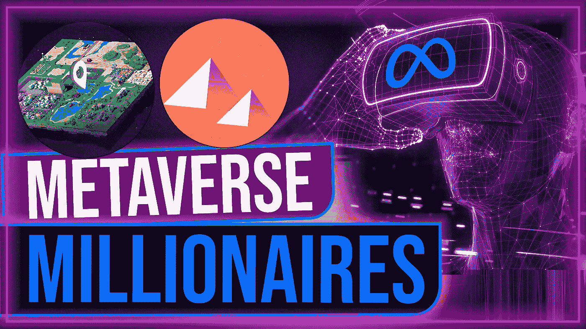

# 如何在元宇宙经济中赚钱|每年赚 10 万美元的 10 种方法

> 原文：<https://medium.com/coinmonks/how-to-make-money-in-the-metaverse-economy-10-ways-to-make-100-000-year-b31501bacf71?source=collection_archive---------9----------------------->

从在现实生活中找不到工作到在元宇宙经济中找到有收入的工作。随着元宇宙的使用和扩张，我们的生活方式和工作机会将会发生革命性的变化。已经说到点子上了，仅仅是在元宇宙，人们每年就能赚到相当于 10 万美元以上的钱。

元宇宙有创造就业的巨大潜力，在这篇文章中，我将与你分享在元宇宙赚钱的 10 种方法。我的主要重点将是分享新兴的元宇宙经济将创造的就业机会。基本上，我所说的是现实生活中的技能和未来的技能，这些都是元宇宙运作所需要的。

在我们开始之前。如果你喜欢这篇文章，请考虑关注我的文章，了解更多赚钱的方法。

现在，让我们直入主题吧！

元宇宙是互联网上的下一个大事件。对于科技行业来说，这是一个新的热门话题。由于它的发展，元宇宙的工作变得越来越受欢迎。全世界的科技爱好者都在努力寻找在元宇宙成为伟人的合适技能。像 Snap、Roblox、OpenSea、脸书和许多其他公司都在元宇宙招聘职位。元宇宙将融合增强现实、虚拟现实、人工智能、区块链技术等。随着世界上最大的雇主探索如何进入元宇宙，很明显，就业市场为希望在元宇宙工作的有才华的求职者提供了许多机会。

上个世纪迎来了一个全球工业大规模生产能力和互联网崛起的时代。当元宇宙被引入主流时，2021 年和 2022 年将被载入史册。这是一个虚拟世界，有望成为比以往任何时候都更具沉浸感、互动性和协作性的互联网。传统上，科幻小说和想象力的领域包括增强现实和虚拟现实等技术。但它已经足够成熟，我们可以想象走在一个充满科技的世界里。

元宇宙的出现也标志着许多有效的现场服务管理和有吸引力的服务提供的工作机会的出现。这项未来元宇宙的工作将对对这一领域感兴趣的技术爱好者有用。但是，即使这些候选人也需要大量的时间和经验来提高他们的元宇宙技巧。所以今天我们列出了元宇宙最好的工作，全世界都需要为此做好准备。

# #1.创造 NFTS

NFT 热目前还没有停止。他们正在探索艺术界，头条新闻是 6900 万美元的 NFT·皮普尔拍卖会或无聊猿游艇俱乐部，以及令人难以置信的隐朋克奖。但是在元宇宙，你可以将你的创作转化成 NFT 或不可替代的代币，并在公开市场上出售。除此之外，元宇宙将依赖于虚拟形象、豪华住宅和非常受欢迎的虚拟形象服装，如耐克和阿迪达斯创造的 NFT。和其他数字商品完全由消费者设计和创造，以发展和支持开放经济。

网上有许多创建 NFT 的教程，它们基本上是一个对象的所有权和真实性的数字证明。但对于那些不太感兴趣的人来说，还有其他选择可以考虑，比如开办一家 NFT 美术馆，出售他人的作品，以换取部分利润，或者与元宇宙客户协商进行艺术品经纪，这是在这个新创建的 NFT 世界中导航的一个很好的方式。

# **#2。房地产**

最近，虚拟房地产经历了巨大的繁荣，因为数字土地的步伐导致了元宇宙的财产，如分散土地、Axie Infinity 和销售数百万的沙盒。显然有许多可供选择的方案。

**我首先想到的是房地产翻转**。为虚拟土地或数字房地产购买土地并以更高的价格转售，消除了这种差异。

你可以做的第二件事是成为一名**房地产经纪人。有这么多房地产交易要做，对虚拟房地产公司的需求正在增长。你可以通过撮合买卖双方或仅仅作为房地产经纪人提供建议来赚取大笔佣金。**

接下来的事情应该是**出租**。就像在现实生活中，你可以买一块地，建一栋房子或其他财产，然后出租。您还可以将您的酒店用于促销目的，尤其是如果您的酒店位于高流量区域。

**物业管理**也是房地产的一大任务。将你在元宇宙的房地产经历货币化的另一个好方法是成为其他用户的物业经理，这包括观察像音乐厅和停车场这样的虚拟场所如何得到最好的利用。

另一件事可能是房地产设计。在元宇宙设计和部署有人居住的地块和建筑可能是一项非常有利可图的业务。无论是私人财产、购物中心还是体育场，对专门的 3D 设计师的需求很快将成为网络空间中最令人向往的工作之一。

# **#3。广告**

许多公司都争相在元宇宙建立自己的虚拟形象，同时也把它作为一个重要的广告平台。就像在现实世界中一样，品牌可以在虚拟商城中开设商店，并在各种虚拟平台上为产品和服务做广告，包括租赁和销售虚拟现实显示器。随着越来越多的用户加入元宇宙，它有望成为海量营销和广告平台。

# **#4。时尚**

元宇宙的最初用途之一是时装。路易威登和古驰等著名时装公司一直在以 NFT 系列的形式尝试虚拟服装。该游戏也是与博柏利 x Blanks Block Party 和 Valentino x Animal Crossing 等品牌合作的另一种成功方式。但在元宇宙，几乎任何人都可以创建一个数字服装系列并创造收入。即使你不是服装设计师，也欢迎你为自己的头像做不同的创作，也欢迎你帮助朋友做自己的。

# **#5。教育**

当疫情迫使学校关闭，世界各地数百万学生需要参加在线课程时，虚拟学校的潜力变得显而易见。随着它的发展，元宇宙将成为一个沉浸式的空间，允许更个性化和高度互动的教学。因此，教学和教育举措肯定会蓬勃发展。

# **#6。元宇宙安全经理**

你知道为什么互联网对每个人来说都是安全的地方吗？是的。我也没有。当然不安全。无论谁说元宇宙在隐私方面越来越好，都是在开玩笑。当然，有很多方法可以成为一个安全和包容的地方，但它不会自己发生。

隐私。世界身份验证。安全头饰。足够的传感器…我们需要能够在设计、验证和大规模生产阶段指导和监督所有这一切的人，以确保我们的数字世界是安全的，并满足或超过适用的监管安全要求。当然，所有这些都不会牺牲功能或现代设计，也不会降低销量。此人是元宇宙安全经理。

这不是一项容易的任务。他们必须准确预测元宇宙功能将如何被使用和可能被滥用，并识别与这些预测相关的对安全性至关重要的组件、系统和生产步骤。在新的数字世界中，移动部件的复杂性和数量足以让我一想到它就头晕。

# **#7。元宇宙硬件制造商**

元宇宙不会只建立在代码上。它还将制造传感器、摄像头和耳机。当有人在网上和你握手时，传感器可以让你触摸。一个摄像头，可以看到你是否心情不好，这样人工智能就不会打扰你太多。耳机可以感知周围的阳光，在数字世界中重现炎热的夏日，增加真实感。它甚至不是关于学习枯燥的东西，如惯性单元，可见光相机和深度相机，这些都有助于跟踪，绘图和定位…

创造一个与物理世界交织在一起的全数字世界所需的所有硬件都很昂贵。也很复杂。随着元宇宙变得越来越复杂，元宇宙的硬件制造商不得不组装和改造它。

目前正在开发适用于工业企业和汽车行业的最佳传感器。这是一个高度资本化的行业。因此，作为一个额外的挑战，无论是谁建造元宇宙的硬件，都必须确保它能够廉价而安全地建造，以免元宇宙成为富人的唯一玩具。

# **#8。创业**

元宇宙是企业家的理想温床。他们可以比在现实世界中更容易地开店和创业。无论是时尚、体育用品、房地产还是娱乐，有无数的公司可以帮助你在数字世界中赚钱。

# **#9。元宇宙说书**

随着体验经济和游戏化的概念越来越受欢迎，让我们的增强现实有一个伟大的故事情节来学习这样一个惊人的课程是有意义的。我们想笑。我们想哭。我们想学习。我们想在数字世界里看到一些奇怪的东西。这就是元宇宙说书人的用武之地。

这个人负责为用户设计深度任务，以探索元宇宙、军事训练场景、商业故事形式难以发现的营销机会和心理会话。当你可以在数字世界假装杀死内心的恶魔时，为什么要杀死它们？…这样的例子不胜枚举。

# **#10。旅行和旅游**

由于新冠肺炎疫情，世界面临着一次又一次的封锁，许多人转向虚拟现实旅游来寻求急需的逃离。元宇宙将是这一想法的延续，这个想法是，来自物理世界的历史物品和事件最终将在虚拟世界中被重现。这将为元宇宙旅游部门带来许多就业机会，如导游和旅行社。

如果你喜欢这篇文章，请关注我，因为它有助于我资助更多的写作研究。如果你知道有人对此感兴趣，请与他们分享。

感谢阅读，并随时阅读更多我的文章或观看这个视频！

> 交易新手？试试[加密交易机器人](/coinmonks/crypto-trading-bot-c2ffce8acb2a)或者[复制交易](/coinmonks/top-10-crypto-copy-trading-platforms-for-beginners-d0c37c7d698c)