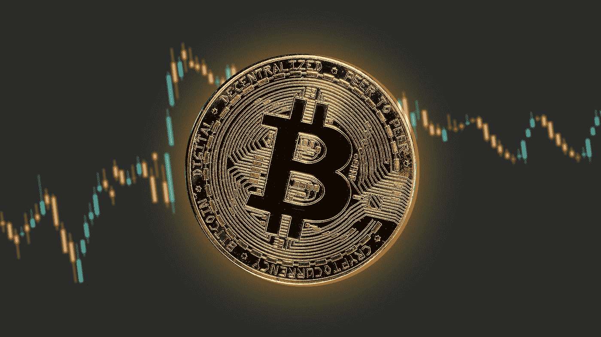

# 如何用比特币赚钱

> 原文：<https://medium.com/coinmonks/how-to-make-money-with-bitcoins-41cd11ee6d65?source=collection_archive---------30----------------------->

## 学习用比特币赚钱的过程

比特币是一种加密货币和全球支付系统，由一个不知名的人或一群人以中本聪的名义发明。比特币是第一种去中心化的数字货币，不同于由央行控制的传统法定货币。这些交易由网络节点通过使用加密技术进行验证，并记录在称为区块链的公共分布式账本中。所以我们来看看如何用比特币赚钱。

Photo by [Kanchanara](https://unsplash.com/@kanchanara?utm_source=medium&utm_medium=referral) on [Unsplash](https://unsplash.com?utm_source=medium&utm_medium=referral)

# 比特币是什么？

比特币是一种创建于 2009 年的数字货币。比特币不受任何政府或银行控制，而是由一个开源软件程序控制。它被称为第一种去中心化的数字货币，因为该系统在没有中央存储库或单一管理员的情况下工作，它最初是由一个只知道叫中本聪的人发明的，并于 2009 年作为开源软件发布。

比特币是一种加密货币，可以像任何其他货币一样使用。它可以被购买、出售、交易和兑换成其他货币。获取比特币最流行的方式之一就是挖矿。挖掘比特币意味着用强大的计算机解决复杂的数学问题，当它们解决问题时会得到比特币的奖励。

Photo by [Alexander Mils](https://unsplash.com/@alexandermils?utm_source=medium&utm_medium=referral) on [Unsplash](https://unsplash.com?utm_source=medium&utm_medium=referral)

# 使用比特币有什么好处？

加密货币市场在过去几年中出现了激增，并且没有显示出任何放缓的迹象。自 2017 年初以来，最受欢迎的加密货币比特币的价值增长了 1000%以上。

使用比特币作为投资组合的投资策略有很多好处。你可以购买比特币并长期持有，以赚取稳定的回报率，也可以在交易所交易，以获得更高的回报。

另一个好处是，你可以使用比特币进行跨境支付，而不用担心货币兑换率或高昂的国际电汇费用。比特币是一种点对点支付系统，使用虚拟货币比特币，不绑定任何银行或国家。它允许支付直接从一个人发送到另一个人，而不通过金融机构。本质上，比特币要么在主要交易所买卖，其他货币也以比特币报价。

[想学习如何用比特币赚钱？点击这里！](https://www.digistore24.com/redir/325658/MichaelHokl/)

# 投资比特币有什么好处？

人们投资比特币的原因有很多。它可以被视为一种避险资产，因为比特币的价值与任何一个国家的经济都不相关，无法受到地缘政治事件的影响。比特币的供应量也是有限的，这意味着只有 2100 万枚比特币在流通。人们投资比特币的另一个原因是，事实证明，对于那些购买并长期持有比特币的人来说，比特币具有正投资回报。比特币最重要的一个特点就是去中心化。这意味着没有单一的权威机构控制比特币网络。去中心化也意味着没有一个人或实体可以获得对比特币的控制权，这使得它很难被操纵。比特币运行的区块链技术是公开的，这意味着网络上的每一笔交易都可以被任何人看到。

# 投资比特币有哪些风险？

投资比特币有风险，但加密货币市场仍不稳定。多年来，比特币的价值经历了多次波动，这种情况可能很快会再次发生。众所周知，比特币的价格也会无缘无故地突然下跌，这可能会让投资者很难知道何时卖出比特币。

对于一些投资者来说，比特币可能有风险，但有一些方法可以最小化这种风险，让你的投资物有所值。如果你对投资比特币感兴趣，在采取任何行动之前，你应该先弄清楚风险是什么。所以我们推荐做一个关于比特币买卖和交易的课程。这个是市场上最好的:[加密量子飞跃。](https://www.digistore24.com/redir/325658/MichaelHokl/)

Photo by [Yiğit Ali Atasoy](https://unsplash.com/@yigitaliatasoy?utm_source=medium&utm_medium=referral) on [Unsplash](https://unsplash.com?utm_source=medium&utm_medium=referral)

# 如何购买比特币？

比特币是一种去中心化的数字货币，可以向世界上任何地方的任何人进行即时支付。比特币使用点对点技术，在没有中央权威的情况下运行:管理交易和发行货币由网络集体进行。

购买比特币的方式有很多种。最简单的方法是使用比特币交易所，在这里你可以按照当前的市场价格快速买卖比特币，而不必注册账户或给出你的名字。如果你想知道如何在线购买比特币，我们推荐使用 [Paxful](https://paxful.com/register?r=2xdVb7AXmdr) ，因为他们是领先的比特币交易网站之一。

> 交易新手？试试[密码交易机器人](/coinmonks/crypto-trading-bot-c2ffce8acb2a)或[复制交易](/coinmonks/top-10-crypto-copy-trading-platforms-for-beginners-d0c37c7d698c)

# 什么是比特币挖矿？

比特币挖矿是一个产生新的比特币并保障比特币网络安全的过程。

一名矿工使用[强大的软件](https://www.ccgmining.com/aff.php?aff=59424)，通过解决数学问题赚取比特币，这些问题很难解决，但很容易验证。问题的难度每 2016 个街区调整一次，对于普通矿工来说大约每两周调整一次。

比特币网络通过向贡献所需计算能力的人释放比特币来补偿矿工的努力。这部分收入来自新发行的比特币，以及矿商确认的交易中包含的交易费。

挖掘是一项困难的任务，因为它需要解决一个复杂的数学问题，然后找到一个数据块，产生满足特定条件的输出。这些产出无法提前预测，因此矿工需要尽可能快地对每个区块的不同部分进行随机猜测，直到他们找到一个能产生回报的部分。采矿过程。区块以恒定且可预测的速度添加到区块链，大约每 10 分钟添加一个区块。一些节点可能会脱机一段时间，或者完全断电，但是区块链可以在没有它们的情况下继续运行。当块被创建时，它们被广播到所有节点。每个随后的块都引用前一个块来验证其合法性。一旦块被处理和完成，它就被加密保护并添加到链中。

# 如何用比特币挖矿赚钱

下面的信息图提供了如何投资比特币而不亏损的分步指南:

## 第一步:买一个比特币钱包

比特币钱包是存放货币的地方，需要得到保护。 [Paxful](https://paxful.com/register?r=2xdVb7AXmdr) 是一款受欢迎的比特币钱包，提供了一个安全的存储比特币的地方，没有交易费用，也没有货币汇率费用。

## 第二步:在交易所购买比特币。

你需要存钱，例如，100 美元可以兑换价值 1000 美元的比特币。

## 第三步:购买比特币挖矿硬件

你需要购买能够承受这一过程的特殊硬件。我们建议从像 Butterflylabs 或比特大陆科技这样的制造商那里购买。

Photo by [Kanchanara](https://unsplash.com/@kanchanara?utm_source=medium&utm_medium=referral) on [Unsplash](https://unsplash.com?utm_source=medium&utm_medium=referral)

# 贸易

开始交易比特币可以让你赚很多钱。成功的交易者会考虑市场和外部因素，他们愿意冒险。一个可靠的加密简讯会让你知道什么时候购买，什么时候持有。[我推荐这本书，因为它提供实时信息，首席编辑有超过 12 年的经验。](https://www.digistore24.com/redir/307348/MichaelHokl/)

确保平仓时，它开始稳步增加。这样你就能获利，人们也能充分利用他们的钱。

以下是用比特币在线赚钱的最常见策略:

1.  **比特币对冲:**当市场趋向于对你不利时，就实行这种策略。你可以通过持有一个相反的立场来最小化你的风险。
2.  **日内交易:**也叫日内交易。这种策略的好处是你不必支付隔夜费，因为你在同一天买入和卖出你的头寸。
3.  **买入并持有:**从加密货币中获利的一个简单方法是买入，然后等待其价格上涨。不利方面——有足够的耐心让它发生。
4.  **趋势交易:**有些投资者会用这种策略来跟随当前的趋势。如果趋势看涨，他们可能会进行长期投资。如果是熊市，他们可能会专注于短期投资。

# 结论:比特币是一项伟大的投资吗？

比特币是否是一项伟大的投资，这个问题可以用肯定来回答，也可以用否定来回答。比特币的价值是由供求关系决定的。如果更多的人想买比特币，那么价格就会上涨。但是如果更多的人想要出售他们的比特币，那么价格就会下降。我们认为，如果你能够理解比特币的工作原理和风险，它可能是一项伟大的投资。有些人只对比特币作为一种投资感兴趣，而不是作为一种支付方式。其他人想把它专门用于支付。还有一些人想把它作为投资和支付的结合。