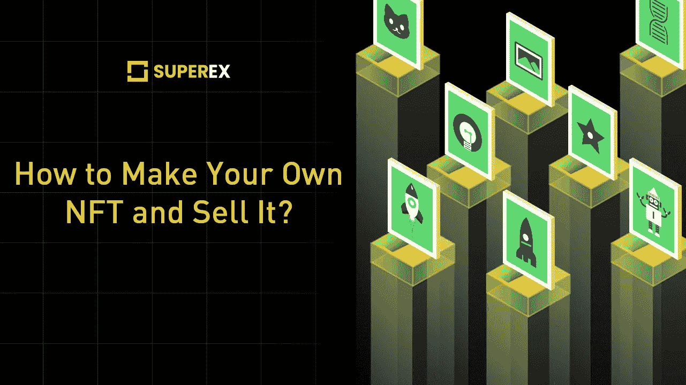
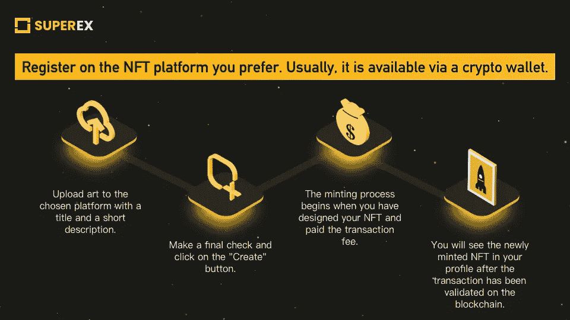

# 如何制作 NFT 并进行交易？

> 原文：<https://medium.com/coinmonks/how-to-make-nfts-and-trade-them-48900e452464?source=collection_archive---------5----------------------->

[www.superex.com](http://www.superex.com)

不可替代的代币 NFT 已经席卷了整个互联网、Twitter 和名人新闻。我们听说过它，甚至想过简单地交易它。从技术上讲，加密“令牌”是区块链上每个人都可以追踪和访问的资产。NFT 是虚拟货币，可能涉及几乎所有类型的艺术、视频、音乐作品或收藏品。从 2021 年热潮开始，现在大家都在买卖 NFT？所以我们很自然地在脑子里蹦出什么是 NFT，我们如何销售它们的想法；我们如何把我们的 NFT 转化为艺术？

**2021 年以来 NFTs 获得显著的流动性深度；公众的注意力也涌入了 NFT 市场。**2022 年，假名数字艺术家 Pak 以 9180 万美元的价格合并了最贵的 NFT。同年，艺术家迈克·温克尔曼的《5000 天 NFT 收藏》以 6930 万美元的价格售出。NFT 不仅在著名的 NFT 平台上出售，也在苏富比和佳士得等传统拍卖行出售。此外，许多不知名的艺术家正在秘密空间创作他们的艺术作品。然而，有许多创新的 NFT 收藏，如 **Cryptopunks** 或最近流行的 **Bored Ape 游艇俱乐部**。这些 NFT 主要是简单图片和不同顶层元素的组合。毕竟，如果你想出一个单一的艺术作品或一个完整的收藏的想法，并考虑你最终希望它变成的内容，这将是最好的。

[**SuperEx exchange**](http://superex.com)**也在向不同的扩展扩展，DeFi 和 NFTs 也在他们的路线图上。去查一下。**

## 铸造 NFT

你不必编写代码来创建一个 NFT。你可以使用你的数字艺术，并将其发布在区块链上；这个过程叫做铸造。经过这一过程，你铸造的艺术品将变得**安全可靠，并具有独特的区块链身份**；没有人能操纵它，因为只有你能卖掉它们。当它被转卖或回收时可以被追踪。铸造 NFTs 给艺术家带来了可观的收入。在大多数 NFT 市场，艺术家可以在他们的 NFT 作品上附加版税条款，在转售非专利作品时从非专利作品中获得被动收入。

**不过，如果你在这方面有很深的造诣，还是可以编写 NFTs 成为 NFTs 开发者的。当你从事编程工作时，你可能还记得**以太坊网络仍然在 NFT 市场流行。对于 NFT 开发，标准的编码语言是 Solidity，它是为运行在以太坊上的智能合约而设计的。其他的还有 Javascript 和 HTML/CSS。此外，星际文件系统通常用于存储艺术家的 NFT。****

NFT minting steps

## NFT 市场

**策划的 NFT 平台对艺术家更加挑剔。**他们会要求你提交申请领域关于你的艺术经历和关于你的 NFTs 的信息。你需要排很长的队才能收到网站的回复。由于他们的门槛很高，买家更有信心从这些平台购买非功能性食物。策划的 NFT 平台有 **SuperRare** 和 **Nifty Gateway** 等等。

**基于自助服务或非策划的 NFT 平台为所有艺术家提供免费访问，无论你来自哪个背景。**要将 NFT 上传到上面，你必须通过加密钱包注册，并支付交易费以铸造 NFT。最受欢迎的是**开放海洋**和**稀有**。

## 设置加密货币钱包

在设置您的钱包之前，您需要确保您使用的 NFT 平台支持您的钱包。大多数 NFT 市场都是基于以太坊的。所以基于 Eth 的钱包更常用。

**一个加密货币钱包也要看你考虑的是什么样的安全性。**保管钱包大多人性化；它们类似于银行。第三方将存储您的资产。非托管钱包将钱包的最终控制权留给了用户。硬件钱包，或冷钱包，是一种物理设备，可以保持用户的密码离线，并在最坏的情况下保护它，如某人的计算机被黑客攻击。

## 销售 NFT

NFT 市场通常支持你两个主要功能:拍卖和固定价格销售。固定价格交易是最简单的方式，而且是透明的。如果你选择这种方式，你需要设定你的销售价格。一些 NFT 市场还要求你设定一个提成比例，当你的 NFT 在未来被转售时，通过分享特定部分的利益给你一个被动收入。

**通过拍卖**，用户对你的 NFTs 进行竞价。可以是线上，但有时也可以是线下拍卖。**拍卖主要有两种，一种是在固定期限内出价最高者胜出。也就是说，在规定的时间和期限内，最可观的投标将获胜。**另一种拍卖是价格不断降低，直到买家买下。****

**你可以评估自己的需求，选择进行固定时间的拍卖，或者为你的 NFT 作品定价。**

[www.superex.com](http://www.superex.com/)

**SuperEx 是第一个拥有完整 DAO 社区治理的分散式加密交易所。** SuperEX crypto exchange 在其交易区拥有数千个代币，使用户能够进行从现货到杠杆和衍生品的不同交易。没有 KYC 条款是超级交易所的焦点，它对用户资产进行终极保护和严密防御。

**SuperEx** **官方页面:**[www.superex.com](http://www.superex.com/)
**官方电报组**:[https://t.me/SuperExOfficial](https://t.me/SuperExOfficial)
**官方邮箱:**[http://business@superex.com/
**官方推特页面:**](http://business@superex.com/) [SuperEx (@SuperExet) /推特](https://twitter.com/SuperExet)