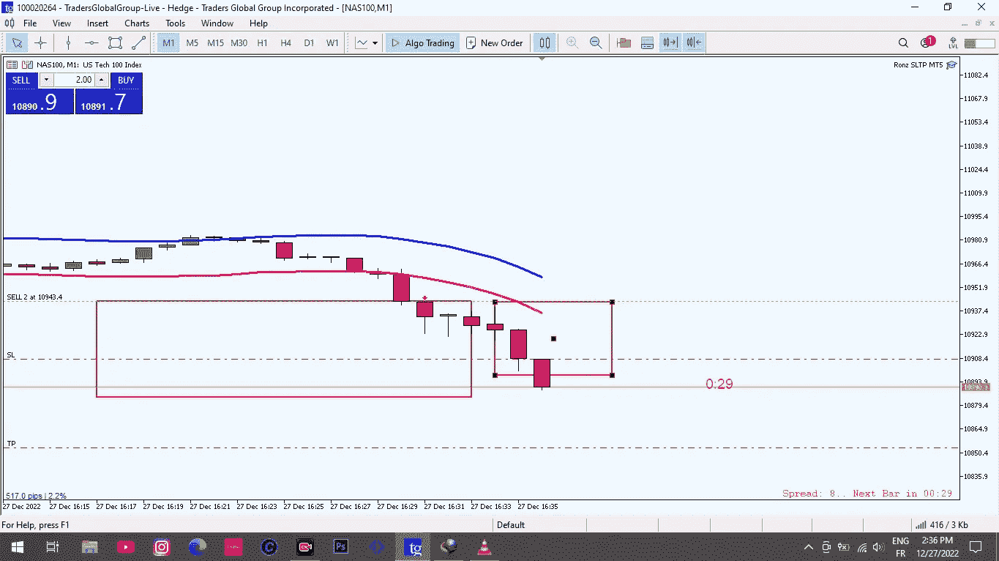

# 如何在交易中赚一百万美元？

> 原文：<https://medium.com/coinmonks/how-to-make-one-million-dollar-in-trading-274a52e5e62e?source=collection_archive---------59----------------------->

通过交易赚一百万美元可能是一项艰巨的任务，但并非不可能。它需要奉献精神、纪律和对市场的深刻理解。在这篇文章中，我们将探讨如何通过金融市场交易赚一百万美元的一些策略和技巧。

首先，对你将要交易的市场有一个清晰的了解是很重要的。这包括理解可用于交易的不同类型的资产，如股票、债券、商品和货币，以及它们如何受到经济、政治和市场条件的影响。理解各种交易策略和技术也很重要，比如技术分析、基本面分析和风险管理。

> 交易新手？在[最佳加密交易](/coinmonks/crypto-exchange-dd2f9d6f3769)上尝试[加密交易机器人](/coinmonks/crypto-trading-bot-c2ffce8acb2a)或[复制交易](/coinmonks/top-10-crypto-copy-trading-platforms-for-beginners-d0c37c7d698c)

交易成功的关键因素之一是有一个明确的交易计划。这应该包括一套明确的目标、风险管理计划以及识别和执行交易的策略。重要的是在你的方法中要现实和自律，不要让情绪或自我影响你的决定。

有可能通过交易赚到一百万美元的一个方法是利用杠杆。杠杆允许交易者用更少的资金控制更大的头寸，这可能带来更大的利润。然而，负责任地使用杠杆很重要，因为如果交易没有按预期进行，它也可能导致更大的损失。

通过交易赚一百万美元的另一个策略是分散你的投资组合。分散投资有助于减轻任何一个交易或资产类别表现不佳的风险。这可以通过投资各种不同的资产和市场，以及使用不同的交易策略来实现。

持续不断地自我教育并了解最新的市场趋势和新闻也很重要。这可以帮助你识别潜在的机会，做出明智的交易决定。寻求更有经验的交易者或专业人士的指导也是有帮助的。

最后，在交易中保持耐心和一致性是很重要的。通过交易赚一百万美元不是一朝一夕的事。这需要时间、纪律和从错误中学习的能力。通过遵循可靠的交易计划，紧跟市场趋势，保持纪律和耐心，通过交易赚一百万美元是可能的。