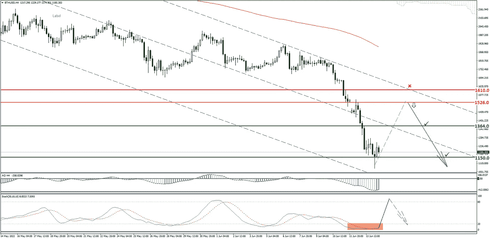
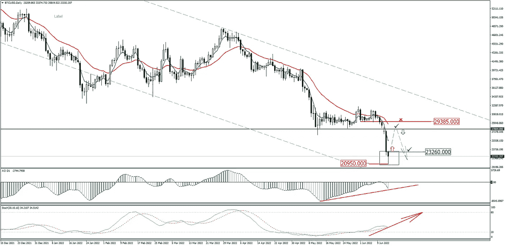

# 如何最大限度地利用加密下跌与做空？

> 原文：<https://medium.com/coinmonks/how-to-make-the-most-of-the-crypto-drop-with-shorting-369267af9581?source=collection_archive---------28----------------------->

加密市场经历了一个明显的负面趋势，预计将持续一段时间。比特币本周暴跌 33%，达到 18 个月低点。对许多交易者来说，比特币不再是“数字黄金”了。

尽管如此，加密市场的熊市趋势只对那些持有 BTC 或任何硬币多头头寸的人来说是坏消息。现在市场上发生的事情是一个独一无二的发财机会。上一次出现这种情况是在两年前，当时 BTC 正稳步增长。

我们的分析师已经为 BTC 和瑞士联邦理工学院准备了交易建议，以及如何做空的简短指南。一切为您充分利用这一市场形势！

# 什么是短线交易？

卖空交易或卖出头寸是一种从资产贬值中获利的交易。

交易员出售经纪人拥有的资产，并依赖其未来的价格下跌。通过这种方式，交易员希望买断相同数量的资产，以偿还他们的经纪人，并从差价中获利。

卖空交易也被称为“裸卖空”，因为交易者出售他们不拥有的资产。这是让大多数通常做多的交易者害怕的一部分。但他们也应该尝试做空。以下是如何做到这一点。

# 简单的例子

例如，现在是 2021 年 11 月初。你查看时间框架为 5Y(即 5 年)的比特币图表。你可以看到它创下了历史新高，超过 56，000 美元。但是你也看到新闻说中国已经禁止了地下采矿。你得出的结论是，价格会因此下降。

2021 年 11 月中旬，你以 56000 美元的价格建立了比特币的卖出头寸，2 个月后，也就是 2022 年 1 月中旬，以 31000 美元的价格平仓。BTC 的价格直线下降，下降了一半。**所以，做空仅仅 60 天就给你带来了 44.64%的毛利。利用杠杆，这一头寸将带来高达 10 倍的回报。**

你看，做空就像做多一样。只有开放顺序是相反的。现在让我们看看如何将它应用于实时市场。

# 加密市场的最新交易建议*

为了指导您了解加密市场的当前趋势，我们的分析师根据技术分析准备了比特币(BTC)和以太坊(ETH)的交易建议。

1.  **为以太坊(ETH/USD)开立空头头寸。**

总的趋势是后裔。硬币在下游价格通道的下边界区间交易。在 H4 时间框架上形成的反转形态针柱，可能会导致修正。

**交易思路:**

从镜像级别 1526.0 开始卖。

止损:1610.0。

目标水平:1364.0；1150.0.

**2。比特币飞溅的双倍利润(BTC/美元)。**

这种情况涉及两个步骤:多头和空头头寸连续出现。这意味着你可以在短时间内从任何市场趋势中获利。

总的趋势是后裔。反向模式“锤子”很可能在日线时间框架上形成。可怕的振荡指标表明多头发散，随机振荡指标表明超卖。

**交易思路:**

*卖出(空头)头寸。*

从镜像级别 27804.0 卖出。

止损:29385.0。

目标:23260.0。

*买入(多头)头寸。*

如果形成了“锤子”形态(大头针)——在日线收盘时买入。

止损:20950.0。

目标:镜像级别 27804.0。

现在你知道如何通过卖空交易从熊市中获利了。

# 快一点！

上一次在 crypto 上赚钱是在两年前，当时 BTC 正稳步增长。

与 Grand Capital 交易，即使在市场下跌时也能乘风破浪！

[**https://grandcapital.net/promo/bonus40/**](https://grandcapital.net/promo/bonus40/)

*   分析师提供的交易建议不构成邀约。在开始在金融市场上交易之前，请确保您了解与使用杠杆相关的风险，并且您接受了足够的培训。

> 交易新手？尝试[加密交易机器人](/coinmonks/crypto-trading-bot-c2ffce8acb2a)或[复制交易](/coinmonks/top-10-crypto-copy-trading-platforms-for-beginners-d0c37c7d698c)