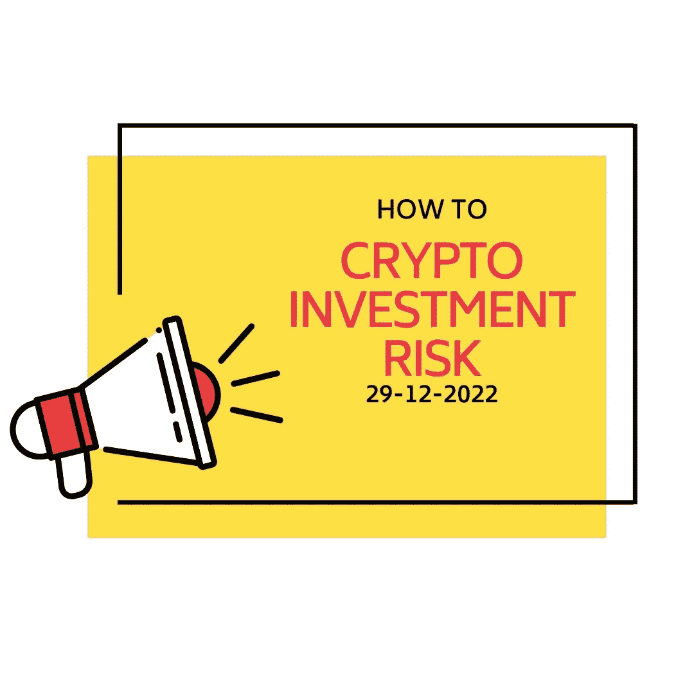

# 如何管理您的加密投资风险？

> 原文：<https://medium.com/coinmonks/how-to-manage-your-crypto-investment-risk-33c74af9425e?source=collection_archive---------35----------------------->

***本文将带你了解管理加密投资风险的基础知识，如何设置门槛和 DYOR！***

随着时间的推移，加密货币被更广泛地接受，现在更多的人正在评估他们用加密货币进行交易的可能性。然而，风险的空间总是存在的。各种风险存在于各种投资类型中，包括股票投资和房地产。然而，加密货币价值的投机性质和市场的动荡需要格外小心，尤其是新手交易者。在进行加密货币交易时，必须警惕风险管理。

> 交易新手？在[最佳加密交易](/coinmonks/crypto-exchange-dd2f9d6f3769)上尝试[加密交易机器人](/coinmonks/crypto-trading-bot-c2ffce8acb2a)或[复制交易](/coinmonks/top-10-crypto-copy-trading-platforms-for-beginners-d0c37c7d698c)

一种经过衡量的风险管理方法使交易者能够最大限度地提高其初始投资的回报，并缓冲他们在交易加密货币时可能遭受的任何损失。以下是五种灵活的风险管理策略:

# 设置加密货币投资门槛

交易者承受特定程度风险的能力因人而异。然而，建立一个人的风险承受能力和定制一个人的秘密投资方法应该是一个常见的程序。作为交易者，你应该在投资你选择的货币和进入加密货币的世界之前分析风险回报比。此外，考虑一下你现在愿意冒多少风险，并保持在这个范围内。使用止损单，指示你的投资在达到特定价格时卖出。如果你的投资价值开始下降，你可以采取措施防止自己遭受严重损失。

要记住的最重要的事情是，交易加密货币需要很多自律。当市场上涨时，投入比你预期更多的钱是很有诱惑力的。然而，要控制你的感觉，把你所有的决定建立在理性的基础上，而不是情绪上。

# 确保符合贸易生态系统

一个人的交易环境和交易本身一样重要。如果您在选择钱包或交易平台时不谨慎，黑客和您加密货币投资的其他安全风险可能会使您遭受重大损失。你对与密码相关的欺诈和骗局的了解也是如此；如果你不知道要注意什么，邪恶的人可能很容易利用你和你的贵重物品。

有鉴于此，决心提供一个安全的交易环境，给你完全的隐私，安全，并控制你的加密资产。选择一个安全的钱包，然后注册一个可靠的比特币交易所。确保您了解加密货币相关诈骗和其他非法行为的最新信息。通过这样做，你将降低与不道德或非法行为相关联的可能性。

# 做你自己的研究

每枚硬币都不一样，包含不同种类的风险。虽然一些硬币可能在特定地点被明确禁止，但其他硬币可能会滑入法律的边缘。由于其系统的性质，某些货币比其他货币更容易受到安全缺陷和漏洞的影响。由于市场不稳定，其他加密货币存在严重的流动性问题。对你来说，了解这些差异是有益的，这样你就可以为与你的首选货币相关的特殊困难做好准备。

你对金钱的选择应该受到你的风险承受水平以及你对隐私和可用性等方面的偏好的影响。如果所有这些都处于和谐状态，处理你遇到的危险将会更简单。

# 分散投资组合

加密货币投资虽然对那些擅长玩牌的人来说利润惊人，但它既不是灵丹妙药，也不能充分替代平衡和多样化的金融投资组合。将你持有的加密货币视为可能帮助你增加个人财富的几种投资类型之一。有了这些知识，集中精力制定一个分散风险的投资计划。其他资产将有助于平衡一个资产类别的价值变化，让你远离危险。

投资各种加密货币可能有助于降低风险。一个投资组合的风险通过一个充分分散的投资组合而降低。因为投资分散在许多硬币中，波动性可以降低。

# 在船上有一个退出策略

建立紧急退出策略是必不可少的，即使你可能不想考虑迫使你停止交易你最喜欢的加密货币的场景。当是时候转移到不同的硬币或完全停止交易时，你应该能够知道。如果你选择了加密货币业务的切入点，你也必须选择相反的方向。这就是所谓的“退出量”，它可以作为避免灾难性损失的合理起点。

然而，拥有退出策略不应阻止你全力投资加密货币。更应该把它看作是充分利用你投资加密货币的每一分钟。理解错误的可能性可能会激励你在加密交易时做出更明智的决定。你的交易的出场和出场是基本要素。强有力的入场是成功交易的锦上添花，但说到出场，你必须同时考虑盈利和亏损。规划你的逃生路线是一个健全的风险管理策略的重要组成部分。

# 底线

对比特币市场的了解以及对任何可能影响你所持资产价值的发展或趋势的认识是至关重要的。这可以帮助你在何时买卖投资时做出明智的决定。交易比特币的经历包含风险，谨慎的交易者会管理而不是拒绝风险。利用上述建议将风险管理纳入您的整体加密交易方法。你的风险承受水平可能决定你交易比特币的成败。

> *加入 Coinmonks* [*电报频道*](https://t.me/coincodecap) *和* [*Youtube 频道*](https://www.youtube.com/c/coinmonks/videos) *了解加密交易和投资*

# 另外，阅读

*   [Bookmap 评论](https://coincodecap.com/bookmap-review-2021-best-trading-software) | [美国 5 大最佳加密交易所](https://coincodecap.com/crypto-exchange-usa)
*   [加密交易机器人](/coinmonks/crypto-trading-bot-c2ffce8acb2a) | [造币评论](https://coincodecap.com/coingate-review)
*   最佳加密[硬件钱包](/coinmonks/hardware-wallets-dfa1211730c6) | [Bitbns 评论](/coinmonks/bitbns-review-38256a07e161)
*   [新加坡十大最佳加密交易所](https://coincodecap.com/crypto-exchange-in-singapore) | [购买 AXS](https://coincodecap.com/buy-axs-token)
*   [红狗赌场评论](https://coincodecap.com/red-dog-casino-review) | [Swyftx 评论](https://coincodecap.com/swyftx-review)