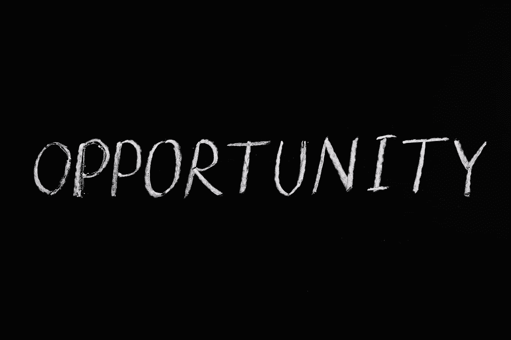

# 如何在危机四伏的冬季最大化机会

> 原文：<https://medium.com/coinmonks/how-to-maximize-opportunity-during-crypto-winters-54e27212aa06?source=collection_archive---------28----------------------->

作者:[克里斯托弗·h·卢，医学博士](http://www.drchrisloomdphd.com)

Photo by Anna [Tarazevich](https://www.pexels.com/photo/opportunity-lettering-text-on-black-background-5598297/)

不言而喻，熊市可能会令人恐慌。

1.  衰退恐惧

2.创纪录的通货膨胀

3.创纪录的天然气价格

4.对利率的担忧

5.俄罗斯和乌克兰之间的战争，以及中国入侵台湾的可能性