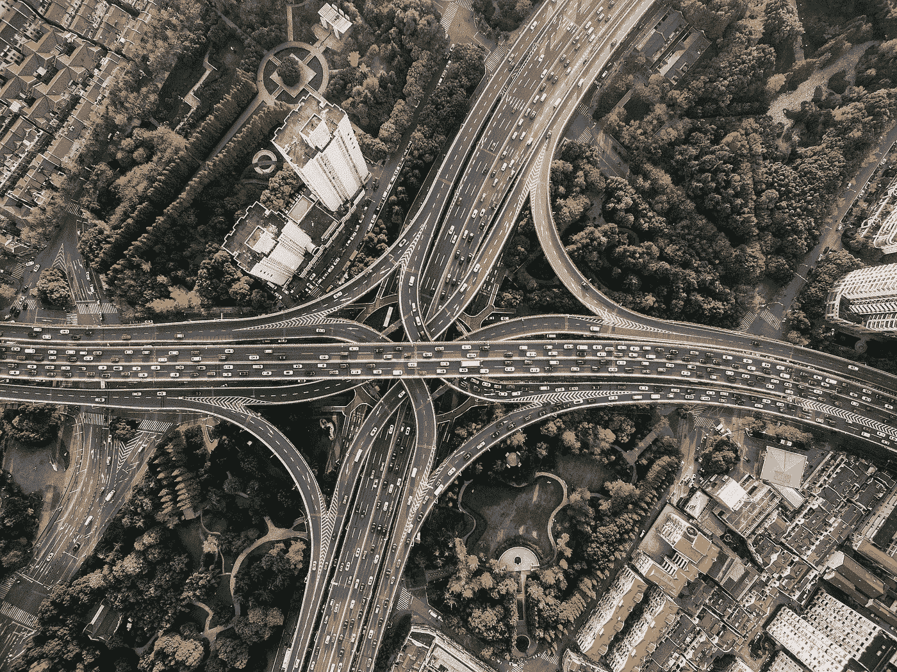
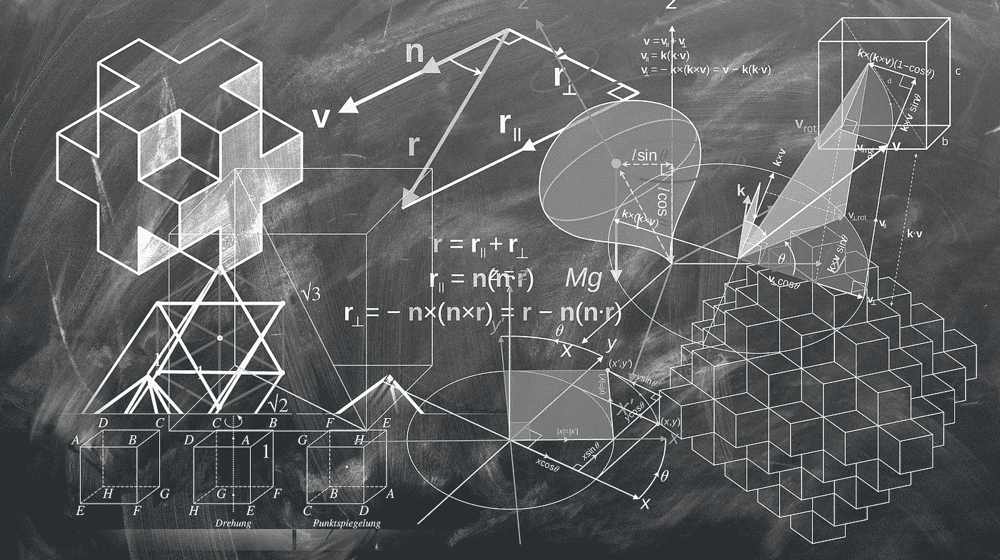
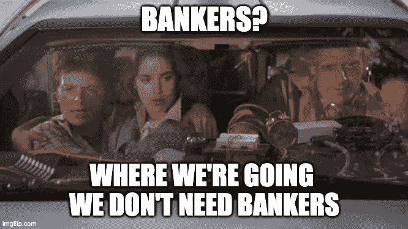
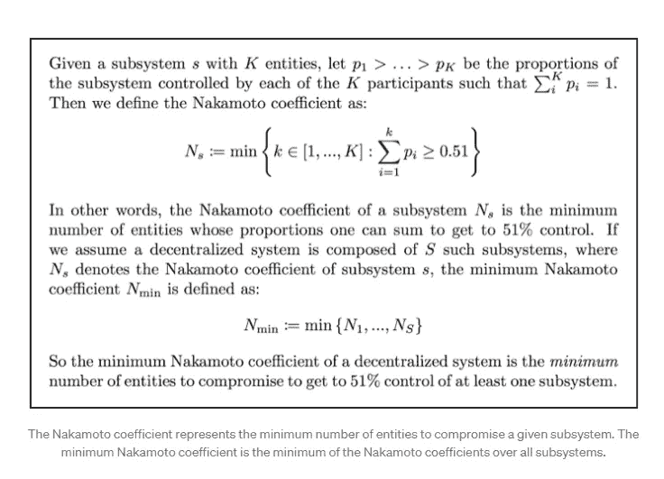
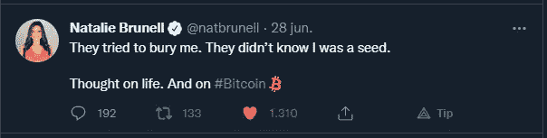

# 如何衡量分权的集中程度

> 原文：<https://medium.com/coinmonks/how-to-measure-the-decentralizations-centralization-8cdbd556b4fd?source=collection_archive---------42----------------------->

我们得到了一个没有许可、没有信任、没有边界的星际高速公路网络，有些人担心汽车生产掌握在少数汽车终端手中，或者许多阿拉伯酋长买下了所有的法拉利。

Image by [Pexels](https://pixabay.com/users/pexels-2286921/?utm_source=link-attribution&utm_medium=referral&utm_campaign=image&utm_content=1837176) from [Pixabay](https://pixabay.com/?utm_source=link-attribution&utm_medium=referral&utm_campaign=image&utm_content=1837176)

真的很搞笑，在熊市时期，随着比特币必然消失的最不可思议的理论出现，越复杂越好。就我个人而言，我正在等待欧洲核子研究中心的科学家告诉我们，在[强子对撞机](https://home.cern/science/accelerators/large-hadron-collider)中模拟了数万亿个场景后，比特币将在 9 月 23 日 22:54 UTC 降至零。

Image by [Computerizer](https://pixabay.com/users/computerizer-4588466/?utm_source=link-attribution&utm_medium=referral&utm_campaign=image&utm_content=2301646) from [Pixabay](https://pixabay.com/?utm_source=link-attribution&utm_medium=referral&utm_campaign=image&utm_content=2301646)

这不是关于是不是 BTC 最大主义者的问题。只需要有一点常识和理性，即使比特币消失了，我认为这是绝对不可能的，中本聪在他的[白皮书](https://www.bitcoin.com/satoshi-archive/whitepaper/)中提出的去中心化(很少灾难理论家阅读)，是人类文明中的一个新实例，以前从未知道。如果他们考虑的只是交易所里某个代币的价格，那么当不可避免的熊市周期到来时，他们预测灾难似乎是合乎逻辑的。是人类对未知的永恒恐惧。以无知为后盾。

看起来，人们关心的是鲸鱼(即银行和其他 BTC 的狂热诋毁者)买卖了多少 BTC，这些鲸鱼以协议的假名以惊人的速度下订单。或者矿工们正在策划一个历史性的阴谋，让地球屈服。或者说，集中式交易所正步近几个月例子的后尘，濒临破产。让我想起了 Covid 的事。

> 交易新手？试试[密码交易机器人](/coinmonks/crypto-trading-bot-c2ffce8acb2a)或[复制交易](/coinmonks/top-10-crypto-copy-trading-platforms-for-beginners-d0c37c7d698c)

问题还是一样。那些忽视加密领域的功能，只把它视为华尔街及其投机之狼的远亲的人，也忽视了一点，如果名为比特币的支付系统消失了，我们将发明另一个，然后另一个，然后另一个。因为重要的是拜占庭将军问题的解决所提出的去中心化，而不是代币在交易所的价格。如果你担心在一个你认为是中央集权、是诈骗犯、无可救药地失败的系统里损失你的钱，那么你要做的就是把你的钱放在一家知名银行的固定期限里，就这样。

> 比特币是一个 app。区块链就是操作系统。

你可以把所有 2100 万个比特币放在一个钱包里，这将是非常荒谬的，因为在这种情况下，BTC 将没有任何价值，但你永远无法清除区块链科技公司播下的种子，它承诺分散管理这个星球的金融层级。

事实上，我仍然认为有许多利益受到威胁，反对公司和机构的斗争不会很容易，因为他们将从各个方面进行斗争，甚至想象近乎疯狂和愚蠢的数学理论。

Image by [Gerd Altmann](https://pixabay.com/users/geralt-9301/?utm_source=link-attribution&utm_medium=referral&utm_campaign=image&utm_content=1023846) from [Pixabay](https://pixabay.com/?utm_source=link-attribution&utm_medium=referral&utm_campaign=image&utm_content=1023846)

如果出于某种愚蠢的原因，汽车经销商停止生产和销售汽车，那会使高速公路网消失吗？如果一个古怪的亿万富翁买下了地球上所有的汽车，那会让汽车行业消失吗？

这是一个概念性的错误，源于不理解或不想理解区块链是如何工作的。因为重要的是区块链，而不是代币。

如果汽车终端停止生产和销售，他们将永远无法阻止新一代人，他们甚至不想听到当前机构的等级制度。

关键是高速公路(区块链网络)已经存在，在这个星球上没有任何力量可以移除它们。如果他们胆敢如此愚蠢，他们可以禁止它们，因为没有人会忽视禁止任何东西都会增加它的用途。但是他们不能以任何方式解除他们的武装。当然，这还没有考虑到同时对世界主要城市发动大规模核导弹袭击，造成全球范围的毁灭和灭绝的可能性。如果发生这种情况，幸存者将只需担心听到或看到美国和俄罗斯都报道谁是这一决定的真正罪犯的新闻。没人会再关心比特币或股票市场了。

我在某处读到，最大量的索拉纳(SOL)是“集中在几个钱包里”。

我在某处读到过，最大量的 BTC“集中在少数鲸鱼身上”。

担心这一点就像担心很少有汽车厂专注于汽车生产并因此推动市场一样。我想我们都同意，没有高速公路的汽车是绝对没用的。因此，你必须担心谁控制了高速公路，而不是汽车的价格或谁控制了汽车的生产和购买。

在我的类比中，由数千个区块链平台组成的被称为加密圈的国际互联网络实际上是一种解释，即价值应该如何在组成经济系统的不同实体之间转移和创造。这个网络是开源的、去中心化的、无许可的、不信任的，并且包含了世界上的任何人。它是由我们支配的，我们可以使用它，没有人能把它从我们这里拿走。

决定区块链可能集中的是其共识协议，而不是货币掌握在少数人手里，尽管前者确实会导致后者。但是反过来就不对了。

像比特币这样的 PoW 网络拥有数十万矿工，其中许多是大型运营商，这是事实，但 PoW 协议本身不太可能允许集中。

PoS 网络具有验证器，并且比 PoW 网络具有更明显的集中化趋势，因为大型运营商将他们的资金用于换取验证区块的好处。PoS 允许链扩展，尽管它失去了安全性，因为较少数量的验证节点使网络更容易受到恶意攻击。时间会证明以太坊从权力走向权力决定是否正确。诚然，许多新的编码技术和系统被纳入，如[分片，等离子，Zk-Snarks 和 Zk-rollups。](https://academy.moralis.io/blog/breaking-down-eth-2-0-zk-snarks-and-zk-rollups)但 PoS 的哲学概念，其 DNA 中隐含着中心化染色体。

目前还不清楚[有多少比特币矿工](https://www.btcwires.com/round-the-block/how-many-bitcoin-miners-are-there/)存在，但估计接近 30 万，比特币是现存最安全的网络。

以太坊 2.0 已经[拥有超过 23 万个验证器](https://blocktables.com/ethereum/total-number-of-validators-on-popular-blockchains/)，卡达诺(ADA)拥有超过 2000 个。

实际上，衡量一个网络的集中程度是通过考虑组成区块链网络的六个子系统来完成的。这些子系统同时可以是集中的或分散的。如果任何一个子系统是集中的，那么整个系统就是集中的。这类似于音频系统中发生的情况，在音频系统中，最终的声音质量不会比最差的组件更好。考虑到这一点，我们可以说比特币是一个去中心化的系统，由去中心化的子系统组成。

[区块链的每个子系统](https://crosstower.com/resources/education/nakamoto-coefficient/)也有自己的激励机制，其行动的结果将决定系统的去中心化程度。

组成区块链的子系统有:

1)矿工，奖励

2)客户端，代码库

3)开发人员，提交

4)交易量

5)节点、国家

6)所有权、地址。

这表明，决定网络中心性的不仅仅是所有权地址。也不是节点的数量。需要根据他们的动机来考虑联合行动，然后再做评估。正如我们所看到的，有许多人不得不同意妥协网络，并不是所有人都有同样的创造力。

如果没有交易商可以给矿商提供价值的交易所，或者如果没有工程师被鼓励向 GitHub 添加承诺并因此改进协议，矿商创造新的比特币将毫无用处。没有一个单独的子系统能使系统工作。如果一个子系统被集中到使系统失去价值的程度，那么这个系统就消失了，所有人，绝对是所有人都损失了。

所谓“中本系数”，就是衡量这六个子系统的相互作用，用一个数字来表示。索拉纳的中本系数是 19。对于比特币来说，这个数字是 7349，这使得比特币成为这个星球上最分散的网络。这个系数粗略地表明，要危及比特币网络的安全，需要 7000 多个验证器，而对于索拉纳来说，只需要 19 个。

这只能告诉我们，[索拉纳比比特币更集中](https://www.makeuseof.com/reasons-solana-isnt-really-decentralized/)，不是因为几个钱包手中的货币量，而是因为我上面展示的六个子系统的相互作用。

对于那些喜欢公式的人，[这里是 Balaji Srinivasan 提出的公式](/21-co/quantifying-decentralization-e39db233c28e)。

 [## 巴拉吉·斯里尼瓦桑培养基

### 阅读 Balaji S. Srinivasan 在媒介上的作品。麻省理工学院 TR35，斯坦福大学博士，临床/微生物基因组学论文…

medium.com](/@balajis) 

另一方面，我们必须考虑到不流通的货币是没有价值的。黄金和石油是有价值的资产，因为它们可以流通，即使它们集中在少数公司手中。

所以，谁会在乎大多数 BTC、ETH 和 SOL 存放在几个钱包里呢？这种情况决不会使网络集中化。如果加密货币的囤积者变得越来越集中，那么当存储达到临界量时，该货币将不再有用。完全没用。老实说，我不认为鲸鱼会犯这样的错误。货币将继续流通，因为它不流通对囤积者不方便，人们失去兴趣，因为这关系到他们自己的财富。这同样适用于挖掘器、节点和其他子系统。

比特币网络的设计具有拜占庭容错功能，因此需要 51%的验证者同意打破这个链条。比特币网络中大约有 16000 个节点，这就是为什么攻击网络需要大于 7000 的中本系数。

矿工们有自己设计的诡计也没关系，因为比特币协议旨在让任何恶意攻击付出高昂代价，尽管不可否认这并非不可能。那些如此害怕“矿工阴谋”的人应该深入阅读[中本聪的白皮书](https://www.bitcoin.com/satoshi-archive/whitepaper/)。您可以在那里找到可能的攻击、它们发生的概率以及它们的成本。

如果管理石油的公司停止生产，资产的价值将会下降，行星工业将会下降，不仅仅是汽车工业，而且必须考虑一些替代系统来生产资本主义所要求的规模。

即便如此，高速公路已经建成，正等待企业家开始开发使用它们的方法。

有人能阻止一个创业者吗？

Image by [Adina Voicu](https://pixabay.com/users/adinavoicu-485024/?utm_source=link-attribution&utm_medium=referral&utm_campaign=image&utm_content=1327759) from [Pixabay](https://pixabay.com/?utm_source=link-attribution&utm_medium=referral&utm_campaign=image&utm_content=1327759)

**结论。**

如果 BTC 消失了，我们会发明别的东西，保持冷静。BTC 只不过是一颗种子。

大多数活跃在加密领域的人对去中心化带来的自由和无政府状态都不感兴趣。他们只想下周发财。这就是为什么在我看来，我们这些确实认为去中心化是人类之间最好的合作形式的人，永久地刷新了加密货币的“特洛伊木马”特征，加密货币是由人类狡猾地创造出来欺骗权力的，因为正面攻击是不可能剥夺印刷货币的权力的。

我更愿意继续相信人类的聪明才智。

[(本文原载于 Publish0x)](https://www.publish0x.com/sirgerardthe1st-grimoire/how-to-measure-the-decentralization-s-centralization-xddroyj)

感谢您的阅读！尽你所能分散你自己，甚至更多！为自己工作，而不是为别人工作。当你为别人工作时，他们付给你与你的职位相称的报酬，当你为自己工作时，他们付给你与你相称的报酬。没有人通过当雇员来实现财务独立。长命百岁，兴旺发达！

像往常一样，这篇文章中写的东西都不是财务建议，也不打算取代个人研究。我写这篇文章的唯一目的是提供信息。这里讨论的一些事情可能是错误的，所以这篇文章不能被解释为金融建议，也不能取代你自己的研究。

如果您有任何问题或意见，请随时写在下面

你也可以打[gerardo.saporosi@gmail.com](mailto:gerardo.saporosi@gmail.com)联系我

https://twitter.com/SirGerardThe1st 推特

领英【https://www.linkedin.com/in/gerardosaporosi/ 领英

关注我的博客《无政府状态:最终解决方案:[https://gerardosaporosi.substack.com/](https://gerardosaporosi.substack.com/)