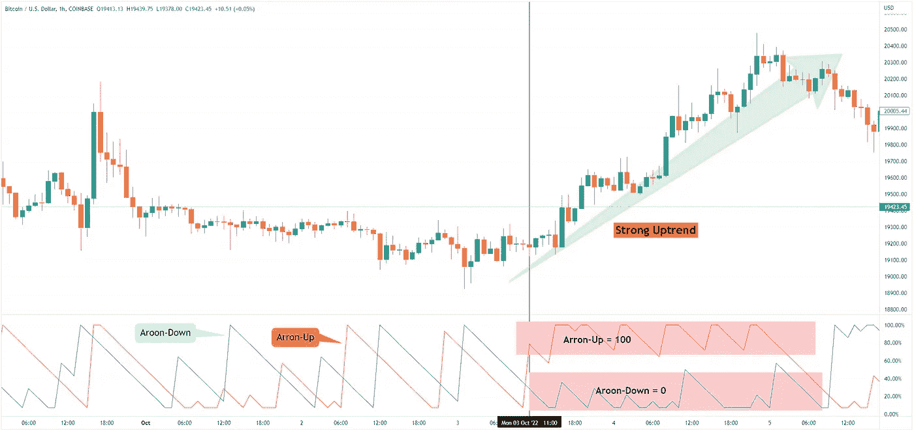

# 如何用 Aroon 指标来衡量隐藏趋势的强度

> 原文：<https://medium.com/coinmonks/how-to-measure-the-strength-of-a-crypto-trend-with-the-aroon-indicator-daf0ea254399?source=collection_archive---------23----------------------->

在交易中，每笔交易只有两个决定。你可以做趋势跟随者，也可以采取逆势交易的方法。要用这两种交易风格成功，你只需要知道趋势是会继续还是会反转。这就是为什么每个人都需要学习如何衡量趋势的强度。

# Aroon 指标是什么？

Aroon 指标是一种技术分析工具，由 Tushar Chande 于 1995 年开发。它用于衡量资产价格趋势的强度，通过查看资产价格高于或低于特定水平的时间量来实现。该指标由两条线组成，上升线和下降线，用于确定趋势的开始和结束。该指标通常用于发现资产价格的潜在反转，以及确认趋势的存在。

# 为什么使用 Aroon 指标？

交易可能是一个情绪驱动的过程。然而，你可以用机械交易规则来克服交易中的情绪偏见。出于这个原因，衡量趋势强度的最简单的方法之一是使用 Aroon 这样的趋势跟踪指标。

# 如何衡量趋势的强弱

衡量一个加密趋势的强度，你只需要知道两条规则:

1.  当上升趋势接近 100 时，我们有一个强劲的上升趋势，同时，下降趋势接近于零。
2.  当 Aroon-Down 接近 100 时，我们有一个强烈的下降趋势，同时，Aroon-Up 接近零。

上涨越接近 100，下跌越接近 0，趋势越强。Aroon 振荡器在发现比特币从低于 20，000 美元的最新反弹时派上了用场。

# 结果

说到技术分析，有很多指标可以用来衡量趋势的强度。然而，一个经常被忽视的指标是 Aroon 指标。在这篇文章中，我们向你展示了如何使用 Aroon 指标来衡量一个隐藏趋势的强度。我们希望这将让您更好地了解如何使用这一指标，并帮助您在交易加密货币时做出更明智的决定。

*最初发表于*[*【https://www.cryptohopper.com】*](https://www.cryptohopper.com/blog/7932-how-to-measure-the-strength-of-a-crypto-trend-with-the-aroon-indicator)*。*

> 交易新手？尝试[加密交易机器人](/coinmonks/crypto-trading-bot-c2ffce8acb2a)或[复制交易](/coinmonks/top-10-crypto-copy-trading-platforms-for-beginners-d0c37c7d698c)