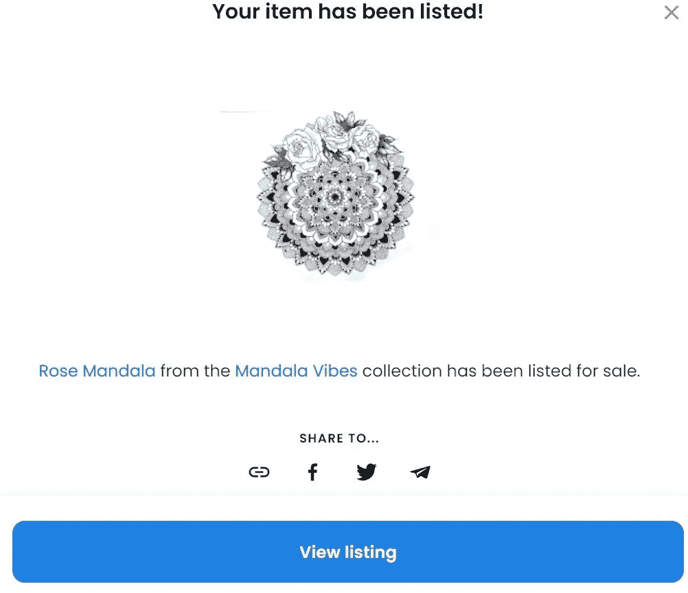

# 如何在 Opensea 上免费铸造你的第一个 NFT？循序渐进的指南

> 原文：<https://medium.com/coinmonks/how-to-mint-your-first-nft-for-free-on-opensea-a-step-by-step-guide-fca64f6d8b25?source=collection_archive---------15----------------------->

我用 MetaMask 钱包做过实验，所以我会解释详细的过程。

去 [OpenSea](https://opensea.io/) 之前，需要有一个 MetaMask 钱包。

你必须安装一个 [MetaMask](https://chrome.google.com/webstore/detail/metamask/nkbihfbeogaeaoehlefnkodbefgpgknn?hl=en) Wallet 的 chrome 扩展。

一旦您安装了扩展，您必须注册并保存您的秘密恢复短语。

之后，你需要访问 OpenSea 网站，点击钱包，这是 MetaMask，就像下面的图片一样-

当你的钱包连接后，你必须点击“**创建按钮**，你可以在下面看到-

点击创建按钮后，你会看到下图，你需要上传你的第一个 NFT

为您的第一个 NFT 提供一个名称，当您在页面中向下移动时，您将看到下图

外部链接是可选的，所以可以忽略它。添加与您的 NFT 相关的描述；甚至你的 NFT 名字也有效，以后还可以编辑。提交 NFT 后，收藏名称会反映出来。所以，也忽略收藏部分。

在那之后，下面，3 个部分将反映你-

***1。属性—*** 你需要提及你的 NFT 的属性。

***2。等级—*** 你可以在这里和神奇宝贝比较等级，因为每个人都知道神奇宝贝，每个神奇宝贝都有稀有度，根据稀有度，它们的价值被定义。你的 NFT 系列也是如此。你的 NFT 收藏品越稀有，它的价格就会越高。

> 注意—在创建级别内容时，我没有找到任何公式来分析和得出正确的数字。尽管它是 NFT 的元数据。

***3。属性—*** 属性反映在你的 NFT 副本上。例如，如果你的 NFT 持有 5 份拷贝，当你使用 1 份拷贝出售时，你必须评估 1/5。但对我来说，我正在使用这一个，而且只有一个副本，所以我给它打了 5/5 分。

如果你看到上面的图像，你可以看到-

***1。可解锁内容—*** 可解锁内容的潜在形式可以是证书&你的 NFT 证明、视频、实物收藏品、独家内容、社区访问等。如果你有类似的东西，可以附在“**可解锁内容**下。”

**2*2。露骨的&敏感内容—*** 如果你的 NFT 是关于露骨的&敏感内容，那么你要“打开”上图提到的 tab 键。

完成上述步骤后，您将在同一页上看到以下步骤，这是最重要的-

上图反映的是多边形，但对你来说，会反映以太坊；你需要选择多边形在 OpenSea 上免费铸造。忽略冻结元数据选项，点击“**提交**”

点击“**提交**按钮后，下面的页面会反映 NFT 已经在 OpenSea 上铸造了。但是您还没有添加您的定价。坚持读下去；我会告诉你在哪里添加您的定价到您的 NFT。

现在，点击下图中的蓝色图标，然后点击“**我的收藏**

当页面打开时，你必须点击“**创建收藏**按钮，之后，下面的页面将会打开，你可以在这里为你的收藏上传图片；这张图片也可以是你的 NFT，它反映了你的收藏。

你可以看到下面的图片，特色图片可以忽略，但如果你想保留一个，你可以。甚至你的横幅也可以挂在你的一个 NFT 周围。

正如您在下图中看到的，您需要为您的 NFT 集合提供一个名称、一个 URL 名称和一个描述。

添加以上细节后，你会在图片下面看到更多选项-

***创造者收益—*** 你需要决定百分比，因为你的 NFT 可以多次转售。每次你的 NFT 被卖掉，你会得到一笔由你决定的费用。

***您的支付钱包地址—*** 您可能会发现很难通过 MetaMask Wallet 扩展获取您的钱包地址。在你的手机上下载元掩码，从那里复制支付地址，并进一步粘贴到这里。

***区块链—*** 你希望在哪个区块链领取你的 NFT 支付？默认情况下，以太坊会反射，但你可以改变它。

填写上述详细信息后，您将看到以下选项-

其中显示的主题-包含将是默认的；如果你想，你可以改变它。

如果你的内容是露骨和敏感的内容，然后打开标签。

之后，点击**创建**

点击“**创建**按钮后。这里，有三种可能-

1.它不会进一步处理；可能在你的页面填充或者 URL 的某个地方有错误。

2.会顺利进行的。

3.它将反映一个错误“哎呀，出错了。”

即使你得到了下面的错误，也不用担心；我是来帮你的。继续遵循以下步骤；你会得到答案的。

> 注意——如果你的过程顺利，你可以跳过这一部分。

如下图所示，您需要点击“**联系支持**”

点击“**联系支持**”后，将会打开下面的页面，您需要在其中填写您收到的错误截图的所有详细信息。

填写完整表格后，您需要点击“**提交**按钮，您将会收到下面的邮件-

在这之后，我想知道谁会等这么久。然后我从 OpenSea 注销，尝试再次登录。

我看到的让我大吃一惊！！

> 是啊！问题解决了。

虽然我收到了来自 OpenSea 团队的邮件，但截图如下-

我分享这个是因为如果你的问题没有解决，你可以依靠 OpenSea 团队。

登录后，你必须点击“**我的收藏**，你会看到下图；你需要把你的第一个 NFT 移到你的收藏中。

要将 NFT 移到您的收藏中，您需要找到钱包旁边的标签；对我来说，它是蓝色的，点击“**简介**你将在那里第一次看到 NFT。正如你看到的 3 个点，你需要点击它们。

点击 3 个点后，会看到下图，需要点击“**编辑**”

点击“**编辑**按钮后，您将看到下图，您需要点击“**收藏**”并选择您的收藏。

之后，您需要点击**提交变更**

这些更改将反映在“**我的收藏**”下，您可以在下图中看到 1 个项目已移到您的收藏下。

如果您想删除另一个收藏，也可以删除它。

现在，你需要双击你的 NFT 收藏，你会看到下图

页面会这样反映，这里只有 1 个项目和 1 个 NFT 的所有者。

在下面，你可以看到 NFT，它被添加到这个系列中

你需要双击你的 NFT，一个新的页面将会打开，如下图所示

现在，你必须点击“**出售**”按钮，如上图所示。

点击“出售”按钮后，下面的屏幕将显示-

你需要决定你的 NFT 的价格和持续时间；默认为 1 个月。你可以保持原样。

也会有一个费用选项，你会在你的屏幕上看到下图

现在，你需要点击**完成清单**

现在，下面的过程已经开始工作；你可以看到下图-

如上图所示，标志按钮是不可点击的，但点击“**向下箭头**后，它将是可点击的。

“**审核收款**处理完毕后，“**审核币种**”和“**确认清单**”也会进行同样的处理。

在这三个过程都被批准后，一个新的页面将会打开，你可以看到下图-

> 恭喜你。！
> 
> 你的第一批 NFT 和收藏品已在 OpenSea 上出售。

如果您添加新的 NFT 或想要创建新的收藏，您必须遵循相同的方法。

如果你对此还有任何疑问，你可以发电子邮件给我——mayurnathani169@gmail.com。乐意帮忙！

***你是 Web3 爱好者吗？*** 给我接[这边](https://linktr.ee/mayurnathani)。

> 交易新手？尝试[加密交易机器人](/coinmonks/crypto-trading-bot-c2ffce8acb2a)或[复制交易](/coinmonks/top-10-crypto-copy-trading-platforms-for-beginners-d0c37c7d698c)