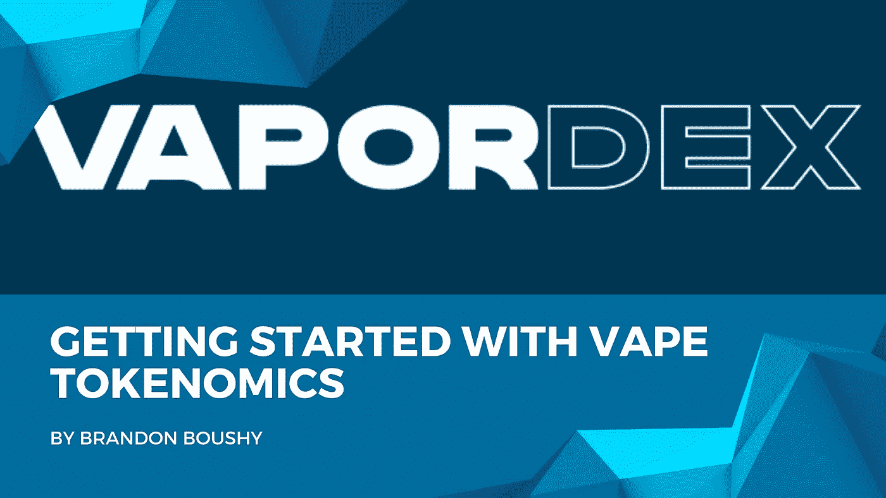

# 如何导航 VaporDEX 令牌发布？

> 原文：<https://medium.com/coinmonks/how-to-navigate-vapordex-token-release-33bdede42401?source=collection_archive---------2----------------------->

VaporDEX 最近发布了$VAPE 的 tokenomics，你可能需要接受博弈论教育才能弄明白。别担心。我将向您展示如何导航 VaporDEX 令牌释放。

这是为了简化最近宣布的 VAPE 发布的决策过程。

 [## VAPE 简介

### 随着 VaporDEX 现已进入公测阶段，我们的奖励计划已进入预注册阶段，我们的节点发展也已全面展开，是时候…

medium.com](/@VaporFi/introducing-vape-7266a2f9d12f) 

# VAPE 的最大供应量是多少？

VAPE 的最大供应量为 2100 万，计划在 10 年内发放。最大供应量是对比特币的认可，也是对长寿的承诺。

获取 VAPE 有四种方式，我们接下来会讨论。

# 获取 VAPE 的方法

最终，您有四种方式获得 VAPE:

1.  起源池:420，000 VAPE 或供应量的 2%
2.  液体赌注:168 万 VAPE 或供应量的 8%。
3.  增加赌注:630 万 VAPE 或 30%的供应量。
4.  平流层奖励:1260 万 VAPE 或供应量的 60%。
5.  我们将逐一查看，以帮助您决定想要参与哪一项。

## 创世池

起源池是一种独特的方式提供一个象征性的发射。他们不做 ICO 或 airdrop，而是允许每个人竞标 VPND，分享 42 万 VAPE 的份额。

您可以在 2023 年 1 月 13 日至 2023 年 2 月 7 日(日期可能会有变化)之间将 VPND 存入资金池。VPND 的人出价越多，VAPE 的初值就越高。你可以在下面阅读更多关于创世纪发射的信息。

 [## 创世纪简介

### $VAPE 的时间到了！

medium.com](/@VaporFi/introduction-to-genesis-9297abe39de5) 

理论上，大约 6 亿 VPND 可以存入 Genesis 池，根据当前定价，这将使 VAPE 的隐含价值约为 3.28 美元。(这将使 VaporDEX 的市值完全稀释，与 Trader Joe 相当。)

投入创世池的 VPND 99%会回到奖励池，1%归伯恩斯。随着投入 Genesis Pool 的 VPND 金额接近 6 亿英镑，我预计 VPND 的价值将会增加，因为除了每日 VPND 下降之外，现在还有增加流动性的方法。这将导致 VPND 和 VAPE 的值都增加。

## 为什么 VAPE Genesis 池很重要

Genesis 池将是任何时期内速度最快、规模最大的 VAPE 版本。它还将为二级市场流动性池提供基础。

## 液体打桩

液体定桩是标准的 DEFI 定桩策略。你入股 VPND，缴纳 5%的税，其中 99%分配给 VaporFi Nodes 奖励池，1%被烧掉。

168 万 VAPE 将在 10 年内分配，这意味着每月只有 14,000 VAPE。如果你持有免费的$STRAT NFT，

好处是你可以保留你的 VPND 并获得 VAPE。这是持有 VAPE 和 VPND 的最好方式。更多细节将在未来发布。

## 增强型打桩

此锁定选项提供了 30%的可用 VAPE，但这也带来了一个问题。如果你喜欢游戏加密项目，增强的赌注结合同温层奖励将 VAPE 带入 GameFi 的世界。

您将获得部分处理的 VAPE，这将需要其他 NFT 和策略来转换为 VAPE。

## 同温层奖励

60%的 VAPE 将作为同温层奖励发布，但它们必须经过复杂的游戏化策略才能上市。

一定要注册你的免费灵魂绑定同温层 NFT。

 [## VaporDEX -世界上最有价值的 DEX

### 世界上回报最高的 DEX

世界上回报最高的 DEXapp.vapordex.io](https://app.vapordex.io/stratosphere/member/manage-wallets) 

我很犹豫要不要说这将如何工作，因为这听起来足够复杂，我想在尝试交流这一切将如何工作之前先等等看，但如果你阅读了团队对 VAPE 的介绍，他们会带你了解这个概念。

# 我如何计划参加 VAPE？

我计划将所有的 VPND 提款集中到起源池。一旦结束，我将开始使用流动赌注，并考虑增强赌注和同温层奖励的成本/收益分析。

我很谨慎，在我开始把钱投入到像两种最复杂的赚取 VAPE 的方法这样复杂的东西之前，我喜欢看看系统是如何工作的。

# VaporDEX 正在为长期发展而努力

最终，我认为 VaporDEX 的团队是这个领域中最有创造力的团队之一。

他们所有的策略都可以应用到远远超出密码的领域。

例如，VAPE 游戏奖励可以很容易地重新用于教授资源管理、供应链管理和机会成本等概念。

同时，同温层忠诚度奖励计划可以很容易地用来帮助小企业主成功地发展一个全球网络:

1.  客户
2.  伙伴
3.  折扣

所有这些都会帮助更多的人实现他们的目标。

请关注这支神奇的队伍！

如果你喜欢这个博客，别忘了👏，关注 m，订阅我的邮件列表。我定期发布关于加密、独特的商业策略和其他我认为人们应该知道的主题。

> 交易新手？在[最佳密码交易所](/coinmonks/crypto-exchange-dd2f9d6f3769)上尝试[密码交易机器人](/coinmonks/crypto-trading-bot-c2ffce8acb2a)或[复制交易](/coinmonks/top-10-crypto-copy-trading-platforms-for-beginners-d0c37c7d698c)