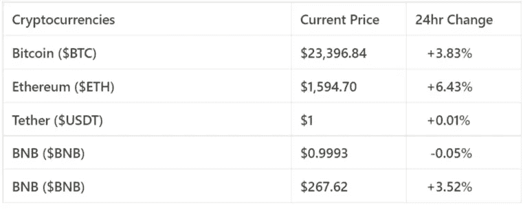
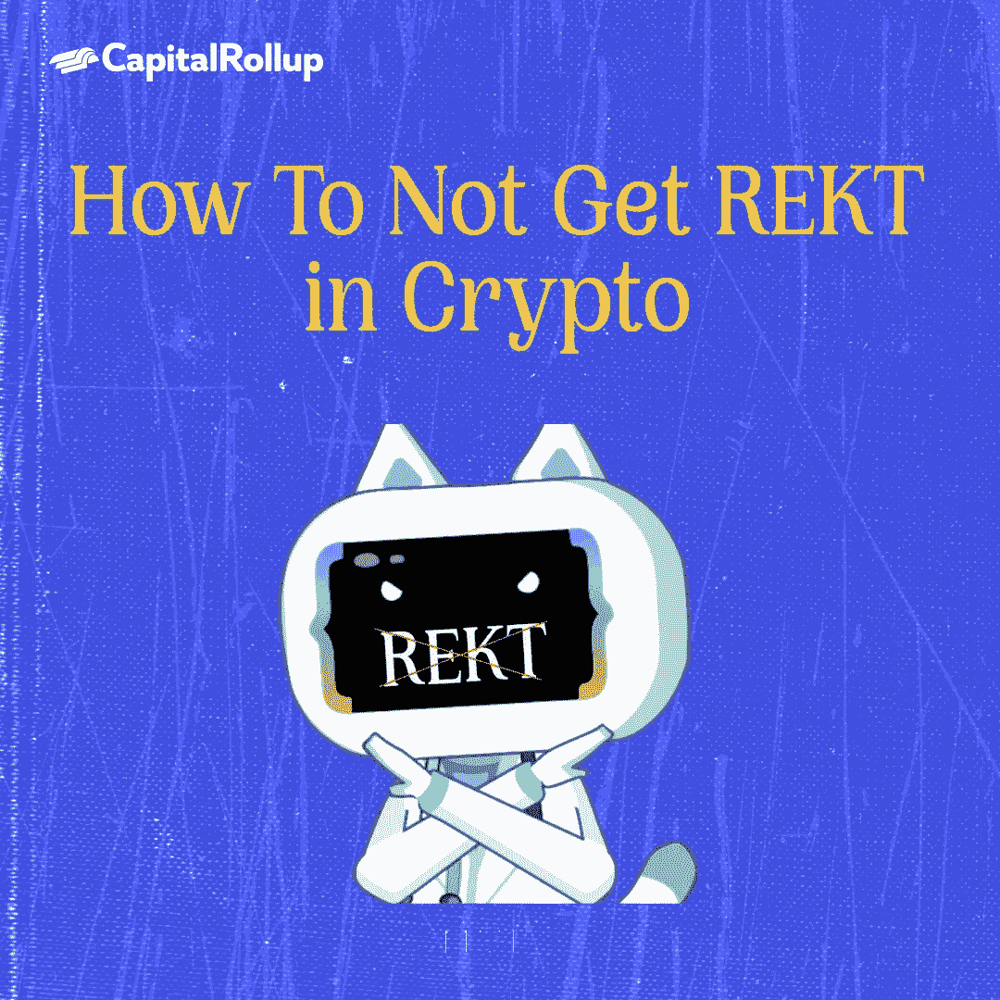
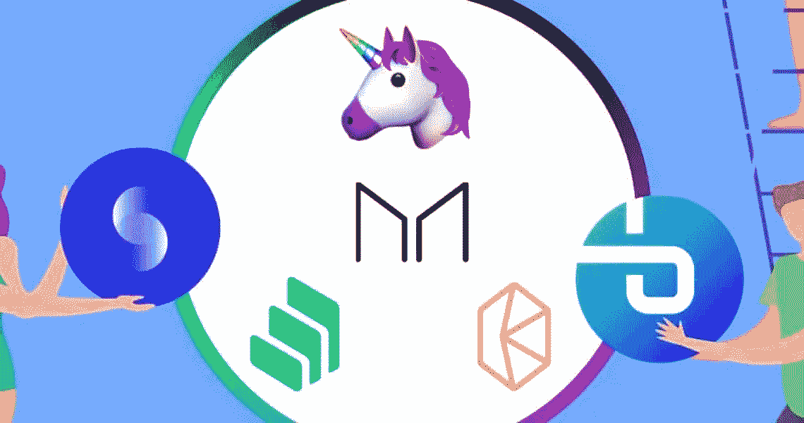

# 如何不在 Crypto 中获取 REKT？

> 原文：<https://medium.com/coinmonks/how-to-not-get-rekt-in-crypto-1de70efb860c?source=collection_archive---------23----------------------->

欢迎来到最新一期的 CapitalRollup Digest！今天的文摘是 7 月 22 日的，大概需要 5 分钟阅读。我们马上开始。

*   今天的市场看起来怎么样？(前 5/10 大流行加密货币)

Price Market Update

# 如何不在 Crypto 中获取 REKT？

由于加密货币的增长和采用，DeFi 取得了巨大的增长，为感兴趣的用户和投资者创造了许多机会。虽然好处很多，但 DeFi 也有风险。

在今天的时事通讯中，我们将讨论如何在 DeFi 和 crypto 中避免“REKT”。术语“REKT”用于描述遭受严重的财务损失，这是由最近价格暴跌导致的不良交易或投资造成的。对于许多初学者来说，这可能意味着游戏结束。

在 DeFi 中，人们因为很多原因而被 rekt，其中包括在没有足够的知识的情况下潜入 DeFi 和 Crypto 的广阔世界，

**想避免被 rekt？让我们开始吧:**

# 美元成本平均法

加密投资者最常见的事情是，当他们进入市场时，他们会花很多钱，一次性购买他们想要的所有加密货币。以这种方式投资也被称为[一次性投资。](https://www.investopedia.com/terms/l/lump-sum-payment.asp)

如果你使用一次性投资，你是在暗示目前的价格是进入市场并获利的最佳时机，这并不总是正确的，因为没有确切的方法来确定进入市场的时间。

一个简单有效的方法是持续投入少量资金来平滑你的投资。这种投资方式被称为美元成本平均法(DCA)。大多数长期投资者欣赏这种策略，这可能是最著名的策略之一。

当你进行 DCA 时，你在一段固定的时间内投资固定的金额。

例如，假设你想在一个月内投资 2000 美元比特币。选择一周中你想投资 500 美元的一天，持续四周(大约一个月)，直到你投资了 2000 美元。通过这样做，你可以防止这个月的价格波动。如果一周中的某一天或某几天比特币价格较低，你可以花 500 美元购买更多比特币。反过来说，如果比特币价格很高，你少买一些也是有道理的。

本质上，DCA 降低了波动性的影响，同时最小化了市场风险。

# 多样化你的投资组合

不要把所有的鸡蛋放在一个篮子里，这是一个很好的建议，尤其是在投资方面。重要的是分割你的资产，而不是投资单一的加密货币。如果一种加密货币下跌，从长远来看，你的加密投资组合中的其他货币应该会帮助你。

明智的做法是不要把你拥有的所有东西都保存在 crypto 中，而是分散到像 DeFi indexes 等资产类别中。假设你这样做，一种加密货币价格下跌，你可以交易另一种。如果整个加密市场不景气，你可以换一种不同的资产。

分散投资在最小化投资组合风险方面发挥着重要作用。通过这样做，你将继续保持领先并减少损失。

# 不要采取任何手段

当交易员对结果过于自信时，通常会出现过度杠杆化。每次都像打了个本垒打。这种方法只有一个问题:它是不可持续的。因此，这个梦想很容易变成一场噩梦，因为把握市场时机是一项挑战。因此，当交易者采用过多的杠杆时，有两种可能的结果。在最好的情况下，交易是成功的，导致了巨大的利润。重要的是要记住，如果头寸结果不佳，高杠杆头寸也可能导致亏损。

为了将风险最小化，你应该更多地关注保本和寻找小而稳定的胜利。

# 坚持你可以信任的 DeFi 协议

尽管区块链缺乏信任，但信任在加密市场中至关重要。

> *作为一名 DeFi 投资者，您可以通过仅在已经过审计并经受住时间考验的既定 DeFi 协议中部署资金，来降低因黑客攻击、欺诈或代码错误而损失资金的风险。*

例如，贷款协议 Aave 和 Compound 已经成功运行多年，允许成员投资于分散的贷款系统。在 DeFi 贷款市场，他们成功地确立了自己作为两大领先平台的地位。

在对 DeFi 市场进行单笔投资之前，要做适当的研究。

# 认真对待您的钱包安全

如果你在密码空间呆过一段时间，你可能听说过“种子短语”这个术语。种子短语也称为恢复短语，它是在您设置钱包时由您的钱包生成的一组 12-24 个随机单词。

只有输入这些随机单词，您才能重新访问钱包上的加密货币，因为如果您的钱包丢失或被盗，这是找回加密货币的唯一方法。

我们鼓励您尽可能充分利用这一工具，为子孙后代保护您的数字资产安全。

# 最后的想法

这就是你想要的——一份避免被炒鱿鱼的建议清单。

我们建议你应该 DYOR，更好地管理你的风险，以保持安全。

# 琐事🤔

**区块链是靠什么获得安全的？**

A.“散列”代码

B.注册

C.密码

D.pin 码

在下一期的 CapitalRollup Digest 中找到答案。😉

# 每日一词！

💡 **JOMO**

JOMO 是“错过的喜悦”的缩写，指的是一个交易者，他很高兴自己没有建仓，经常在价格大幅下跌后说。

**一个句子中使用的术语:**
*——推特和脸书上正在使用缩写词* ***JOMO*** *。*

# 社区更新📢

我们与 3 位行业领袖组织了一次 Twitter 空间会议，我们在会上讨论了“分享您的熊市经验& CeDeFi 内爆”，您可以在这里[收听](https://twitter.com/i/spaces/1YpKkZzakbNxj?s=20)

# 我们今天在读什么📰

**挺过比特币熊市。** [***阅读更多***](https://blockpublisher.com/survive-getting-rekt-this-bitcoin-bear-market/)

**如何避免在 web3 中被 rekt？。** [***阅读更多***](https://www.odysseydao.com/articles/how-to-avoid-getting-rekt)

## 与朋友一起学习和投资加密💰

当您邀请您的朋友开始使用 CapitalRollup 进行有利可图的投资时，您将获得独特的奖励。

💬对 CapitalRollup Digest 有什么反馈吗？ [**告诉我们！**](mailto:hi@capitalrollup.com)

> 交易新手？尝试[加密交易机器人](/coinmonks/crypto-trading-bot-c2ffce8acb2a)或[复制交易](/coinmonks/top-10-crypto-copy-trading-platforms-for-beginners-d0c37c7d698c)