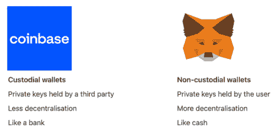

# “如何接纳下一个十亿用户”, crypto/区块链，第 1 部分

> 原文：<https://medium.com/coinmonks/how-to-onboard-the-next-billion-users-to-crypto-blockchain-part-1-2a5a1d3ab275?source=collection_archive---------14----------------------->

为什么一个普通人会关心 web3？

如今，最常见的理由是:“他们想赚钱。”

web3 上的普通用户:

1.  **使用交易所**购买 BTC、瑞士联邦理工学院或者(但愿不会如此)一个迷因令牌。
2.  **设置钱包**并在那里转移代币。
3.  购买一辆 NFT 或探索 DeFi。

上面的每一步都有一个巨大的落差。交易所、钱包和 NFT 市场如何提供更好的人民币？

**你在交易所做什么？**

交易所是最接近 web2 的代理。通过交换，您可以:

1.  **使用常规用户名和密码登录。**
2.  从银行或信用卡存钱。
3.  用那些钱来买卖密码。

但是，很多人只是利用交易所买卖 crypto。他们将代币移动到独立的钱包中以做任何其他事情(例如，购买 NFT)。

这就是为什么交易所正在向下移动。例如，比特币基地已经拥有 8900 万个与银行或信用卡相关的账户。他们可以将这 8900 万个客户追加销售给:

1.  **将密码转移到比特币基地钱包。**
2.  从比特币基地市场购买 NFT。

交易所的风险在于它们不是分散的。目前还不清楚比特币基地钱包有多少用户，也不清楚比特币基地的 NFT 市场是否会让艺术家和创作者从交易费中提成。

自我保管钱包(例如 Metamask)是最接近您的 web3 身份的代理。

钱包有什么问题，如何解决？

如今的钱包有两个问题:

1.  将资产转移到钱包里是一件令人伤脑筋的事情。钱包的公共地址是一长串随机字符。一个打字错误，你的资产就永远消失了。
2.  种子短语并不那么安全。骗子会不遗余力地诱骗你分享它。一个错误，你的资产就永远消失了。

为了解决这些问题，钱包可以:

*   **建立直接菲亚特 onramps** 。钱包可以让人们直接用信用卡或银行账户购买密码，完全跳过交易。这需要 KYC(身份验证)，但我认为大多数用户不会在意。(**这是我们公司的******来入画**)**
*   ****提高 UX 和安全性。ALOT 可以提高钱包的可用性。钱包也可以引入 web2 安全性(例如，2FA)来帮助人们保护他们的种子短语。****

**但是钱包可以做更多的事情。它们可以是您的:**

1.  ****Web3 身份**。钱包可以让你设置一个更容易记住的公共地址。他们还可以让您创建一个公共的 web3 个人资料页面，以突出您的 NFTs，链上凭证，等等。**
2.  ****Web3 社交网络**。钱包可以让您轻松找到、关注其他钱包并向其发送信息。**
3.  ****Web3 NFT 和应用商店**。每个 dapp 和 NFT 项目都希望搭载更多用户。钱包可以向你展示你关注的人实际上在做什么，并推荐你网络中的热门 NFT 和应用。社会背景对发现有着不可思议的影响力。**

**今天，钱包主要通过其他 NFT 项目和 dapps 获得客户。在未来，**钱包将成为你的 web3 身份、社交网络和应用发现的中心枢纽**。**

**如果钱包将有助于推动社会背景下的发现，那么 NFT 市场(如 OpenSea)将何去何从？**

**为了找到这个有趣问题的答案，请继续关注我们即将推出的**第二部分。****

> **交易新手？尝试[加密交易机器人](/coinmonks/crypto-trading-bot-c2ffce8acb2a)或[复制交易](/coinmonks/top-10-crypto-copy-trading-platforms-for-beginners-d0c37c7d698c)**