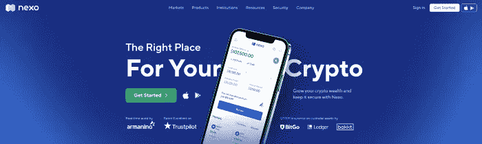
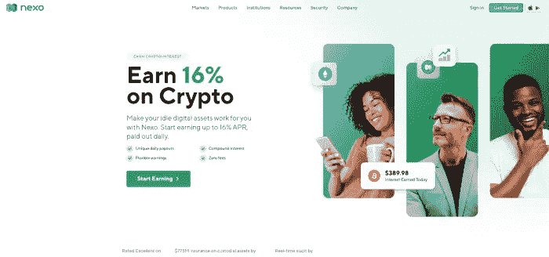
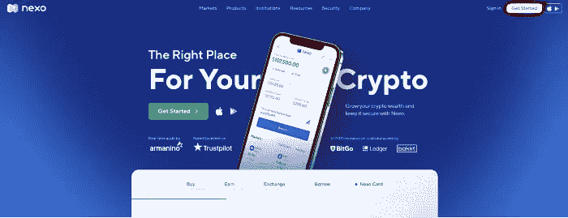
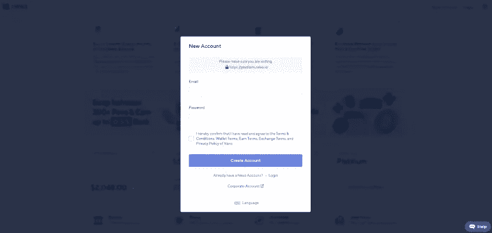
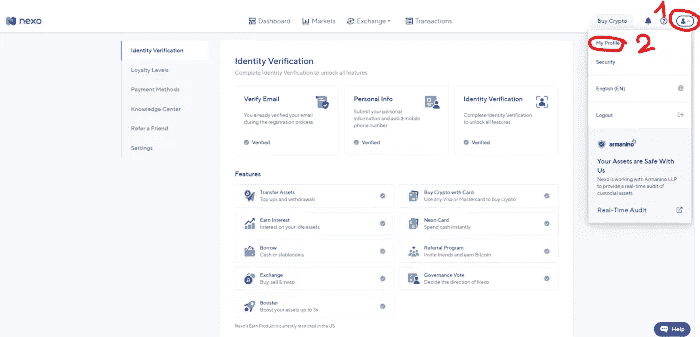

# 如何用 Nexo 优化 Stablecoin？

> 原文：<https://medium.com/coinmonks/how-to-optimize-stablecoin-with-nexo-1d8ffc976262?source=collection_archive---------34----------------------->

世界经济形势影响到全世界公民的收入。假设你正在寻找如何优化 Stablecoin？让我们看看这篇帖子，了解一下**如何用 Nexo 优化 Stablecoin？**这对你使用**稳定硬币赌注**会有帮助。

# Nexo 是什么？

Nexo.io

[**Nexo**](https://nexo.io/) 是一家在美国有牌照的借贷平台。 **Nexo** 成立于 2018 年。用户目前可以在 Nexo 平台上以每年高达 10%的利息下注 Stablecoin。Nexo 也被认为是稳定硬币赌注的最佳平台之一。

> [*在这里注册一个新的 Nexo 账户*](https://nexo.sjv.io/PartnerNexo)

# 为什么选择 Nexo？

Nexo Earn Interest

FTX 和币安之间发生的事情让投资者对交易所失去了信心。FTX 对投资者撒谎导致 FTX 垮台。然而，与 FTX 不同，Nexo 了解 FTX 的问题，并公布所有信息。

*   投资者可以查看 Nexo 的牌照:[https://nexo.io/licenses-and-registrations](https://nexo.io/licenses-and-registrations)。
*   Nexo 的实时证明:[https://real-time-attest.trustexplorer.io/nexo](https://real-time-attest.trustexplorer.io/nexo)
*   投资者对 Nexo 的保险:通过 Nexo 与 BitGo、Ledger、Bakkt、Fireblocks 和其他顶级托管人的合作，Nexo 钱包的总保险金额已增加到 7.75 亿美元，这些托管人的设施通过伦敦劳埃德保险社和 Marsh and Arch 的保险公司辛迪加进行保护。
*   诱人的 Stablecoins 储蓄利率:Nexo 在 Stablecoins 的储蓄利息和币安差不多，最高每年 10%，最低灵活 8%。然而，投资者在币安只能存 2000 美元以获得灵活的储蓄利息。但在 Nexo，投资者可以存入最高 10 万美元的灵活储蓄利息。

# 指南注册 Nexo 的帐户(一步一步)

**第一步**:点击此链接:[https://nexo.sjv.io/PartnerNexo](https://nexo.sjv.io/PartnerNexo)，点击即可开始。

Step 1

第二步:填写你的邮箱和密码，创建一个账户

Step 2

**第三步**:进入主屏幕后，点击上方右上角的图标，选择“我的个人资料”验证您的电子邮件、个人信息和身份验证

Step 3

# 结论

**储蓄利息**现在**是帮你守住钱的最好方法。Nexo 是加密领域最合法的平台之一。你可以选择 **Nexo** 来优化你的 stablecoins 和 **DCA 比特币**当你觉得合适的时候。**

以上都是**如何用 Nexo 优化 Stablecoin？**如果你对我有任何问题，请在本帖下方评论；我会为你写下他们。别忘了跟随我的媒介。祝你投资之旅成功。

> 交易新手？尝试[加密交易机器人](/coinmonks/crypto-trading-bot-c2ffce8acb2a)或[复制交易](/coinmonks/top-10-crypto-copy-trading-platforms-for-beginners-d0c37c7d698c)