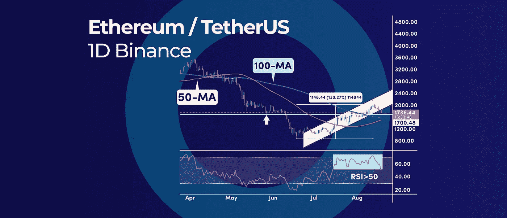

# 如何正确选择支撑位和阻力位？|以及本周加密更新中的更多内容。

> 原文：<https://medium.com/coinmonks/how-to-pick-support-and-resistance-levels-the-right-way-and-more-in-this-weeks-crypto-update-672828813b0?source=collection_archive---------19----------------------->

How to Pick Support and Resistance Levels the Right Way? | And More in This Weeks Crypto Update.

*   Celsius 的 RSI 现在是有史以来最超买的，下一步是什么？
*   以太坊是如何突破 2000 美元的
*   如何正确选择支撑位和阻力位？

# Celsius 的 RSI 现在是有史以来最超买的，下一步是什么？

根据最受欢迎的动量指标之一，摄氏(CEL)已经达到极端超买读数。日线图上相对强弱指数(RSI)达到 93.61。上一次 RSI 达到这样的值是在 2021 年 4 月，当时加密货币价格见顶，在未来 15 天内下跌了 31%。

## RSI 指标

此前 2021 年 4 月录得的最高日 RSI 读数为 84.18。直观的比较显示，价格走势看起来与一年前的价格走势相似——两次涨势都很快。因为 RSI 是一个领先指标，80 以上的读数通常标志着顶部。

价格也可以在 4.70 美元阻力位以下保持盘整，直到 RSI 振荡指标自行复位。然而，在短期内，我们更有可能看到这一趋势的停顿。

技术图也显示了 4.70 美元的强大阻力，随后是 5.00 美元的心理水平，空头可能会在此进行激烈的斗争。

展望未来:下行方面，3.50 美元是一个强有力的支撑位。如果日线跌破这一水平，将有机会再次测试关键的 2.60 美元支撑位。

# 以太坊是如何突破 2000 美元的

以太坊(ETH)经历了自 6 月低点以来又一次约 130%的大幅反弹。尽管如此，在短期内，价格走势表明 2000 美元的心理水平是一个需要克服的坚实阻力。以下是需要发生的三件事，以便 ETH 的价格有更高的机会突破 2000 美元。

## #1 相对强弱指数需要保持在 50 以上

相对强弱指数(RSI)需要继续打印 50 中间水平以上的读数。这将标志着当前反弹背后的积极势头。

## #2 黄金交叉信号需要实现

100 天和 50 天简单移动平均线之间的黄金交叉是一个重要的看涨信号。两条均线彼此非常接近，信号可能在未来几天的任何时候出现。

黄金交叉不仅发生在 50 天均线越过 200 天均线的时候，也发生在 50 天和 100 天均线的牛市交叉的时候。通过使用移动平均线的第二个组合，我们可以更早地得到黄金交叉信号。

## #3 回调需要保持在 1500 美元以上

价格的任何回落都需要跌破 1500 美元。否则，我们可能最终跌破 100 天和 50 天的简单移动平均线，并跌破关键支撑位。跌破 1500 美元将降低继续突破 2000 美元的可能性。

**底线:**以太坊的涨势要持续到 2000 美元及以上，RSI 需要保持在中级 50 上方，50 SMA 需要穿越 100 SMA 日线图上方，最后，任何回调都需要保持在 1500 美元上方。

# 如何正确选择支撑位和阻力位？

支撑和阻力交易实际上是技术分析的核心。选择最相关的支撑位和阻力位可以作为你在加密交易中成功的起点。并非所有的 S.R .等级都是平等的，因为有些等级比其他等级更有分量。这篇文章将教你使用支撑位和阻力位的基本技巧。

## 什么是支撑位和阻力位？

因此，为了正确选择这些级别，您需要了解它们是如何工作的。当对股票或密码的需求大于供应时，就产生了支撑位。这导致股票或密码的价格上涨。另一方面，当股票或密码的供应量大于需求量时，就会产生阻力位。这导致物品的价格下降。

## 怎么画支撑线和阻力线？

在画支撑线和阻力线的时候，有一些事情要记住。首先，你要确保线是水平的。这将有助于你很容易地看到价格变动，并确定潜在的逆转。

第二，你要确保在关键级别绘制线条。这意味着要找出价格在过去反转的区域，或者有重要支撑位或阻力位的区域。最后，您需要确保这些行的间距是均匀的。这将帮助你更容易识别潜在的突破或趋势反转。

## 如何选择支撑位和阻力位？

一些支撑位和阻力位被低估了，经常被散户忽略，但它们通常是最有力的交易点。

你应该开始关注的第一个 S.R .水平是更高的时间框架水平，更具体地说，是每年的转折点。这些市盈率水平向我们展示了谁在控制市场。

在比特币周线图上，我们可以看到 BTC 如何在 2022 年 3 月拒绝了年度中枢点，以及该区域如何在年初充当阻力。此外，我们可以观察到 5 月份确立的边际低点实际上是 S1 早期支撑位。

如果你只关注当天的价格波动，你就会错过这些标准差水平。这些水平中的大多数在当天的时间范围内是看不到的。

关于如何选择支撑位和阻力位的其他有用提示包括:

*   定期更新你的支持和阻力水平。
*   使用价格区域，而不是单一的支撑线和阻力线。
*   偶尔你可以切换到折线图来过滤掉噪音，得到更多相关的信噪比水平。
*   使用枢纽点等汇流聚类因素。

# 一锤定音

选择正确的支撑位和阻力位可能很棘手，但花时间学习如何正确地做是绝对值得的。毕竟，这些水平对技术分析至关重要，对你的交易结果有很大的影响。我们希望我们的建议能帮助你像专业人士一样找到支撑位和阻力位。如果你仍然不确定从哪里开始，选择正确的支撑位和阻力位可能会很棘手，但花时间学习如何正确地做是绝对值得的。毕竟，这些水平对技术分析至关重要，对你的交易结果有很大的影响。我们希望我们的建议能帮助你像专业人士一样找到支撑位和阻力位。如果你仍然不确定从哪里开始，考虑在图表上练习，看看你感兴趣的项目的实时例子。

订阅我们的媒体每周博客和更新。
在[推特上关注我们](https://twitter.com/cryptohopper) | [脸书](https://www.facebook.com/cryptohopper)|[Reddit](https://www.reddit.com/r/CryptoHopper/)|[insta gram](https://www.instagram.com/cryptohopper/?hl=nl)

在 [Cryptohopper](https://www.cryptohopper.com/) 开始交易！

> 交易新手？尝试[加密交易机器人](/coinmonks/crypto-trading-bot-c2ffce8acb2a)或[复制交易](/coinmonks/top-10-crypto-copy-trading-platforms-for-beginners-d0c37c7d698c)