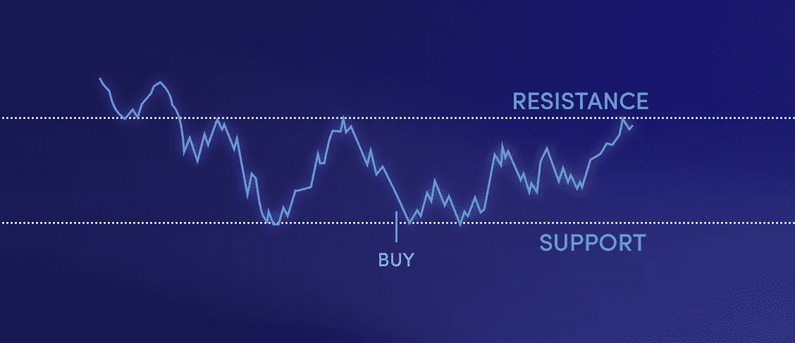
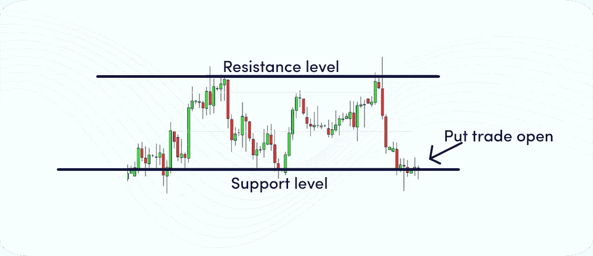

# 如何正确选择支撑位和阻力位？

> 原文：<https://medium.com/coinmonks/how-to-pick-support-and-resistance-levels-the-right-way-f007fdc99ecf?source=collection_archive---------29----------------------->

How to Pick Support and Resistance Levels the Right Way?

支撑和阻力交易实际上是技术分析的核心。选择最相关的支撑位和阻力位可以作为你在加密交易中成功的起点。并非所有的 S.R .等级都是平等的，因为有些等级比其他等级更有分量。这篇文章将教你使用支撑位和阻力位的基本技巧。

# 什么是支撑位和阻力位？

因此，为了正确选择这些级别，您需要了解它们是如何工作的。当对股票或密码的需求大于供应时，就产生了支撑位。这导致股票或密码的价格上涨。另一方面，当股票或密码的供应量大于需求量时，就会产生阻力位。这导致物品的价格下降。

# 怎么画支撑线和阻力线？

在画支撑线和阻力线的时候，有一些事情要记住。首先，你要确保线是水平的。这将有助于你很容易地看到价格变动，并确定潜在的逆转。

第二，你要确保在关键级别绘制线条。这意味着要找出价格在过去反转的区域，或者有重要支撑位或阻力位的区域。最后，您需要确保这些行的间距是均匀的。这将帮助你更容易识别潜在的突破或趋势反转。

# 如何选择支撑位和阻力位？

一些支撑位和阻力位被低估了，经常被散户忽略，但它们通常是最有力的交易点。

你应该开始关注的第一个 S.R .水平是更高的时间框架水平，更具体地说，是每年的转折点。这些市盈率水平向我们展示了谁在控制市场。

在比特币周线图上，我们可以看到 BTC 如何在 2022 年 3 月拒绝了年度中枢点，以及该区域如何在年初充当阻力。此外，我们可以观察到 5 月份确立的边际低点实际上是 S1 早期支撑位。

如果你只关注当天的价格波动，你就会错过这些标准差水平。这些水平中的大多数在当天的时间范围内是看不到的。

关于如何选择支撑位和阻力位的其他有用提示包括:

*   定期更新你的支持和阻力水平。
*   使用价格区域，而不是单一的支撑线和阻力线。
*   偶尔你可以切换到折线图来过滤掉噪音，得到更多相关的信噪比水平。
*   使用枢纽点等汇流聚类因素。

# 一锤定音

选择正确的支撑位和阻力位可能很棘手，但花时间学习如何正确地做是绝对值得的。毕竟，这些水平对技术分析至关重要，对你的交易结果有很大的影响。我们希望我们的建议能帮助你像专业人士一样找到支撑位和阻力位。如果你仍然不确定从哪里开始，选择正确的支撑位和阻力位可能会很棘手，但花时间学习如何正确地做是绝对值得的。毕竟，这些水平对技术分析至关重要，对你的交易结果有很大的影响。我们希望我们的建议能帮助你像专业人士一样找到支撑位和阻力位。如果您仍然不确定从哪里开始，

*最初发表于*[*【https://www.cryptohopper.com】*](https://www.cryptohopper.com/blog/7502-how-to-pick-support-and-resistance-levels-the-right-way)*。*

> 交易新手？尝试[加密交易机器人](/coinmonks/crypto-trading-bot-c2ffce8acb2a)或[复制交易](/coinmonks/top-10-crypto-copy-trading-platforms-for-beginners-d0c37c7d698c)