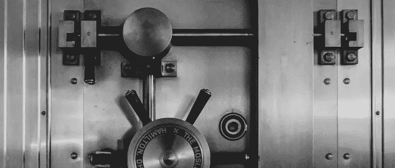
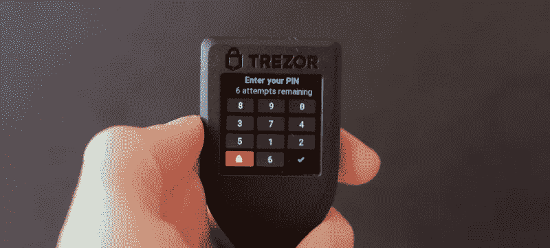
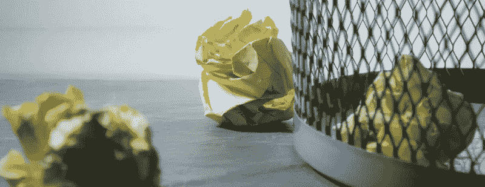
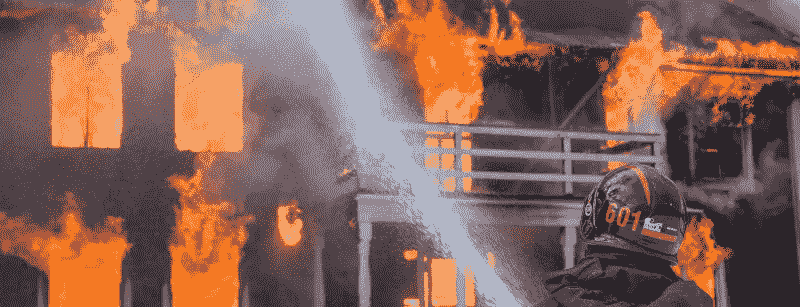
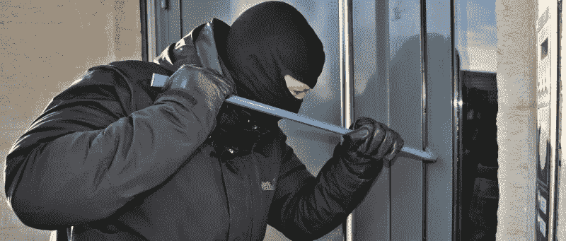
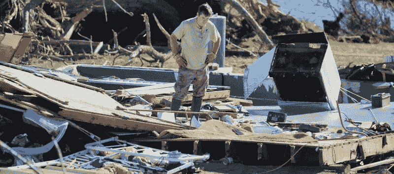
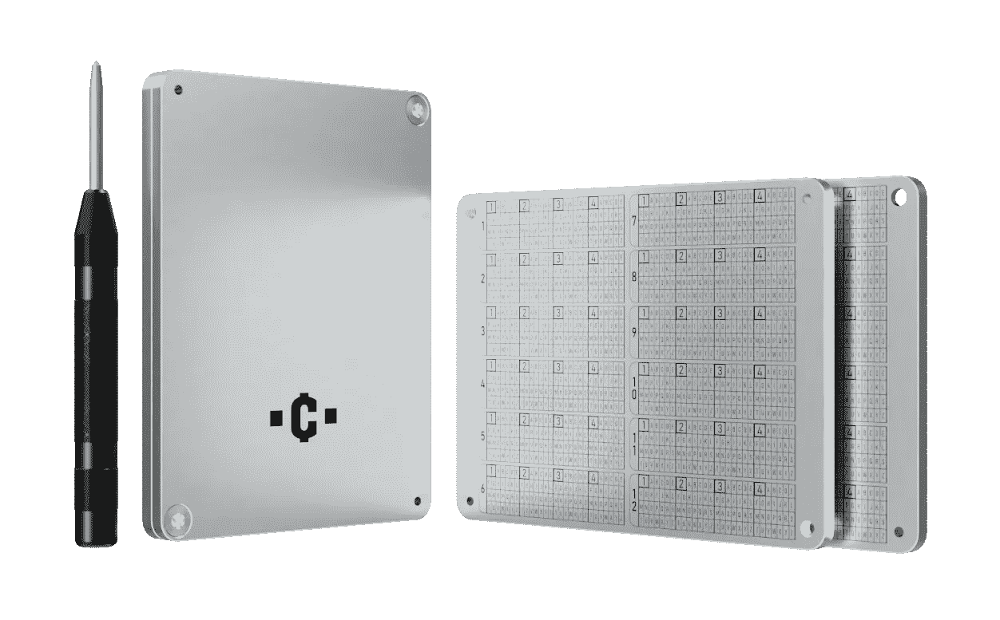

# 如何挑选最好的金属加密钱包和安全多年？

> 原文：<https://medium.com/coinmonks/how-to-pick-the-best-metal-crypto-wallet-and-be-safe-for-years-663b275852de?source=collection_archive---------10----------------------->

希望你已经知道一些加密货币的安全性，并拥有一个硬件钱包来保护你的加密货币组合免受黑客攻击。请注意，你也应该做一个钱包恢复短语的适当备份，最好是用一个坚固的金属加密钱包。如果没有，你绝对应该买一个。不要忘了继续阅读，根据下面的建议来保护你的硬件钱包的备份短语的安全。

使用硬件钱包和金属备份对于加密货币的最终安全性至关重要。无论是比特币、以太币还是 Dogecoins，你都是唯一对你的资金安全负责的人。在加密领域，我们说“做你自己的银行”，这并不是偶然的，所以你必须像它一样行动，并很好地保护你的资金。金属加密钱包是保护您资金的最佳方式之一。

金属加密钱包是安全加密货币持有的重要组成部分，因为软件和硬件钱包都需要某种形式的备份，通常是恢复短语(种子短语)。为了不损失资金，你必须安全地保存一份副本，最好把它标在一些耐用的金属上，比如不锈钢。这就是金属加密钱包对任何加密持有者如此重要的原因。

内容:

1.  **为什么需要金属加密货币钱包？**
2.  **金属加密钱包——它如何保护您的备份**

*   错位风险
*   火灾和热损伤
*   水和湿气损害
*   入室盗窃或盗窃风险
*   房屋倒塌和其他灾难
*   时间变质和墨水褪色

**3。最好的金属加密钱包是什么？**

**4。我们团队提供的关于保护您的钱包恢复短语安全的额外提示**

# 为什么你需要一个金属加密钱包？

硬件和软件钱包都要求你写下一个备份密码(种子短语)，如果钱包被破坏或损坏，你可以用它来恢复钱包和你的帐户。强烈建议每个硬件或软件钱包的用户备份他们的种子词并妥善保管。这是一个很好的建议，因为如果你把你的 pin 码输错了几次，钱包就会自动删除，或者有一天它就坏了，你就需要这个钱包备份。

大多数用户只是在一张纸上写下他们的钱包备份——一个[种子短语](https://getcoinplate.com/blog/is-a-seed-phrase-the-same-as-a-private-key-the-ultimate-guide-to-private-keys-and-recovery-seed-phrases/)——就完成了。但是你必须明白，这个备份是拥有你的硬币的必要条件。如果纸质备份被破坏或丢失，您将永远无法存取您的资金，而且纸质备份很容易被破坏或放错地方。这就是为什么在更耐用的设备上进行备份如此重要的原因。有现成的金属加密货币钱包可用，如 [Coinplate Alpha](https://getcoinplate.com/product/coinplate-alpha/) ，由超厚不锈钢板制成，超级容易使用。有了它，你可以在几分钟之内在你的餐桌上制作一个超级耐用的备份。

金属加密钱包是必不可少的，以保持您的硬件或软件钱包备份安全。我们必须再说一遍，你必须保证你的钱包备份短语的安全，否则你可能会失去所有的资金。金属加密钱包，尤其是不锈钢加密钱包是保护您的钱包恢复短语免受任何可能的事故和灾难的最佳方式。

# 金属加密钱包—它如何保护您的备份

从我们自己的经验来看，我们可以说，你必须保护你的钱包恢复短语对最常见的事故和灾难。你永远不知道未来会发生什么，但你可以通过简单地使用金属加密钱包和多年的良好睡眠来避免几乎所有的风险。你可以专注于观察你的投资组合增长，而不用担心几年后你会把这张奇怪的纸条放在哪里。

# 错位风险

对于大多数人来说，最大的风险就是将备份放错了地方——有无数这样的故事，人们将一张纸和他们钱包的备份一起扔掉，因为它和其他文件放在一起。清理你的办公桌，清理你的阁楼或车库——比起一张粘在其他文件里的纸，你更容易注意到像金属加密钱包这样的重金属物品。尤其是大多数人会把他们珍贵的备份文件藏在一大堆其他文件中，这样就不会被窃贼发现。事实上，他们通常会在一段时间后忘记它藏在哪里，更不用说他们的父母或配偶了。这个备份经常会被你的家庭成员扔掉，因为它看起来一点也不重要。

像 Coinplate 这样最好的金属加密货币钱包，由于有特殊的安装孔，可以固定在墙上，阁楼梁上或你的房子基础上。你甚至可以在盒子里找到一些木螺丝，这样你就可以马上动手了。更不用说，一个好的金属加密钱包将是一个沉重的固体金属块，当检查一箱文件时，即使你把它放在那里，也不会那么容易忽视。

# 火灾和热损伤

你的标准纸种子短语备份将没有机会对抗房屋火灾。你的备份可能会被销毁，即使没有直接烧毁，因为高温会使墨水褪色。更糟糕的是，当消防队到达时，他们会将大量的水喷遍你的房子、公寓或公寓楼。即使火灾发生在你邻居的公寓里，他们也可能会完全浸泡你的房间来控制火势。水会彻底毁掉你的纸质备份以及所有纸质照片和其他文件。

此外，纸张上的墨水在受热时可能会褪色，时间比你预期的要早得多。标准的钢笔或打印机墨水应该至少 5 年不褪色，但是如果你把你的备份纸张放在散热器、电脑或阳光充足的窗户旁边，它可能会让你的备份纸张很快变得一文不值。

这与一个合适的钢制加密钱包大不相同。不锈钢加密金属钱包可以承受高达 1.400 摄氏度/2.500 华氏度的温度，而房屋火灾可以达到 850 摄氏度/1.500 华氏度，但通常低于这一温度。由于其坚固的构造，最好的金属钱包将在消防员的浸泡下迅速冷却，而没有破裂的风险。水也不会成为问题。因为你会在不锈钢上标记你的短语，它不会受到任何热源的影响，除非你把它扔进熔炉。

# 水和湿气损害

说到纸张，没有什么会比水和湿气更快地破坏您的纸质钱包备份。这就是为什么图书馆和档案馆花费数百万美元来保持他们的存储设备干燥的原因。

直接接触水可能足以使你的恢复短语的纸质副本不可读，在最好的情况下，它只会使它难以阅读。如果你能把纸铺开并晾干，你可能会保存纸本身，但墨水可能会消失或弄脏。水渍可能是由不同的原因造成的，比如被你办公室的火警触发的水珠浸湿，甚至是你楼上邻居有问题的水管。即使在你自己的房子里，洗碗机或洗衣机也会淹没你的房间，在它浸湿下面的房间之前，你可能不会注意到。

此外，纸质文件经常会因潮湿和发霉而毁坏。把你的纸质备份放在阁楼、车库、工具棚或自己的储藏室里会使它容易受潮和发霉。

对于金属，这不是问题，特别是如果你使用不锈钢加密钱包，可以在水中保存多年，没有问题。优质不锈钢甚至可以长期暴露在盐水中，所以你完全不用担心。此外，一个制作精良的金属加密备份也可以毫无问题地经受住冷冻和解冻，而这对你的纸质备份来说可能是毁灭性的。

# 入室盗窃或盗窃风险

大多数人把纸质备份放在书里，放在保险箱里，和其他重要文件放在一起。仅仅因为这些是你的纸质备份不会暴露在火或水中的地方。一些更有创意和更好的隐藏点通常更容易受到潮湿或天气的影响。这意味着窃贼可以在你的公寓周围搜索时找到它，并把所有东西翻个底朝天。

然而，有了耐用的金属加密钱包，你可以把它藏在任何地方，因为没有天气、水或任何其他东西可以破坏它。想把它藏在你的狗屋里吗？把它放在干墙里面怎么样？也许你会喜欢把它埋在地下，爷爷的风格？有了像 Coinplate 这样的优质不锈钢加密钱包，您可以做到这一点，并在晚上睡个好觉。你可以发挥创意，想出一些不会被窃贼或爱管闲事的家庭成员发现的真正好的藏身之处。此外，最好的金属加密备份有可移动的标记，即使被发现，也不会引起任何人的兴趣。例如，硬币金属钱包有一个非常简单的外观，就像一块钢板或一块废金属。

我们之前已经提到过，但是如果需要的话，好的金属加密钱包应该有办法用螺丝安全地安装它，所以你可以把它固定在阁楼横梁上，你的狗的房子里，甚至是你孩子的树屋里。这给了你很大的灵活性来找到一个完美的藏身之处。

# 房屋倒塌和其他灾难

这是任何人一辈子都不想经历的。但是你的房子或公寓楼可能会被自然或人为的灾难损坏或摧毁。世界各地的房屋都被火灾、采矿或水力压裂作业以及地震、飓风或龙卷风等灾难摧毁。如果这种情况发生在你身上，你所有投资组合的纸质备份都将不复存在。请记住，即使它现在值 20k 美元，几年后也可能值 10 倍，你会后悔没有好好保管你的备份。

得到一个好的金属加密钱包可以让你用螺丝把它固定在你房子的地基或地下室，你也可以把它埋在地下，在那里它甚至可以幸免于像龙卷风和房屋火灾这样的大灾难。像 Coinplate 这样超耐用的金属备份也应该能够在房屋倒塌时存活下来，因为它们是由超厚的不锈钢板制成的，非常坚固。

# 时间变质和墨水褪色

当谈到你打印机的墨水时，即使是激光打印机，时间也会让你的文件褪色。你钢笔上的墨水也是一样。根据墨水的质量，即使仅仅五年后，字迹也可能开始褪色，使文件无法阅读。当暴露在高温、潮湿或阳光下时，这种情况会发生得更快。这就是为什么你的软件或硬件钱包的纸质备份不是一个好主意，尤其是当大多数加密货币所有者倾向于长期持有他们的硬币时。

此外，周围有一些动物碰巧喜欢吃纸。各种啮齿动物和昆虫喜欢吃你的书和其他文件。最糟糕的是，它们通常会吃掉你的纸堆或书的内部，所以你可能很长时间都注意不到它。

有些人试图通过自封袋包装或层压来增加纸质备份的耐用性。然而，这并不能改变墨水会褪色，塑料纸在没有空气流通的情况下会发霉的事实。

由不锈钢板制成的金属备份，在那里你用压痕物理标记你的种子短语将持续几十年，没有啮齿动物或昆虫可以吃它，即使他们想吃。当材料本身防锈时，时间也不是问题。你可以把你的硬币盘备份传给你的孙子，它仍然会像新的一样。

# 最好的金属加密钱包是什么？

我们讨论了您的纸面备份容易受到的一些风险。好的加密金属钱包应该能够承受所有这些，而不容易受到其他可能的风险。

综上所述，**最好的金属加密钱包应该是:**

*   **防火**抵御房屋火灾
*   防水，能够经受雨水、消防员的浸泡和高湿度的空气
*   即使在潮湿的环境中也能存活几十年
*   **容易被忽视**(简单的外观，没有标识)不引人注意
*   **易于隐藏**(安装孔，结构紧凑)，您可以找到一个绝佳的隐藏点
*   **超耐用**(坚固构造)能够承受房屋倒塌等灾难
*   **离线和防黑客**完全避免暴露给黑客
*   **易于使用和阅读**，这样你就不会在几年后制作你珍贵的备份或阅读它时出错。

考虑到这一点，建议使用不锈钢加密钱包来存储种子短语或尝试自己制作。

市面上最好的金属加密钱包，如[**coin plate Alpha**](https://getcoinplate.com/product/coinplate-alpha/)**，都非常耐用，而且易于使用和读取。**从设计阶段开始，我们就将上述所有品质融入到 Coinplate Alpha 中。你可以确信它不会让你失望，这样你晚上就可以睡个好觉了。Coinplate 加密钱包由超厚不锈钢板制成，用实心螺栓连接。版面本身就深深的刻上了高能激光。你也可以用安装孔把它固定在一些有创意的隐藏点。不过，你不必相信我们自己的话。我们的备份由第三方进行了压力测试，表现很好，请参见[压力测试结果](https://getcoinplate.com/blog/coinplate-received-a-stellar-triple-a-rating-in-jameson-lopps-stress-tests/)，并检查它们是如何经受住焊枪加热、酸浴和液压机挤压的。

请记住，你总是可以自己制作某种金属备份，但请记住，这可能比看起来更难，可能会受伤，而且所需的工具并不便宜。

# 我们团队关于保护您的钱包恢复短语安全的额外提示:

*   种子短语中单词的顺序很重要。不要改变种子短语中单词的顺序，这会使你的种子短语不可用。
*   **不要给你的备份拍照，甚至避免大声朗读**以免被恶意软件或黑客截取。
*   **不要将你的种子短语(甚至是它的一部分)输入到电脑** **或除了硬件钱包之外的其他电子设备**。
*   **您应该只使用随机生成的种子短语**，最好由钱包生成。
*   如果你给自己的种子做了正确的标记，一定要反复检查。您可以使用钱包的恢复检查功能来完成此操作。
*   使用防篡改标签来保护你的种子备份或硬件钱包，确保在你不看的时候没有人使用它们。
*   如果您不确定在 5-10 年后是否能够破译，您应该避免加密或使您的种子短语难以阅读。最好只使用一个密码短语(第 25 个单词)，并将其与种子分开进行可靠的备份。
*   如果您担心有人可能会访问您的种子短语或强迫您显示它，请使用额外的密码短语或种子短语分割。请注意，这些都是需要事先研究的先进技术。

> 交易新手？试试[加密交易机器人](/coinmonks/crypto-trading-bot-c2ffce8acb2a)或者[复制交易](/coinmonks/top-10-crypto-copy-trading-platforms-for-beginners-d0c37c7d698c)