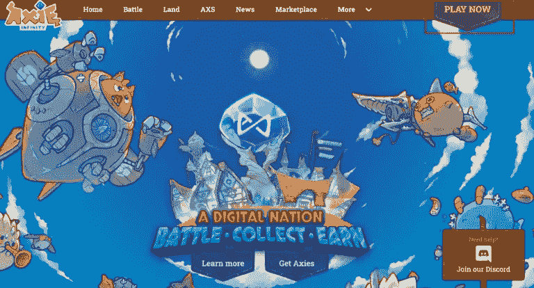
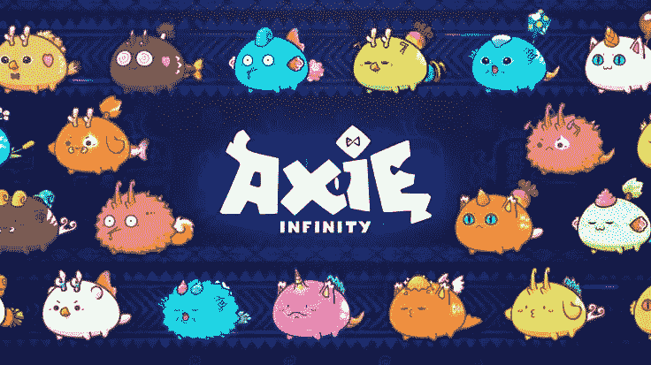
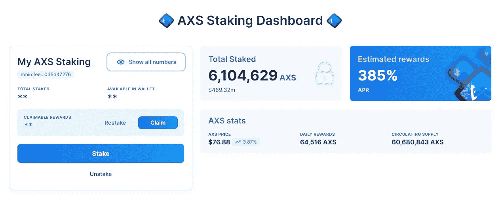
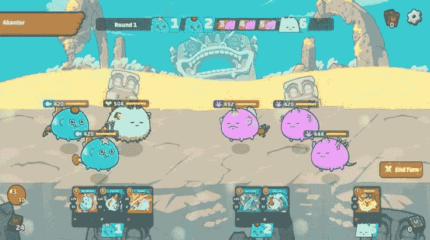
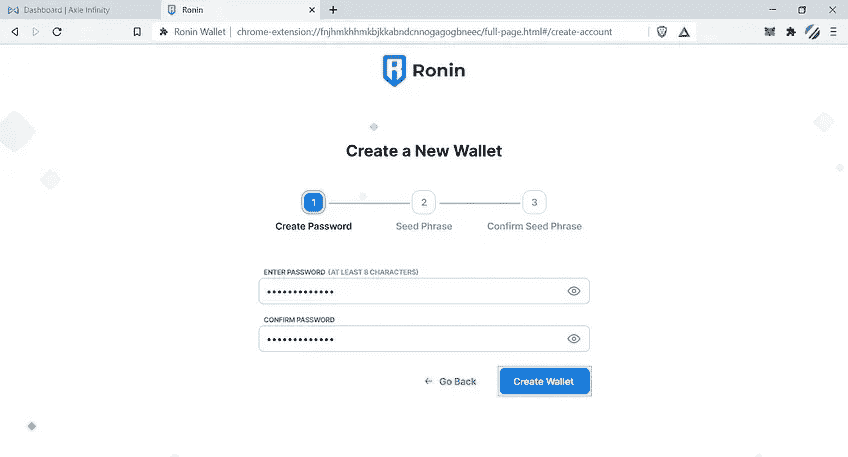
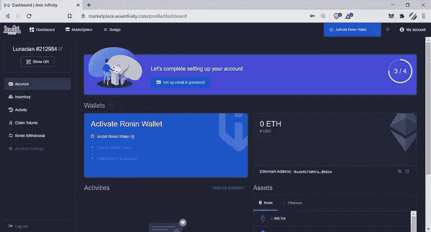
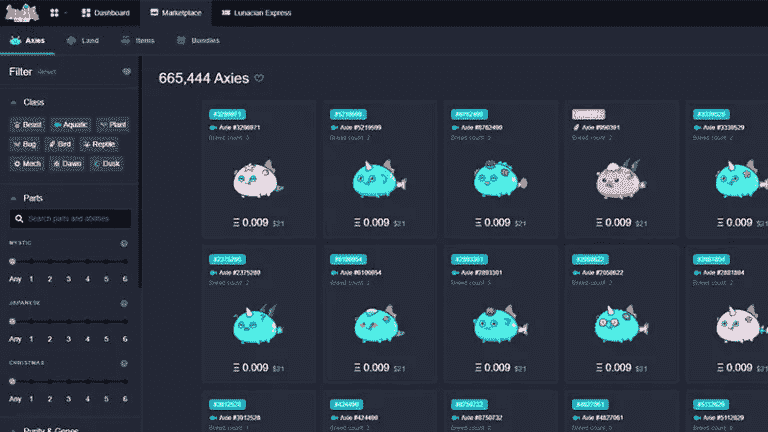
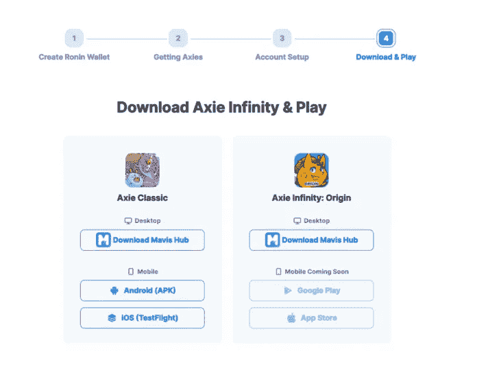

# 如何在 Axie Infinity 上玩和赚？

> 原文：<https://medium.com/coinmonks/how-to-play-and-earn-on-axie-infinity-3441102e0dbe?source=collection_archive---------13----------------------->

自 2021 年游戏赚钱开始流行以来，人们对传统游戏赚钱机会的渴望一直在上升。像 Axie Infinity 这样的区块链游戏开创了这一运动，表明将区块链解决方案融入游戏有着巨大的市场和可能性。

# 什么是 Axie Infinity？

Axie Infinity 是一款游戏赚取宠物模拟游戏，使用加密货币和不可替代代币(NFT)。它是由提供区块链解决方案的组织 Sky Mavis 开发的。这个游戏利用 Ronin，一个由 Sky Mavis 为减少交易费用和等待时间而创建的侧链，在以太坊区块链上运行。

Axie Infinity 的开放式虚拟宠物世界以有趣的生物为特色，奖励玩家更高水平的能力。 ***游戏的目标是让玩家通过战斗、繁殖、聚集和培育来为他们的 Axies 建立王国。***

# Axie Infinity 背后的团队和赞助商。

2018 年，总部位于越南的视频游戏公司 Sky Mavis 专注于技术，创建了 Axie Infinity。Axie Infinity 团队得到了众多知名企业的支持和赞助，包括育碧、三星、AAVE、币安、德尔福数码、MakerDao、Klaytn、Kyber Network 和 Upbit 等。

# 无限记号组学。

Axies Infinity 利用双令牌经济模型。

> 双代币模型是一种经济模型，具有主要代币和次要游戏内代币。次要令牌通常用于游戏中的机制，而主要令牌通常是治理令牌。双令牌系统有助于最小化开放市场对游戏的影响。

Axie Infinity 的支配令牌被称为 ***Axie Infinity 碎片(＄AXS)***，而它的辅助令牌被称为 ***平滑爱情药剂(＄SLP)。***

# Axie Infinity 碎片(AXS)。

在以太坊区块链开发的 Axie Infinity 碎片(AXS)是一个 ERC-20 代币。因此，它受到以太坊的工作证明(POW)一致算法的保护。持有$AXS 代币的人可以参与游戏以及重要的管理投票和财政管理。

# 光滑的爱情魔药(SLP)。

流畅的爱情药剂($SLP)，一个 ERC-20 代币可以通过玩 Axie Infinity 游戏获得。与传统游戏中获得的经验值不同，$SLP 是在 Axie Infinity 中获得的。这种数字资产用于培育 Axies，即游戏中的数字宠物。

# 如何在 Axie Infinity 上挣钱？

在 Axie Infinity 协议中，主要有五种赚钱方式。它们是:

1.**玩游戏。**

玩游戏是 Axie Infinity 上最流行的赚钱方式。 在冒险模式中击败电脑控制的怪物，在竞技场模式中与其他玩家竞争，以及执行每日任务都是赚取$SLP 的方法。要赚取$SLP，你必须玩战略，并在战斗中取得胜利；否则，你可能会失去最初的投资。

2.**阿协养殖与销售。**

你也可以在 Axie Infinity 上通过繁殖 Axie 并在 [Axie 市场上出售来赚钱。一个 Axie 的价值是由它的稀缺性和权力程度来定义的。这种策略是有益的，因为每天都有新玩家加入 Axie Infinity，并且必须购买 Axie 才能玩。繁殖 Axies 需要花费$SLPs，所以你必须有足够的钱来从事这项工作。然而，值得一提的是，在繁殖七次后，胚轴可能会不育。](https://marketplace.axieinfinity.com/)

3.在露丝安娜投资土地。

Axie Infinity 有一个名为 [Lunacia](https://land.axieinfinity.com/#:~:text=Lunacia%20is%20divided%20up%20into,as%20access%20points%20for%20dungeons!) 的虚拟土地。您的土地可以定制为您创建有用的资源，作为怪物的战场，主机商店以及其他结构，并作为各种地下城的入口。

卢纳西亚的土地可以出租给其他玩家，或者在增值时出售，就像房地产一样。此外，你可以和其他玩家一起合作，组合土地，生产稀有资源，并组成行会。

4.**下注$AXS 币。**

你可以在 [Axie 赌注仪表板](https://stake.axieinfinity.com/)上押 Axie Infinity 碎片(AXS)来赚取利息。

除了获得利息，赌注赋予你投票权和如何使用社区资金的发言权。桩也有助于 Axie Infinity 区块链保持网络功能。

5.**设立奖学金。**

如果你收集了大量的 Axies，你可以把你的虚拟宠物借给其他缺乏资金购买自己的虚拟宠物的玩家。这种安排被非正式地称为“奖学金”。拥有 Axies 的玩家被称为经理，而代表经理玩游戏的玩家被称为学者。

# 如何玩 Axie Infinity？

玩无限轴游戏至少需要三个轴。如果你还没有 Axie，你可以在那里购买。按照这些说明从 Axie 市场购买 Axie。

*   **设置软件钱包。**

安装一个软件钱包，比如[元掩码](https://metamask.io/)或者[信任钱包](https://trustwallet.com/)。但是，建议使用 Metamask，因为它可以在桌面和移动设备上使用。Trustwallet 只能在移动设备上使用。

*这里有一个快速指南。*

Youtube

确保钱包种子短语保持私密，并且不被他人获取。

*   **将以太坊($ETH)存入钱包。**

你可以从你最喜欢的密码交易所或点对点平台购买以太坊(ETH)。

*   **设置浪人钱包。**

接下来，您必须设置一个由密码和种子短语保护的[浪人钱包](https://welcome.skymavis.com/create-wallet/)。

保持这些安全措施的安全性和私密性非常重要。

*   **桥接以太坊($ETH)到浪人钱包。**

接下来，前往[浪人-以太坊桥](https://bridge.roninchain.com/deposit)，连接您的 Metamask 钱包，输入您的浪人地址和所需的以太坊数量，并完成存款。

*   **创建您的 Axie 帐户。**

下一步是通过使用你的 Ronin 钱包登录，在 Axie Marketplace 上注册一个 [Axie 帐户](https://marketplace.axieinfinity.com/login/)，然后创建一个具有有效电子邮件和密码的帐户。

您必须提供准确的信息，才能玩游戏并获胜。

*   购买你的第一个 Axie。

创建帐户后，访问 [Axie 市场](https://marketplace.axieinfinity.com/)购买至少三个 Axie。Axie 的繁殖次数和纯度是需要考虑的最重要的特征。

> 如果你想在游戏中取得成功，努力组建一个稳固的团队，包括一个具有高生命值的 Axie 和另一个可以处理重大伤害的 Axie。

*   **下载并安装 Axie Infinity。**

一旦你买了足够数量的轴，就该开始玩游戏了。要开始玩游戏并赚取$SLP，请从 [Sky Mavis hub](https://welcome.skymavis.com/download/) 下载。

虽然 Axie Infinity 仍在 iOS 上进行测试，但它目前在 Windows 和 Android 设备上受到支持。一旦安装，你可以随时随地玩游戏。

# 结论

Axie Infinity 凭借其受欢迎程度，证明了用户可以一边玩一边赚钱。拥有数百万月活跃玩家的 Axie Infinity 目前是加密货币历史上玩得最多的 P2E·元宇宙/NFT 游戏。Axie Infinity 游戏有许多独特的功能，所以如果你想竞争并取得成功，就像在现实生活中一样，你需要专注和专注。

## 你觉得这篇文章怎么样？请在下面分享您的评论。

## 不要忘了订阅这个频道，并继续关注更多关于游戏赚钱项目的更新。只有优质内容。

> 交易新手？试试[密码交易机器人](/coinmonks/crypto-trading-bot-c2ffce8acb2a)或者[复制交易](/coinmonks/top-10-crypto-copy-trading-platforms-for-beginners-d0c37c7d698c)