# 如何玩 Thetan 竞技场

> 原文：<https://medium.com/coinmonks/how-to-play-thetan-arena-24fa76fe7dfa?source=collection_archive---------27----------------------->

*Thetan Arena 是一款非常流行的区块链游戏。在这篇文章中，我们将带你通过它的游戏。*

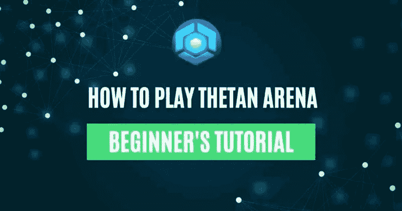

**Thetan Arena 是一款非常受欢迎的区块链游戏，自推出以来拥有超过 2400 万玩家。它成为 2021 年区块链下载量最高的五大游戏之一。游戏结合了多人在线竞技场(MOBA)的战略和不同的竞争元素。玩家利用他们的技能或通过团队合作获得 NFT 和代币奖励。**

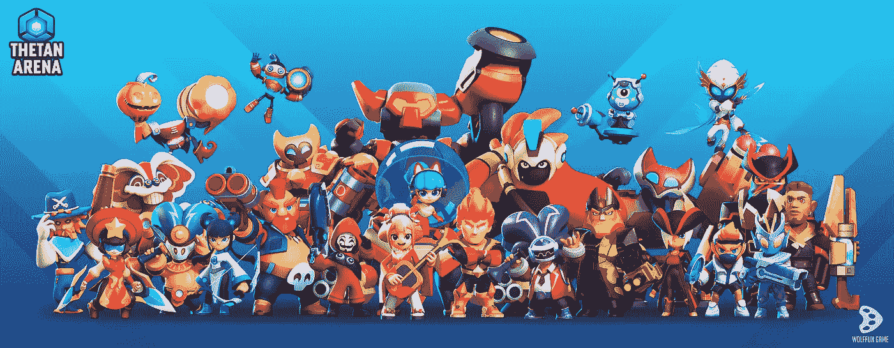

**历史**

Thetan Arena 是由一家名为 Wolfrun Game 的越南工作室开发的。Wolfrun 成立于 2016 年，拥有丰富的经验，特别是在线移动 PvP 游戏。该工作室开发了像《太空雄猫》、《坦克突袭》和《英雄出击》这样的游戏。《英雄出击》的下载量接近 1000 万，并成为谷歌 Play 商店的“编辑之选”。Wolfrun 发现了区块链的机会，把英雄罢工搬到了区块链。他们把它重新命名为 Thetan 竞技场。这意味着 Thetan Arena 已经有了完整的游戏和 Web 2.0 收入来源。

**发布后**

2021 年 9 月，Thetan Arena 在 Polkastarter 和付费网络中成功举办了 IDO。它筹集了 20 万美元。社区认为他们是最先进的区块链游戏之一。它立即获得了巨大的人气，并创下了 264 倍的历史新高。到 2022 年 12 月，Thetan Arena 打破了区块链游戏的多项记录。该游戏在所有平台上都有 300 万玩家，日活跃用户数达到 2M 的峰值。这款游戏在 Google Play 上获得了 4 个国家超过 80，000 名玩家的 4.7/5 评分。
Thetan Arena 凭借稳健的发展、强大的持续营销、定期的产品更新和活动发布等，在成功推出的基础上不断发展。

*   到 2021 年 12 月，Thetan Arena 国库有 80，650，011 美元。这是以$THG 代币的形式出现的，来自传奇盒子早期销售，市场$THG 收入，生态系统费用和赌注发行。这向用户保证了项目的长期稳定性。
*   Thetan Arena 继续加强其经济。它侧重于项目的长期可持续性。它介绍了$THC Burn 程序(下一节将详细介绍 Tokenomics)。$THC 是游戏中的代币。玩家能够以非常吸引人的汇率将 1 美元 THC 兑换成 1 美元 THG。团队回购了一定数量的$THC，并将其烧毁。
*   该项目推出了英雄出租计划。英雄的主人现在可以租借英雄 NFT 并获利。
*   最近，Thetan 地区在$THG 建立了一个 500，000 美元的基金池，以增加合作伙伴公会对丰富 Thetan 社区的关注

公会伙伴计划已经获得了良好的牵引力。像 AAG、PathDAO 和 Polkastarter 这样的流行公会是这个项目的一部分。随着这种增长，Thetan Arena 团队不断壮大。它现在有 80 名全职员工和 20 名兼职员工。

**记号组学**

锡坦竞技场有两种象征性的经济，锡坦宝石(THG)和锡坦硬币(THC)。

*   $THG 的总供应量为 4.2 亿美元。这是一个免费的代币。用户可以通过押坛英雄、参与挑战、累积游戏时间、参与治理等方式获得。玩家可以使用$THG 参与管理、市场交易、进化英雄等。
*   玩家可以通过玩这个游戏赚到$THC。玩家通过参与战斗、任务和排名奖励获得$THC。$THC 用于购买 Thetan 盒子，里面有 Thetan 英雄。

**游戏玩法**

那么，坦竞技场有什么特别的？Thetan 竞技场有非常成熟的游戏性。我们去看看。
进入 [Thetan 竞技场网站](https://thetanarena.com/)。

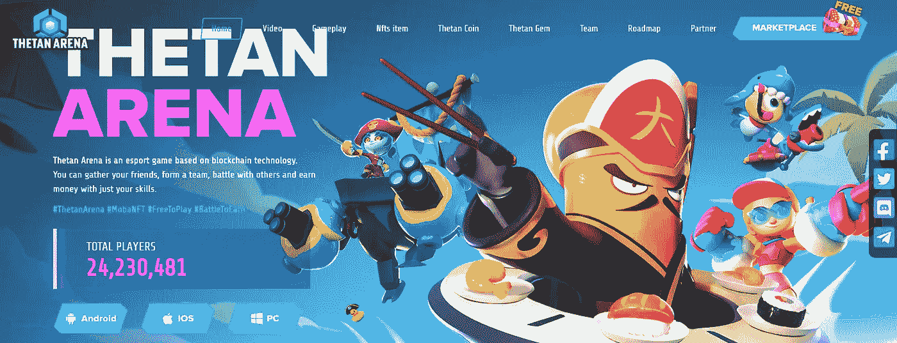

**领取您的欢迎礼盒**

去市场拿你的礼品盒。连接你的钱包。你应该在币安智能连锁店。请注意，此钱包将永久连接到您的 Thetan Arena 帐户。如果您是新用户，请使用“创建新游戏帐户”。

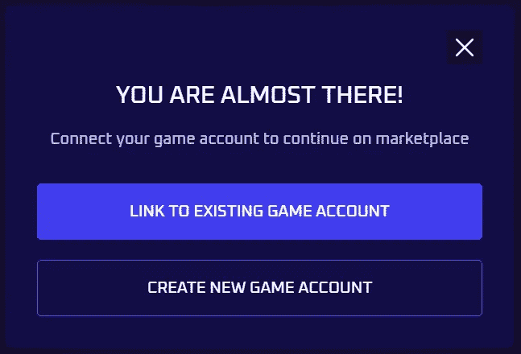

在 ThetanBox 选项卡中，您会发现一个免费接收欢迎框的选项。你需要这个来开始你的游戏。你将收到一份英雄、化妆品或 gTHC 形式的礼物。另外，请注意，您只能申请一次箱子。

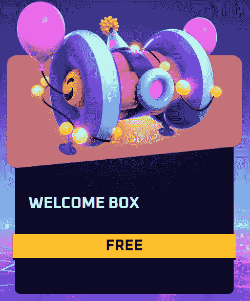

在你的库存中找到要求的礼物。您可以在索赔后 24 小时内解锁。你现在需要安装并登录游戏。

**下载并登录**

从[主页](https://thetanarena.com/#home)下载游戏。可以下载安卓、IOS、PC 版本。安装游戏。游戏画面非常好。目前，你可以作为一个客人或登录/注册。万一你作为一个客人玩，你将失去游戏进展。一些重要的游戏功能也是客串玩家无法使用的。

我们将使用之前创建的 ID 登录。您将在您的电子邮件 ID 中收到一个代码。认领你的 3 个随机英雄。

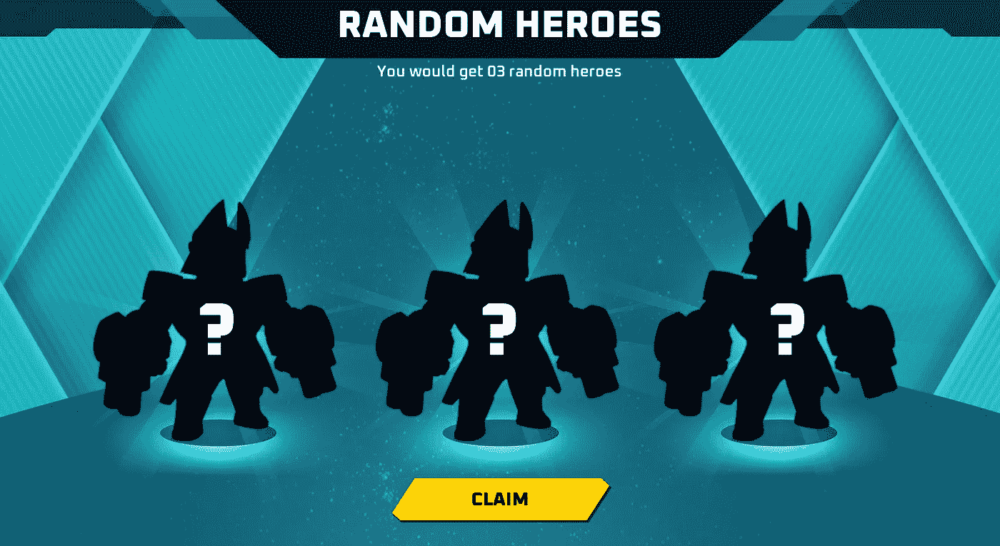

我收到了一个刺客，神枪手，和坦克。这是三种类型的 Thetan 竞技场英雄，基于他们的标志性技能和统计数据发展而来。

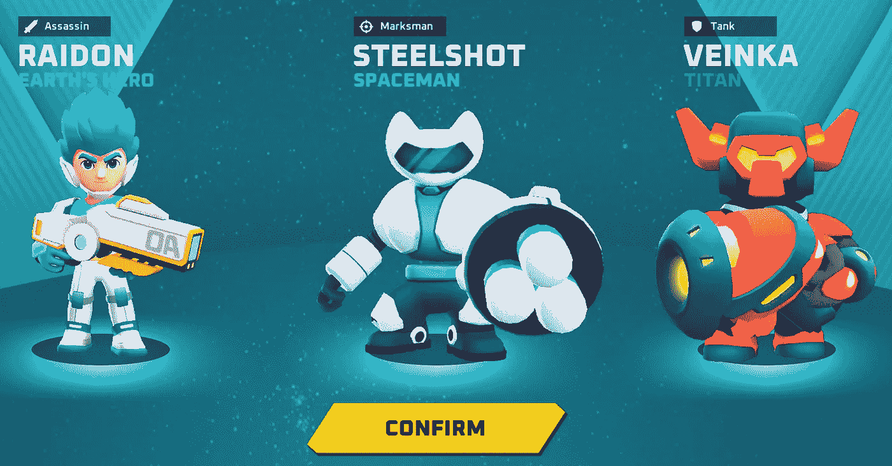

让我们看看这些英雄能做什么:

**刺客**:刺客是直接投入战斗，杀死敌人然后快速撤退的初级战士。然而，他们的健康状况不佳。

*   健康点:低
*   攻击伤害:高
*   速度:高

**神射手:**神射手在战斗中拥有最大伤害力。

*   健康点:正常
*   攻击伤害:高
*   速度:正常

**坦克:**坦克英雄在战斗中冲锋陷阵。他们面对敌人，防止队友受到伤害。

*   健康点:高
*   攻击伤害:正常
*   速度:慢

你可以从市场上购买一个 Thetan 盒子来获得不同稀有的英雄。你需要非常小心地选择你的英雄来增加在竞技场的胜率。

**仪表板**

你的游戏中的仪表盘将如下图所示。

你可以点击你的英雄来选择你想送去战斗的英雄类型。

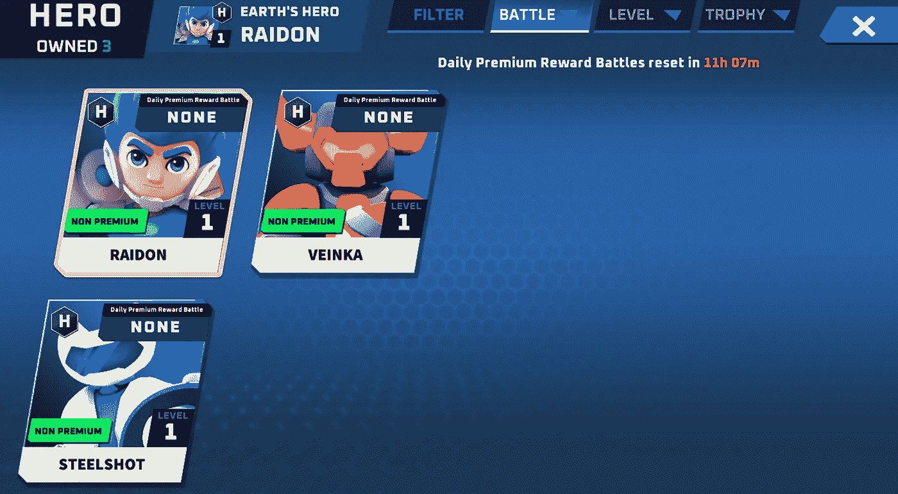

我们进攻吧。我们会用 Assassain，雷电。看到“非高级”标签，这意味着你不会得到这些英雄的高级奖励，你需要升级。
检查英雄的状态和狂怒。这一点很重要，因为你需要给英雄装备一些技能来弥补他的弱点。您还会看到一个用 PowerPoints 升级的选项。回到你的仪表板主页，你可能会得到一些免费的幻灯片。

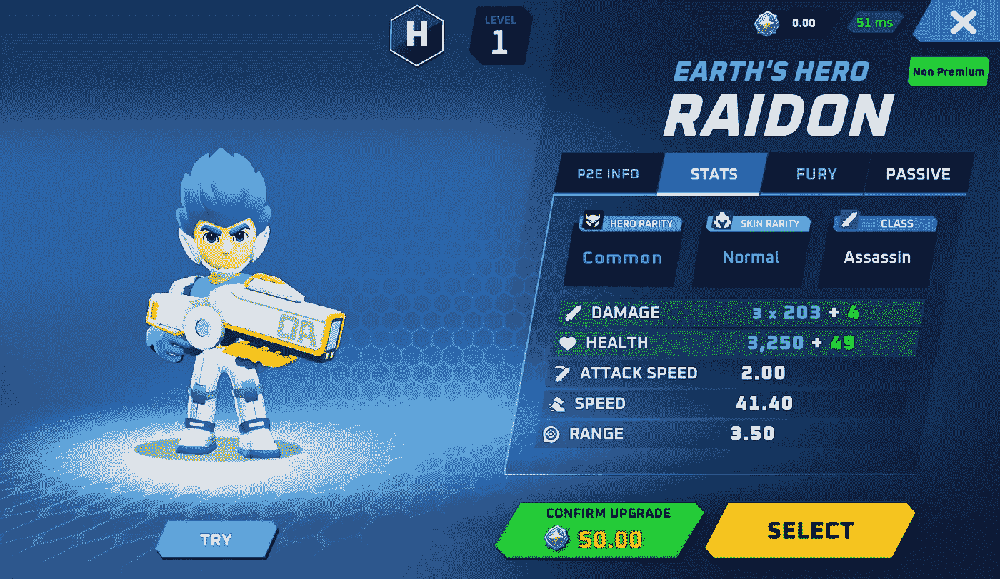

点击商店

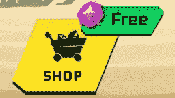

索取 10 点灵能点。PowerPoints 每 11 小时重置一次。用 270 个灵能点，你可以购买一个具有以下物品掉落率概率的 Powerpoint 盒子:

*   表情——29%
*   皮肤——12%
*   英雄——6%
*   阿凡达——25%
*   框架 28%

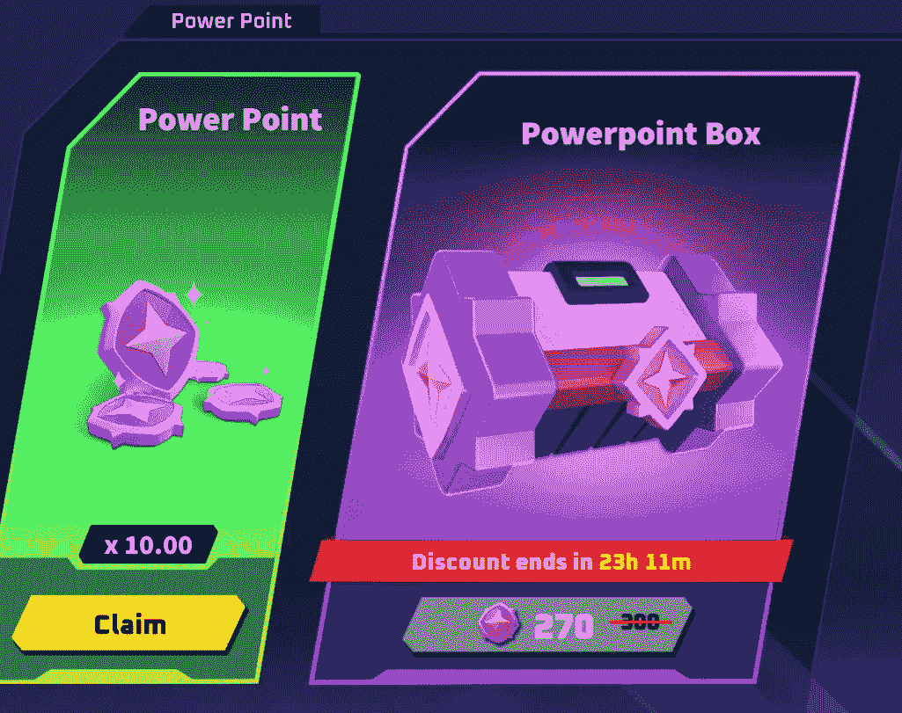

**然而，值得注意的是，所有从游戏商店获得的英雄都是不可交易的，因为这些英雄与 Web 3 没有直接联系。所以即使这些游戏内的英雄很便宜，你也不会得到想要的利润。**
如果你想得到一个更好的英雄，我们建议你去市场上购买。

**市场**

去[市场](https://marketplace.thetanarena.com/dashboard)。确保您在“主题框”选项卡中。(这也是我们得到礼盒的地方，礼盒也将在一天后打开)

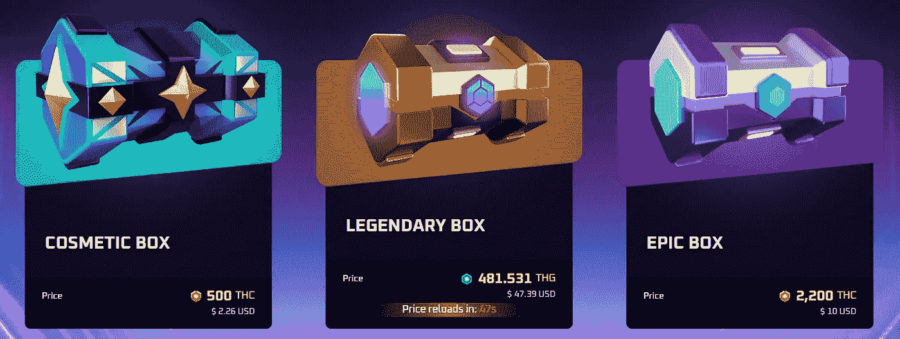

比方说，我们想购买一个传奇英雄。我们将点击传说中的盒子。传说中的盒子有 100%的机会获得传说中的英雄，但是不同的皮肤稀有度的机会不同。皮肤稀有性也是提高战斗性能的必要条件。

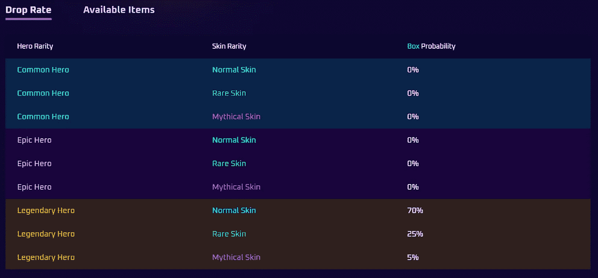

选择您想要购买的数量并查看价格。在这一点上，它花费了我 483 美元 THG(47 美元)

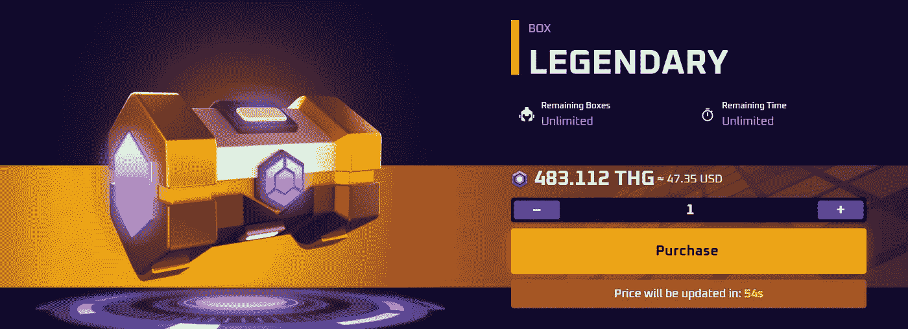

在购买这个之前，让我们去二手市场看看有什么。点击“购买”标签。我们会按传奇英雄和神话皮肤
**过滤注意:每个英雄都会有有限的 gTHC 战斗次数(剩余的战斗次数可以赚取 gTHC 奖励)。越少越好。**
我们按照剩余 gTHC 战斗的最便宜价格排序。英雄花费 75 美元，已经消耗了 66 场战斗(共 1041 场)。此时，您需要决定是购买盒子并在皮肤上冒险，还是直接从 secondary 购买 Thetan 盒子。

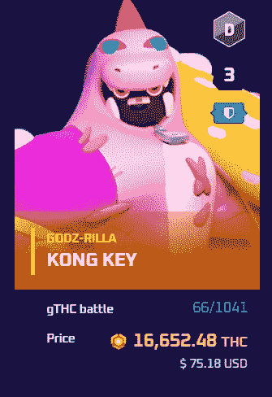

**战斗**

回到游戏，我们选择了一个刺客。让我们给他装备一些技能。点击以更改、添加或删除技能。

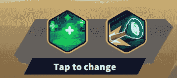

我们将为刺客装备治疗炮塔来补偿他糟糕的健康状况

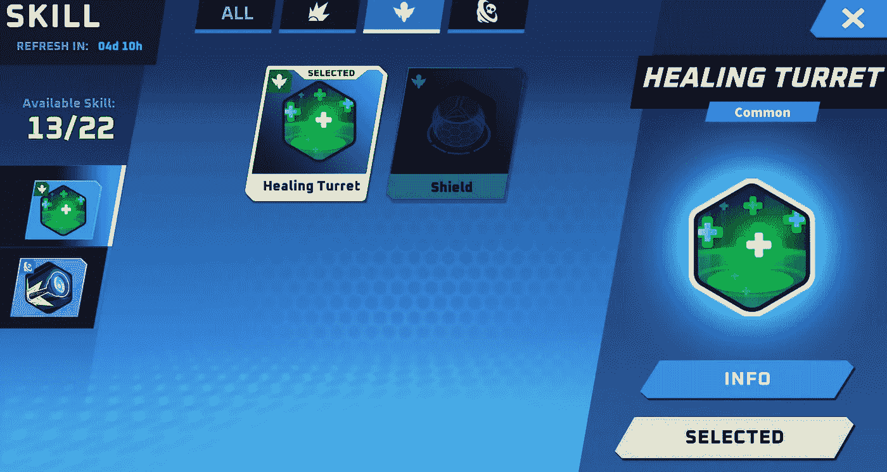

现在，是战斗的时候了。点击查找匹配。

目标是成为最后的幸存者。砸碎供应箱来获得能量。

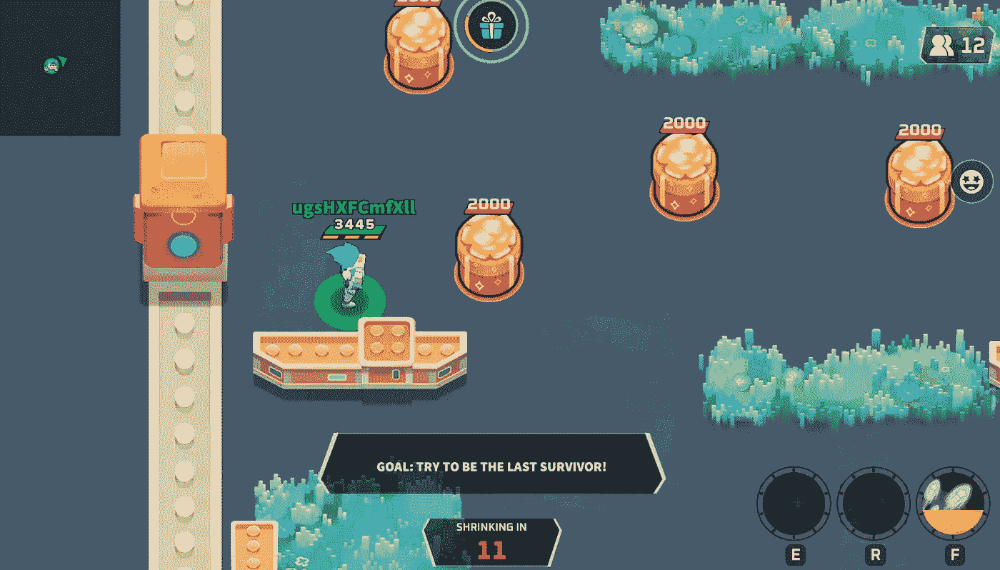

你在一个竞技场里，你必须玩策略。一个非常好的策略是暂时隐藏起来，直到其他玩家互相残杀，你只剩下几个敌人可以战斗。当然，难度会有所不同。此外，确定健康和通电的位置。我第一次试跳就名列第 12 名。还不错！

除了单人游戏，你还可以玩皇家战役，这是一个多人游戏选项，在坦竞技场内。

**结论**

Thetan 竞技场游戏简单，流畅，基于策略。这是激动人心的，直观的，引人入胜的。然而，如果你想赚一大笔钱，你就必须给游戏很多时间。这款游戏最适合专注的游戏玩家。休闲游戏玩家可以使用英雄租借功能来赚取一些利润。

**来源:** [西坦竞技场中型](/@ThetanArena/the-thetan-treasury-in-a-nutshell-79eb64ad38af)，[西坦竞技场中型 2](/@ThetanArena/3-million-players-reached-as-thetan-arena-breaks-multiple-records-in-nft-gaming-19e247d70c8a) ，[趣味解构者](https://www.deconstructoroffun.com/blog/2022/2/28/thetan-arena)，[西坦竞技场](https://news.thetanarena.com/bnb-chain-spotlight-thetan-arena?type=preview&fbclid=IwAR3OhrJKFrehyz4w8j5PtOluJW5GJw8fNTSqzzVSU1P-FuE2aPM6w5iO4oI)

***注:*** *本帖首发* [*此处*](https://www.altcoinbuzz.io/blockchain-gaming/blockchain-game-reviews/how-to-play-thetan-arena/) *同 Altcoinbuzz.io.*

跟我来

**👉** [推特](https://twitter.com/rumadas123)

**👉**[**Linkedin**](https://www.linkedin.com/in/ruma-das-a1439320/)

> **交易新手？尝试[加密交易机器人](/coinmonks/crypto-trading-bot-c2ffce8acb2a)或[复制交易](/coinmonks/top-10-crypto-copy-trading-platforms-for-beginners-d0c37c7d698c)**