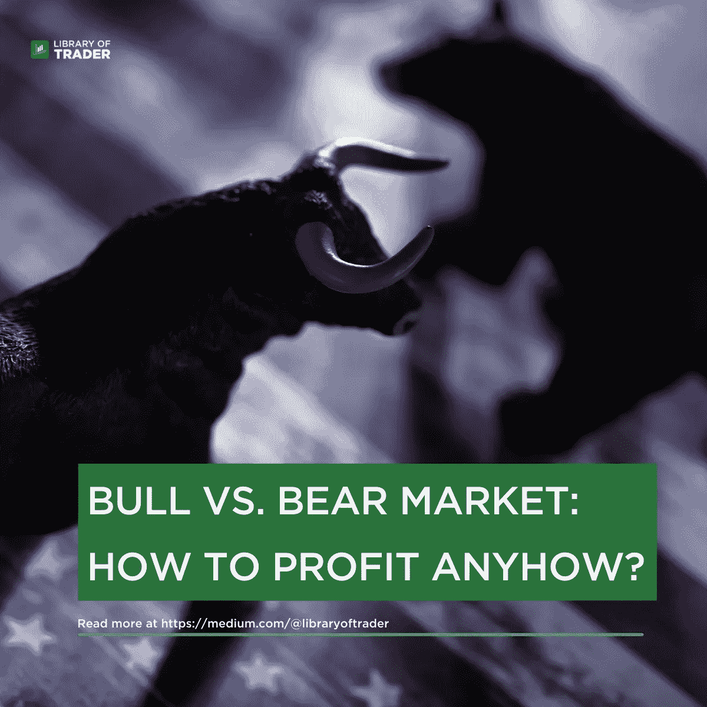

# 如何在牛市和熊市中获利

> 原文：<https://medium.com/coinmonks/how-to-profit-in-the-bull-and-bear-markets-be6ecc83b9e2?source=collection_archive---------48----------------------->

在上一篇文章中，我们已经介绍了[牛市和熊市的基本面。它们各有利弊，都会影响交易者和投资者的盈利能力。无论价格如何变动，我们都将分享有效的策略和技术，以最小化风险，最大化利润。](http://Bull vs. Bear Market: Definitions & Differences | by Library of Trader | Medium)

 [## 牛市与熊市:定义与区别

### 牛市和熊市是交易者和投资者的常用术语。然而，它们到底是什么？什么是…

medium.com](/@libraryoftrader/bull-vs-bear-market-definitions-differences-d5e51d42dd15) 

# 如何从牛市中获利

牛市表明价格在一段时间内持续上涨。所以，你应该优先考虑的事情是利用价格上涨来获利。以下内容涵盖了一些有用的建议，你可以用在股票市场。

# 多头头寸

这种方法是购买股票或其他资产，预期价格会上涨。最终目标是以低价买入证券，然后以高价卖出。利润是你的卖价和买价之间的差额。

# 呼叫选项

看涨期权允许其持有者以特定的价格/执行价格购买股票，并在某个到期日到期。如果股票价格上涨，看涨期权的价值也会增加。因此，交易员和投资者可以以较低的执行价格买入股票，然后以较高的价格卖出。对于期权交易者来说，在公开市场购买看涨期权并选择有利的头寸进行平仓是很常见的。

# 多头 ETF

 [## ETF 算法交易盈利吗？

### 介绍

medium.com](/@libraryoftrader/is-etf-algorithmic-trading-profitable-a523e0925032) 

交易所交易基金大多遵循特定的市场平均水平，包括道琼斯工业指数(DJIA)或标准普尔 500 指数(标准普尔 500)。然而，它的操作和股票一样。

在牛市中，投资者乐观地认为价格会继续上涨。用 S&P 的增长购买相同数量的 ETF 可以帮助你增加收益。

使用交易所交易基金的一些优势是交易成本和运营费用低。此外，它不要求最低投资额。

# 如何在熊市中生存

 [## “炒股是赌博吗？”&为什么总有人问？

### 我们很抱歉有这样一个点击诱饵标题来吸引您的点击，因为它是…毫无意义的比较股票交易和…

medium.com](/@libraryoftrader/is-trading-stocks-gambling-why-are-people-always-asking-5f4314c30d74) 

熊市显示了股票价格的下降趋势，通常从 20%的水平开始，持续两个多月。虽然牛市伴随着经济增长，熊市与经济衰退或萧条有关。这些情况与理想情况完全不同。那么，我们该怎么办呢？

# 空头头寸

空头又称卖空和做空，是指借入股票，在近期有价格下跌信号时卖出。如果股价下跌，以较低的价格买入这些股票将弥补空头头寸，并赚取差价利润。

# 看跌期权

看跌期权允许持有者在特定的到期日以预定的价格出售股票或任何其他证券。你必须支付期权费才能拥有看跌期权。

如果股价下跌，看跌期权的价值就会增加。所以，你可以以更高的执行价卖出股票或者卖出看跌期权来获利！

# 短期交易所交易基金

当熊市主导价格趋势时，做空 ETF(又称反向 ETF)可以产生回报。例如，一只与纳斯达克 100 指数表现相反的做空 ETF 的价值将增长约 25%，如果该指数下跌 25%，你就可以获得利润。

# 总而言之

牛市和熊市是投资者和交易者的常用术语。然而，学习利用市场条件和避免风险需要实际的指导。

这篇文章带你通过有效的策略和技术来保持稳定的利润和承担较少的风险。无论你是在熊市还是牛市，这些方法都可以帮助你利用有利的市场形势赚取更高的利润。

> 交易新手？试试[密码交易机器人](/coinmonks/crypto-trading-bot-c2ffce8acb2a)或者[复制交易](/coinmonks/top-10-crypto-copy-trading-platforms-for-beginners-d0c37c7d698c)