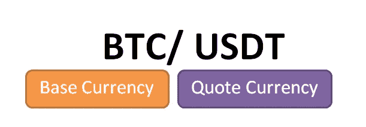
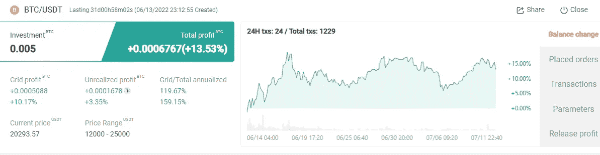
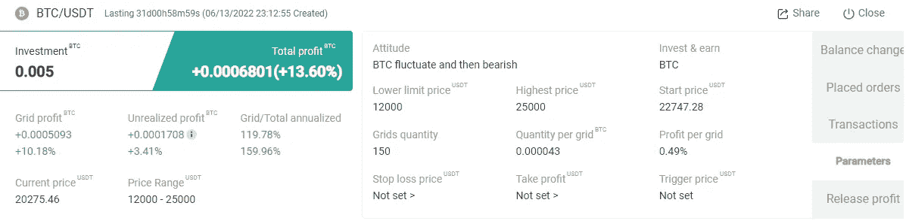
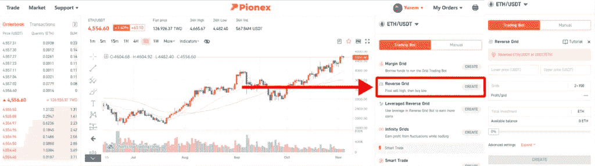
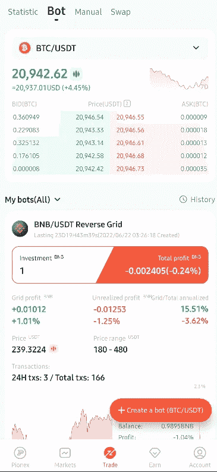
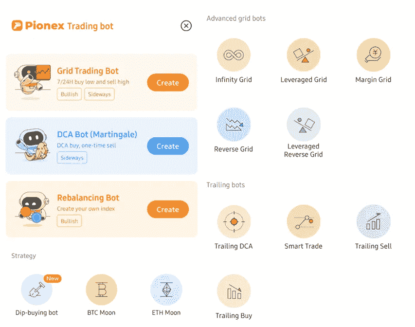
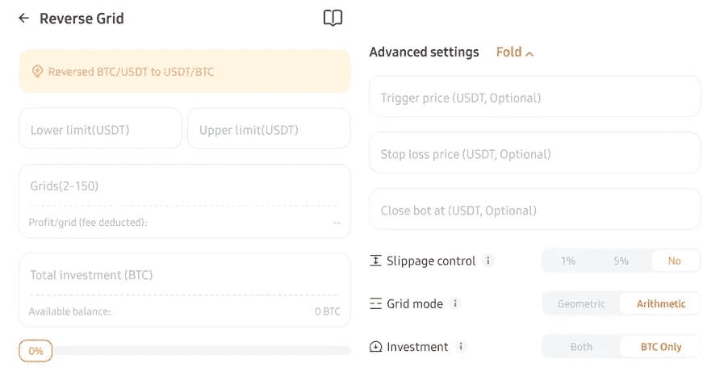
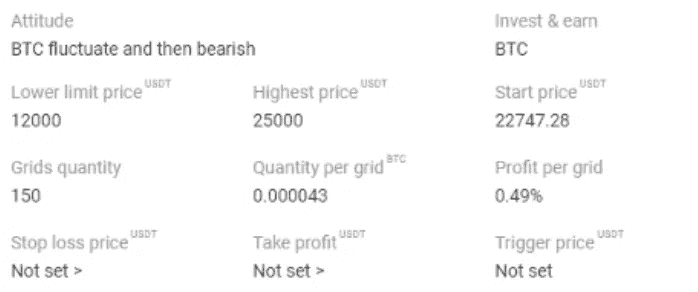

# 如何在熊市中利用反向电网交易机器人获利

> 原文：<https://medium.com/coinmonks/how-to-profit-with-a-reverse-grid-trading-bot-in-a-bear-market-9ab1df8a0fe3?source=collection_archive---------1----------------------->

# 最佳自动化

我一直是一个技术爱好者，喜欢在生活的各个方面追求自动化，在投资方面也是如此——因此,**交易机器人很有吸引力，它们本质上是自动化了低买高卖的平凡过程。**我涉足过各种交易机器人，比如 [Kucoin](https://www.kucoin.com/r/af/rJH29LZ) 和 [Huobi](https://www.huobi.com/en-us/topic/double-invite/register/?invite_code=5t5jb) 提供的那些；但给我留下特别深刻印象的是 Pionex 的多样化产品，其中的反向电网交易机器人和杠杆代币交易机器人在熊市中表现尤为出色。关于交易机器人及其工作方式的介绍，请点击这里查看我之前的文章[。](/coinmonks/kucoin-trading-bot-the-ultimate-volatility-killer-cb7e90c13e19)

# 反向电网交易机器人是如何工作的？

W 当你在 [Pionex](https://www.pionex.com/en-US/sign/ref/mWhH4v29) 上启动反向网格交易机器人时，它实际上是**出售你指定的加密货币的一部分，以给出一个篮子，该篮子包括未出售的剩余硬币和出售的 USDT** ，比例由机器人的设置决定。USDT 和感兴趣的加密货币的存在使得**低买高卖的过程能够在电网**上运行，从而产生利润——当价格下跌时，USDT 将被用于购买感兴趣的加密货币；当价格上涨时，可用的加密货币将被出售给 USDT；冲洗并重复。事实上，运行反向网格交易机器人类似于一种更时尚的简单出售硬币的方式——而不是一次性出售数字资产，出售的 USDT 和剩余资产被套利以产生额外的利润。

# 与传统交易机器人的区别:简介

以上述 BTC/ USDT 货币对为例，BTC 是基础货币，而 USDT 是报价货币。在外汇交易中，**基础货币代表您需要多少报价货币才能获得一个单位的基础货币**。

在传统的交易机器人中，利润是用报价货币(USDT)来衡量的，重点是 USDT 持有量是否增加。另一方面，反向网格机器人使用基础货币(BTC)来衡量机器人的收入，并关注持有的 BTC 数量是否增加(从出售硬币、以更便宜的价格再次买回并重复该过程的自动化过程)。这是因为在反向网格交易机器人中，初始投资来自基础货币(BTC)，而不是传统交易机器人中的报价货币(USDT)。

# 我迄今为止的经验

一个月前，我投资了一个使用 0.005 BTC 的反向网格交易机器人，当时 BTC 为 22747 美元，使用如上定制的设置。迄今为止，它已经从最初出售硬币的过程中获得了 0.000508 (10%) 的**网格利润，稍后当硬币下跌时回购，当价格在之前设定的预定价格范围内上涨时再次出售。加上盈利销售的未实现利润 0.0001708 BTC (3.41%)，迄今为止，bot 的**总年化 APY 为 159%。****

> 交易新手？试试[密码交易机器人](/coinmonks/crypto-trading-bot-c2ffce8acb2a)或[复制交易](/coinmonks/top-10-crypto-copy-trading-platforms-for-beginners-d0c37c7d698c)

# 如何创建反向网格

S[**ign up**](https://www.pionex.com/en-US/sign/ref/mWhH4v29)**for Pionex**如果你还没有帐号！Pionex 上的交易机器人可以免费使用。找到网站页面右侧的“**反网格**，点击“**创建**进入参数设置页面。

或者，访问 Pionex 应用程序中“交易”下的 Bot 部分中的交易 Bot，如下所示。

**选择“创建一个机器人”**从各种各样的机器人中进行选择。在反向电网交易机器人的情况下，**选择‘反向电网’**并输入您想要的参数。

**一些技术细节**

> **价格上限:**当价格高于区间价格上限时，bot 将不再执行电网区间外的订单。
> 
> **较低价格:**当价格低于区间的较低价格时，bot 将不再执行网格区间外的订单。
> 
> **网格:**将区间的上价格和区间的下价格分成对应的份额。
> 
> **总投资:**计划投入 bot 的代币数量。
> 
> **高级设置**
> 
> **触发价格:**当货币价格达到该价格时，触发创建 bot 订单。
> 
> **止损:**当币价涨到这个价位(基础货币数量在减少)时，bot 订单会自动平仓，bot 持有的所有报价货币都会转换成基础货币。(例如，当反向网格交易 BTC/USDT 交易对时，订单触发止损，bot 将把所有 USDT 转换为 BTC)
> 
> **止盈:**当币价跌至此价位(基础货币数量在增加)时，bot 订单将自动平仓，bot 持有的所有报价货币将转换为基础货币。(例如，当反向电网交易 BTC/USDT 交易对时，订单触发器会获利，机器人会将所有 USDT 转换为 BTC)
> 
> **滑点控制:**通过参数设置将初始开仓最终交易均价与下单时价格的偏离控制在一定的百分比范围内。(由于密码市场的波动性较大，交易者在交易时，最终的交易价格往往与下单时的价格不一致。这时候可以通过开仓限价来控制滑点)
> 
> **网格模式-算术:**创建网格策略时，算术网格的每个网格的价格区间是相等的(例如 1，2，3，4)
> 
> **网格模式-几何:**创建网格策略时，几何网格的每个网格的价格区间是成比例的(例如 1，2，4，8)

# 安装机器人的实用指南

*   较低价格:输入你预计硬币会跌到的最低价格——可能是 TA 的一个重要支撑位。当资产价格接近这一水平时，你的大部分资产将会是波动硬币的形式，因为根据网格，USDT 将会被用来购买低价格。
*   上限价格:输入您预计硬币会涨到的最高价格。当资产价格接近这个水平时，你的大部分资产将会以出售硬币的 USDT 的形式出现。

交易机器人在初始化时出售的硬币比例由价格上限和下限决定。相对于 bot 运作的价格范围，当前市场价格越高，卖给 USDT 的硬币就越多；反之亦然。

在熊市中，为价格下限和上限设定一个下限，以便在价格下跌时有更多的空间让机器人套利。

如果你想捕捉微妙的价格波动，一定要最大化网格的数量。然而，增加电网数量和扩大 bot 的运营价格范围需要更大的投资。如果最低投资变得过高，考虑减少电网数量和/或 bot 运营的价格范围。

例如，我将我的 BTC/ USDT 机器人的价格下限设置为 12000 美元，将价格上限设置为 25000 美元(一个月前市场看起来非常悲观，因此我决定通过为价格上限输入较低的值来出售我的大部分 BTC)。我利用了 150 个网格(可用网格的最大数量)，这给了我每网格 0.49%的计算利润。

# 最后的想法

我知道，大多数百万富翁都是在熊市中诞生的**——抓住机会(有区别地)买入值得投资的资产，比如主流的加密货币硬币。如果你已经持有一种在熊市中贬值的加密货币代币，不妨通过使用反向网格交易机器人(如上文详述的 [Pionex](https://www.pionex.com/en-US/sign/ref/mWhH4v29) 提供的机器人)自动化出售和回购的过程来充分利用它。你对此有什么想法？欢迎在下面留下你的评论！**

**延伸阅读: [Pionex 博客](https://www.pionex.com/blog/)**

****

***一如既往，这不是财务建议！而只是我投资过的，觉得值得分享的投资平台。在投资前做好自己的研究，不要存你输不起的钱。下面有什么问题可以随时问我。***

***如果你喜欢这篇文章，* [*关注&订阅*](/@cybery) *！***

***查看以下值得信赖的平台！***

***🎁*[*honey gain*](https://r.honeygain.me/CYBER577DD)*一款被动收入应用，从你未使用的互联网带宽中赚钱。* [*免费获得 5 美元*](https://r.honeygain.me/CYBER577DD) *，无需投资。***

***🎁* [*蛋糕 Defi*](https://cakedefi.com/?ref=677920) *一站式投资平台，以高达 100%的 APYs 烘焙被动现金流！* [*在 DFI 用 50 美元存款获得 50 美元奖金*](https://cakedefi.com/?ref=677920) *。***

***🎁*[*Nexo*](https://nexo.io/ref/hce5cfdt5o?src=web-link)*一家先进的、受监管的数字资产机构，提供即时加密贷款，资产日收益率高达 36%，是一家交易所，在 200 多个司法管辖区提供 40 多种法定货币的服务。* [*用 100 美元存款获得 25 美元*](https://nexo.io/ref/hce5cfdt5o?src=web-link) 奖金*。***

***🎁*[*Hodlnaut*](https://www.hodlnaut.com/join/RTbHxuJMX)*一个强大的加密借贷平台，从您闲置的加密货币中产生被动现金流，年利率高达 9.4%。* [*在 USDC 存款 1000 美元可获得 30 美元*](https://www.hodlnaut.com/join/RTbHxuJMX) *奖金，存款 1500 美元可获得 50 美元奖金。***

***🎁*[*Kucoin*](https://www.kucoin.com/r/af/rJH29LZ)*一个庞大的加密货币交易所，提供有趣的产品，如赌注、自由交易机器人和比特币云挖掘服务。***

***🎁* [*火币*](https://www.huobi.com/en-us/topic/double-invite/register/?invite_code=5t5jb) *一个提供多样化产品、免费空投和交易机器人的加密货币交易所。***

***🎁*[*MEXC*](https://www.mexc.com/en-US/register?inviteCode=mexc-1NAJC)*一个持有 MX 令牌的加密货币交易所，有有趣的列表和频繁的空投。***

***🎁*[*Crypto.com*](https://read.cash/@TraderFX/10-tips-to-maximize-earnings-on-honeygain-an-effortless-free-passive-income-app-68535728#bad-link)*一家位于新加坡的加密货币交易所。* [*获得 25 美元*](https://crypto.com/app/fcbsjmf5pb) *在 CRO 赌赢一张红宝石牌。***

***🎁* [*Pionex*](https://www.pionex.com/en-US/sign/ref/mWhH4v29) *一个免费的多功能套利交易机器人，自动化低买高卖的过程，24/7。***

*****针对马来西亚投资者*****

***🎁*[*Luno*](https://www.luno.com/invite/EDXG2X)*在 BTC 用 100 令吉购买 BTC 获得 25 令吉奖金！***

***🎁* [*斯塔沙威*](https://www.stashaway.my/referrals/kenleel9jx) *免费投资 6 个月！***

***🎁Wahed code 'KENLIE1' RM10 注册奖金***

***🎁Capbay P2P 代码' 8879c6' RM100 注册奖金***

***🎁* [*亦然*](https://download.versa.com.my/1bAf/referral?deep_link_value=QF218MMB) *用 100 令吉存款获得 10 令吉奖金！***

***🎁*[*KDI*](https://app.digitalinvesting.com.my/registration/signup?referral_code=103433)*用 250 令吉存款获得 10 令吉奖金！***

*****接我*** [***中***](https://cybery.medium.com/)***|***[***read . cash***](https://read.cash/r/TraderFX)***|***[***Youtube***](https://www.youtube.com/c/SmartInvestingChannel)**

> **加入 Coinmonks [电报频道](https://t.me/coincodecap)和 [Youtube 频道](https://www.youtube.com/c/coinmonks/videos)了解加密交易和投资**

# **另外，阅读**

*   **[密码交易机器人](/coinmonks/crypto-trading-bot-c2ffce8acb2a)|[15 大 P2E NFT 游戏](https://coincodecap.com/p2e-nft-games)**
*   **[币安期货交易](https://coincodecap.com/binance-futures-trading)|[3 commas vs Mudrex vs eToro](https://coincodecap.com/mudrex-3commas-etoro)**
*   **[如何购买 Monero](https://coincodecap.com/buy-monero) | [IDEX 评论](https://coincodecap.com/idex-review) | [BitKan 交易机器人](https://coincodecap.com/bitkan-trading-bot)**
*   **[尤霍德勒 vs 科恩洛 vs 霍德诺特](/coinmonks/youhodler-vs-coinloan-vs-hodlnaut-b1050acde55a) | [Cryptohopper vs 哈斯博特](https://coincodecap.com/cryptohopper-vs-haasbot)**
*   **[顶级付费加密货币和区块链课程](https://coincodecap.com/blockchain-courses)**