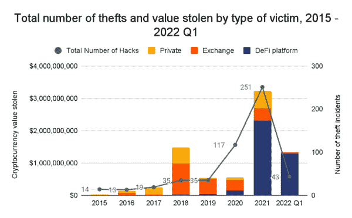

# 如何保护您的数字资产(加密)免受黑客攻击

> 原文：<https://medium.com/coinmonks/how-to-protect-your-digital-assets-crypto-from-hackers-d443e3560a6a?source=collection_archive---------27----------------------->

> 随着加密空间的惊人发展，黑客设计出新的数字资产欺诈方法；因此，预防损害而不仅仅是减轻损害是首选，尤其是在金钱和数字资产受到威胁的时候。

Photo by [Pankaj Patel](https://unsplash.com/@pankajpatel?utm_source=medium&utm_medium=referral) on [Unsplash](https://unsplash.com?utm_source=medium&utm_medium=referral)

【TL；博士]

*   自 2020 年初以来，DeFi 协议[占了从加密货币平台被盗的所有资金的很大一部分，这些资金中的绝大多数在 2021 年丢失。截至 5 月 1 日，DeFi 协议对 2022 年被盗的 16.8 亿美元加密货币中的 97%负责。](https://blog.chainalysis.com/reports/chainalysis-web3-report-preview-safety-compliance-defi/)
*   建议用户采用双因素认证甚至多因素认证。
*   虽然 2FA 是一种有用的资源，但多因素身份认证为保护用户的数字资产和个人信息提供了额外的安全性。黑客可以绕过所需的 2FA 令牌，通过用户账户批准加密交易。
*   热钱包是为了在线存储资产而创建的，而冷钱包是为了离线存储私钥，这是通过加密货币所必需的。
*   到目前为止，2022 年，DeFi 平台已经成为非法资金的最大接收者，[已经收到了从与犯罪活动相关的地址发送的所有资金的 69%](https://10guards.com/fr/articles/theft-money-laundering-and-nft-market-manipulation-what-crypto-scammers-do-in-2022/#:~:text=So%20far%20in%202022%2C%20DeFi,hackers%20are%20leading%20the%20way.) ，相比之下，2021 年为 19%
*   集中式加密交易所保留用户的私钥，而且因为大多数蓬勃发展的交易所拥有价值数十亿美元的数字资产，所以它们对黑客一直很有吸引力。
*   区块链网络使得追踪窃取资金的个人或黑客团体几乎不可能。

# 介绍

数字资产由区块链技术提供支持，这是一个分布式的、不可变的公共分类账，保存着网络内完成的所有交易的清单。区块链功能并不排除犯罪分子侵入或闯入某人的钱包并篡改其数字资产。此外，任何能够改善社会的新技术都有可能被骗子滥用来谋取私利。虽然这是事实，但数字资产黑客攻击的一些普遍实例涉及使用恶意软件勒索加密货币、清洗交易和网络钓鱼攻击等。

据[chain analysis](https://blog.chainalysis.com/reports/2022-defi-hacks/)报道，2021 年对网络罪犯来说是个好年景。他们偷走了价值 32 亿美元的[加密货币](https://blog.chainalysis.com/reports/2022-defi-hacks/)，到 2022 年，他们将会偷走更多。今年前三个月，黑客从不同的交易所、平台和私人公司窃取了 13 亿美元，其中 DeFi 受害者的数量不成比例。由于 DeFi 允许用户将一种类型的密码转换为另一种，从而使跟踪资金流动变得更加复杂，DeFi 被认为是数字资产欺诈的最新避风港，并且是所有加密货币盗窃的[超过 97%](https://10guards.com/fr/articles/theft-money-laundering-and-nft-market-manipulation-what-crypto-scammers-do-in-2022/#:~:text=So%20far%20in%202022%2C%20DeFi,hackers%20are%20leading%20the%20way.) 的来源。

source: [chainanalysis](https://blog.chainalysis.com/reports/2022-defi-hacks/)

谈到[数字资产黑客](https://blog.chainalysis.com/reports/2022-crypto-crime-report-preview-malware/)，行业观察人士倾向于关注针对大型组织的攻击、加密货币交易所的黑客攻击或针对关键基础设施的勒索软件攻击。但在过去几年里，黑客利用恶意软件窃取了少量的加密货币，甚至是从个人用户那里。

根据 Crypto Head 的数据，过去十年，Crypto fraud[造成的损失接近 150 亿美元，即平均每起欺诈损失 3.64 亿美元。迄今为止最大的加密攻击是价值 40 亿美元的 OneCoin 庞氏骗局，它自称是一种新的加密货币。根据 Chainalysis 的数据，2021 年，PlusToken 庞氏骗局诈骗了数百万投资者总计约 20 亿美元。](https://www.ft.com/content/6cea9227-aaa2-4850-ac7a-b2ca18cccbe3)

这也是为什么用户在投资一个平台之前需要保持专注，保护他们的数字资产，并进行适当的研究的部分原因。建议投资者始终进行尽职调查，并研究“白皮书”和其他有关任何数字资产计划的文件。

很高兴知道，通过采取一些简单的步骤，您可以保护您的数字资产免受黑客和其他潜在罪犯的攻击。我们将在本文中讨论其中的一些准则，但在此之前，您为什么需要保护您的数字资产？

# 为什么要保护您的数字资产？

保护您的数字资产可能看起来令人生畏且耗时，但从长远来看，积极主动地保护网络安全是有益的。一月份，领先的加密货币交易所 Crypto.com 遭到攻击，价值超过 3400 万美元的数字资产被盗；价值 1500 万美元的 ETH、1900 万美元的 BTC 和 66200 美元的其他加密货币被盗。该交易所的 483 名用户受到该事件的影响，丢失了他们的加密资产。仅这一事件就提醒了所有人，尽管集中式交易所很方便，但在持有加密资产时并不是 100%安全的，尽管 Crypto.com 声称所有受影响的消费者都得到了补偿。因此，所有者还应该涉及其他手段来备份，而不是完全依赖于交换平台。

加密货币业务的爆炸式增长吸引了一大群欺诈的[黑客和骗子](https://www.finance-monthly.com/2022/01/how-to-secure-digital-assets-safely-in-2022/)，他们不断寻找新的方法来欺骗加密客户并取走他们的钱。因此，任何数字资产所有者都必须采取措施来保护它们，并且有各种具有不同安全级别的选项。加密资产的所有者必须像对待传统货币一样警惕针对他们个人的骗局和黑客，以保护他们免受损失。最佳安全方法取决于用户如何保存资产以及使用何种平台，因为在这一领域，安全性和可靠性差别很大。

# 如何防止您的数字资产受到黑客攻击

以下是持有者应该检查的一些步骤，以保护他们的数字资产免受黑客攻击:

## 1.使用冷钱包

冷钱包通过类似 USB 驱动器的物理硬件设备安全地离线存储加密货币。这些钱包连接到一个私人的加密密钥，一个数字号码，使所有者能够解锁钱包并获得其数字资产。冷钱包是热钱包的更安全的替代品，也更不容易被黑客攻击。

相反，热门钱包容易受到在线攻击，因为用户通过互联网访问他们的资金。例如，使用这种在线存储技术，获得用户投资账户访问权限的黑客可以窃取用户的所有资金。

同样值得注意的是，建立一个冷钱包需要一些[技术诀窍](https://www.finance-monthly.com/2022/01/how-to-secure-digital-assets-safely-in-2022/)，冷钱包被认为比其他形式的加密货币钱包更具挑战性。由于失误和缺乏冷藏知识，许多消费者损失了金钱。

## 2.请改用 VPN

管理加密资产时，使用安全的专用互联网连接，而不是公共 Wi-Fi 网络。加密用户的互联网流量允许虚拟专用网络(VPN)改变他们的 IP 地址和位置。VPN 是一种保护用户的互联网数据和浏览活动免受包括黑客在内的外来者攻击的简单方法。一个可靠的 VPN 将对你的互联网服务提供商(ISP)隐藏所有的加密活动，对潜在的入侵者隐藏你的所有通信和在线活动。

## 3.多因素身份认证和多个密码

使用多因素认证(MFA)方法，你可以用最重要的方式保护你的比特币钱包。要登录您的帐户，MFA 解决方案会将您的密码与安全密钥或手机与应用程序相结合。当您使用多因素身份验证方法时，黑客很难通过猜测您的密码进入您的帐户。

任何资产都应该在最大程度上防止非法访问，并且使用最强大的各种技术是必不可少的。以前只用密码；然而，这种方法并不总是可靠的，因为密码很简单。

现代社会使用了一种更有效的方法——多因素身份认证。

## 4.避免扫描未知的二维码

很大一部分加密攻击涉及扫描未识别的二维码。在使用二维码进行支付之前，验证二维码的准确性至关重要。这一行动将防止你成为欺诈的受害者。

## 5.不要重复使用密码

确保密码使用一次后不要重复。为了让黑客更难进入你的账户，经常更换你的密码，避免重复。

## 6.保护您的设备

建议用户保护他们的设备，这是最佳的安全措施。这个过程包括几个阶段，例如应用系统更新和建立可靠的防火墙和防病毒防御。这些预防措施为数字投资者提供了至关重要的安全保障，尽管这些措施还不够。

## 7.警惕网络钓鱼诈骗

建议用户在打开看似可疑或错误的未知电子邮件和广告时要小心。如今的黑客更加老练，因为他们为发动攻击做了充分的准备。例如，他们可能会寻找区块链交易所的领导和员工，发现他们的电子邮件地址和职位。有了这些知识，他们可能会使用虚假的电子邮件来欺骗用户点击危险的链接，提供他们的登录凭据或安全密钥，并迅速窃取他们所有的数字资产。

## 8.投资前分析加密货币

加密货币无疑是时下的热门话题。在投资这些货币之前，研究它们是至关重要的。不要因为加密货币受欢迎就投资加密货币。

## 9.在声誉良好且安全的交易所进行交易

像股票一样，加密货币通常在交易所购买和交易。交易量巨大的加密货币交易所为数以百计。但是只有少数可以说是真正安全的:比特币基地、 [Gate.io](https://www.gate.io/) 和币安可以说是最好和最安全的加密平台。

# 最后

当您成为数字投资者时，您的数字资产或加密钱包将成为您金融实力中最重要的工具之一。现在的骗子正在升级他们的攻击模式和欺骗性。

因此，人们应该格外小心网上交易；保护数字资产免受黑客攻击应该是您的首要任务。

在本帖中，我们仔细讨论了一些保护数字资产免受黑客攻击的建议，以及在区块链交易所网络上买卖时遵循安全最佳实践的必要性。

> 交易新手？试试[密码交易机器人](/coinmonks/crypto-trading-bot-c2ffce8acb2a)或者[复制交易](/coinmonks/top-10-crypto-copy-trading-platforms-for-beginners-d0c37c7d698c)