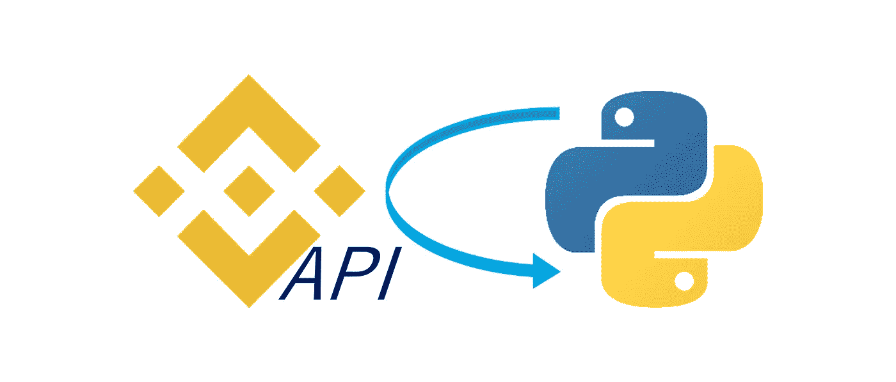

# 如何从币安 API 中提取数据

> 原文：<https://medium.com/coinmonks/how-to-pull-data-from-the-binance-api-db90b3246fd3?source=collection_archive---------3----------------------->

在构建交易机器人时，最重要的部分可能是访问市场数据。没有数据，你就无法定义何时买入或卖空多少，也无法根据历史数据对你的策略进行回溯测试。本文是一种教程，将帮助您使用 Python 访问最流行的 exchange 数据之一。通过本教程，您将能够获得实时数据以及…