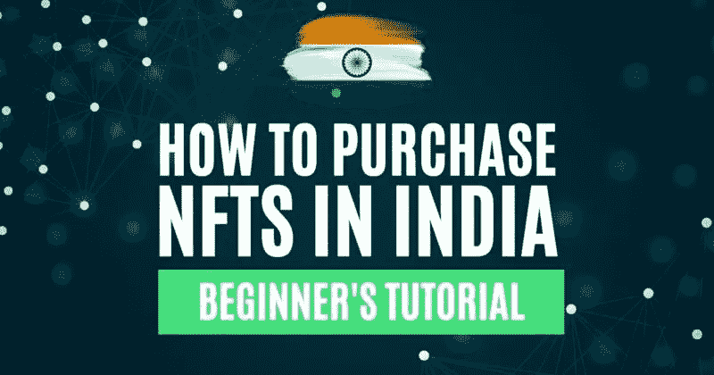
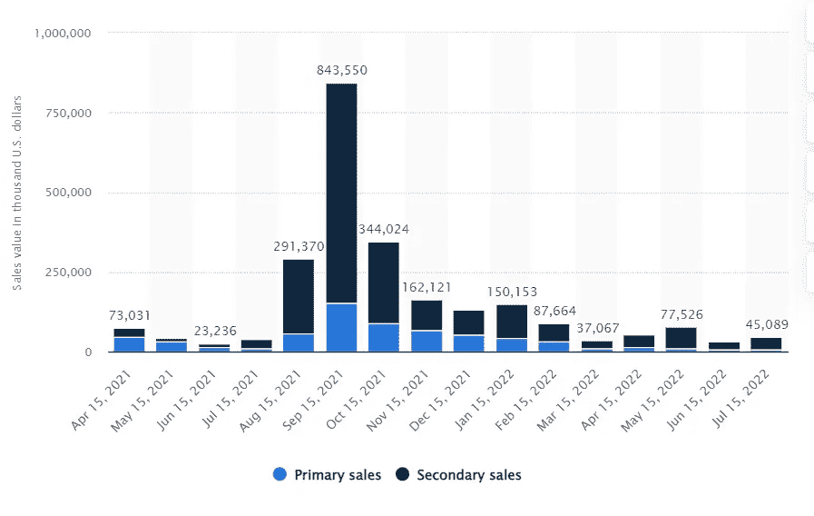
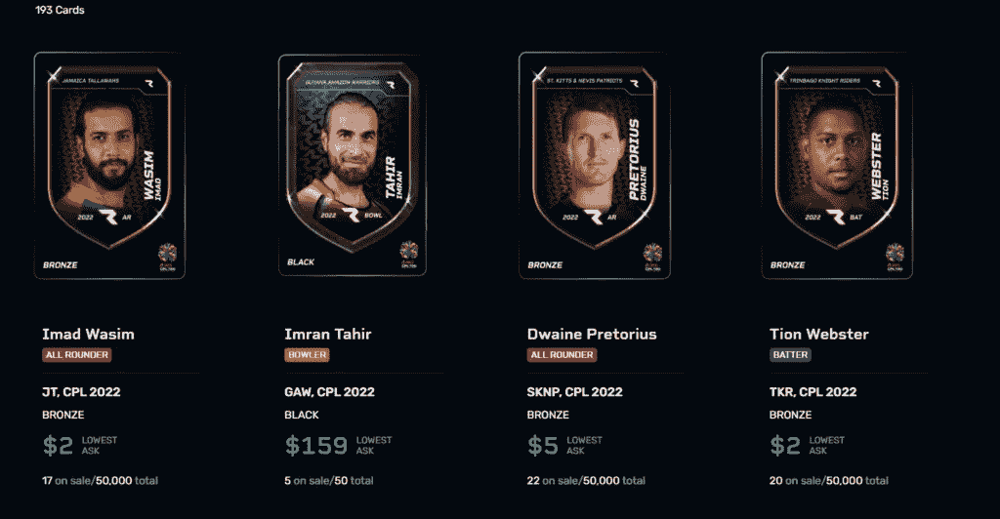

# 如何在印度购买 NFT

> 原文：<https://medium.com/coinmonks/how-to-purchase-nfts-in-india-dee490c31135?source=collection_archive---------34----------------------->

印度艺术市场是本地化的，印度艺术家很难拓展更大的全球市场。NFTs 能解决这个吗？下面是一些支持这一功能的平台。

## 印度是一个以丰富的文化和遗产而闻名的国家。多年来出现了多种艺术风格。他们中的大多数都保持了他们的高标准和正直。虽然有各种各样的艺术可供选择，但艺术家们面临着一个共同的问题。印度艺术市场是本地化的，资源有限的艺术家很难拓展更大的全球市场。

印度的 NFTs 能解决这个吗？印度艺术家如何利用 NFT 炒作？

**全球艺术市场**

根据 Statista 的一份[报告，2021 年，全球艺术品市场的价值为 651 亿美元。有趣的是，艺术品和古董的在线销售贡献了艺术品市场总价值的五分之一。NFT 已经成为在线艺术品销售的一大刺激因素。考虑到目前的熊市，这些数字已经大幅下降，但仍然令人鼓舞。月销售额(考虑一手和二手)在 2021 年 9 月](https://www.statista.com/topics/1119/art-market/)达到 8 亿美元的峰值[。7 月份，这个数字徘徊在 4500 万美元/月左右。](https://www.statista.com/statistics/1235263/nft-art-monthly-sales-value/)

**印度艺术市场**

那么印度在这一切中处于什么位置呢？《2021 年艺术市场状况报告》指出，2021 年是印度艺术拍卖市场最好的年份之一。估计总营业额约为 88.09 亿卢比(1.17 亿美元)。这比前几年增加了 57.3%。

**印度 NFT 市场**

NFT 是数字艺术的前进方向。它解决了艺术家目前面临的许多问题，如伪造、模糊的转售佣金、难以接触全球观众、不公平竞争等。对印度艺术家来说也是如此。当前的印度 NFT 市场生态系统处于非常初期的阶段，受到缺乏监管准则的困扰。

然而，印度人迟早会采用这些市场，这是迫在眉睫的。越早进入，受益越多。作为一名艺术家，这给了你一个创建 NFT 品牌的良好开端。作为一个收藏家，它给你时间在竞争不那么激烈的时候早点收集好的艺术品。

以下是一些你可以尝试的有趣的 NFT 市场:

[**NFT**](https://nft.wazirx.org/discover?sort=recent-desc)

WazirX NFT 市场由 Web3 提供支持。你可以将你的元掩码以分散的方式链接起来进行买卖。该平台为您提供了一些基本的工具，如搜索、排序和过滤。然而，它也缺少拍卖、真实性检查等工具。

资料来源:NFT 瓦济尔克斯

买家提示:

*   下载图片，在谷歌做图片扫描，检查真伪。
*   像“创建者”一样使用标签他们会让你更好地了解谁是真正的卖家。理想情况下，一个拥有大量追随者和相当数量创作的创作者应该比那些拥有非常多创作或非常少追随者的创作者更安全。
*   转到创建者的个人资料，检查他们的社交句柄。你会对造物主的真实性有所了解。

[**超越生命**](https://www.beyondlife.club/)

超越生活是印度第一个策划人才和运动员 NFT 交流。他们与印度顶级艺术家、运动员和乐队合作，提供一流的 NFT 体验。该项目随着印度著名影星阿米塔布·巴钱(Amitabh Bacchan)的 NFTs 的推出而走红。

他们还推出了斯坦·李的查克拉无敌 NFTs。marketplace 有一个很好的用户界面，带有排序、搜索和过滤等基本选项。在多边形网络上创建 NFT。然而，你不需要付煤气费。您可以直接用加密货币、美元或印度卢比支付。

来源:超越生活

买家提示:

*   下载图片，在谷歌做图片扫描，检查真伪。
*   这是一个集中的交易所。你实际上并不拥有你的 NFT。如果出现任何负面的政府法规，您将有可能失去 NFTs。
*   虽然阿米塔布巴坎和查克拉 NFT 都很受重视，但要经常检查需求和流动性，这样你在出售时就能获利。

[Rario](https://www.rario.com/)

板球是印度最受欢迎的运动。Rario 带来板球瞬间，球员图像等。以 NFT 收藏品的形式。NFT 车主还可以参与 Rario 自己开发的名为 [D3](/rario/cricket-strategy-game-build-your-team-enter-contests-and-win-rewards-60b32e3a5b2c) 的策略游戏并赢得奖励。

拉里奥看起来很有趣，也很有野心。从其卑微的开始，它现在已经与 6 个国际板球联盟，19 个品牌大使和 1000 多名球员建立了合作伙伴关系。

买家提示:

*   购买玩家时，检查该玩家的总卡数。检查卡的层级。层级越高，卡的价值越高。黑色是最稀有的，其次是金、银和铜。
*   检查玩家的受欢迎程度。
*   检查你是否可以在 D3 策略游戏中使用玩家来赚取奖励。
*   玩家的价值会随着年龄的增长而降低，所以，万一你手上的玩家不是传奇人物，那就在玩家全盛时期卖掉这张牌。
*   Rario 也是一个集中式平台。

无独有偶，我们最近也采访了 Rario。查看[完整面试这里](https://www.altcoinbuzz.io/cryptocurrency-news/spotlight/rario-ama-session-with-ankit-wadhwa-founder-ceo/)。

**结论**

印度的 NFT 及其市场仍处于萌芽阶段。成交量低，艺人素质有待提高。这也是一个识别和收集一些好的和罕见的 NFT 的好机会。目前，你还可以使用 Web3 全球市场，如 [Rarible](https://rarible.com/) 、 [OpenSea](https://opensea.io/) 、[币安 NFT](https://www.binance.com/en/nft/home) 等。这些平台上有很多印度艺术家。由于这些平台直接与区块链集成，您可以轻松地将 [NFTs](https://www.altcoinbuzz.io/category/nft/) 放在自己的钱包里，不受地理位置的限制。

***注:*** *本帖首发* [*此处*](https://www.altcoinbuzz.io/bitcoin-and-crypto-guide/how-to-purchase-nfts-in-india/) *同* [*一* ltcoinbuzz.io](https://www.altcoinbuzz.io/) *。*

跟我来吧

**👉** [推特](https://twitter.com/rumadas123)

**👉**[**Linkedin**](https://www.linkedin.com/in/ruma-das-a1439320/)

> **交易新手？试试[加密交易机器人](/coinmonks/crypto-trading-bot-c2ffce8acb2a)或[复制交易](/coinmonks/top-10-crypto-copy-trading-platforms-for-beginners-d0c37c7d698c)**