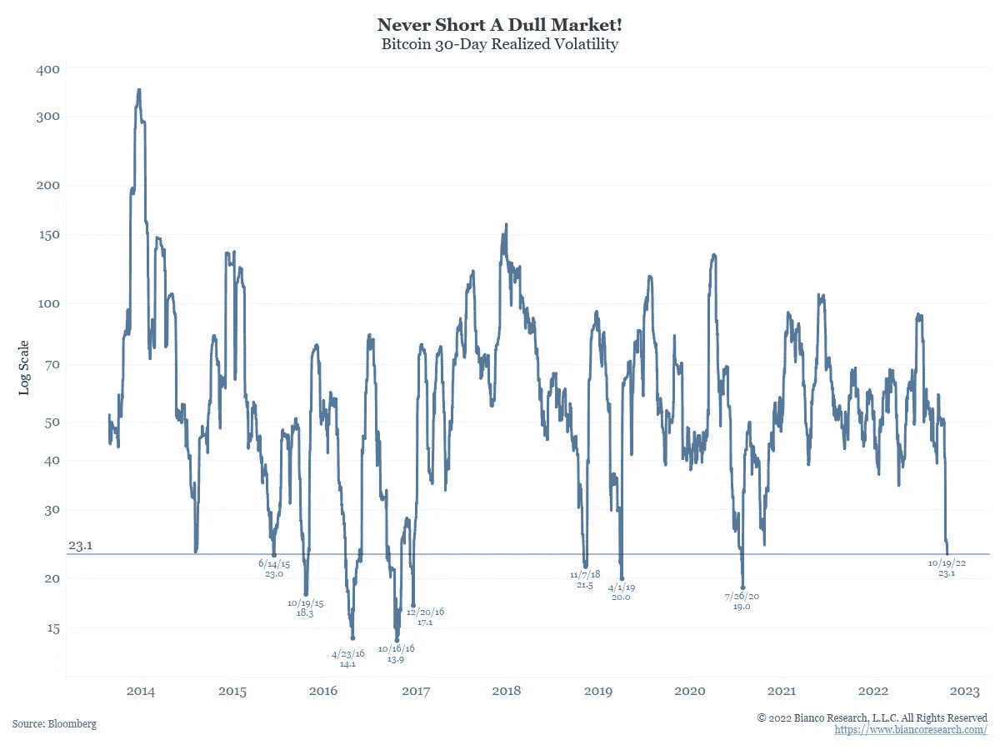
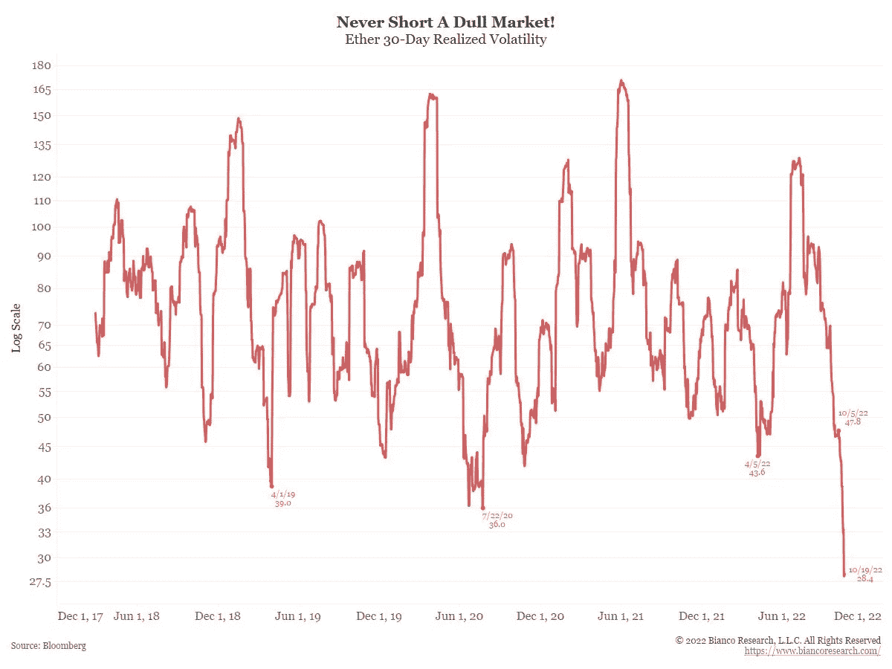
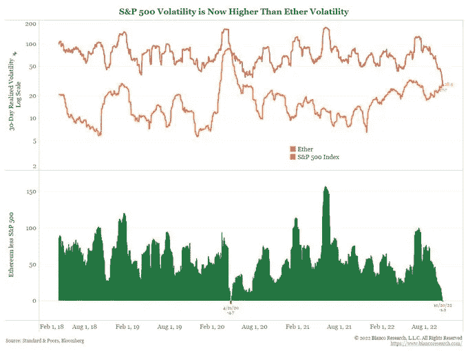
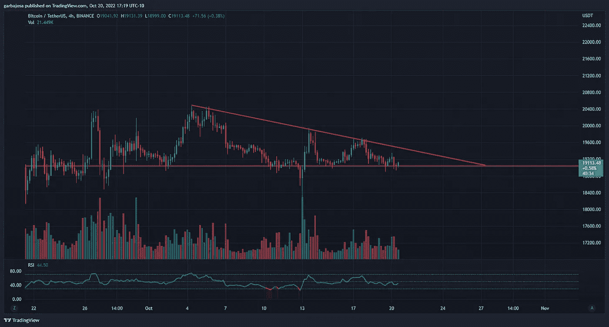
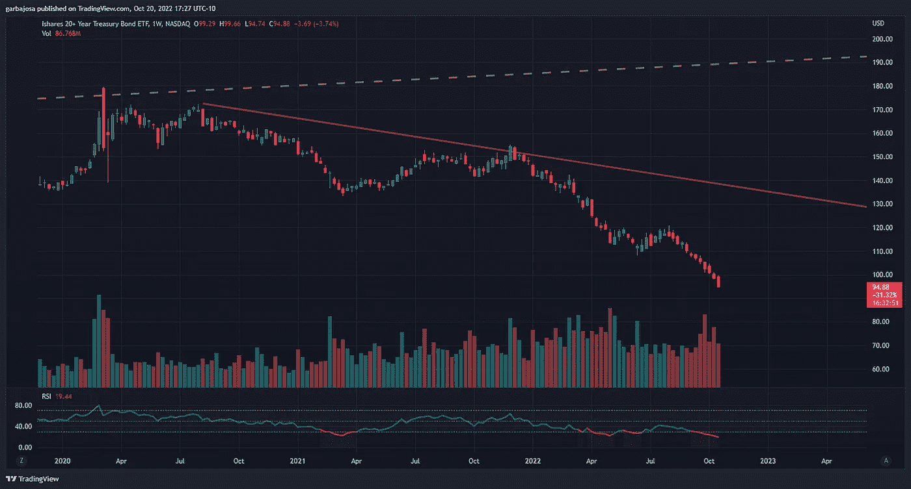
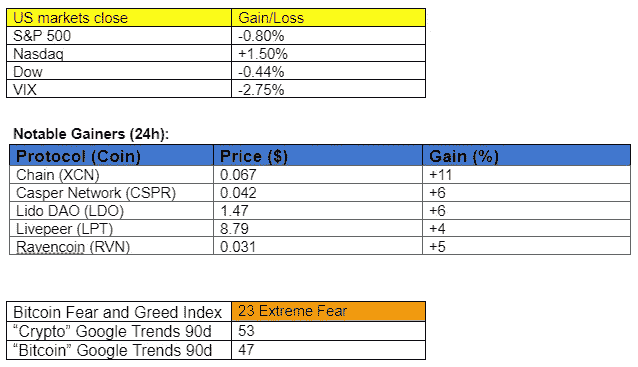

# 如何接收空投上市你的非功能性食物？

> 原文：<https://medium.com/coinmonks/how-to-receive-an-airdrop-for-listing-your-nfts-f817e81676d8?source=collection_archive---------31----------------------->

## 每日征服#108

问题#108

Photo by [Ross Stone](https://unsplash.com/@rs2photography?utm_source=medium&utm_medium=referral) on [Unsplash](https://unsplash.com?utm_source=medium&utm_medium=referral)

密码市场是一个狂野、奇妙而令人生畏的地方；不要一个人跋涉！订阅加密征服者，让我们成为您的向导。

S [*订阅*](https://tradergabi.substack.com/subscribe?) *本刊每日快讯，永不错过一期。*

**概述**

*   为什么低波动性对比特币和以太坊大有好处。
*   美国国债继续暴跌。
*   比特币基地大幅削减菲亚特至 USDC 的费用。
*   新 NFT 市场提供上市空投！

早上好，家人，

在经历了几个月的价格下跌和长达一个月的单边趋势后，人们对比特币和以太坊的态度冷淡了。因此，这两种资产的波动性都创下了历史新低。

Bianco Research LLC 的专家研究员 Jim Bianco 在这条[推文中用各种图表覆盖了低波动性的现状。他所说的很有趣。](https://twitter.com/biancoresearch/status/1583071345188823040?s=20&t=aH-jI2BK7XczaCR-V5V5pg)

自 2014 年以来，比特币的波动性只在其他 8 次跌至这一低点(23.1)。考虑到目前 BTC 期货和杠杆的未平仓头寸数量，这一数据确实令人震惊。BTC vol 上一次跌至如此低点是在 2020 年疫情崩盘时。

*来源:* [*推特，比安科*](https://twitter.com/biancoresearch/status/1583071345188823040?s=20&t=aH-jI2BK7XczaCR-V5V5pg)

另一方面，以太坊的波动性触及 28.4 的 5 年低点。考虑到以太坊刚刚经历了 crypto 历史上最重大的更新之一(合并),这也确实令人震惊。

*来源:* [*推特，比安科*](https://twitter.com/biancoresearch/status/1583071345188823040?s=20&t=aH-jI2BK7XczaCR-V5V5pg)

有趣的是，以太的波动性小于标准普尔 500，后者是 30.12 万亿美元的资产。普遍的预期是，较大的资产往往比较小的资产波动更小，但这里的情况并非如此。至少现在是这样。

Bianco 指出，这可能是 TradFi 和 crypto 之间关系破裂的迹象。关于这个想法，他说“如果是这样的话，这对 crypto 来说是长期的利好。”

*来源:* [*推特，比安科*](https://twitter.com/biancoresearch/status/1583071345188823040?s=20&t=aH-jI2BK7XczaCR-V5V5pg)

历史表明，这种低流量环境往往不会持久。价格波动肯定会随之而来，尽管没人能预测何时或朝哪个方向。我们已经祈祷了，这是向上的！

*如果你想更深入地挖掘波动性漏洞，我们在周三的早安加密* [*简讯*](https://www.getrevue.co/profile/CryptoBanter/issues/this-is-exactly-why-bitcoin-won-t-stand-still-much-longer-the-irs-is-coming-for-your-nfts-1414157) *中讨论了类似的主题，展示了 Glassnode 对低波动性环境的研究。*

# 市场更新🌍

**BTC/USDT 1D**

BTC 在早盘攀升至 19，347 美元的高点，但在美国市场交易时段被抛售至 18，929 美元的低点。随着价格接近 4 小时图上的下降趋势阻力(红色)，价格在长期的 19k 美元支撑位上方保持低波动状态。BTC 收盘上涨 0.38%，至 19111 美元。

*高分辨率* [***图表***](https://www.tradingview.com/x/MvUar0Wv/)

**TLT/美元**

不，这不是黑幕 altcoin 图表，尽管它的外观，而是 20 年期债券 ETF。债券历来被认为是市场上最安全的投资之一，但由于美联储的大规模平仓，今天 20 年期债券的售价处于 2011 年以来的最低水平。

# 新闻观察📰

比特币基地大幅削减菲亚特与 USDC 的费用互换。美国最大的加密交易所将开始免除任何法定货币的 USDC 交易的佣金。此举旨在通过一个无摩擦的入口加速 USDC 在国际上的采用。

**航海家客户退款**。根据 CoinDesk 的报道，Voyager 立法中的法庭文件显示，如果 FTX 的投标获得通过，陷入困境的加密交易所 Voyager 的客户可以收回 72%的投资。法官预计将在 12 月前批准该交易，但如果出现更好的报价，该交易仍有可能被取消。

**新闻花絮:**

*   国际刑警组织已经[进入了](https://twitter.com/interpol_hq/status/1583064663595528194?s=61&t=vVlEZJ85pwJg3Sm47rCFnQ)元宇宙。
*   利兹·特拉斯辞去英国首相职务。
*   2150 万 AXS 代币将于 10 月 25 日[解锁](https://twitter.com/lookonchain/status/1582644844635181056?s=20&t=4UHpOdg5pHAvE0TSOBOA1w)。
*   与[的联系使得](https://www.coindesk.com/business/2022/10/20/stablecoin-issuer-tether-to-make-usdt-available-at-24000-atms-in-brazil/) USDT 可以在巴西的 24000 台自动取款机上使用。
*   霍德洛瑙特[赢得](https://www.coindesk.com/policy/2022/10/20/hodlonaut-wins-norwegian-lawsuit-against-self-styled-satoshi-craig-wright/)挪威对自称“聪”的克雷格·赖特的诉讼。
*   芒果市场将开始从 1 . 14 亿美元的剥削中向用户退款。
*   PancakeSwap [提议](https://pancakeswap.finance/voting/proposal/0x29913ec3d379014a6137fdfe62c1cf27f7b2c1edff7c6a802d4300251d06d34c)在 Aptos 上发布。
*   比特币基地向[提供](https://bitcoinmagazine.com/business/coinbase-files-amicus-brief-in-support-of-grayscale-spot-bitcoin-etf)现货 ETF 案例中的灰度指引？

**NFT &元宇宙更新🐵**

*   华纳兄弟[与 web3 初创公司 elu VIO](https://techcrunch.com/2022/10/20/warner-bros-teams-up-with-web3-startup-eluvio-to-launch-lord-of-the-rings-nfts/?guccounter=1&guce_referrer=aHR0cHM6Ly93d3cuZ29vZ2xlLmNvbS8&guce_referrer_sig=AQAAABAzXkvLi_N1MhJ8uRymvkEg69h-a8yUHBWvohmK-Zi7YARnNruCnzvWvTf2LQ2tAFfTA2NVzefNKoMirW_suaUc0uBWhHPnkLJ1usC7o2Mxu6hXogXtvwpmDPb83cCQUmDw4VO9ZfoGIvYcl9JoHiDAdtb2b8lAPjdbUreVAfCN)联手推出《指环王》NFTs。
*   模糊 NFT 市场在 4 个月的私人测试阶段后上线。

# 我的五分钱…

让我们在笑声中结束这一周。

哇哦。由于肖恩·瑞恩·亚当斯和萨姆·班克门-弗里德在推特上对我们昨天报道的 DCCPA 法案[话题](https://www.getrevue.co/profile/CryptoBanter/issues/could-this-mean-the-end-of-defi-world-s-largest-asset-manager-offers-eth-trading-1415829)的评论，比特男孩在他的节目中彻底崩溃了。

**T21 加百列**

*关注我* [*推特*](https://twitter.com/web3_gabri) *每日更新！*

订阅 *这份每日简讯，永不错过任何一期。*

> 交易新手？尝试[加密交易机器人](/coinmonks/crypto-trading-bot-c2ffce8acb2a)或[复制交易](/coinmonks/top-10-crypto-copy-trading-platforms-for-beginners-d0c37c7d698c)