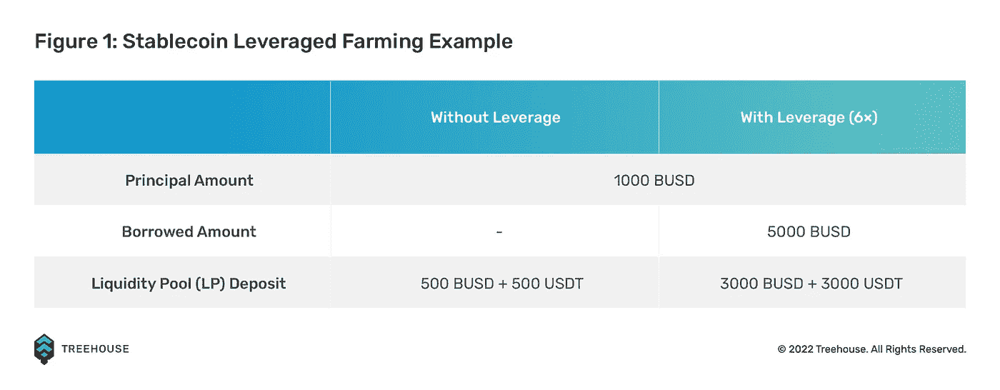
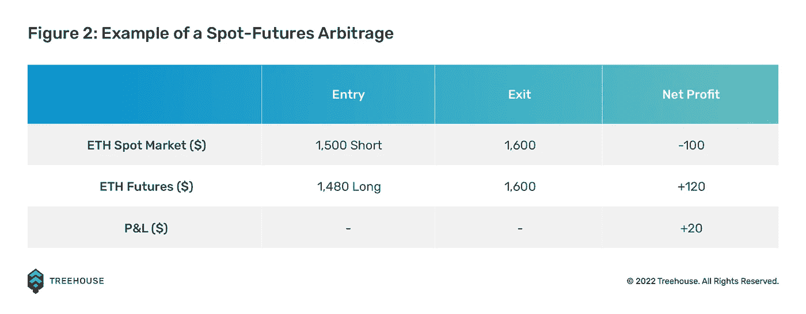

# 如何利用 Delta 中性策略降低违约价格风险

> 原文：<https://medium.com/coinmonks/how-to-reduce-defi-price-risk-with-delta-neutral-strategies-5c916bf107c?source=collection_archive---------2----------------------->

*本文旨在概述如何利用 delta 中性策略降低违约价格风险。如果你对这些概念不熟悉，在阅读本文之前，请先阅读我们关于加密货币***[*DeFi*](https://www.treehouse.finance/learn-defi/what-is-defi)和 [*DeFi 价格风险*](https://www.treehouse.finance/learn-defi/defi-risks-what-you-need-to-know) *的介绍性文章。***

# **什么是三角洲中立策略？**

**在一个高度不稳定的环境中，投资者可能会选择低风险策略，但仍能为他们带来回报。投资者经常参与的一篮子策略是 delta 中性策略。**

**[Delta](https://www.treehouse.finance/learn-defi/how-to-measure-your-price-risk-in-defi#:~:text=Volatility-,Delta,since%20the%20underlying%20position%20has%20no%20delta%20(meaning%20no%20directional%20risk).,-Beta) 是指衍生产品价值相对于其基础资产 1 美元价格变化的变化程度的理论估计。衍生工具是一种投资工具，如股票期权，其价值来自其基础资产的表现。短语“delta 中性”描述了利用多个头寸来平衡正 delta 和负 delta 的投资组合，使得资产的总 delta 等于零。**

**本质上，delta 中性策略寻求最小化投资组合的价格波动风险，减轻其对市场波动的反应。本文讨论了散户投资者在加密时可以考虑的四种 delta 中性策略:现货期货套利、现货永久融资套利、[稳定币](https://www.treehouse.finance/learn-defi/what-are-stablecoins-are-they-important)农业和 delta 中性收益农业。**

**点击在我们的见解文章[中了解更多关于 delta 中性策略的信息！](https://www.treehouse.finance/insights/delta-neutral-strategies-the-neutralizer-of-your-portfolio)**

# **稳定的谷物农业**

**稳定收益养殖类似于常规收益养殖，除了存放在流动性池中的两种资产是稳定收益，允许该头寸几乎没有[非永久性损失](https://www.treehouse.finance/learn-defi/what-is-impermanent-loss)。通过与相同的基础资产(多数情况下是法定货币)挂钩，用户只需持有一种能抵御市场波动的资产，就能获得收益。这就是为什么[稳定的硬币已经成为 DeFi 堆栈中的关键](https://www.treehouse.finance/learn-defi/stablecoins-3-reasons-why-you-still-need-them)，也是为什么稳定的硬币种植在投资者中是如此受欢迎的策略。理论上，从事稳定的硬币种植的投资者只暴露于[特质风险](https://www.treehouse.finance/learn-defi/introducing-price-risk-and-basic-trading-strategies#:~:text=Unsystematic%20Price%20Risk,holding%20multiple%20cryptocurrencies.)。**

## **稳定的货币杠杆农业**

**通常，稳定的硬币池提供 8%以上的年收益率。为了优化产量，用户还可以选择利用农场稳定的玉米。虽然不稳定资产的杠杆农业可能有风险，但稳定货币的杠杆农业本质上风险较小，因为稳定货币没有价格波动。**

**给定一个初始金额为 1000 BUSD 的投资组合样本，杠杆稳定的硬币种植的效果可以如下所示:**

****

**参考图 1，由于存入流动性池的两项资产(BUSD 和 USDT)的总价值应该相等，因此假定本金金额为 1000 BUSD，则需要 500 BUSD 和 500 USDT 的存款。**

**对于 6 倍杠杆头寸，投资者必须在 1000 BUSD 本金的基础上借入 5000 BUSD。接下来，他将把这笔借款兑换成 2000 BUSD 和 3000 USDT，以满足参与稳定的货币流动性池的要求。**

**因此，投资者将存入 3000 BUSD 和 3000 USDT，价值 6000 美元，与他仅用 500 BUSD 和 500 USDT 的本金进行养殖相比，有可能获得 6 倍的收益。**

## **全进稳定币杠杆农业？**

**虽然在熊市或动荡的市场条件下，在稳定的债券上进行杠杆养殖似乎是一项有吸引力的投资，但[做自己的研究(DYOR)](https://www.treehouse.finance/learn-defi/how-to-dyor) 总是很重要的，特别是要知道稳定的债券是如何得到支持的。例如，像 USDC 这样的稳定币，由大量的资产储备支持，并由定期发布的认证报告验证，可能比[算法稳定币](https://www.treehouse.finance/insights/the-evolution-of-stablecoins-a-vital-cog-in-defi#:~:text=Algorithmic%20(Algo)%20Stablecoins,separate%20sections%20below.)风险更小。尽管将算法稳定债券与[菲亚特支持的稳定债券](https://www.treehouse.finance/insights/the-evolution-of-stablecoins-a-vital-cog-in-defi#:~:text=a%20(Stable)%20Coin-,Fiat%2DBacked%20Stablecoins,-Very%20Liquid%2C%20Very)配对可能会提供更高的收益率，但这也带来了更高的非永久性损失风险，因为算法稳定债券可能会偏离它们的挂钩。在最坏的情况下，算法稳定币可能会像臭名昭著的 UST 那样完全失去其固定地位。**

**阅读我们关于 stablecoins 的见解文章[“stable coins 的演变:DeFi 中的一个重要齿轮”](https://www.treehouse.finance/insights/the-evolution-of-stablecoins-a-vital-cog-in-defi)。**

# **现货期货套利**

**另一种产生 delta 中性回报的流行方法是通过套利现货市场和期货市场之间的差价。由于资本机会成本等几个因素，期货价格通常高于或低于基础市场。**

**例如，在[以太坊合并](https://www.treehouse.finance/learn-defi/everything-you-need-to-know-about-the-ethereum-merge)之前，2022 年 9 月 30 日到期的以太坊期货表现出超过 2%的贴水。这是因为投资者做空期货来对冲他们的现货 ETH 头寸。假设价差将在到期时收敛(即 2022 年 9 月 30 日 ETH 的现货价格将等于 ETH 的期货价格)，投资者试图通过做空现货市场和做多 ETH 期货来获取价差。**

**图 2 显示了执行示例交易时的收益。当现货和期货价格在到期时趋同时，交易者可以净得 20 美元的 delta 中性利润。**

****

**虽然这种策略允许用户通过持有多头和空头头寸来有效地对冲方向性风险，但这些交易也有其他相关的成本和风险。例如，做空现货市场会产生“借入费”，这会侵蚀潜在的价差利润，甚至导致交易亏损。此外，如果交易不是“自动”执行的，执行风险可能是一个问题，因为交易的每个阶段都是在单独的时间戳上完成的。这可能会导致每条线路的进场价格略有不同。**

# **即期交易者融资利率套利**

**永久债券的经常使用者，或 perps，会注意到该工具有一个适用于未平仓头寸的[融资利率](https://www.treehouse.finance/insights/a-peep-into-perps-perpetual-futures-explained#:~:text=So%20What%20Exactly,rate%20is%20negative.)。融资利率是用于支付交易者的定期付款，交易者根据 perps 和现货价格做多或做空。与通过期限结构自动反映实物融资成本的期货不同，perps 强加了实际融资现金流，因为它们没有迫使现货和期货价格趋同的到期日。**

**在牛市中，融资利率为正，做多的交易者向相反的一方(空头交易者)支付融资费。在熊市中，融资利率为负，做空的交易者将不得不向做多的交易者支付融资费用。**

**融资利率套利是交易者在市场中对冲其头寸并从该策略中赚取融资费用的 delta 中性策略。例如，交易者可以使用 perps 做空 ETH-PERP 头寸，同时在现货市场上买入等值的 ETH-USD，以对冲价格波动，同时收取资金费用。**

**现货交易的一个例子:**

1.  **假设 ETH-PERP 上的资金利率为每 8 小时 0.01%**
2.  **多头交易者必须付钱给空头交易者来保持他们的头寸**
3.  **交易者可以在现货市场上做空瑞士法郎，做多相应数量的瑞士法郎-美元**
4.  **只要融资利率保持在利润有意义的期望阈值之上，交易者就可以保持头寸开放**

**在我们的 Learn DeFi 文章[“介绍价格风险和基本交易策略”](https://www.treehouse.finance/learn-defi/introducing-price-risk-and-basic-trading-strategies)中了解更多基本交易策略。**

# **三角洲中性产量农业**

**收益农业是投资者用他们持有的密码产生回报的一种方法，让他们的资产为他们工作，而不是无所事事地呆在他们的 T2 钱包里。与[下注](https://www.treehouse.finance/learn-defi/what-is-staking)类似，用户将他们的代币存入某个协议中一段时间，以“收获”奖励。这是通过将令牌存入[流动性池](https://www.treehouse.finance/learn-defi/how-does-defi-lending-and-borrowing-work)来实现的，在该池中，用户因向协议提供流动性而获得奖励。**

**三角洲中性产量农业是产量农业的一个子集。如果投资者不希望押注某项资产向某个特定方向移动，他们通常会采用这种策略。相反，他们构建自己的投资组合，以平衡多头和空头头寸。有一些协议允许用户使用这样的策略。一个例子就是 [Francium](https://francium.io/app/mypage) ，一个 DeFi yield 策略平台，允许用户参与 LP 对的 delta netural farming。**

**即使在市场状况不确定的情况下，Delta 中性策略也能让投资者获利。然而，重要的是要注意，这种策略并不意味着带来天文数字的回报。相反，它们是在动荡的市场条件下的避险策略。对于投资者来说，了解与他们互动的流动性池中资产的最新消息和价格变化也很重要。**

**查看我们的指南，了解如何[进行自己的研究(DYOR)](https://www.treehouse.finance/learn-defi/how-to-dyor) 。**

# **Delta 中性策略:无风险？**

**Delta 中性策略只是对冲市场波动的众多方法之一。虽然这种策略风险较低，但并不意味着零风险。重要的是要注意基础资产也有相关的风险。如前所述，算法稳定积分是一个很好的例子，说明了由于资产的性质，无风险策略也可能有风险。因此，投资者必须行使个人责任，进行尽职调查。**

**在我们的见解文章[中了解更多关于 delta 中性策略的信息，请点击](https://www.treehouse.finance/insights/delta-neutral-strategies-the-neutralizer-of-your-portfolio)！**

**在 Treehouse，我们希望让人们能够[自信地导航 DeFi】，这包括帮助用户正确理解和评估风险。如果你错过了，看看我们推荐的与风险相关的物品清单吧！](https://www.treehouse.finance/about)**

1.  **[如何理解 DeFi 中的指标](https://www.treehouse.finance/learn-defi/how-to-make-sense-of-metrics-in-defi)**
2.  **[DeFi 审计的真相](https://www.treehouse.finance/learn-defi/the-truth-about-audits-in-defi)**
3.  **[定义风险:您需要知道的内容](https://www.treehouse.finance/learn-defi/defi-risks-what-you-need-to-know)**
4.  **[如何利用该框架管理您的 DeFi 风险](https://www.treehouse.finance/learn-defi/how-to-manage-your-defi-risks-with-this-framework)**
5.  **[介绍价格风险和基本交易策略](https://www.treehouse.finance/learn-defi/introducing-price-risk-and-basic-trading-strategies)**
6.  **[闪贷和闪贷攻击？它们是什么，如何预防？](https://www.treehouse.finance/learn-defi/flash-loans-and-flash-loan-attacks-what-are-they-and-how-to-prevent-them)**
7.  **[回顾过去的加密冬天](https://www.treehouse.finance/learn-defi/a-look-back-at-past-crypto-winters-then-till-now)**
8.  **[如何在 DeFi 中衡量你的价格风险](https://www.treehouse.finance/learn-defi/how-to-measure-your-price-risk-in-defi)**
9.  **[分散投资组合，管理违约价格风险](https://www.treehouse.finance/learn-defi/diversify-your-portfolio-to-manage-your-defi-price-risk)**
10.  **[如何通过设置止损来管理违约价格风险](https://www.treehouse.finance/learn-defi/how-to-manage-defi-price-risk-by-setting-stop-losses)**

***免责声明***

**本出版物仅供参考和娱乐。本出版物中的任何内容都不构成财务建议、交易建议或任何其他建议，也不构成买卖证券或任何其他资产或参与任何特定交易策略的要约。本出版物不考虑您的个人投资目标、财务状况或需求。Treehouse 不保证本出版物中提供的信息是最新的或准确的。**

***初来乍到？如果你觉得这很有用，请查看我们的其他* [*学习 DeFi*](https://www.treehouse.finance/learn-defi?category=get-started) *文章，深入了解 DeFi 的奇妙世界！或者，浏览我们的* [*见解*](https://www.treehouse.finance/insights) *部分，阅读更多关于 DeFi 空间的深入分析。您也可以试用我们的旗舰产品，*[*Harvest*](https://harvest.treehouse.finance/connect?utm_source=medium&utm_medium=content&utm_campaign=harvest)*，全面分析您的 DeFi 资产。最后，订阅快讯更新* [*这里*](https://www.treehouse.finance/newsletter?utm_source=medium&utm_medium=content&utm_campaign=treehouse%20daily) *！***

> **交易新手？尝试[加密交易机器人](/coinmonks/crypto-trading-bot-c2ffce8acb2a)或[复制交易](/coinmonks/top-10-crypto-copy-trading-platforms-for-beginners-d0c37c7d698c)**