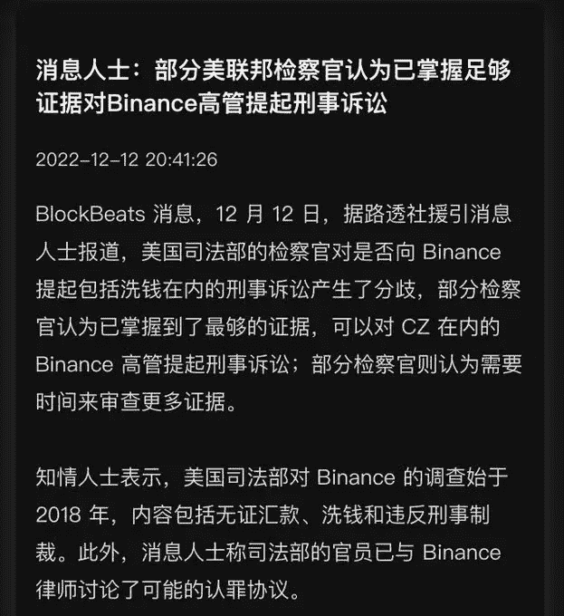
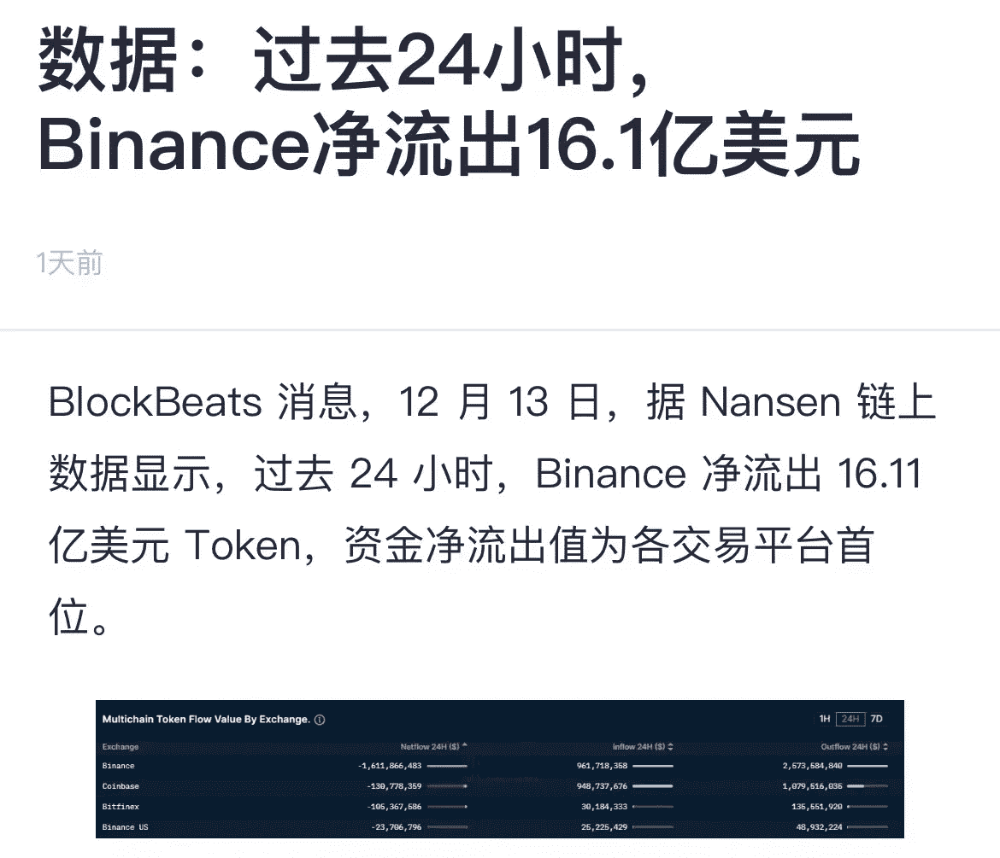
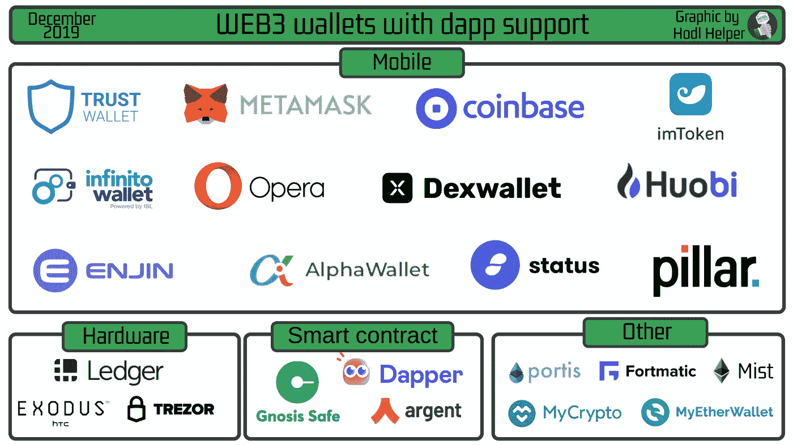
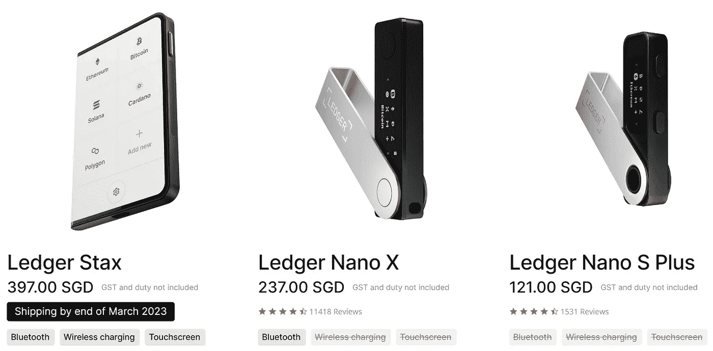
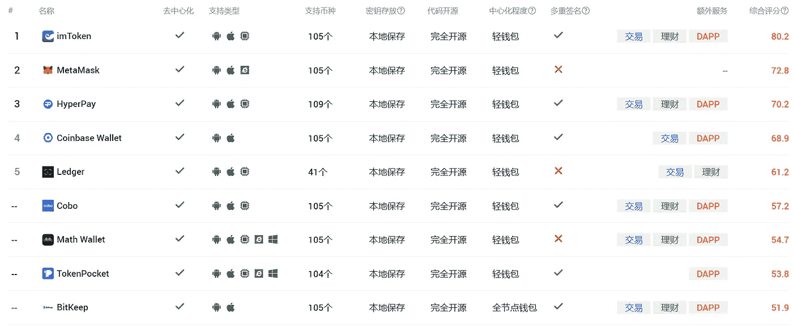
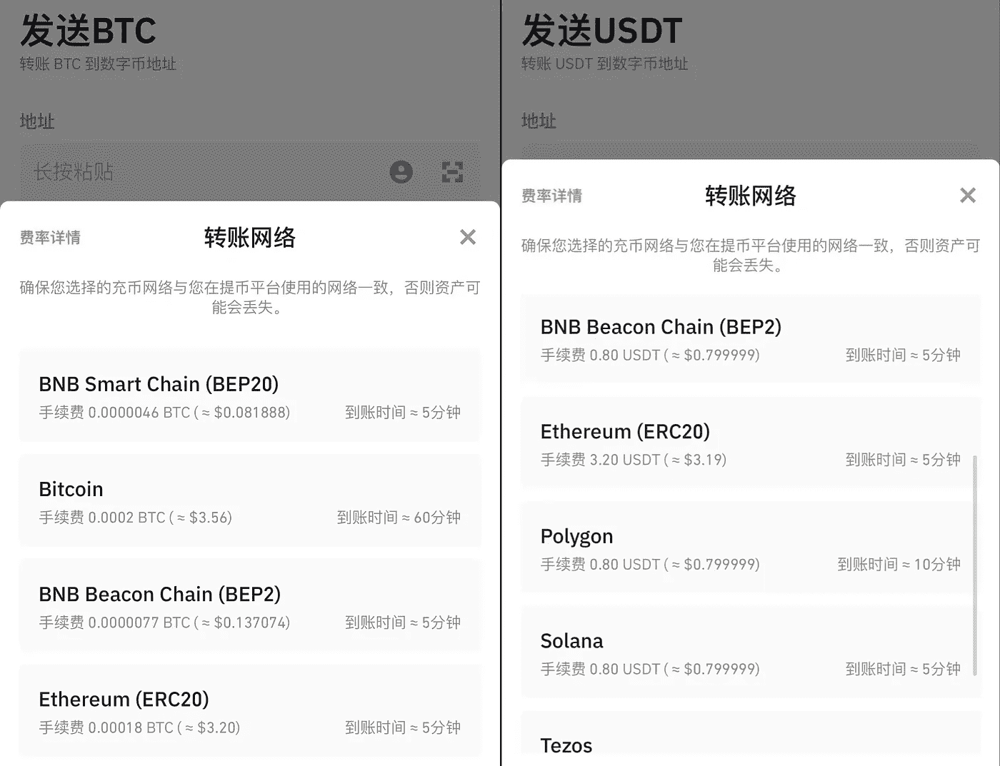
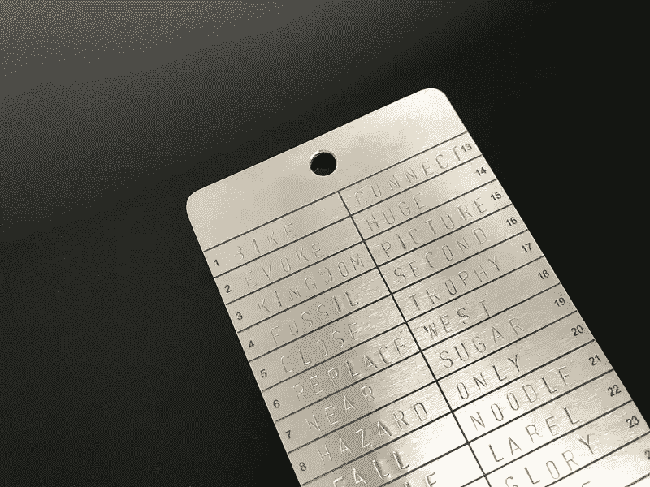
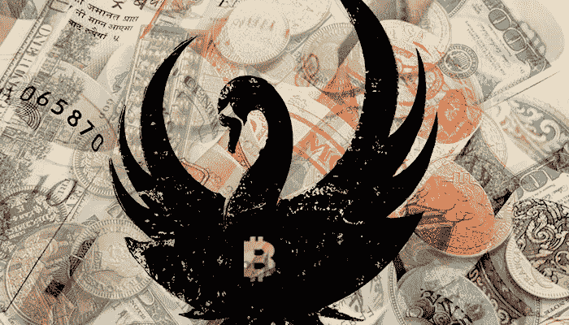

# 如何降低数字钱包被盗的风险？

> 原文：<https://medium.com/coinmonks/how-to-reduce-the-risk-of-digital-wallet-theft-d20a4886ed43?source=collection_archive---------17----------------------->

昨天，据透露，币安再次被美国司法部起诉。有一段时间市场上有很多讨论，考虑最大的交易所会不会被雷到，有什么风险，会不会出现挤兑。

由于 FTX 大公司倒闭的刺激，一些人变得害怕，担心 BN 雷暴，或减少风险，并参考他们的钱包来规避风险。

BN was exposed and sued

BN 提现网络短时间拥堵，APP 一度崩溃无法访问。还好很快就恢复了。根据 13 日的统计，过去 24 小时内有 16.1 亿美元从 BN 撤出。

利空消息一出，BNB 价格直接从 282 跌至 271，一度跌至 255.6，最大跌幅超过 9%，目前价格为 274。

BTC 价格受美国公布的 11 月 CPI 数据影响，从 17k 涨到最高 18k，目前价格为 17700 美元。

Withdrawal of $1.61 billion from BN in the past 24 hours

消息对加密市场的影响非常迅速，短时间内会出现大幅上涨或下跌。比如 BNB 受利空消息刺激，直接跌了 9%。本来是长合同的玩家，没注意就突然平仓了。

对于现货玩家来说，交易所的雷雨天气是最大的风险。资产无处可去，只能放在钱包里，钱包的用途有限。如果助记符被盗或泄露，钱包会直接归零。

整个市场充满了不确定性。只能根据自身情况尽可能平衡风险，选择一个可以接受的范围。

有时钱包资产被盗。数字钱包的使用确实有风险，使用有门槛，但也相对可靠。掌握了助记符，就是掌握了自己的钱包。

Various digital wallets

使用数字钱包需要注意哪些问题？

**1。选择哪个钱包？**

一般网上生成的助记词被认为是热门钱包；硬件设备钱包被称为冷钱包，不联网。

网上生成的助记符可能被窃取或泄露；或者使用钱包与项目交互时，过度授权可能导致资产被盗。

如果能保证助记符的安全性，一般就能保证钱包的安全性。

有条件的话可以买个硬件钱包，比如账本，需要通过官网等官方渠道购买，学习基本的操作设置。

Hardware Wallet Ledger Models and Prices

要使用链上的钱包，必须通过官网搜索下载。通过 Twitter、私信、搜索引擎结果获取的钱包地址，你一定要分辨识别，看是否准确。

常用的钱包如 metamask、imToken、coinbase、bitpie、mathwallet 等。一般选择开源代码、本地存储密钥的钱包。

Common Wallet Information

下载钱包后，创建一个助记短语，一般是 12 个助记短语，必须时刻妥善保管，因为这是钱包的唯一证明。谁拿到助记符，谁就可以随意操作钱包。

在助记符被正确记录之后，钱包地址被生成。这个地址可以接收别人支付的资产，也可以存储你自己的数字资产。

**2。它存储在哪个链上？**

从平台到钱包，一般放在哪个链条上？例如，BTC 和瑞士联邦理工学院被放在各自的公共链上。只有链条停了，资产才会流失。

其他令牌可以保存在相应的已发布链上，比如桑德和 SHIB 都在 ETH 链上。例如，在存储 usdt 的地方，通常首选 ERC20 网络。

也可以放在 BSC 或者 Solana 链上，但是要承担公链本身的风险。

比如之前 BSC 链被盗的时候，BN 启动了 BSC 公链节点的紧急关闭，确实挽回了损失，避免了被盗，也论证了中心化的问题。

keep the network consistent

只有 BTC 和 ETH 是真正去中心化的，没有中心节点，基本不可能有人阻止，保证用户的资产绝对去中心化、私有化、不可变更。

当然也方便黑客操作，如果被盗也无法恢复。

提现时，一定要选择对应的网点。如果转入和转出网络不一致，可能会丢失。

比如把 BTC 从 BN 转到钱包，选择 Bticoin 网络转出，在钱包的比特币链上接收。

**3。如何妥善保管助记符？**

使用钱包最重要的是保存助记短语。如果截图保存在相册、邮箱、记事本中，也有可能被盗。现在很多手机或者电脑软件都要求用户的读写权限，或者可以直接查看相册。

在线存储在助记符上的图片或文字可能会被获取，助记符会丢失。

最好是手动抄写记录，比如固定的笔记本记录，如果只是抄写在一张纸上，很容易丢失。

Someone engraved the mnemonic phrase

另外，作为主要资产存储钱包，一定不能授权登录任何网站，因为授权可能有风险，无法确认登录的网站是否有 bug，是否会被盯上。

对于大额钱包资产，最好不要频繁操作，只收不做任何其他交互。

The market is full of risks and uncertainties

在密码市场，每天都有风险，也有黑天鹅事件。加密资产只是符号，一系列不规则的字符。想要保证钱包的安全，就必须提高自己的工具基本功。

不花时间学习，肯定会通过各种方法交学费。输的次数越多，技术就越好。任何涉及钱包的操作都要小心。

以上只是我个人观点，没有投资建议。我是楚小莲，我正在关注元宇宙和 web3。

> *交易新手？试试* [*密码交易机器人*](/coinmonks/crypto-trading-bot-c2ffce8acb2a) *或* [*复制交易*](/coinmonks/top-10-crypto-copy-trading-platforms-for-beginners-d0c37c7d698c)
> 
> *分散密码持有量，了解* [*币安替代品*](https://coincodecap.com/binance-alternatives)
> 
> *加入 Coinmonks* [*电报频道*](https://t.me/coincodecap) *和* [*Youtube 频道*](https://www.youtube.com/c/coinmonks/videos) *获取每日* [*加密新闻*](http://coincodecap.com/)

# 另外，阅读

*   [复制交易](/coinmonks/top-10-crypto-copy-trading-platforms-for-beginners-d0c37c7d698c) | [加密税务软件](/coinmonks/crypto-tax-software-ed4b4810e338)
*   [网格交易](https://coincodecap.com/grid-trading) | [加密硬件钱包](/coinmonks/the-best-cryptocurrency-hardware-wallets-of-2020-e28b1c124069)
*   [密码电报信号](/coinmonks/top-3-telegram-channels-for-crypto-traders-in-2021-8385f4411ff4) | [密码交易机器人](/coinmonks/crypto-trading-bot-c2ffce8acb2a)
*   [最佳加密交易所](/coinmonks/crypto-exchange-dd2f9d6f3769) | [印度最佳加密交易所](/coinmonks/bitcoin-exchange-in-india-7f1fe79715c9)
*   [面向开发者的最佳加密 API](/coinmonks/best-crypto-apis-for-developers-5efe3a597a9f)
*   最佳[密码借贷平台](/coinmonks/top-5-crypto-lending-platforms-in-2020-that-you-need-to-know-a1b675cec3fa)
*   [免费加密信号](/coinmonks/free-crypto-signals-48b25e61a8da) | [加密交易机器人](/coinmonks/crypto-trading-bot-c2ffce8acb2a)
*   [杠杆代币的终极指南](/coinmonks/leveraged-token-3f5257808b22)