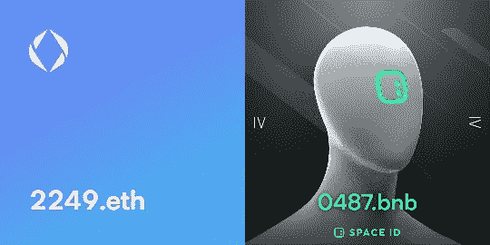
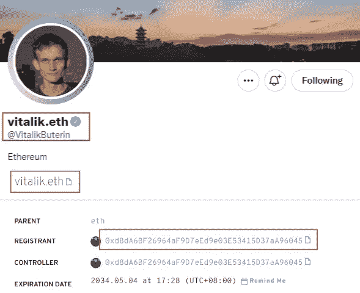
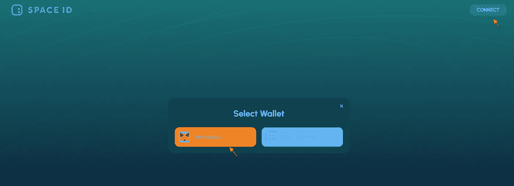
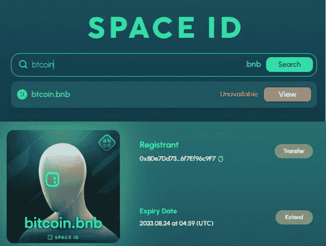
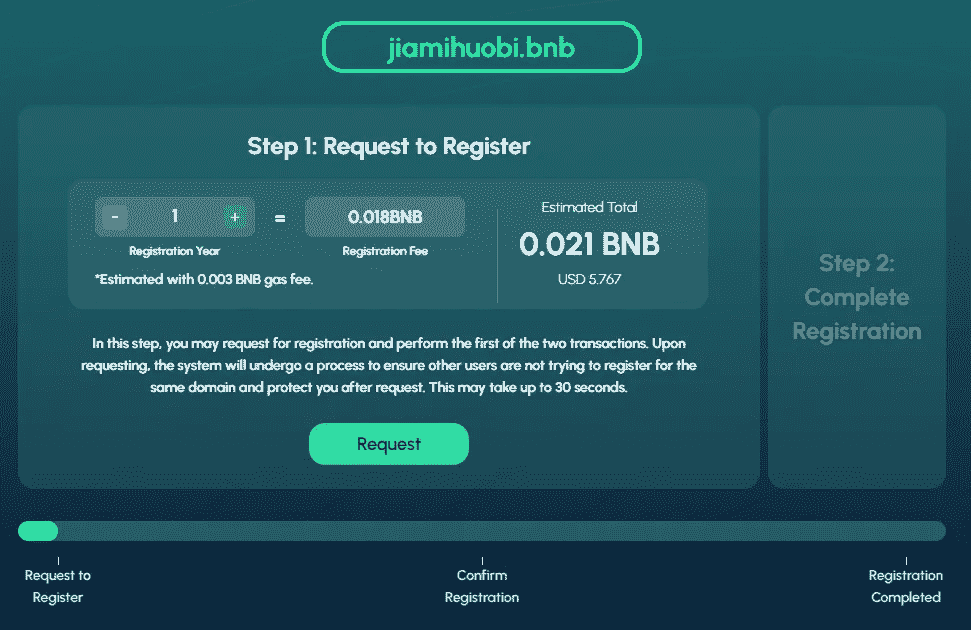
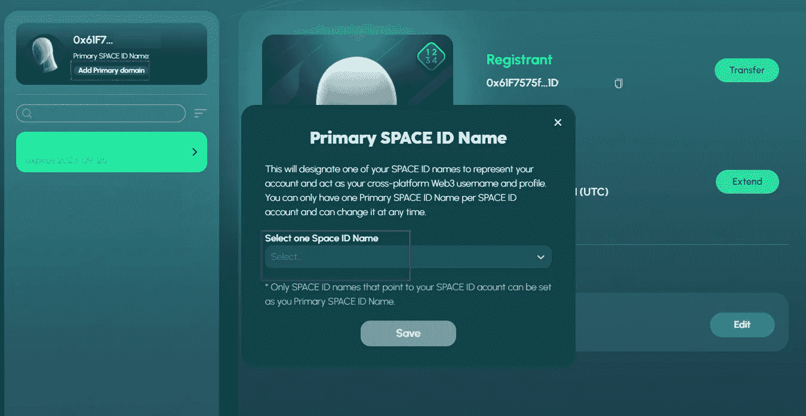
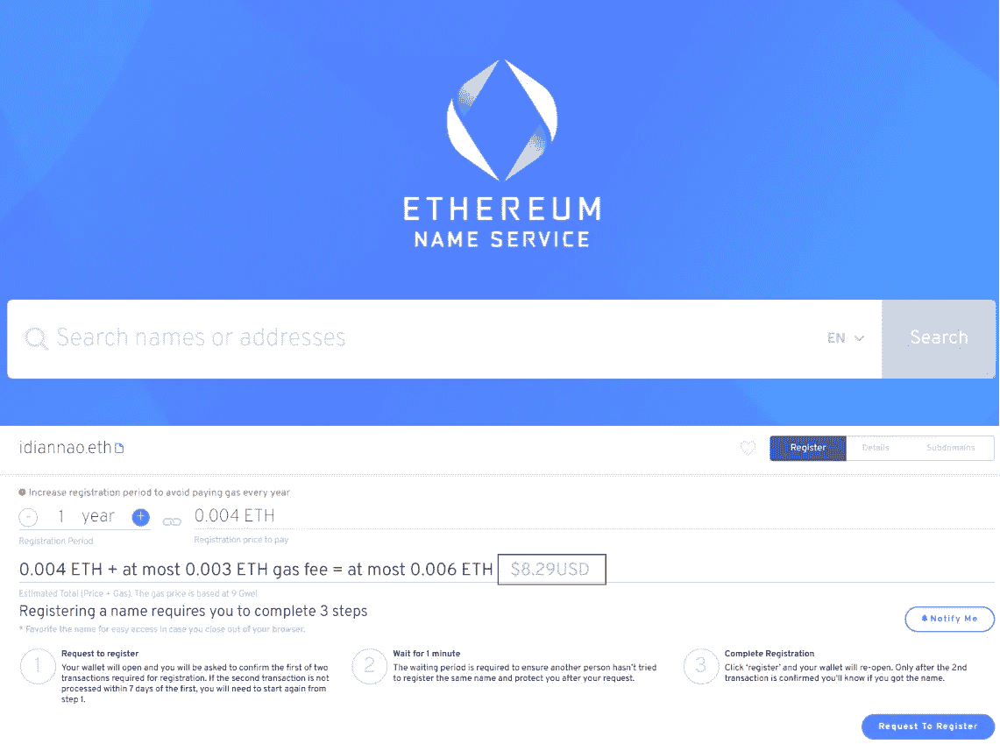

# 如何注册一个 Web3 域名？

> 原文：<https://medium.com/coinmonks/how-to-register-a-web3-domain-name-c6f99555477c?source=collection_archive---------5----------------------->

最近，域名。BSC 链上的 bnb 已经相当普及了。获得内测资格的用户已经受益匪浅，现已开放注册。

褚小莲已经注册了。eth 和。bnb 域名，并设置 web3 域名和钱包地址之间的关联绑定。通过搜索 web3 域名，可以找到对应的钱包地址，比较方便。

目前 Web3 域名的价值到底有多大，谁也说不清楚，炒作还在炒作，更多的应用场景还在建设中。

4-digit ENS domain name just sold for 2.94ETH

但不确定性中也有意想不到的收获。比如我刚注册的时候。eth，我不知道会有空投；第一批注册并使用。eth 域名收到数百个 ENS 空投，这是不确定性的收获。

域名作为 web3 的入口之一，未来是否有更多的可能性不得而知，但作为一个行业跟随者，拥有一个自己的 web3 域名不失为一个好主意，毕竟只是几块钱的投入。

**如何注册 web3 域名？首先，什么是 web3 域名？**

Web3 域名是一个流行的说法，它是不同链条上的身份入口，它是一个去中心化的身份 DID(去中心化的身份)。

数字钱包是每个区块链用户的身份，用户通过数字钱包进入链上世界。钱包地址是数字和字母的不规则组合，一般有 42 个字符。

记住数字钱包地址并不容易。绑定 web3 域名后，某人钱包地址为***。，而不是一串不规则的字符。

ENS domain name and wallet address of VitalikButerin

**在哪里注册一个 web3 域名？**

Web3 域名建立在不同的公有链上，目前最流行的是 ENS 和 SPACEID 域名。本文以注册一个. bnb 域名为例。

目前。bnb 域名通过 space.id 注册，SPACE ID 是一个去中心化的域名服务协议。这是由币安实验室牵头的种子轮融资。

**1。数字钱包登录。**

进入官网 app.space.id 后，通过右上角的 connect 登录钱包账号。如果您没有数字钱包，请先注册一个钱包帐户，您可以查看如何创建和使用 MetaMask 小狐狸钱包。

钱包注册成功后，需要往钱包里转一些 BNB 作为手续费和注册费。您可以通过平台购买 BNB，并通过 BNB 连锁网络将其转移到钱包中。

Use digital wallet to log in and register

2.登录后，搜索需要注册的域名。

搜索您要注册的域名，并检查它是否已注册。比如比特币已经注册了，就不能再注册；发现该域名于 2033 年 8 月 24 日到期。如果到期后没有续费，可以继续注册。

bitcoin is registered

搜索 jiamihuobi.bnb 进行注册，可以选择注册进行注册。

与传统域名类似，web3 域名是按年付费的。

目前一年注册 0.021BNB，差不多 5.767 美元；注册 2 年 0.038BNB，3 年 0.058。注册时间越长，费用越高，但总体费用相对较低。

去年楚小莲注册 5 个 ENS 域名的时候，花了 100 多美元。

Register a bnb domain name for $5.767

域名选定后，提交信息请求，钱包需要确认授权；然后确认注册确认注册，再通过钱包支付报名费。一般需要 2 个钱包确认、授权、支付环节。

3.注册成功后，绑定域名和钱包账号。

支付成功后，域名自动保存在钱包中，并且可以绑定域名与钱包地址的关联，这样在搜索域名时就可以找到钱包地址，钱包之间的转账交互可以直接通过 web3 域名进行。

SPACEID domain name and BSC address binding

除了。bnb 域名，ENS 域名也可以注册。目前 ETH 还是第一公链，用户基数大，生态更丰富。

注册 ENS 域名(app.ens.domains)，还需要使用钱包登录，选择以太坊网络登录。

目前注册一个 5 位数的域名需要 8.29 美元，注册后可以绑定一个以太坊钱包地址。

Register a 5-digit ENS domain name for $8.29

作为 web3 从业者，你可以体验注册过程，获得自己的 DID 身份。后期是否有价值，要看行业的整体发展，但是参与其中有可能获得机会。

还可以注册 web3 域名，了解数字钱包的使用，进一步体验加密市场。这个市场充满了不确定性，但不确定性中也蕴含着希望。

以上只是我个人的看法和总结，不含投资建议，读者的任何投资行为与作者无关。

我是褚小莲，我在学习区块链，关注元宇宙和 NFT，关注 web3。

> 交易新手？试试[加密交易机器人](/coinmonks/crypto-trading-bot-c2ffce8acb2a)或者[复制交易](/coinmonks/top-10-crypto-copy-trading-platforms-for-beginners-d0c37c7d698c)