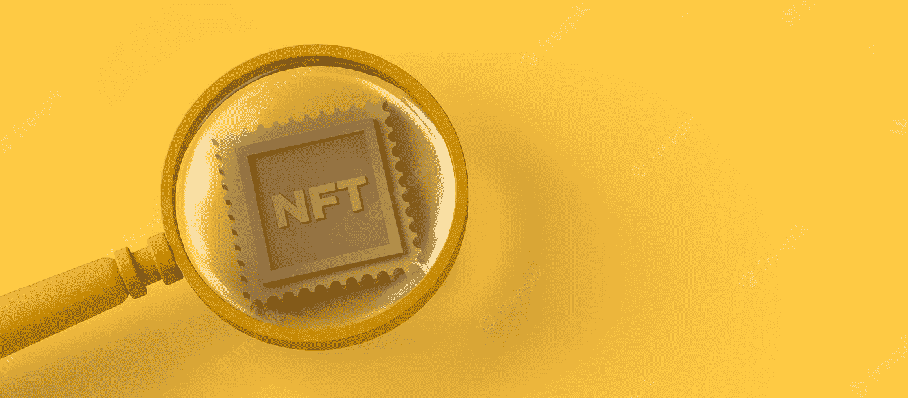

# 投资前如何研究 NFT 项目；如何去 DYOR NFT

> 原文：<https://medium.com/coinmonks/how-to-research-an-nft-project-before-investing-how-to-dyor-nft-60fa7f318419?source=collection_archive---------26----------------------->

在找到你打算投资的 NFT 项目后，如何在购买 NFT 之前做自己的研究(DYOR)的完整指南。

在[我之前的一篇文章中，我们研究了在寻找好的 NFT](/coinmonks/how-to-find-a-good-nft-project-to-invest-in-b80a7e97b416) 时可以采取的步骤。然而，当你找到一个引起你兴趣的 NFT 项目后，在投资之前，有几件事你应该留意。

*如果您还不了解什么是 NFT 以及它们是如何工作的，请花一点时间来阅读这篇文章，了解一下什么是 NFT**。*

通过下面列出的步骤，你将能够对一个 NFT 项目进行尽职调查，并在投资这样一个 NFT 之前得到一些重要问题的答案。

# DYOR 上 NFTs 时要注意的 4 件事

在投资任何 NFT 项目之前做研究时，基本上有四(4)件事需要注意。它们概述如下。

## **社区**

在评估该项目的 NFT 社区的规模时，您应该从三个方面进行考察。

*   他们的关注者有多少(尤其是在 Twitter 上)？
*   他们的追随者之间的互动如何？
*   社区有多活跃？

拥有大量社交媒体追随者和大型社区的 NFT 项目更有可能拥有有价值的 NFT。这表明有人有兴趣投资他们的计划和购买他们的非功能性测试。

需要注意的一件重要事情是社区互动。随时向社区提出您可能有的任何问题；这样做不仅能帮助你更好地理解这个项目，还能让你更好地了解活跃在社区中的人物。如果您有任何疑问，一个强大的社区将会很乐意回答，或者至少会为您指出正确的位置。

在考察任何 NFT 项目的社区或社交媒体时，他们在社交媒体上发布帖子的频率、他们与他人的联系以及他们向他人伸出援手的倾向都是值得关注的重要指标。在我看来，如果一个项目的 feed 只包含需要转发和分享作为补偿的免费内容，这就是一个危险信号。

## 创建者和团队成员

请记住，你投资的是 NFT 的创造者和他们的执行力，而不一定是 NFT 本身。因此，认识到每一个 NFT 项目的成功最终取决于创作者的能力至关重要。

谁是 NFT 的创造者？谁是这个项目的主要核心？你欣赏他们以前做的工作吗？他们是否具备完成项目的基本能力，比如设计师、开发人员或社区经理的能力？他们之前有什么项目吗？如果是，他们参与了什么，他们的表现如何？当考虑 NFT 项目背后的团队时，你应该调查这些和其他可能出现的问题。

发现品牌创始人和团队的身份应该是你的 NFT 分析中最重要的一步。一个值得信赖的 NFT 项目通常会有一个执迷不悟的开发者或创建者，并且对他们的目标完全开放。

## 路标

涉众的期望、计划、资源分配以及与其他组织的合作都可以通过项目路线图来解决。

作为一名 NFT 投资者，你应该关心这样的问题:该项目是否有一个计划来随着时间的推移创造明显的效用？有更多的 NFT 空投计划吗？项目的扩张和营销策略是否明确？

问这些问题会让你清楚地了解到，关于正在讨论的 NFT 项目，未来会发生什么。

## 合同

在你检查了社区、创建者和 NFT 项目的路线图，并且他们激起了你的兴趣之后，你可以进一步检查项目的智能合同。

重要的是要注意，并不是你考虑购买的每个 NFT 都有智能合同。如果你只是想购买 NFT 作为收藏品，如果你想购买一件精美的艺术品或其他收藏品，这是完全可以的。

然而，有几份报告称，在与 NFT 网站或智能合约互动时，个人钱包被掏空了。

如果您对智能合约代码有所了解，您可能能够识别出 NFT 本身特有的安全漏洞或条件。然而，如果你缺乏必要的专业知识，我建议等待一段时间，直到有相当数量的个人这样做了 NFT。通过这种方式，那些在你捐赠之前已经铸造过的人可以分享他们的经验，你也可以向他们学习如何做出决定。

# 获得您喜欢的 NFT

当你确定你的研究已经完成，你已经确定了一个你感兴趣的项目，你准备购买 NFT，你可以在二级市场上购买一辆现有的 NFT，或者通过首次分销(铸造)获得一辆全新的 NFT。

**铸造新 NFT —** 铸造 NFT 的过程需要使用 DApp 以数字方式交换 NFT 的代币(通常是建造 NFT 的区块链的本地代币)，使 NFT 在铸造后可以在公开市场上买卖，并在将来转售或收集时进行数字跟踪。

**在二级市场上购买 NFT**——你也可以从知名市场，如 [Opensea](https://opensea.io/) 、 [MagicEden](https://magiceden.io/) 、 [Solsea](https://solsea.io/) 等，购买之前已有的 NFT。

# 最后的想法

“总是 DYOR”是一个在加密领域非常流行的短语，但很少有人遵守。很多人依赖道听途说和朋友及受欢迎的有影响力的人的推荐，这些人在大多数情况下被付费来营销这些项目或有更多的好处。

然而，遵循本文概述的步骤可以帮助你覆盖足够的领域，并确保你投资在正确的 NFT。一旦你了解了 NFT 市场的运作方式以及需要寻找什么，找到好的 NFT 项目将不再是一件困难的事情。

> 如果你还有任何问题，请留下评论，或者更好的是，在 Twitter ( [@lanre_aderemi](https://twitter.com/Lanre_aderemi) )上直接给我留言，我会尽快回复。感谢您的阅读，如果您能为我鼓掌，那就太好了！

不要忘记点击关注按钮，获取更多类似这样的故事；-)

> 交易新手？尝试[加密交易机器人](/coinmonks/crypto-trading-bot-c2ffce8acb2a)或[复制交易](/coinmonks/top-10-crypto-copy-trading-platforms-for-beginners-d0c37c7d698c)