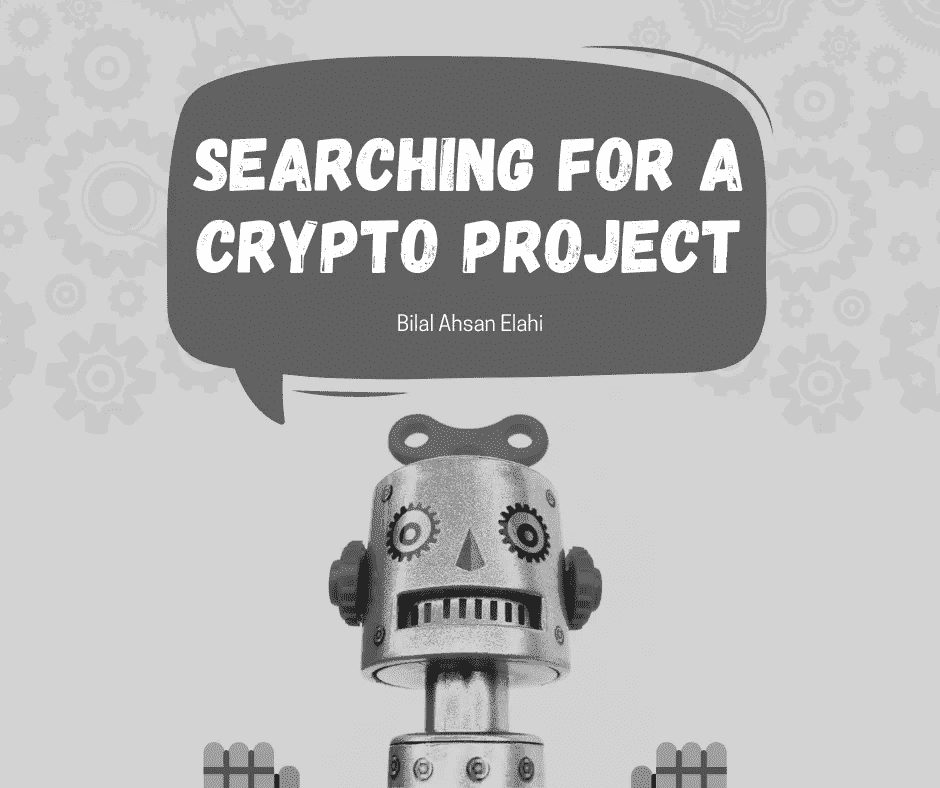

# 如何在密码空间搜索潜在项目？

> 原文：<https://medium.com/coinmonks/how-to-search-for-potential-projects-in-crypto-space-53d47f9a717d?source=collection_archive---------30----------------------->

这篇文章讲述了新投资者在投资一个加密项目之前如何进行研究，以确保潜在的利润。

# 介绍

评估任何决策的第一步是进行研究；你应该了解并致力于一个项目的基本方面。随着交易、投资和资产收购，研究的责任变得更加重要。

加密是一个可以成就你也可以毁灭你的空间，这取决于你的投资和定位。虽然大多数人会涌向最引人注目和表现最好的加密项目，但你需要知道即将到来的项目或“隐藏的宝石”，它们可以帮助你成倍地增加利润。在这篇文章中，我们将看看一些你可以坚持的技巧，以确保你的钱用在正确的地方，并产生积极的结果。

# 启动你的研究

加密市场的繁荣见证了几个平台的出现。这些平台托管着一些硬币和其他数字资产。这些平台中的许多确实为用户投资提供了很好的选择。著名的平台已经成为一个家喻户晓的名字，在加密领域非常有名，包括币安等。用户必须知道的一个概念是 ICOs-初始硬币产品。这些平台被用于加密初创企业的融资机制。尽管它们看起来与 IEO 不相上下，但人们普遍认为它们存在风险。由于 ico 托管在项目的网站上，它们很容易被黑客攻击、欺骗，或者面临可能危及整个过程的技术异常。如果我们谈论 ieo，它们通常比 ico 更安全。ieo 在适当指定的交易所推出，就像上面提到的那些交易所一样。安全性和真实性得到了保证，因为 IEOs 的流程更加严格。初创企业向这些交易所提交项目后，只有在交易所进行尽职调查后，它们才会接受严格的审查和审核；只有到那时，这些项目才被允许开始代币销售。

这是一篇帮助你进行研究的文章，但是独立于任何观点和偏见进行你自己的研究是至关重要的。保持更新和获取信息是很重要的，但是只有你才能决定什么是最适合你的。把你的头低下来，并通过基本的。

# 一个区块链项目的评估

以下是你在考虑一个项目时应该有的清单:

# 项目白皮书

白皮书通常概述项目的技术细节、细节、目标、解决方案和象征经济学。白皮书将会明确地写出来，不会试图通过为普通用户增加复杂性来逐步解决技术问题。它将清楚地列出项目旨在解决的问题。如果一个项目的白皮书含糊不清、过于复杂而难以理解，那么要表现得机警和聪明。如果一个项目的白皮书很容易阅读，并且列出了它的目标和应该如何操作，那么就把它当作一面绿色的旗帜。如果阅读一篇冗长的文章对你来说很费力，那么节略版也很有帮助。

# 项目愿景

当考虑一个项目时，确保项目的目标是一致的，并且计划是可实现的，这是很重要的。不要陷入“好得不真实”的项目，因为它们没有一个可靠的计划。大多数这样的项目进入舞台时都盛况空前，魅力四射，但它们的推出却从未公开过。这类项目被称为“vaporware”。这些项目在加密市场上很常见，因此建议对它们保持警惕。

# 主导游戏的玩家

研究项目背后的人是很重要的。在一个创业计划中，团队起着至关重要的作用。数百万美元危在旦夕，声誉、背景和经验非常重要。如果项目背后的团队是有凝聚力的、和谐的，并且有相当多的专业知识和经验，你可以相对容易和信任地打赌真实性。

# 市场潜力和测试案例

只有实际存在问题，问题才能得到解决。当想要坚持一个项目时，注意它想要解决的问题。看看是否有问题，或者它的大小是否有意义，或者是否另一个项目已经解决了它。谈到问题的严重性，看看这个问题是否只影响到一小部分人。如果是这样的话，你可以打赌，这个项目的增长潜力将相形见绌。除非你告诉委托人支持投资一个项目，因为它解决了一个你很敏感的问题，否则建议远离这样的项目。

# 社区兴趣和文化

与项目相关的社区会告诉你很多关于项目的信息。假设该项目足够强大，足以在社区中产生兴趣，该项目拥有相当大的社交媒体追随者，或者活跃用户对该项目有积极的评价。在这种情况下，你可以自信地把它作为你投资组合的一部分。

# 市场资本化

所有开采的硬币或代币的总价值通常被称为市值。这是衡量一个项目的规模和潜力的极好方法。市值也指项目的总价值。它是项目稳定性的可靠指标。普遍认为市值高的项目更稳定。

# 底线

当涉及到金钱或其他任何事情时，研究是至关重要的。此外，考虑包含和评估所有的因素和方面是不可能的，你的分析也不可能百分之百准确。虽然很难做到这一点，但以上步骤可以让你受益。他们可以给你一个关于项目走向和如何执行的想法。走出去，选择一个项目，做充分的研究。如果结果是正确的，就下单，坐下来，等待结果来让你轻松起来。

# 免责声明:

我是一名金融分析师，分享观点仅供学习和参考。我不是你的顾问，你也不应该根据我的工作进行交易。在进行任何金融交易之前，一定要咨询你的独立财务顾问。我假设市场参与者的任何交易都没有造成损失或损害。

# 最后:

如果你喜欢我的作品，请为我鼓掌！这将有助于我接触更多的人。也会提升我的士气，我会更多的分享我的作品！非常欢迎你的评论。也欢迎你不同意我的观点！

> 交易新手？试试[加密交易机器人](/coinmonks/crypto-trading-bot-c2ffce8acb2a)或者[复制交易](/coinmonks/top-10-crypto-copy-trading-platforms-for-beginners-d0c37c7d698c)