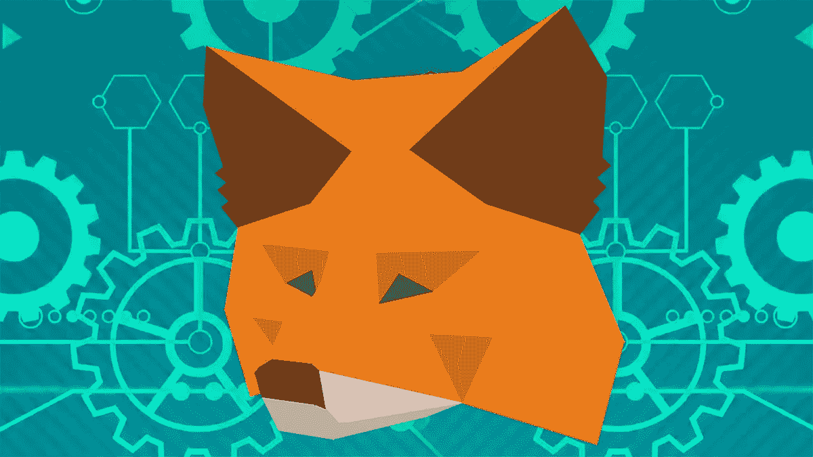

# 如何设置一个 MetaMask 钱包&保存您的密码！

> 原文：<https://medium.com/coinmonks/how-to-set-up-a-metamask-wallet-save-your-cryptos-ffce2331521?source=collection_archive---------7----------------------->

MetaMask is a decentralized wallet which will save your cryptos from exchanges going bust

许多**交易所**正在经历**银行挤兑**。第二大加密交易所 **FTX** 破产**许多人说其他交易所将面临同样的**流动性危机**。**

在本教程中，我们将向您展示如何**设置元掩码** **钱包**，以便您可以以**安全**和**分散**的方式存储您的密码。

> 元掩码是一个“**桥**”，它允许你今天就在你的浏览器中访问未来的分布式 web。它允许你以一种安全和分散的方式存储你的密码。

首先，去 [**MetaMask 网站**](https://metamask.io/) 下载你想要的浏览器的扩展。然后，打开扩展，点击“**创建钱包**”。

接下来，您将被要求创建一个密码。此**密码**将用于加密您的帐户信息，因此请确保您会记住它！创建密码后，点击“**创建**”。

然后你会得到你的**种子短语**，它是一系列的 **12 个单词**，如果你忘记了密码，它可以用来恢复你的帐户。将这些写在某个安全的地方**并点击“**我已经将它复制到某个安全的地方**”。**

**在下一页，您将被要求通过按顺序点击单词来**确认您的种子短语**。完成后，点击“**确认种子短语**”。**

**现在你的 MetaMask 钱包已经设置好了，你可以开始使用它了！为此，只需点击浏览器中的 MetaMask 图标，用你的**密码**解锁你的钱包。从那里，你可以开始**发送**和**接收加密货币**。恭喜你！**

**有许多不同的加密货币钱包，但在我看来，MetaMask 是最好的一种。它很容易使用，允许你直接从浏览器与分散的网络互动。另外，**设置**超屏蔽钱包是**简单的**，只需要几分钟。你还在等什么？按照本教程中的步骤，现在就开始安全使用加密货币吧！**

**🤑加入我们的 [**电报频道**](https://t.me/officialcryptohub) 与志同道合者互动**

**🐦也可以查看我们的 [**推特账号**](https://twitter.com/CryptoHub210?s=20&t=ts3bUBYtX7g0s5_ClYnL_A) 获取更简短的分析**

**💰欢迎 [**关注我们**](/@officialcryptohub0) 获取更多此类分析**

**👋业务请求: [**电报:联系@cryptohubtiktok**](https://t.me/cryptohubtiktok)**

> **交易新手？尝试[加密交易机器人](/coinmonks/crypto-trading-bot-c2ffce8acb2a)或[复制交易](/coinmonks/top-10-crypto-copy-trading-platforms-for-beginners-d0c37c7d698c)**