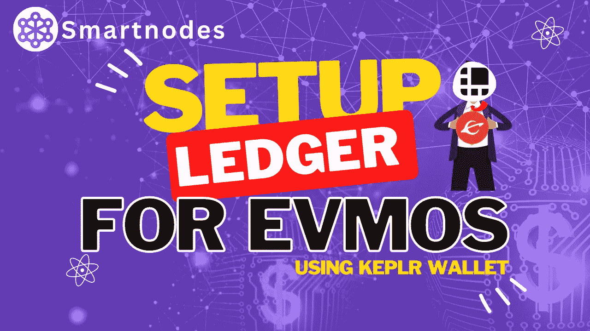
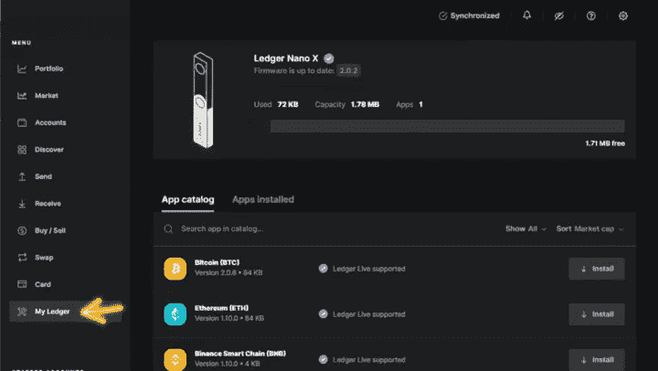
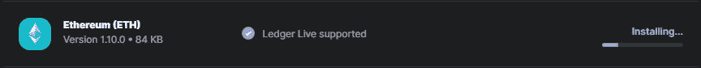
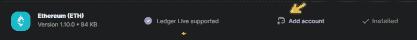
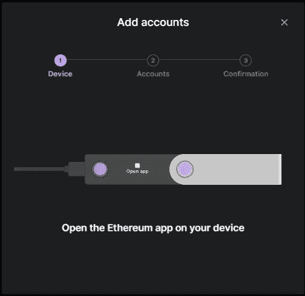
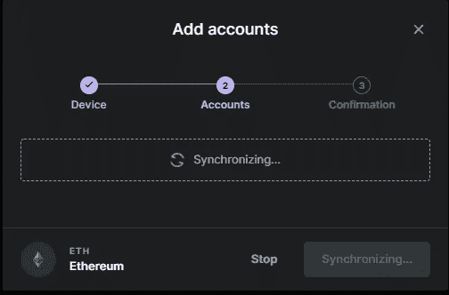
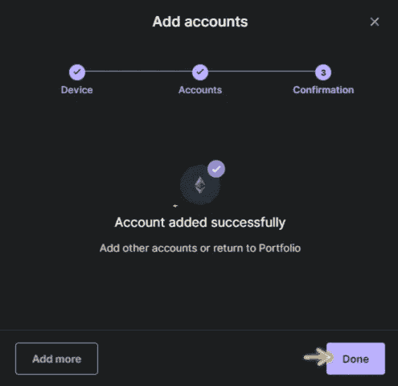
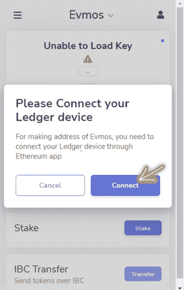
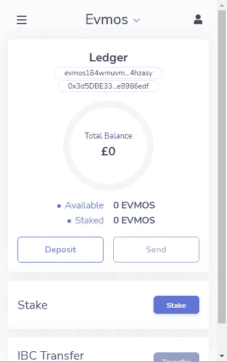

# 如何使用 Keplr 通过 Evmos 设置分类帐钱包

> 原文：<https://medium.com/coinmonks/how-to-set-up-ledger-wallet-evmos-using-keplr-c438cf8c5321?source=collection_archive---------5----------------------->

## 分类帐指南

## 将 Evmos 令牌放入分类帐硬件钱包中



Ledger Hardware Setup for Evmos using keplr Wallet

一个快速指南，告诉你如何用你的 keplr 钱包设置分类帐硬件来下注并赢得 Evmos 奖励。(使用*分类账钱包和 Keplr Chrome 扩展*

# 为什么是莱杰？

当您购买加密令牌时，您真正拥有的是一个允许您访问资金的私钥。这把钥匙只能由你保管，你必须妥善保管。

保护您的加密令牌的最佳方法是使用分类帐硬件钱包和 Keplr 应用程序。您的硬件钱包将您的私钥存储在经过验证的安全芯片中，以确保其始终安全。只有你能接触到它。任何交易都必须由您亲自验证，并在设备的可信显示屏上验证。

由于您的钱包，您可以灵活地自行管理您的加密货币。您可以在一个地方使用 Keplr 应用程序安全地下注、交换和开发您的加密令牌。

credit -L[edger](https://www.youtube.com/watch?v=k2oyXw1pdmQ)

不幸的是，在撰写本文时，Ledger 和 Keplr 的组合不能直接与 Evmos 一起使用。这是签名处理方式的结果。

然而，由于 [Keplr 更新 v0.11.10，](https://twitter.com/keplrwallet/status/1580487833113923585?s=20&t=UiPvvwP6l9BRiNLz7-n5fQ)Keplr 升级现在可以使用以太坊应用而不是宇宙应用进行签名。

如果您尚未将您的分类帐连接到您的 Keplr 钱包，

请参见我们之前的媒体文章:

[](https://smartnodes.medium.com/how-to-set-up-a-ledger-with-keplr-wallet-e96176a3ef05) [## 如何用 Keplr Wallet 设置分类账

### 本教程介绍了如何设置和使用 Keplr 网络应用程序与您的分类帐设备，以访问您的分类帐宇宙…

smartnodes.medium.com](https://smartnodes.medium.com/how-to-set-up-a-ledger-with-keplr-wallet-e96176a3ef05) 

## 要遵循的步骤

以太坊软件必须首先下载到你的账本。

**步骤 1** 打开 **Ledger Live** ，下载并安装 **Ledger Live** 的更新，**连接**你的设备。

*导航至左侧的“我的分类帐”。*



你会在要安装的应用列表顶部附近看到**以太坊**，如果没有，在框中搜索，点击**安装**。



安装完成后，您会看到这个。



**步骤-2**点击 T22【添加账户】T23。会提示你打开**以太坊 app** 。



Your ledger should prompt you to open it, but if not, open it manually.

花一点时间让**同步**，一旦完成，您应该能够创建一个**帐户名称**。



Choose a name of your choice to identify the Ethereum account.



Success!

**步骤 3** 一旦你完成了这些，在你的浏览器中打开 **Keplr** ，当你选择 **Evmos 链**时你会看到这个。



**第 4 步**现在继续，**连接你的设备**并打开**以太坊应用**(如果还没有打开)



**恭喜你！**你现在可以为你的 **Keplr 钱包**注入资金，并开始**下注$Evmos**

```
Please note, not all dapps and sites/services currently support keplr with 
the ledger. If you’re having issues with a particular dapp/service you may 
have to use MetaMask.
```

如果您需要帮助设置分类帐的元掩码，请遵循本指南。

[](https://smartnodes.medium.com/how-to-setup-evmos-ledger-wallet-using-metamask-dff4a74daf95) [## 如何使用元掩码设置 Evmos 分类帐 Wallet

### 使用元掩码的 Evmos 令牌的分类帐硬件设置

smartnodes.medium.com](https://smartnodes.medium.com/how-to-setup-evmos-ledger-wallet-using-metamask-dff4a74daf95) 

> 作者[肖恩(智能节点管理员)](https://t.me/SheephogTHC)

# 关于智能节点

Smartnodes Validator 提供利益相关证明服务。您的资产受到我们 100%的斜线和双标志退款保护。

1.  我们完全融入了宇宙，并乐于尽我们所能帮助他人。社区是我们前进的动力。由 [Smartnodes validator](https://smartnodes.family/) 对想法进行主动投票，以确保有效的治理。
2.  只有最好的基础设施中最好的才被 Smartnodes 所采用，并且有 10 层保护来保护您的投资。
3.  查看我们的网站，了解更多关于我们的验证器节点的信息。我们目前在 33 个加密货币链上提供利益证明服务(POS ),并且还在增加。
4.  如果您有任何其他疑问，请随时通过我们的社交媒体平台或电子邮件(hello@smartnodes.one)与我们联系。


*   **现在就玩！** [**Smartnodes 彩票**](https://lotto.smartnodes.family/)

**参加赢取宇宙周大奖抽奖。**

每周日都会宣布获胜者。

# 在社交媒体上关注我们

[Reddit](https://www.reddit.com/user/Smart_nodes)|[Twitter](https://twitter.com/nodes_smart)|[网站](https://smartnodes.family/) | [电报](https://t.me/smartnodesvalidators) | [Instagram](https://www.instagram.com/smartnodes_validator/?igshid=YmMyMTA2M2Y%3D) | [不和](https://discord.com/invite/TA3UVPwn6D)

> 交易新手？试试[加密交易机器人](/coinmonks/crypto-trading-bot-c2ffce8acb2a)或者[复制交易](/coinmonks/top-10-crypto-copy-trading-platforms-for-beginners-d0c37c7d698c)