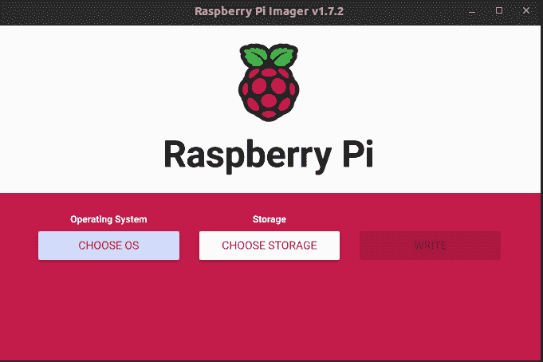
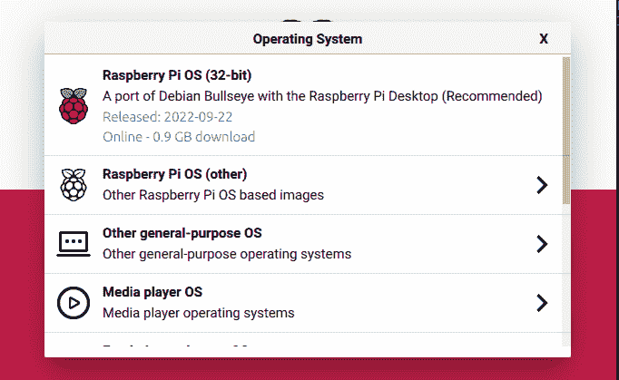
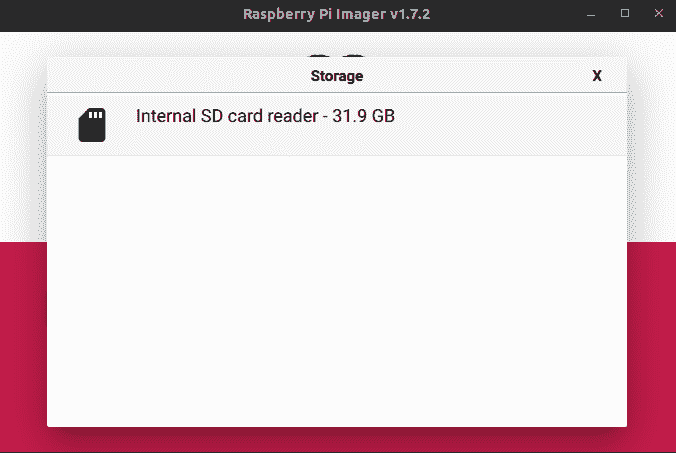
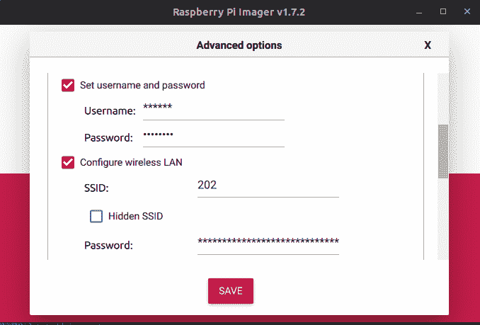
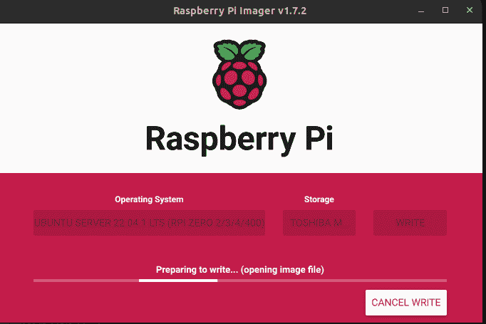
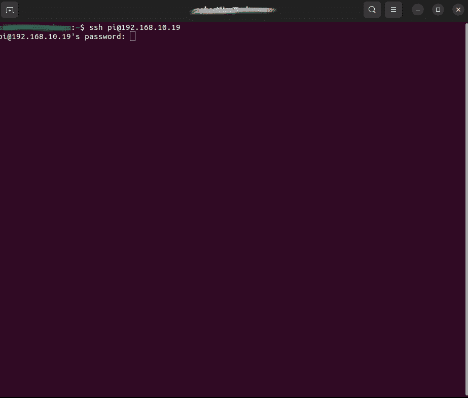
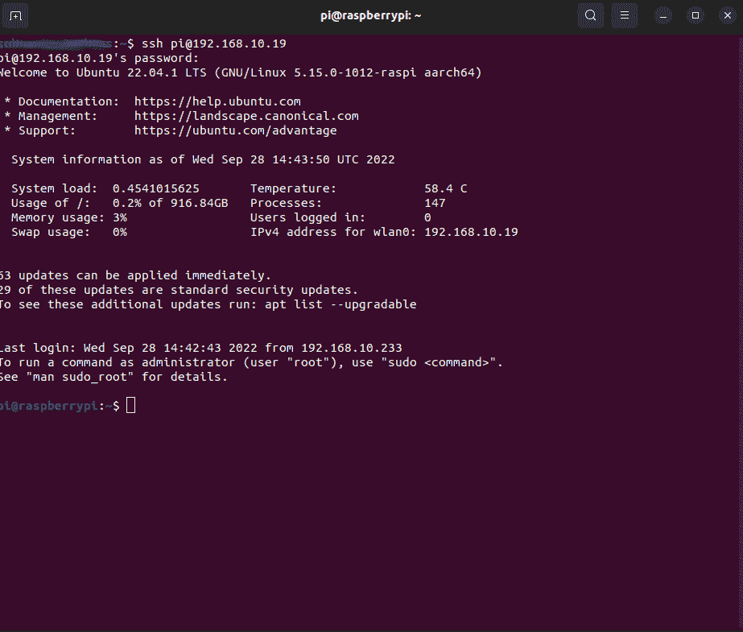
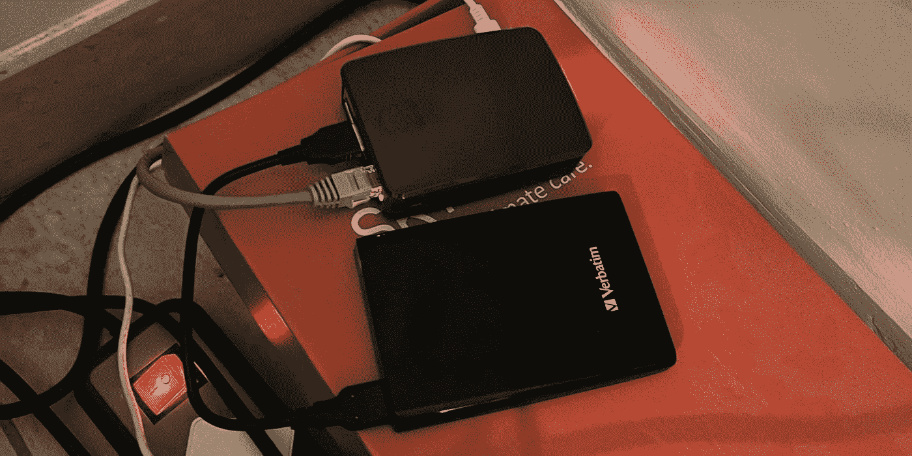

# 如何设置 Raspberry 并在没有显示器的情况下访问它

> 原文：<https://medium.com/coinmonks/how-to-set-up-raspberry-and-access-it-without-a-monitor-81f63b6d6014?source=collection_archive---------24----------------------->

你好。你有没有想过，如果不把它连接到显示器、鼠标和键盘上，你怎么能使用你的新树莓派呢？好吧，在这里我将向你展示如何用一种简单的方法做到这一点。

# 我们需要开始做的是:

*   **配有充电器的树莓派**
*   https://www.raspberrypi.com/products/
*   **SD 卡或任何外置固态硬盘/硬盘**
*   **以太网电缆(除非您的 Pi 周围有 wifi 连接)**
*   **Raspberry PI 成像仪可选***
*   [https://www.raspberrypi.com/software/](https://www.raspberrypi.com/software/)

# 开始吧！

*   首先，让我们把你得到的记忆卡连接到你的电脑上
*   打开 **Pi 成像仪**应用程序，我们从选择操作系统开始



*   **选择操作系统** - >，选择你想要的操作系统。最基础的是 **Ubuntu 桌面**。
*   出于这个视频的目的，我将从**中选择 **Ubuntu Server 22.04 LTS** 选择操作系统** - > **其他通用操作系统** - > **Ubuntu**



*   接下来，我们进入**选择存储**，我们选择将要安装操作系统的内存驱动器



*   最后也是最重要的是进入**设置**，在这里我们设置我们的主机名、登录/密码和 wifi。



*   之后，我们点击**写入**按钮，我们必须等待程序将我们的操作系统模拟到我们的内存驱动器中。



一切完成后，移除带有操作系统的内存驱动器，将充电器和**以太网电缆*可选**连接到您的覆盆子

# 最后…

我们只需要连接到你的小设备上。由于我们试图“无头”连接，我们必须找到我们的 Pi 的 IP 地址。要做到这一点，我们可以安装愤怒的 IP 扫描仪或使用终端键入 **arp -a** 。

在我们知道了我们机器的 IP 地址后，现在我们可以根据你在电脑上使用的操作系统来连接它。在 windows 上连接到 Raspberry 的最佳方式是安装 **Putty** ，我们可以在 Mac 和 Ubuntu 上通过输入 ssh name _ of the machine @ IP _ address 从终端访问 ssh



一旦我们连接上了，我们就可以用这个小巧但功能强大的设备做任何我们想做的事情了。



# #没有 Pi 成像仪的可选步骤！

还有另外一种不用 Pi 成像仪就能编东西的方法。我们通过使用任何其他应用程序并创建一个名为“ **wpa_supplicant.conf** ”的空白文本文件，将选择的操作系统写入内存驱动器。
将以下数据插入该文本文件:

```
country=us  #choose your own country
update_config=1
ctrl_interface=/var/run/wpa_supplicantnetwork={
 scan_ssid=1
 ssid="MyNetworkSSID" # name of your wifi network
 psk="Pa55w0rd1234"   # password of your wifi network
}
```

将“ **wpa_supplicant.conf** ”文件复制到 SD 卡的引导分区。在 Windows 中，这是您能够看到的唯一分区

现在您要做的最后一件事是创建一个名为“**ssh**”**的空白文件，没有任何扩展名**。只要简单地把它放在启动分区就可以了！



Final hardware look:)

> *交易新手？试试* [*加密交易机器人*](/coinmonks/crypto-trading-bot-c2ffce8acb2a) *或* [*复制交易*](/coinmonks/top-10-crypto-copy-trading-platforms-for-beginners-d0c37c7d698c) *上* [*最好的加密交易*](/coinmonks/crypto-exchange-dd2f9d6f3769)

> 加入 Coinmonks [电报频道](https://t.me/coincodecap)和 [Youtube 频道](https://www.youtube.com/c/coinmonks/videos)获取每日[加密新闻](http://coincodecap.com/)

# 另外，阅读

*   [免费加密信号](/coinmonks/free-crypto-signals-48b25e61a8da) | [加密交易机器人](/coinmonks/crypto-trading-bot-c2ffce8acb2a)
*   [杠杆代币](/coinmonks/leveraged-token-3f5257808b22)终极指南
*   [16 款最佳折叠电动自行车](/coinmonks/top-17-folding-electric-bikes-5e296f0918cb)
*   [28 最佳电动自行车评选](/coinmonks/the-28-best-electric-bikes-review-and-buying-guide-in-2023-7bb3146cb403)
*   前三名[币安期货交易机器人](/coinmonks/top-3-binance-futures-trading-bots-e6031f84b3f9)