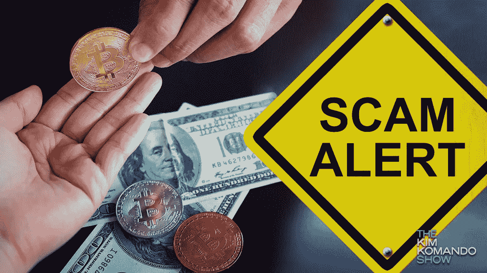
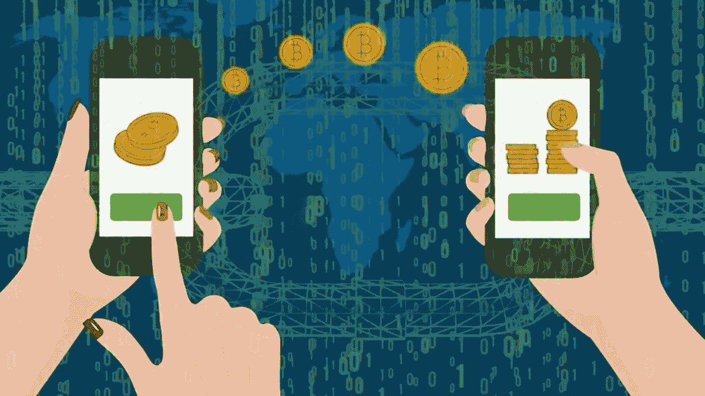
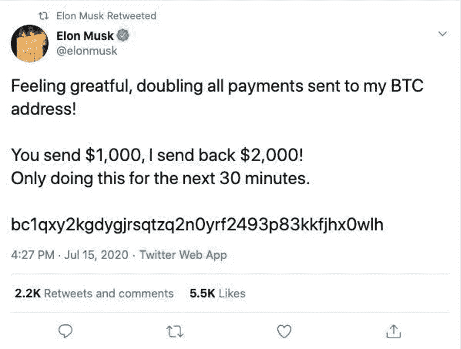

# 如何识别加密货币骗局？投资就要懂加密货币！

> 原文：<https://medium.com/coinmonks/how-to-spot-cryptocurrency-scams-know-cryptocurrency-if-you-are-investing-1c8a9b6d2aef?source=collection_archive---------24----------------------->

Image Source: [Bitcoinist](https://bitcoinist.com/scam-victim-gets-back-bitcoin/)

[加密货币](/coinmonks/simple-way-to-understand-cryptocurrency-by-day-to-day-examples-9f3bb62f7c9c)已经进入主流经济，并为早期行动的投资者提供了潜在的资本收益回报。人们[投资加密货币](/coinmonks/successful-tips-to-research-and-invest-in-cryptocurrency-96ab2e18d057)，却没有足够的知识和轻松致富的希望。

自己投资或通过不知名经纪人投资的人，有时会因为输钱而被骗。随着加密货币延伸到更广泛的家庭领域，加密骗局变得越来越常见。

> 一份新的美国联邦贸易委员会报告称，自 2021 年初以来，加密货币骗子已经从 46，000 人那里窃取了超过 10 亿美元。根据统计，大多数被骗的人年龄在 25 岁到 40 岁之间。

这些骗子破坏了加密市场的形象和印象，并使普通公众对投资加密货币持怀疑态度。

人们怀疑它的可信度，某处知识和简化加密货币的企图得不到中央的鼓励和推动，让人难以理解，陷入骗子的陷阱。

我分享了一些观察和技巧，告诉你如何识别加密骗局，让自己免于被骗。

## #1:个人或应用程序只要求用比特币或替代币支付:

Image Source: [NBC 5 Dallas Fort-Worth](https://www.nbcdfw.com/news/local/plano-veteran-loses-220k-in-crypto-scam/2930440/)

如果任何声称负责提供加密投资回报的专家或投资者要求比特币形式的资金，那么这肯定是一个最大的骗局。

如果任何人要求以比特币或选择性加密币支付，并承诺在特定时期内获得回报和利润，请务必避免回复和联系此类人员。

## #2:人员没有提供跟踪记录和责任:

如果你正在投资加密货币，并通过经纪人寻找有前途的利润，而他缺乏或拒绝分享他以前的历史和跟踪记录，那么要明白他是一个潜在的骗子。

任何投资加密货币或管理任何金融证券集合基金的人都应该提供透明的回报，无论是盈利还是亏损。

## #3:未知或虚假的社交媒体资料 Dm 您声称加密专家:

Image Source: [Moralis Academy](https://academy.moralis.io/blog/how-to-recognize-crypto-and-bitcoin-scams)

> 骗子使用名人或有影响力的人的名字宣布重大奖励，并提示他们点击未知链接，这是一种网络钓鱼欺诈。避免评论和回复此类帖子，因为这会提供对您的社交账户的参考访问。

在 Instagram、Twitter 和 Linkedin 等社交媒体平台上，很多时候会弹出自称密码专家的未知 dm 或帖子，通过他们的推荐引诱你投资。

如果是这种情况，这是一个很大的危险信号，因为专家不会在个人层面上支持任何人。远离未知消息，避免接触自称密码专家的此类简介。

## #4: Crypto 应用程序显示一致且不切实际的利润:

无论市场状况如何，任何在其界面上提供持续未实现利润的应用程序都是潜在的骗局和威胁。

在现实中，加密市场根据新闻影响动态波动，在某些日子，投资组合在其他日子有未实现的损失和利润。

## #5:显示个人投资利润的随机社交媒体帖子:

> “往往骗子是房间里喊得最响的人，以证明自己的清白！”

社交媒体页面显示加密货币中过高和不切实际的暴富、轻松赚钱计划主要是虚假账户。

不要关注或回复任何社交媒体页面，这些页面显示通过投资加密货币获得不切实际的轻松成功和个人利润。在生活中取得成功没有捷径可走。

> 请远离这些有利可图的陷阱！

## 如果你发现自己是这类骗局的受害者，该怎么办？

不幸的是，如果你陷入这样的骗局或欺诈，**首先重置你所有的加密应用程序和银行密码。**

1.  如果最近与骗子进行了任何交易，请尝试联系客户服务部并获取收款实体的详细信息。
2.  如果发生了任何比特币或特定替代比特币的交易，记得记下交易地址或哈希码，前往官方加密币网站，输入复制的地址或哈希码详细信息。此操作帮助您获得通过帐户地址收款的人的地址或身份的详细信息。
3.  打电话向当地网络安全部门报告此类事件。
4.  立即将此类事件通知您的社交媒体圈，从而防止骗子获得进一步的参考。

## 底线是:

随着技术的发展和通过投资获得财富的许多选择，骗子的威胁总是存在，他们抢劫人们。

加密货币是一种在区块链网络上运行的分散技术，当它通过官方硬币网站跟踪分散网络上的交易细节时，它是最安全和透明的。

但对于新手来说，对加密货币的了解和教育是很有必要的，以防骗局。因此，在你自己投资或交易之前，了解最新的消息，获取知识。

> “谢谢你读我的文章。鼓掌，分享并关注我的[个人资料(点击此处)](/@barateprajwal25)了解更多更新和内容。”
> 
> 交易新手？试试[密码交易机器人](/coinmonks/crypto-trading-bot-c2ffce8acb2a)或[复制交易](/coinmonks/top-10-crypto-copy-trading-platforms-for-beginners-d0c37c7d698c)