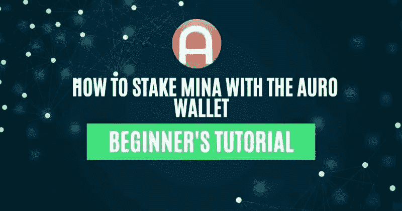
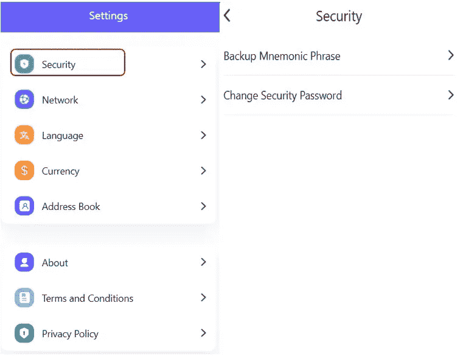
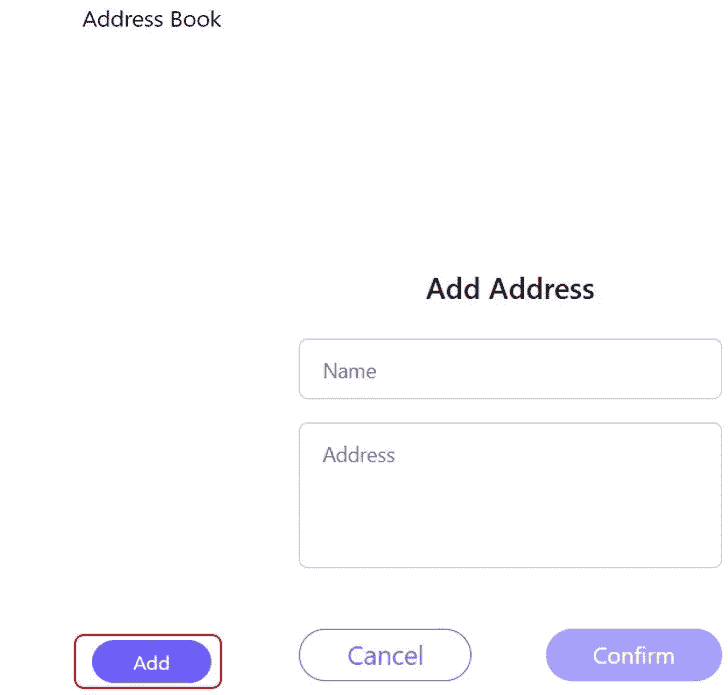
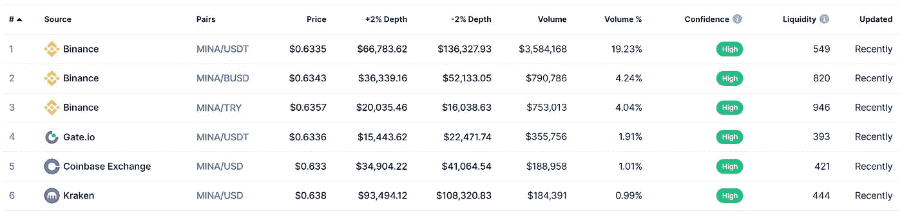
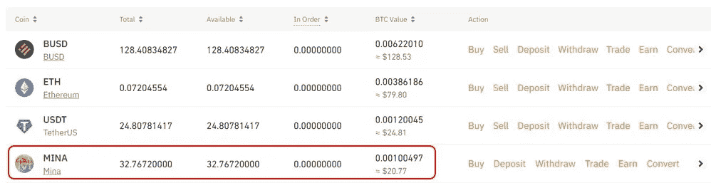
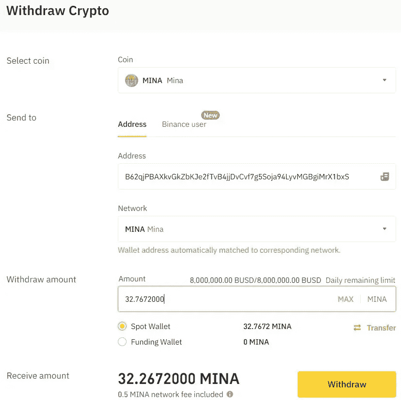
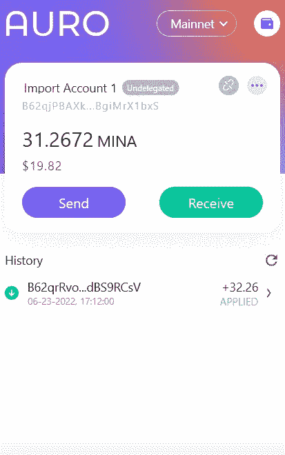
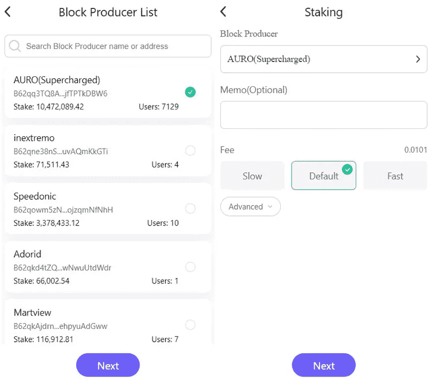
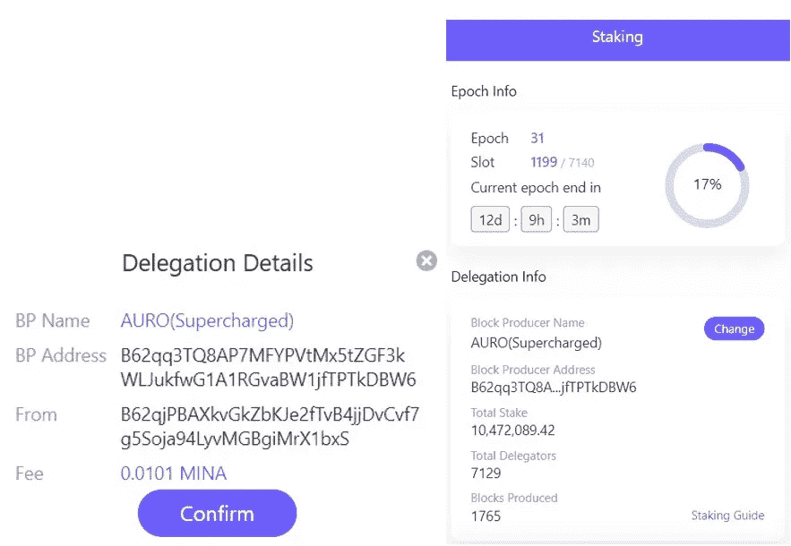
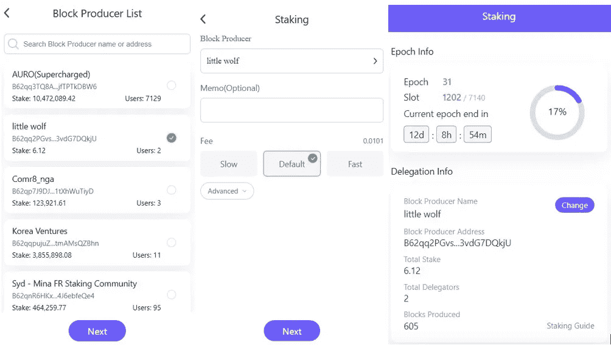

# 如何从奥诺钱包股份米娜

> 原文：<https://medium.com/coinmonks/how-to-stake-mina-from-auro-wallet-fef405c09b6f?source=collection_archive---------13----------------------->

本指南包含如何下注 MINA 代币并赢取奖励的详细步骤。

## 在奥诺钱包指南的[前一部分，我们已经解释了如何安装、设置和使用钱包。在本文中，我们将解释奥诺钱包的其余功能，并展示您如何](https://www.altcoinbuzz.io/bitcoin-and-crypto-guide/how-to-use-the-auro-wallet/)[下注](https://www.altcoinbuzz.io/passive-income/staking/how-to-stake-the-rose-token/)您的米娜代币并赢取奖励。

**设置**

使用**设置**选项卡，用户可以进行以下与设置相关的活动:

1.  **安全**

*   备份助记短语-你可以通过给你的钱包密码来检查并备份你的助记短语
*   更改安全密码-从这里更改您的钱包密码

1.  **网络**

从网络选项卡中，您可以检查主网络和测试网络节点的详细信息。您可以切换到任何节点来使用它。

您还可以在这里找到一个**添加节点**按钮，它允许您通过提供名称和节点地址来添加任何自定义节点。但是，添加节点时要非常小心，因为这需要一些技术知识。

1.  **语言**

钱包应用程序目前只支持两种语言——英语和中文。

1.  **货币**

奥诺钱包支持以下货币-美元，CNY，卢布，欧元和英镑。用户可以选择任意，以所需的货币值查看他们的钱包详细信息。

1.  **通讯录**

用户可以在他们的地址簿中添加常用联系人，以便于访问。使用地址簿，您可以添加其他 Mina 协议用户的姓名和地址。

我们现在将解释哪里可以得到 MINA 令牌，如何将它转移到你的奥诺钱包，以及最后如何将它与网络验证器绑定。

**获得米娜令牌**

用户可以在币安、Gate.io、比特币基地等地找到米娜代币。你可以查看这个[链接](https://coinmarketcap.com/currencies/mina/markets/)来了解支持平台的完整列表。

**把米娜转到奥诺的钱包里**

正如你在下面的截图中看到的，我们的兑换账户中有一些米娜代币。

我们现在将这些代币转入我们的奥诺钱包。要转移，点击出现在 MINA 令牌旁边的**撤回**按钮。现在，填写以下详细信息:

*   收件人地址(复制您的奥诺钱包公共地址并粘贴到此处)
*   网络(在这种情况下，MINA 应该在您填写接收地址后自动出现)
*   要转移的金额

填写完上述详细信息后，点击**撤回**按钮确认流程。等待事务完成。一旦完成，你就可以检查你的钱包中的 MINA 代币的数量。

**重要:**正如我们在[上一篇文章](https://www.altcoinbuzz.io/bitcoin-and-crypto-guide/how-to-use-the-auro-wallet/)中提到的，当用户向钱包地址进行第一次转账时，协议会自动扣除 1 MINA token。查一下，扣除兑换费后我们已转账 32.2672 但钱包账户收到 31.26。

**桩子米娜**

要下注您的代币，请前往您钱包中的**下注**选项卡。

你可以点击**转到 Staking** 来获得你可以将你的 MINA 令牌委托给的块生产者的列表。

我们选择了 AURO(增压)作为我们的验证器。点击它。

钱包应用程序不允许部分委托。这意味着您钱包中的所有 MINA 代币都将被存入以进行授权(见下面的截图)。但这并不意味着您的令牌被锁定。您可以自由地将代币转移到其他地址。

此外，委托给验证器是一次性的活动。即使将来您的帐户中收到一些额外的代币，您也不需要再次重新授权。它会自动将这些额外的令牌用于委派。换句话说，任何米娜代币数量的增加/减少都只会对奖励百分比产生影响。将不会有锁定，也不会重新下注。

审查并确认流程。交易成功后，您可以查看您的下注详情。

用户将仅在由验证器/节点定义的设定周期(时期)之后接收奖励。

**更改验证器**

如果用户愿意，他们可以在将来更改他们的验证器。要更改，只需点击出现在上面截图中的**更改**按钮，并遵循相同的步骤。

请参见下面的截图来更改您现有的验证器。

**结论**

奥诺是一个简单的钱包，支持用户与网络交互和工作所需的所有基本功能。change validator 特性非常好，用户可以更改他们的验证器，甚至不需要分解他们的令牌。我们已经注意到一个主要的缺点，交易需要时间来完成。

***注:*** *本帖首发* [*此处*](https://www.altcoinbuzz.io/passive-income/staking/how-to-stake-mina-from-auro-wallet/) *同*[*ltcoinbuzz . io*](https://www.altcoinbuzz.io/)**。**

***跟着我***

***👉**推特*

***👉**[**Linkedin**](https://www.linkedin.com/in/ruma-das-a1439320/)*

> ***交易新手？尝试[加密交易机器人](/coinmonks/crypto-trading-bot-c2ffce8acb2a)或[复制交易](/coinmonks/top-10-crypto-copy-trading-platforms-for-beginners-d0c37c7d698c)***