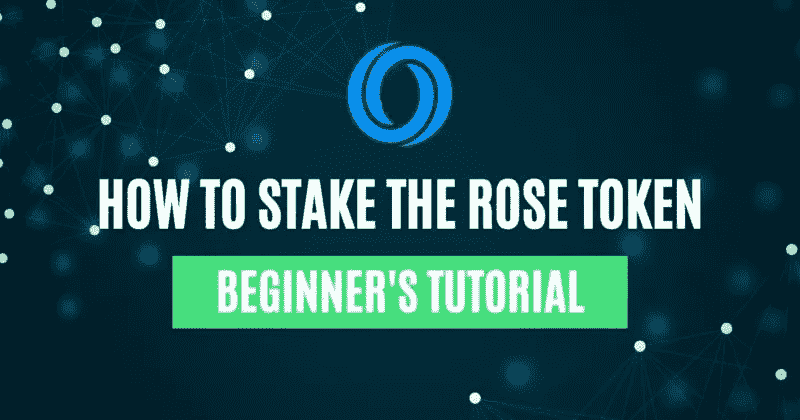
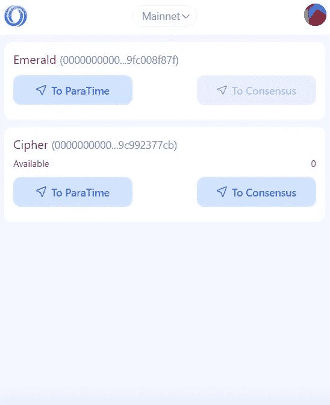
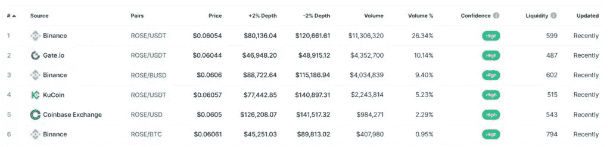
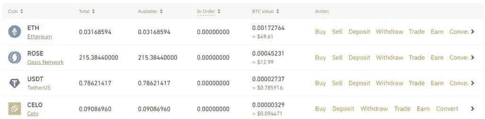
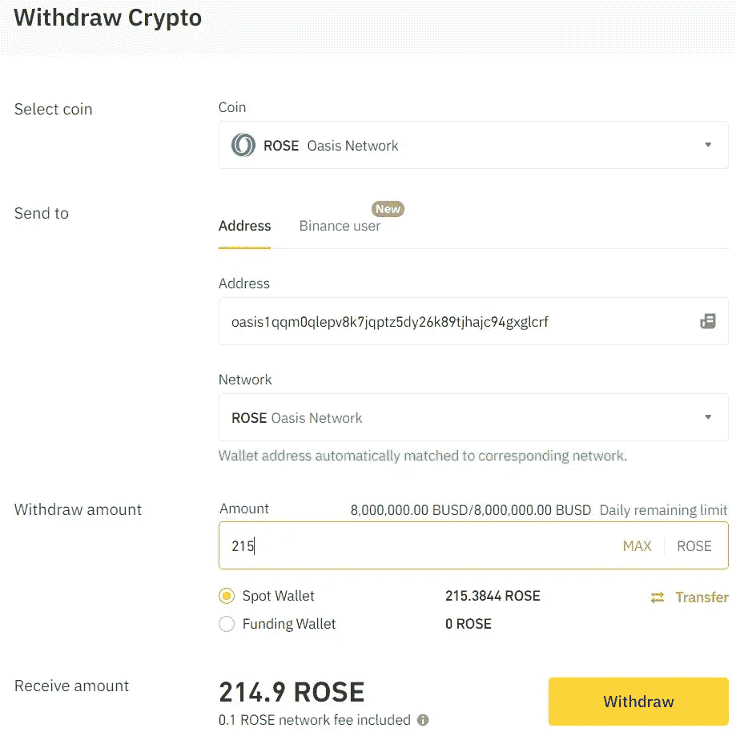
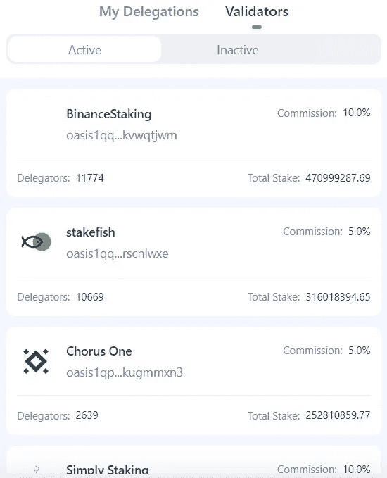
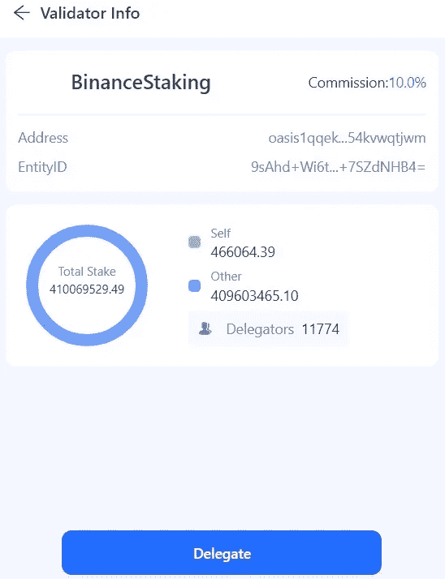
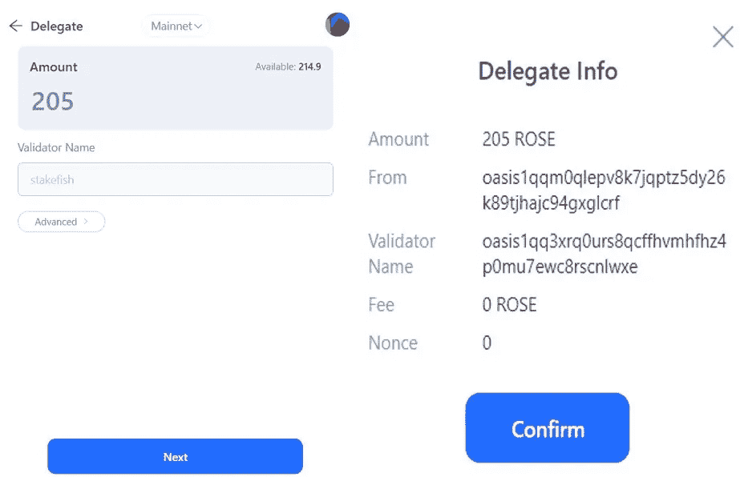
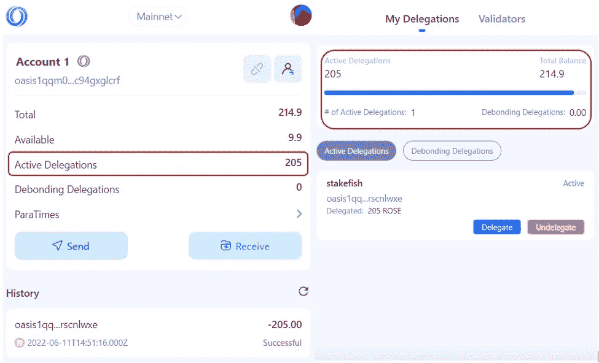

# 如何用木桩支撑玫瑰信物

> 原文：<https://medium.com/coinmonks/how-to-stake-the-rose-token-936d38f7e526?source=collection_archive---------12----------------------->

本指南包含如何下注玫瑰色代币的详细步骤。

在本系列文章的[前一部分](https://www.altcoinbuzz.io/bitcoin-and-crypto-guide/how-to-use-the-oasis-wallet/)中，我们解释了什么是 [Oasis network](https://www.altcoinbuzz.io/defi/oasis-networks-rose-surges-following-the-launch-of-yuzuswap/) 以及如何设置和使用他们的本地 Oasis web 浏览器扩展钱包。

在本文中，我们将解释什么是业余时间，在哪里可以获得玫瑰令牌，以及如何下注来赢取奖励。

**并行时间**

为了实现高性能和可扩展性，Oasis 网络在两个不同的层中进行一致性和计算，即一致性层和并行层。

这些并行时间是分散的，并行运行。他们是完全独立的，彼此隔离。这种设计的优点是，一个并行时间上的复杂处理对不同并行时间上的事务处理没有影响。任何人都可以根据自己的应用需求建立自己的并行时间，每个并行时间都具有网络的基本特征，即保密计算、开放或封闭委员会等。

目前，只有 Oasis browser 扩展钱包支持与 ParaTime 取款和存款相关的 GUI。通过分类帐设备对 ParaTime 的支持尚未实现。

当您进入钱包中的 **ParaTime** 选项卡时，您会注意到两个 para time(Emerald 和 Cipher)具有不同的 ParaTime IDs。

注意，要使用上述两个 ParaTime 中的任何一个，您必须将 ROSE 令牌转移到所需的 para time 层。因为你钱包中的玫瑰平衡存在于副时间层之外的一致层中。

*   **Emerald —** 与 EVM 兼容的 ParaTime 旨在解决高费用和低吞吐量问题。与以太坊相比，它可以帮助将交易吞吐量提高到每秒 1000 笔，并将费用降低 99%以上。
*   **Cipher-** 机密智能合约 ParaTime。它是确保隐私的 Oasis 网络的主要构件。

**玫瑰令牌**

ROSE 令牌是 Oasis 网络的本地令牌。它在网络生态系统中具有多种效用，包括在共识层的赌注/委托、支付网络费用等。用户可以从以下任何平台获取令牌。你可以查看这个[链接](https://coinmarketcap.com/currencies/oasis-network/markets/)来获得可以购买玫瑰令牌的平台的完整列表。

从兑换处提取玫瑰代币

正如你在下面的截图中看到的，我们的兑换账户中有一些玫瑰代币。我们将把令牌从交换帐户转移到 Oasis 网络的共识层。

**注:**如果您的 Oasis 钱包中有玫瑰令牌，您可以跳过这一步。

要撤回，只需点击玫瑰令牌上的**撤回**按钮。现在，填写收件人地址和您希望转移的代币数量。

确认该过程，您可以在您的 Oasis 钱包中看到所需的 ROSE token 余额。

**如何入股罗斯**

持有 ROSE 的用户可以将他们的令牌委托给网络验证者并获得奖励。用户奖励取决于下注的代币数量及其持续时间。

要下注您的 ROSE token，请前往 Oasis 钱包中的**下注**选项卡。

从**验证器**部分，您可以检查您可以委托令牌的网络验证器列表。

在委派令牌之前，用户应该检查有关验证器的以下详细信息:

*   委托人总数
*   下注的代币总数
*   佣金率
*   节点的当前状态
*   节点的正常运行时间百分比

您可以点击一个特定的验证器来了解更多关于它的细节。

一旦你完成了验证程序，点击**委托**按钮。

现在，输入您希望存入的玫瑰代币金额。用户可以将令牌委托给多个验证器。这意味着你可以部分授权。

审查并确认流程。

流程完成后，您可以从钱包的登录页面以及**我的委托**选项卡中查看您的**活动委托**。

**取消授权**

用户可以随时取消他们的赌注玫瑰令牌。要取消堆叠，点击**取消授权**按钮。将出现一个窗口，您可以在其中输入您希望取消授权的 ROSE tokens 的数量。

请注意，当您取消下注时，佣金将从您的下注余额中扣除。您可以看到取消下注后您将获得的最终代币金额。

确认流程。您现在可以从**去堆叠委托**部分检查去堆叠状态。

注意有一个 336 小时的脱粘期。所以，你的资金会在这段时间后发放。

***注:*** *本帖首发* [*此处*](https://www.altcoinbuzz.io/passive-income/staking/how-to-stake-the-rose-token/) *同 Altcoinbuzz.io.*

跟我来吧

**👉** [推特](https://twitter.com/rumadas123)

**👉** [Linkedin](https://www.linkedin.com/in/ruma-das-a1439320/)

> 交易新手？尝试[加密交易机器人](/coinmonks/crypto-trading-bot-c2ffce8acb2a)或[复制交易](/coinmonks/top-10-crypto-copy-trading-platforms-for-beginners-d0c37c7d698c)