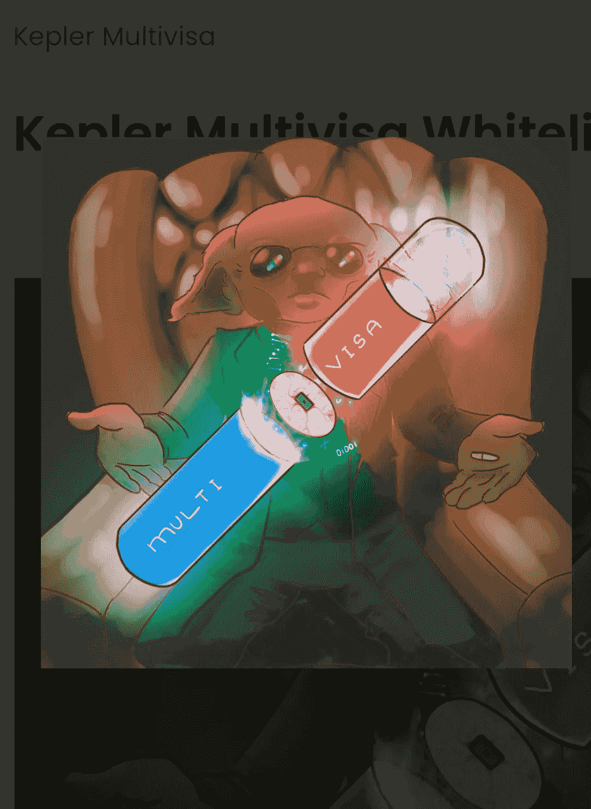

# 如何从零开始创建和发展一个在线社区🌱

> 原文：<https://medium.com/coinmonks/how-to-start-grow-an-online-community-from-scratch-5a542147f98a?source=collection_archive---------13----------------------->

创建一个社区没有“千篇一律”或“放之四海而皆准”的方法……这意味着对一个人/项目有效的不一定对另一个人/项目有效，反之亦然。

在这篇简短的博文中，我将帮助你获得第一批追随者，并给你一个发展追随者的计划，以建立一个社区和受众。

> 社区=沟通+一致性

记住这个等式，就要准备好几个月甚至几年的时间…如果你不能花足够的时间来发展关系，日复一日，周复一周，月复一月地出现…那么也许发展一个社区不是你的事情，这没关系！但是这篇文章是写给那些愿意做出承诺并想学习成为一个更好的社区领袖的人的。

建立一个在线社区不是一件容易的事情。作为一个社区领导者和营销人员，我知道最深/最好的关系是按照这个顺序形成的:**顶部是 IRL(物理)，然后是口头(语音到语音)，最后是文本(文本到文本)**

这意味着建立社区的最佳方式是举办 IRL 活动。这是建立长久关系的唯一真正的方法。如果你有能力按照一致的时间表举办 IRL 聚会/活动，这将是你建立最深刻和最真实的联系的方式。

如果你没有 IRL meetups 的能力，下一个最好的事情是举办一些用户可以听到彼此的声音，以及你(领导者)的声音，最好能够通过聊天或视频电话相互交流，这就更好了。简单的语音信息仍然比文本信息更好，因为在我们的声音中，情感可以更自由地表达。

如果你对你的项目没有一个“为什么”，请看这篇文章:
[https://medium . com/coin monks/top-5-NFT-best-practices-marketing-and-community-growth-7025 e 26 EB 50 c](/coinmonks/top-5-nft-best-practices-marketing-and-community-growth-7025e26eb50c)

# 也就是说，现在让我们从 0 开始

我们正在网上启动一个 NFT 项目，这将是一个数字优先的项目…这意味着我们的社区将全部在线。

大多数 NFT 项目(主要)因为托管他们的在线社区而回到不和谐状态。虽然我个人不喜欢不和，但我确实意识到主持和完成工作很容易，但从长远来看并不理想。我们也可以选择利用 Twitter、抖音、LinkedIn、Medium 或任何正在开发的新的 Web3 社交平台。

我个人建议在 [Discord](https://discord.gg/mchzhDCwhF) 上主持(除非你有更好的选择)，通过[网站](https://www.multilayeredmarketing.xyz)收集电子邮件，并进行电子邮件宣传，以及在 [Twitter](https://twitter.com/metadadsxyz) 上发布 3-5 次/天，在[抖音](https://www.tiktok.com/@thedudescrypto)上发布 1-3 次/天，在[李](https://www.linkedin.com/in/stevensonty/)上发布 1 次/天，以及一个月左右发布 3 篇关于最佳社会实践的博客。试着在你的一些/大部分帖子中标记相关和有价值的账户。

正确安全地建立你的家庭基地。在你的社区成长的开始阶段，你可能会在你的不和谐中看到很少的活动，但是随着你为造币日做宣传，参与度会显著提高。

> 获得你的第一个 1000 个追随者是困难的，第一个 100 个更困难

现在所有的社交网站都已经上线，可以运营了，你也有了内容策略，是时候真正开始工作了！

专注于一个你真正想吸引你的追随者的社交平台，把你 50-80%的精力放在这个平台上。

也许第一个月可以尝试，看看什么样的内容制作简单，但对你的潜在受众有价值。在所有平台上测试测试测试，看看哪个平台最受关注，并在那个平台上磨练未来，因为你的内容在那里最有共鸣。

连续几个月保持一致…在所有社交网站上发帖，回复所有评论/反馈/消息。

> 真正的价值在于与其他客户/成员的互动
> 
> **评论他人的帖子，关注他们，回复他们在你的社区中引起共鸣的帖子，在 Twitter 空间和不和谐中与他们聊天…**

强烈建议每周开设一个 Twitter 空间，或者如果你愿意，可以更频繁地开设……这样人们会听到你的声音，给你和你的社区带来更多联系。Twitter 空间的一个替代品是新的 LinkedIn Audio、抖音、IG reels 和 YT shorts。

在分享内容时，不要低估想象力和迷因的力量！试着在每篇文章中提供价值，不管是有趣的，有教育意义的，还是令人震惊的…即使你不喜欢，你也不需要创建原创内容…你可以成为一名内容 DJ，甚至在你的频道上分享来自其他创作者帐户的最佳内容。

就是这样！这就是你如何从零开始建立和发展一个在线社区！

> 关键是一致性…日复一日地坚持下去，你最终会赢的。一路上试着交一些朋友

_ _ _ _ _ _ _ _ _ _ _ _ _ _ _ _ _ _ _ _ _ _ _ _ _ _ _ _ _ _
_ _ _ _ _ _ _ _ _ _ _ _ _ _ _ _ _ _ _ _ _ _ _ _ _ _ _ _ _ _ _

务必小心！！！⚠️

*我怎么强调都不为过！保持高度警惕，留意你点击的每一个链接、你做的每一笔交易和你接触的每一个人，因为这个领域骗子很多，即使是最好看的项目也会被撤下。*

*在点击所有链接之前，反复检查，确保它们是你要找的官方链接。此外，在给自己或他人发送任何有价值的东西之前，要再三检查所有的钱包地址。*

关注我的新营销代理公司**多层次营销**，获取更多未来几年的营销技巧/建议！

> [*推特*](https://www.twitter.com/metadadsxyz)[*不和*](https://discord.gg/mchzhDCwhF)[*YouTube*](https://www.youtube.com/channel/UC7pbtSBs9nRJHK6coMhCR8g)*[*抖音*](https://www.tiktok.com/@thedudescrypto)[*insta gram*](https://www.instagram.com/metadadsxyz)[*Spotify 播客*](https://open.spotify.com/episode/5U8vXE9HDAsGbSbebw9p62?si=2rZIigw-Tw2pCxjxmkbYzQ)*
> 
> **请通过发送 Polygon Matic 到这个 Eth 地址或 Eth Tokens 来支持我和我的家庭🙏🏼**
> 
> *****0xb 53b 3978333 e 11 c 382 ab 619 f 02 f 469 A8 c 70750 af*****
> 
> *****或*****
> 
> ***从我们的 OpenSea 购买 NFT(报价)更多信息请访问 11 月* [*https://opensea.io/collection/dudelvillegenesis*](https://opensea.io/collection/dudelvillegenesis)**

**_________________________________________________________________**

****

# **干杯，
Ty**

****我的一些其他博文:**
[5 个没落的 Web3](/coinmonks/5-downfalls-of-web3-cd5dc8ade4fd)
[5 + 5 个不和谐的战术](/coinmonks/5-tips-for-a-better-discord-nft-crypto-edition-ff9b039d0359)
[Crypto 101:一个初学者指南](/coinmonks/crypto-101-a-beginners-guide-345d440bd163)
[NFT 最佳实践(营销&社区成长)](/coinmonks/top-5-nft-best-practices-marketing-and-community-growth-7025e26eb50c)
[Web3 基础知识](/coinmonks/web3-basics-252121357f33)
[替代效用案例对于 NFT 的](/coinmonks/alternative-nft-crypto-real-life-use-cases-b7c0b08d99ef)
[什么是营销&为什么](/coinmonks/what-is-marketing-why-everyone-should-be-a-marketer-6173b8dffd61)**

> **交易新手？尝试[加密交易机器人](/coinmonks/crypto-trading-bot-c2ffce8acb2a)或[复制交易](/coinmonks/top-10-crypto-copy-trading-platforms-for-beginners-d0c37c7d698c)**