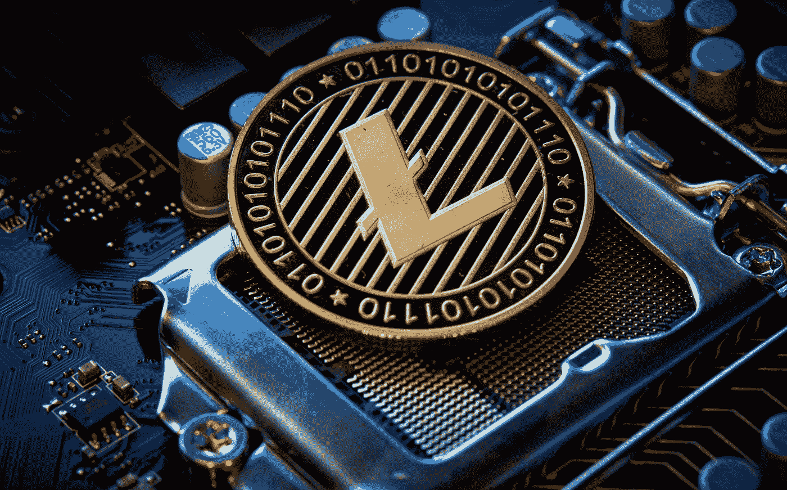

# 如何开始用比特币和其他硬币制作加密货币

> 原文：<https://medium.com/coinmonks/how-to-start-making-cryptocurrency-with-bitcoin-and-other-coins-5980f7e2c81b?source=collection_archive---------19----------------------->

## 加密货币是一种新的货币类型，它是通过一种叫做挖掘的过程创造出来的。

Photo by [Michael Förtsch](https://unsplash.com/@michael_f?utm_source=medium&utm_medium=referral) on [Unsplash](https://unsplash.com?utm_source=medium&utm_medium=referral)

比特币是第一种也是最知名的加密货币，是最受欢迎和最知名的。还有许多其他加密货币，但比特币是最有名和最知名的。如果你想…