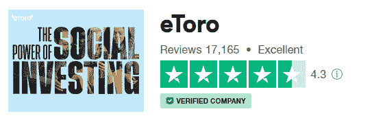

# 如何在马来西亚用 Etoro 开始交易(初学者指南)

> 原文：<https://medium.com/coinmonks/how-to-start-trading-with-etoro-in-malaysia-beginners-guide-3b961a886c0a?source=collection_archive---------2----------------------->

eToro 是马来西亚人可以访问的一个受欢迎的社交交易平台。据 Statista.com 称，截至 2022 年第一季度末，eToro 的注册用户总数达到了 2850 万。

要在马来西亚的 eToro 上开始交易，您需要通过手机应用程序访问该平台。GooglePlay 为 iOS 和 Android 用户提供下载服务。

除了在 eToro 上购买 ETF、股票和加密资产，投资者还可以探索社交交易的机会。eToro 上还有更多信息——投资者可以从探索指数、商品和股票的差价合约的杠杆交易中受益。

> 从顶级交易者那里复制交易机器人。免费试用。

## Etoro Malaysia 亮点/概述(简短)

对于马来西亚的投资者来说，eToro 对愿意探索的交易者来说是一项有吸引力的服务

通过手机应用的机会。更准确地说，它适合社交或复制交易者。

eToro 服务附带一些费用，投资者应该阅读政策中的详细规定。更具体地说，您的位置以及您从 eToro investments 提取资金时使用的货币。

规程

eToro 受六个司法管辖区的监管:塞浦路斯、英国、美国、澳大利亚、南非和直布罗陀

## 平台:

可在 iOS 和 Android 上访问

最低存款额:50 美元

**最大杠杆**

*   主要货币 x400
*   黄金和商品及指数 x100
*   非主要货币对 x50
*   非主要指数、CFD 股票和 ETFs x10

## 提供的仪器

*   外汇对
*   计算流体动力学，指数
*   交易所交易基金
*   加密货币

## 交易费用:

*   账户闲置费用
*   每次取款 5 美元

## 适用于:

*   社会拷贝交易
*   新手交易者
*   根据 KYC 的偏好指导投资者
*   Etoro 在马来西亚合法吗？

是的，如果你在马来西亚，通过 eToro 平台投资是完全合法的。然而，投资者应该知道，eToro 作为一个平台，没有 SC 或马来西亚证券委员会的许可。

关于以上所述，在马来西亚土地上抓住 eToro 机会的投资者可能无法从政府那里获得他们应得的全面保护。

这意味着马来西亚政府没有对 eToro 平台上的投资者制定任何限制性法律。在幕后，eToro 在以色列正式注册为一个专门从事多资产管理和社交交易的平台。

# 4.eToro 有多安全？Etoro 是值得信赖的经纪人吗？

根据 Trustpilot 的独立评论，eToro 是一家安全、值得信赖的经纪商，平均总分 4.3 分(满分 5 分)。

在法规方面，eToro 努力满足各种法律要求，以符合地区要求。

## 例如，eToro 通过以下子公司进行交易:

值得信赖的经纪人通过寻求跨地区的相关注册和许可来证明自己清白。尽管 eToro 没有在马来西亚当局正式注册，但从上述四个区域注册中可以感受到合规精神。

令人愉快的是，交易是一件复杂的事情，并不是每个交易者都有能力和技巧从经纪人那里获利。因此，投资者仔细阅读政策指引非常重要。

例如，根据 [Nerdwallet](https://www.nerdwallet.com/reviews/investing/brokers/etoro) 的评论，马来西亚的投资者可能没有资格获得任何高于 50 美元账户存款的 8%红利。

eToro 实施了三个关键的安全层来确保投资者资金的安全。

# 独立账户

eToro 致力于部署高安全标准来保护所有投资者的资金。

因此，为了达到这些标准，每个投资者的存款都存放在两个独立的账户中。

通过分离账户，eToro 客户资金与公司资金是分开的。这是一个比交易平台和交易者资金账户合二为一更好的安排。

# 监管义务/投资者保护

eToro 遵守[地区和国家关于保护投资者资金的法律标准](https://www.etoro.com/investing/insurance/)。例如，对于 FCA 或 CySEC 下的地区/国家内的投资者，有明确的退款计划。

具体来说，FSCS 和 ICF 有权在 eToro 破产的情况下向发明者退款。

从另一种方法来看，FSCS (FCA)保证最高 85，000 英镑的退款范围。同样，ICS (CySEC)保证对发明者的退款不超过 20，000 欧元。

# 私人保险

eToro 在公司一级与私人保险公司有保护投资者资金的安排。在这种情况下，eToro 向伦敦的劳埃德保险社投保。这是为了在资不抵债的情况下向投资者提供退款。

然而，保险范围为每个客户提供了最高 100 万英镑/欧元/澳元的退款。

# 如何在马来西亚开设 Etoro 账户？

马来西亚居民很容易在 eToro 社交交易平台[开设账户](https://www.etoro.com/customer-service/how-to-open-etoro-account/#:~:text=On%20the%20www.eToro.com,open%20a%20new%20trading%20account.)。

首先，你必须有一个有效的电子邮件地址和电话号码。

其次，开户需要用户通过 KYC 或了解你的客户程序。

第一步是最容易的；您必须提供一个有效的电子邮件地址和一个强密码，这样就完成了。

# eToro 平台开户

1.  转到 eToro 平台
2.  键入您的用户名、电子邮件地址和密码
3.  勾选两个框，分别确认遵守 eToro 条款和条件以及隐私政策
4.  登录到您在上述步骤 2 中提供的电子邮件地址。找到标题为— **eToro 电子邮件验证的电子邮件。**

单击绿色选项卡，或者复制并粘贴其下方提供的链接，以完成您的电子邮件验证。

# eToro 平台上的账户验证

然而，第二部分需要更长的时间，因为 eToro 需要您提供关键的详细信息来验证您的帐户。你所需要的只是有效的文件:护照、身份证或驾驶执照。

亲注:具体来说，马来西亚人使用 [MyKad](https://en.wikipedia.org/wiki/Malaysian_identity_card) 在 eToro 上进行账户验证。此外，eToro 有一个更长或更耗时的 KYC 过程。然而，这是为了帮助平台根据投资者的能力(经验和获得资本的能力)来描述他们。

## eToro 账户验证步骤:

1.  电子邮件地址验证后，登录您的 eToro 帐户仪表板。你会看到一个标有“验证”的按钮。点击它，在 eToro 平台上开始您的帐户验证过程。
2.  您将被邀请进入一个页面，要求您为您的帐户资料提供个人详细信息。第一步需要你的名字，出生日期和性别。
3.  第二步需要地址:国家，邮政地址和邮政编码。护照号码是可选的。
4.  eToro 将要求你的交易经验。另外，你过去是否投资过杠杆融资产品。eToro 执行复杂的用户 KYC 和验证过程，因此根据您的情况提供回复。

**注:** eToro 将给出账户验证流程的完成百分比分数。当您进入下一步时，百分比会递增显示。

一旦你达到 100%，你的档案将通过验证阶段。清除所有步骤后，您将收到通知

有了账户——即使还没有经过完全验证，eToro 也允许您访问虚拟或模拟账户。它由高达 10 万美元的虚拟资本资助，帮助您在零风险环境中学习和测试策略。

有了 eToro 上的验证账户，投资者可以立即向账户注入资金并开始交易。

# 如何将资金存入马来西亚 Etoro？

首先，eToro 社交交易平台以美元为基础货币。所以马来西亚人可以使用[马来西亚林吉特](https://en.wikipedia.org/wiki/Malaysian_ringgit)，eToro 平台会直接兑换成美元。除了美元，还有 8 种其他货币可以用来存款。

## 将资金存入 eToro 账户的过程非常简单。以下是要遵循的步骤:

1.  首先登录您的 eToro 交易门户帐户
2.  接下来，点击标有“存款”的按钮
3.  输入您的目标存款金额，以及您喜欢的货币。
4.  接下来，选择您喜欢的存款方式，例如，银行转账或使用借记卡。
5.  检查细节，以确保您输入的所有内容都符合交易要求。

平均而言，就不同的存款方法而言，转账需要不同的时间来结算:

*   电汇至少需要 2 天，最多 3 天
*   通过信用卡或借记卡和在线钱包存入的资金会立即或在几小时内反映出来

交易完成后，eToro 将向您发送一封电子邮件，确认收到您帐户中的存款。

# 面向马来西亚人的 eToro 账户资金

向 eToro 账户提供资金很容易——他们可以使用任何借记卡或信用卡。此外，马来西亚人可以使用电子银行转账。此外，马来西亚人可以通过 Skrill 或 PayPal 等可接受的电子钱包为 eToro 账户提供资金。

亲注:投资者将存款存入 eToro 交易账户可以利用信用卡，而不是银行转账。有了他们，他们可以获得更好的转换率，由于较低的利差。

Wise Card 是向马来西亚 eToro 账户汇款的最简单方式之一。 [Wise 卡](https://wise.com/my/card/)允许无缝转账，用户从自动转换功能中受益。简单来说，Wise Card 将其中的所有货币按平均市场汇率兑换成美元。

# eToro 最低存款额

最低存款金额因交易者的居住地或支付点而异。具体而言，以下最低要求适用于向 eToro 存款的马来西亚人:

*   通过信用卡向 eToro 存款不得少于 50 美元
*   通过银行转账存入 eToro 的金额不得少于 50 美元

# 7.在马来西亚如何从 Etoro 提取资金？

eToro 允许投资者随时提取资金。但是，所有的提款都必须低于账户中的可用金额，再加上 5 美元的取款费。

# eToro 提款流程或步骤:

1.  在您的 eToro 帐户仪表板上，点击标有“取款”的按钮
2.  将会出现一个子窗口，显示账户中的总金额以及可以提取的金额。
3.  键入您要收回的数字
4.  请在电子取款表格中填写您的详细信息。
5.  最后，点击“提交”按钮。

一旦提款请求明确，投资者就会通过电子邮件收到确认。它还显示了实现撤回的首选方法。在清关之前，交易者可以通过 [eToro 仪表板](https://www.etoro.com/portfolio/history/cashflows)检查请求的状态。

最好，如果你在马来西亚，你可以通过 [Wise USD 银行账户详情](https://wise.com/help/articles/2898124/how-do-i-receive-money?origin=topic-1pXx5wZnF7Rp83VWwzGPUv)提取美元。这个过程提供了零转换成本，所以你可以多赚一点。

一个明智的帐户在马来西亚帮助你超越对 eToro 的投资。您可以按照平均市场汇率自由发送、持有或接收 MYR、美元或 50 多种货币。它为您节省了高达 3 倍的银行手续费。另外，没有最低余额。

# Etoro 对马来西亚贸易商的利弊

eToro 不仅提供免佣金的股票交易，还提供快速简单的开户流程。最突出的特点之一是社交交易，它帮助新手交易者从其他专家交易者的策略中获益。

eToro 的缺点首先是对非交易或不活动以及提款收取高额费用。此外，取款需要相对较长的时间。另外，您只能单独持有美元基金。eToro 最大的缺点是客户支持反应非常慢。

## 赞成的意见

*   轻松开户流程
*   股票和交易所交易基金的自由交易
*   受社交交易的欢迎
*   聊天或票证的备用客户支持团队
*   客户资金保护政策

## 骗局

非交易费用高

仅限于一种账户基础货币，即美元

# 马来西亚贸易商的 eToro 账户类型

马来西亚商人在 eToro 上有几种类型的账户，可以满足他们各种特殊的需求。第一，有适合普通投资者的散户账户。其次是适合公司投资者的专业账户。

对于每一个类别，在注册后，交易者将被要求进行 KYC 或了解你的客户程序，以便对账户进行全面核实。eToro 还为交易者提供一个演示或虚拟账户来测试投资策略。

# Etoro 在马来西亚提供伊斯兰账户吗？

是的。eToro 在马来西亚提供伊斯兰账户，但需符合伊斯兰教法的要求。

因此，伊斯兰账户不要求所有定居点在 24 小时内结清利息。超过 24 小时的交易展期零利息和零佣金。

# 我会在 eToro 上找到哪些金融工具？

eToro 平台提供投资和交易机会。具体来说，投资者的目标是长期积累财富。

另一方面，交易包括抓住价格波动的机会，在短期内获利。

eToro 帐户允许您获得以下机会:

## 外汇

外汇交易包括买卖货币对。在 eToro 上，投资者可以探索杠杆高达 X30 的所有主要货币对。

在 X30 的杠杆作用下，它指的是每 1 美元的资金，投资者可以控制高达 30 美元的头寸。

外汇交易的机会是全天候的，也就是说从周一到周五的 24 小时，从悉尼到亚洲、欧洲，最后到纽约。

## 股票

对于股票，你拥有一家公司的股份，并从公司的利润中获得股息。或者，如果你以低价买入股票，你可以在价格上涨时卖出，赚取差价。

股票交易员会查看影响股价的季度收益和基本面消息。

除了通过持有股票获得股息，股东还可以以更高的价格出售股票，获得资本收益。

## 商品

在金融市场上，商品交易就像实物商品一样，尽管缺乏实物接触。随着价格的涨跌，投机正确的交易者有很好的机会。

你通常会发现四个类别:能源、金属、农产品和牲畜。

大宗商品是扩大投资者敞口的一种独特方式，无需实际拥有大宗商品。

## 交易所交易基金

ETF 是“交易所交易基金”，仅仅是在交易所交易的基金。ETF 跟踪特定的指数。实际上，ETF 将几种资产捆绑在一起，你可以买入或卖出。

ETF 通过帮助投资者分散风险来降低市场的潜在风险。

最常见的 ETF 包括标准普尔 500、景顺 QQQ 和 SPDR 道琼斯工业平均指数。

ETF 的专业交易员指导分析师在监控业绩的同时跟踪关键变量的表现。这些因素包括交易量、较低的费用率、业绩、持股和佣金。

## CFDs

差价合约，简称差价合约，是投资者与经纪人或金融机构之间的约束性合约。

在差价合约中，交易员或投资者对资产的未来价值进行投机，任何一方都必须在到期时结算差价。因此，差价合约是现金结算的金融工具。

CFD 交易者被要求以高度关注波动性和风险偏好的方式进入市场。上述内容应该基于一个经过检验、测试并取得成功的策略。只有当投资回报率为正时，CDF 交易者才能通过净正差额增加他们的账户。

## Cryptos

加密越来越受欢迎，提供了更广泛的投资和赚钱方式。

加密货币风险很高，但如果你有经验，就会有很大的机会。当然，风险越高，回报同样或非常高的可能性就越大。

加密货币是一种高风险的投资——它们的监管框架在全球范围内仍然非常低。然而，对于聪明的投资者来说，这是一个在正确的时间介入并获得一些利润的机会。

## **我会找到哪些交易平台？**

投资者和交易者将进入移动和网络平台。eToro 是一个经纪平台，为加密货币交易者和股票投资者提供广泛的机会。

eToro 交易平台可通过以下方式访问:

## 移动应用程序:

1.  可通过手机或平板电脑访问的 Android 应用程序
2.  可通过 iPhones 或 iPads 访问的 iOS 应用程序

## Web 访问，您可以通过 web 浏览器进行访问。

对于网络交易者来说，安装双因素认证或 2FA 是明智的。这只是增加了一层访问安全性。

很简单——交易者可以从仪表盘上激活它，并通过注册的手机接收一个 5 位数的代码。或者，它也可以作为语音呼叫的一种形式来访问。

## eToro 钱包或 eToro 货币登录

eToro 钱包访问可通过安装在手机上的移动应用程序进行。用户可以相应选择 iOS 或 Android。

访问钱包的投资者登录凭证是您 eToro 帐户上的凭证。使用您的用户名或电子邮件以及相应的密码。或者，如果用户拥有苹果、脸书或谷歌账户登录凭证，他们可以使用登录功能

eToro 的一个独特之处是利用了人群的力量——它在社交交易中很受欢迎。社交或复制交易对新手交易者非常有帮助，因为他们学习了深入的策略来投资获利。

# 13.Etoro 在马来西亚的费用和佣金

eToro 专门向账户持有人收取以下类别的费用:

首先是取款的间接交易费(5 美元)，货币兑换，以及不活动费。

其次是差价、佣金和掉期的直接交易成本。

# 14.面向马来西亚贸易商的 Etoro 客户支持

eToro 有一个客户支持部门，可以通过客户端仪表板联系到。一般查询可以在这里通过[自助阅读解决。](https://www.etoro.com/customer-service/help/)

此外，您还可以与实时支持团队聊天。另一种方法是开一张请求帮助的票据，支持团队可能会联系您。如果您有紧急请求，请使用实时聊天选项。

# 关于马来西亚 Etoro 的最常见问题

## eToro 是什么？

eToro 是一家受欢迎的社交交易和经纪公司。有了社交交易，投资者就有机会联系专业交易者，或者通过联系或跟踪他们来跟踪他们的交易信号。

## Etoro 在马来西亚工作吗？

是的，马来西亚人可以和 eToro 一起工作。然而，他们必须意识到马来西亚的 SC 并没有提供保护他们的法规。

## 什么是 Etoro 复制交易？这真的很简单

eToro Copy reading 允许用户将他们的账户连接到选定的交易者，并跟踪他们开始和结束的交易。

一旦你选择了好的交易者，模仿交易就很容易了。难的是跟随失败的交易者，你会损失资本。

## eToro 对马来西亚初学者好吗？

是的，eToro 对初学者有帮助。随着他们在金融市场上专业技能的提高，这给了他们赚钱的机会。

## Etoro 在马来西亚提供奖金吗？

不，马来西亚不在 eToro 提供奖金的地区之列。

# 最终裁决:

eToro 是马来西亚人可以使用的可靠的贸易和投资平台。一个独特的轨迹是，你不会通过常见的 MT4 或 MT5 平台访问 eToro。只限于手机 app。

至于手续费，eToro 向账户持有人收取取款费——这是一种罕见的安排，你在许多经纪商那里不会经常见到。

非常值得一提的是，eToro 拥有非常可靠的社交或复制交易安排。新投资者可以在平台上跟随成功的交易者，并在他们收集知识和专业技能以自己进行交易和投资时获得收入。

> *加入 Coinmonks* [*电报频道*](https://t.me/coincodecap) *和* [*Youtube 频道*](https://www.youtube.com/c/coinmonks/videos) *了解加密交易和投资*

# 另外，阅读

*   [3 商业评论](/coinmonks/3commas-review-an-excellent-crypto-trading-bot-2020-1313a58bec92) | [Pionex 评论](https://coincodecap.com/pionex-review-exchange-with-crypto-trading-bot) | [Coinrule 评论](/coinmonks/coinrule-review-2021-a-beginner-friendly-crypto-trading-bot-daf0504848ba)
*   [莱杰 vs n 格拉夫](/coinmonks/ledger-vs-ngrave-zero-7e40f0c1d694) | [莱杰纳诺 s vs x](/coinmonks/ledger-nano-s-vs-x-battery-hardware-price-storage-59a6663fe3b0) | [币安评论](/coinmonks/binance-review-ee10d3bf3b6e)
*   [加密交易机器人](/coinmonks/crypto-trading-bot-c2ffce8acb2a) | [Bingbon 评论](https://coincodecap.com/bingbon-review)
*   [Bybit Exchange 审查](/coinmonks/bybit-exchange-review-dbd570019b71) | [Bityard 审查](https://coincodecap.com/bityard-reivew) | [Jet-Bot 审查](https://coincodecap.com/jet-bot-review)
*   [3 commas vs Cryptohopper](/coinmonks/3commas-vs-pionex-vs-cryptohopper-best-crypto-bot-6a98d2baa203)|[赚取加密利息](/coinmonks/earn-crypto-interest-b10b810fdda3)
*   最好的比特币[硬件钱包](/coinmonks/hardware-wallets-dfa1211730c6) | [BitBox02 回顾](/coinmonks/bitbox02-review-your-swiss-bitcoin-hardware-wallet-c36c88fff29)