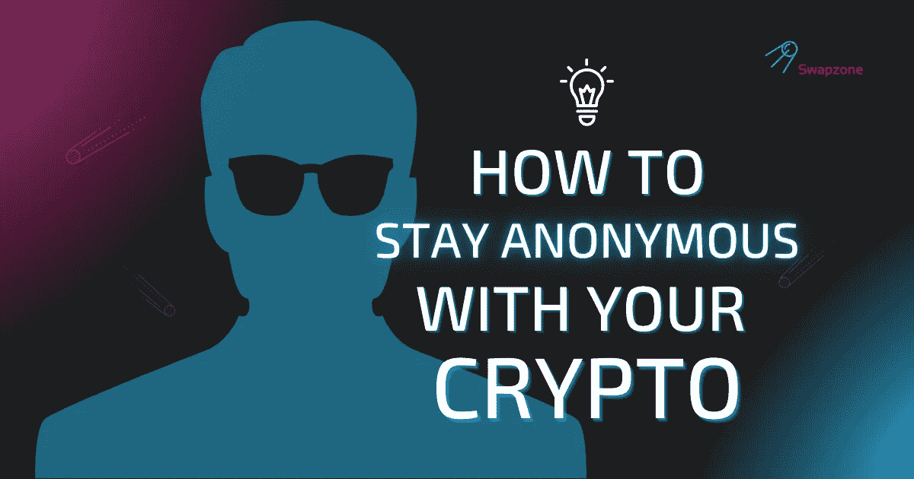

# 如何用你的密码保持匿名？

> 原文：<https://medium.com/coinmonks/how-to-stay-anonymous-with-your-crypto-602292206766?source=collection_archive---------16----------------------->

人们总是希望密码交换更快、更安全、更有利可图。在琳琅满目的不同交流平台中，非常容易迷失自我。当然，一些密码拥有者一夜暴富，这就引发了安全问题。匿名是至关重要的，也是 Swapzone 的首要任务。因此，在本文中，我们将尝试向您展示这一迷宫般的报价，并指出执行匿名加密货币交易的方法。

# 无需注册即可转换加密货币

大约十年前比特币在国际金融领域出现的时候，各国政府根本不在乎数字货币。现在，大多数国家都在制定监管加密货币的法律，而一些国家已经完全禁止了加密货币。在中国和印度等地，那些相信政府会制定智能密码法律的人损失惨重。选择尽可能匿名的加密货币所有者更有可能保留其加密货币的所有权，并以他们想要的方式使用它们。因此，寻找不需要你注册的平台是非常重要的，因此，要把你的资金托付给他们。这意味着你应该避免 CEXes，选择非托管和匿名的比特币交易所。

# 如何用你的密码保持匿名？

由于社会条件的原因，有些人没有在任何地方登记。有些人故意拒绝使用银行账户，因为交易可以追踪一个人的所有行为。悲剧在于，对于那些不喜欢使用银行产品的人来说，比特币将是一种理想的储值手段，然而，如果不输入你的 ID，比特币通常很难购买。至少到目前为止是这样。匿名购买比特币是维护你的加密隐私的良好开端，但还有其他事情要考虑。互联网对黑客和政府机构非常开放，所以如果你希望你的加密货币尽可能匿名，请继续阅读。我们将为想进行匿名加密货币交易的人编制一份必须知道的事情清单。

# 即时加密交换 KYC/反洗钱程序

金融机构通常使用 KYC(了解你的客户)和反洗钱(反洗钱)程序。由于身份识别，一方面，机构获得了关于个人和资金来源的信息。另一方面，客户有机会达成正式协议。

KYC 是客户身份验证。本质上，当有人试图开户或进行交易时，就会用到 KYC。

## KYC 过程通常包括:

*   身份验证(带护照的照片)
*   核实地址(一些帐户与您的地址和姓名)
*   验证用户是否遵守法律
*   研究资金来源和去向
*   搜索非法交易或评估过大的交易

在 KYC 的帮助下，那些无权使用这些服务的人被筛选掉了。非法获得的收入总是在被清洗或转化为净资产的过程中。在某个时候，骗子开始明白加密货币世界对那些操作来说是多么方便。

## 为了防止这些活动，反洗钱流程包括:

*   搜索大宗交易
*   硬币运动控制
*   获取 KYC 信息，检查是否注意到某个人有可疑行动

正如我们之前所提到的，加密交换的主要部分保持这些实践的真实性，因此，消除了匿名加密交换的可能性。此外，加密货币本身是可以追踪的。因此，在谈论匿名加密货币交换时，还应该注意所使用的硬币。

现在让我们来看看匿名数字货币。我们还将简单解释一下，匿名是通过什么方式得到保证的？

# 五大隐私硬币

匿名数字货币是一种加密货币，有自己的内部支付单元。他们的主要目标是使用特殊技术和加密协议确保金融交易的完全保密性。

# 莫内罗(XMR)

主要匿名加密货币 [Monero](https://www.getmonero.org/) 的开发者 Ricardo Spagni 认为，数字行业需要金融隐私。否则，在最好的情况下，市场将充斥着基于消费者偏好的定向广告。最坏的情况是，犯罪分子会开始对拥有大量加密货币的个人发动战争(毕竟几乎每个人都能查出别人比特币钱包的余额)。

[Monero](https://swapzone.io/currencies/monero) (XMR)是一种加密货币，事实上，它早在 2014 年就出现了，并在隐私领域提供了关键优势。它专注于保密性，并使用区块链与开源技术合作。开源或开放代码意味着技术和软件是通过与用户合作来构建、测试和改进的。据 Monero 称，超过 240 名开发人员参与了该项目，其中 30 人被标记为“主要”群体。

# 兹卡什(ZEC)

[Zcash (ZEC)](https://z.cash/) 是一个加密货币项目，源于 2013 年提出的 Zerocoin / Zerocash 的想法。它于 2016 年 10 月推出，之前是 Zerocoin。它使用加密技术，理论上可以确保用户的隐私。密码学和密码学一样，分析各种防止第三方或公众读取私人信息的协议。

[Zcash](https://swapzone.io/currencies/zcash) 和比特币有很多共同点。Zcash 交易有两种类型:私有和公开(类似于 BTC)。当你下载官方的 Zcash 钱包时，你会看到它提供了两种类型的地址:t-addr，你的公共地址，和 z-addr，你的个人地址。你可以选择使用哪一个。比特币交易完全透明。每个人都可以使用 BTC 块浏览器来检查交易是否从一个 BTC 地址发送到另一个地址。如果用户选择一个 z 地址，Zcash 就成为私有的，这意味着仅仅通过查看交易报告不会知道任何用户或客户的身份。这是零知识证明——这项技术为 Zcash 用户提供了屏蔽交易的选项，如果他们愿意的话。

# 边缘

[边缘](https://vergecurrency.com/)项目旨在创造一种强调交易完全匿名、高吞吐量和快速确认的加密货币。与大多数受欢迎的项目不同，the Verge 没有任何正式的组织或社区。该项目是开源的，团队由独立的假名开发人员组成。该项目的一份黑色文件上只签了创作者的昵称。隐私、匿名和分散是该项目的主要原则。

[Verge](https://swapzone.io/currencies/verge) 的匿名技术影响了用户连接网络的过程。Tor 和 I2P 协议有不同的数据传输方法。它们也被 [Verge](https://swapzone.io/blog/what-is-verge-and-how-to-exchange-bitcoin-to-verge) 采用，以确保用户的匿名性。Tor (TOR，洋葱路由器)是一个众所周知的携带 IP 地址的设备的互联网网络，嵌入在数据的发送者和接收者之间。此外，数据经过几个阶段的加密，很难中途拦截。I2P 是下一代技术解决方案。与 Tor 不同，I2P 为在 p2p 网络上发送包裹提供了一个动态的目的地。

# 费罗(Firo)

[Firo](https://swapzone.io/currencies/firo) ，原名 Zcoin，是一种匿名数字货币，旨在为用户带来真正的财务自由。让人们对自己的资产拥有 100%控制权的想法源于弗罗的信念，即隐私是一项基本人权。

为了确保这种隐私和不可追踪的交易， [Firo](https://firo.org/) 团队创建了 Lelantus 协议。简单来说，Lelantus 通过焚烧和兑换硬币来帮助用户隐瞒交易历史。

# 海盗链(ARRR)

[Pirate Chain](https://swapzone.io/blog/what-is-pirate-chain) 是一种专注于完全隐私的加密货币，从而使 100%的 ARRR 交易受到屏蔽。结合 Komodo 的延迟工作证明、Zcash 的 zkSNARK 和 Monero 的强制私人交易规则，Pirate Chain 确实创造了最强隐私技术的独特组合。

作为 ARRR 突出隐私的一个例子，我们可以考察攻击这个区块链有多难。[海盗链](https://pirate.black/ru/)使用的 DPoW 基于莱特币和科莫多区块链。因此，一个 Sybil 攻击将花费一大笔钱，因为在这种情况下，人们应该克服 LTC，KMD 和 ARRR 的 hashrates。

# 匿名加密货币交易所

[Swapzone](https://swapzone.io/) 是新一代的聚合者。它的创造者已经考虑到了所有以前的缺点，现在已经准备好让用户茁壮成长。我们为您提供使用 600+备用币进行交易的机会，其中您可以找到 10+匿名数字货币。你要做的就是:

1.  打开 [Swapzone](https://swapzone.io/) 主页。
2.  选择您拥有的加密货币，硬币或代币。
3.  选择您想要兑换的加密货币。
4.  输入您想要兑换的金额。
5.  在合作伙伴列表中选择一项优惠。
6.  点击“交换”。
7.  输入您兑换的硬币将被发送到的钱包地址。
8.  点击“继续交换”按钮。
9.  你会得到一个二维码，上面有你要把硬币寄到的地址。

# 结论

使用 crypto 可能会是一个困难的过程。然而，交换聚合器可以成为你的个人指南针，显示提供的最佳价格。有些评分可能有偏差，市场成交量不是找到你平台的最好标准；所以，这是值得你自己(或阅读我们的)研究和选择的。我们为您提供 [Swapzone](https://swapzone.io/) 作为您未来匿名加密货币交易的基础，因为我们不会被咬一口:我们知道如何修正其他平台的缺点，并节省您的时间和金钱。此外，人们可以很容易地从比较价格和知道如何在 700 多种加密货币的世界中操作中获利。加入 [Swapzone](https://swapzone.io/) 看看区别！

> 交易新手？尝试[加密交易机器人](/coinmonks/crypto-trading-bot-c2ffce8acb2a)或[复制交易](/coinmonks/top-10-crypto-copy-trading-platforms-for-beginners-d0c37c7d698c)