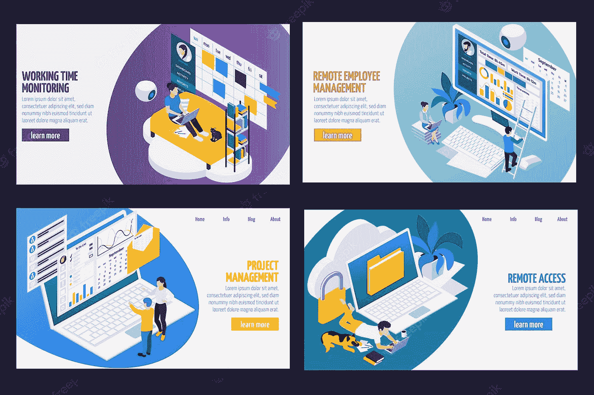

# 如何保持高效率:5 个让你保持高效率的方法

> 原文：<https://medium.com/coinmonks/how-to-stay-productive-5-productivity-hacks-that-will-keep-you-on-track-5c916eb31dd8?source=collection_archive---------32----------------------->

**如何保持高效:5 个让你保持高效的方法**

Image Source: FreeImages

保持高效没有秘密。真正的诀窍是在一天中保持专注和动力。如果你感到注意力不集中，或者想按时完成工作，这里有五个提高工作效率的方法，可以帮你做到。这些建议将帮助你保持专注，这样你就可以在更短的时间内完成更多的工作。通过培养高效的工作习惯和设定非生产性任务的界限来保持生产效率。无效的活动会消耗你的精力，限制你的选择，阻止你实现对你来说最重要的事情。为了保持高效，你需要清除这些障碍，并愿意做任何事情，只要能创造出想要的结果。

# 不要让电子邮件获胜

电子邮件是一个很好的交流工具，但是它经常被滥用。我们表现得好像我们的工作就是一收到邮件就回复。这是一种糟糕的使用电子邮件的方式。使用电子邮件的最好方式是在你有时间充分回复的时候回复。如果你从这个角度来看，你会发现如何利用电子邮件来帮助你专注于工作，而不是让你分心。这意味着下次你收到邮件时，你不会马上回复。取而代之的是，在你的日历上设置一个提醒，提醒你什么时候有时间回复，然后就把邮件放一放。这意味着你的收件箱不是一个待办事项列表(即使它是这样设置的)。不要把你的收件箱当作待办事项列表。仅用于交流。任何不是电子邮件交流的事情都应该在适当的待办事项列表程序中设置为待办事项。

# 设置您的工作环境

你的工作环境可以帮助你，也可以阻碍你。理想情况下，你想要创造一个有助于你完成工作的环境。如果你的工作环境不利于提高生产率，你将很难完成任何事情。例如，如果你有一张杂乱无章的桌子，很可能会让你浪费时间翻箱倒柜去找你要找的东西。这将会降低你的工作效率，甚至让你失去工作的动力。相反，创造一个让你工作更有效率的工作环境。把你工作需要的所有工具放在你的桌子上。如果你需要移动，把你的工作工具放在背包里。如果你在一个安静的地方工作得最好，确保你的工作环境尽可能的安静。如果你需要抵消声音，戴上耳机。避免呆在太热、太冷、太亮或太暗的地方。

# 计划你的一天

虽然你可以每天列一个待办事项清单，但你也可以制定一个每日计划来帮助你保持正轨并更有效率。每日计划类似于待办事项清单，但有一个关键的区别:待办事项清单是你需要完成的事情的清单。每日计划是你需要做的事情的清单，以达到你的目标。如果你没有任何目标，现在是时候考虑一下了。你可以从问自己开始:我想实现什么？我的梦想是什么？我的人生目标是什么？一旦你心中有了几个目标，你就可以开始为每个目标制定一个每日计划。

# 自下而上的思维是关键

当你试图完成一个大项目时，你会经历严重的注意力不集中，尤其是当你试图开始一件新的事情时。你可能会觉得不知道从哪里开始，不知道如何完成这个项目。如果你发现自己处于这种情况，你正在经历心理学家所说的“自下而上的思维”这是当你的大脑试图同时做所有的事情，而无法专注于手头的任务。走出这种状态最好的方法就是休息一下，重新饱和。

-休息一下-散散步。去兜风。小睡一会儿。吃一些饼干。

重新饱和——喝点水，吃点健康的零食，听听音乐，读几页书

# 休息一下，重新饱和

休息一下是好的，但是休息一下重新饱和更好。通过休息和重新饱和，你将能够以全新的视角回到手头的任务中。

——休息——你可能觉得自己在浪费时间，但实际上你在给自己充电。休息并不意味着你在浪费时间。这意味着你在给自己充电，这样你就能从工作中获得更多。

——重新饱和——当你回到手头的任务时，你会有一个全新的视角。你将能够从中断的地方重新开始，并以更大的精力完成任务。

# 结论

如果你知道该避免什么，该做什么，你就能保持高效率。避免分心，把你的注意力放在最重要的事情上。如果你这样做了，你将能够更快更准确地完成任务，你将有更多的时间去做你喜欢的事情。你还可以做一些额外的事情，比如找到一个好的生产力应用，制定一个每日计划，利用动力的力量。如果你想保持较高的生产力水平，避免拖延，设定目标，留出休息时间。

让我知道你打算做什么，什么最能引起你的共鸣。喜欢并与你的朋友和家人分享这篇文章。

在这里找到更多关于我的信息。

如果你想了解更多关于个人理财的知识，请点击这里查看我的 YouTube。订阅并关注以在未来接收更多类似的内容。

如果您想了解更多关于生产力、个人发展和领导力的信息，请点击[此处](https://2minutesliteracy.wordpress.com/category/personal-development/)。

*原载于 2022 年 10 月 22 日***。**

> *交易新手？尝试[加密交易机器人](/coinmonks/crypto-trading-bot-c2ffce8acb2a)或[复制交易](/coinmonks/top-10-crypto-copy-trading-platforms-for-beginners-d0c37c7d698c)*