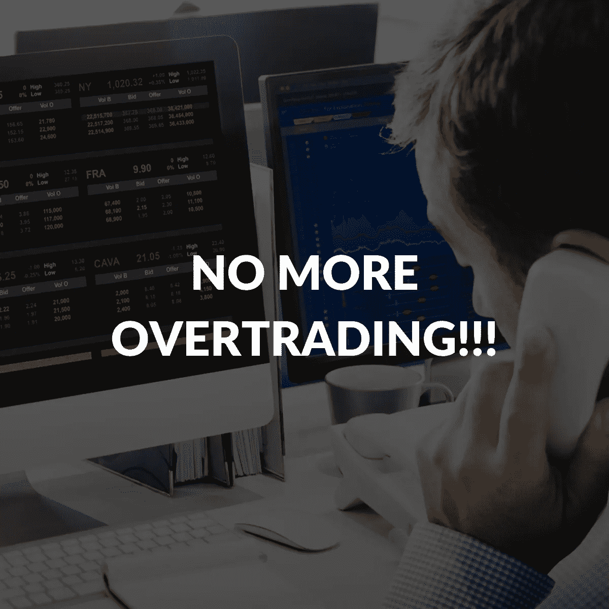
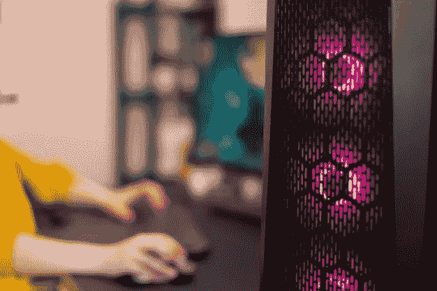

# 如何停止过度交易:你应该知道的 3 个简单提示

> 原文：<https://medium.com/coinmonks/how-to-stop-overtrading-3-simple-tips-you-should-know-1343303b8268?source=collection_archive---------26----------------------->

太极端的东西不好。不管是新手还是有经验的交易者，过度交易和微观管理都是常见的但代价高昂的陷阱。证明了交易成瘾的存在。

当交易似乎进展顺利时，我们倾向于继续持有赚更多的期望。然而，它通常以令人心碎的失败告终。

与此同时，如果交易的价值似乎在下降，我们倾向于放弃，因为我们相信损失会最小化。然后，事情会突然转变，亏损的交易会变得有利可图。我们可能会失去赢回巨额利润的机会。

所以，学习交易开始和停止的时间技巧是至关重要的。换句话说，什么时候交易，什么时候停止是每个交易者最基本的要求，但是这些知识被忽略了。

这篇文章建议了一些有效的方法来帮助你避免过度交易和微观管理。因此，无论市场变得多么混乱，你的交易收入都会增加。

# 建立并遵循你的规则

*Do you have a set of rules for your trades?*

当市场上的东西不断更新自己时，你如何才能阻止自己进入交易“多巴胺”的循环，即使你正在亏损或成功？

解决方法很简单——建立并遵守规则。在信息和令人上瘾的交易流的海洋中游泳是很容易的。然而，客观地跟踪你的交易表现并在损失变大之前及时离场是很有挑战性的。

因此，原则或一套规则可以成为穿越黑暗的向导。根据你的原则，你会知道什么时候应该开始或停止交易，以达到目标或防止痛苦的损失。

在建立自己的规则时，你可以考虑的因素包括[风险承受能力和风险承受能力](/@libraryoftrader/the-stock-market-there-is-an-emotional-trap-you-shouldnt-go-in-c5dac3838dfa)。这两个术语对于在动荡的市场中跟踪风险至关重要。

风险承受能力指出了你应该承担的必要风险，这样你才能达到你的财务目标。同时，风险容忍度指的是你持有时能承受多大的风险或能承受多大的损失。

 [## 股市:有一个你不应该进入的情感陷阱

### 在股市的疯狂涨跌中，情绪波动变得疯狂并不奇怪。阅读金融…

medium.com](/@libraryoftrader/the-stock-market-there-is-an-emotional-trap-you-shouldnt-go-in-c5dac3838dfa) 

例如，交易的风险能力可以是 500 美元，持有期为 2 天。然而，在同一时期，你的风险承受能力停留在 300 美元。所以，最好不要让它出现在交易中。

此外，[80/20 法则](/pm101/how-you-can-apply-the-80-20-rule-in-your-life-and-work-7d094a78e136)是另一个很好的参考。它指出，大约 80%的后果可能来自 20%的原因。简单来说，你 80%的交易利润来自于你 20%的交易时间。这里的核心概念是优先考虑最有影响力的战术，引导你走向胜利之地。

但最终，这些规则应该是你严格遵守但感到舒服的规则。自律和适合你的风格之间应该有一个平衡。

# 找另一个不应该交易的爱好

*Trading can be a hobby or a way of your life, but it should not be the only thing!*

嘿，交易不是你生活中唯一的事情。残酷但真实的是，当你的交易失败时，世界不会崩溃。

我们都尽最大努力让自己的生活更上一层楼。交易现在是丰富我们账户的有效方式之一。然而，有些人可能认为这是他们生活的唯一方式。他们把所有的时间都花在交易上，包括睡觉。

然而，生活比那有趣得多！

找一些能放松你的思想，给你留出一些时间和空间来呼吸没有计算的纯粹快乐的味道。

你可以在网上经营你喜欢的东西，如工艺品、香水、绘画等。或者，在附近的公园散步、看书、旅游、写作等。可以是另一种选择。

我们在这个世界上能看到的。如果只看到[股票](/@libraryoftrader/the-stock-market-there-is-an-emotional-trap-you-shouldnt-go-in-c5dac3838dfa)、[密码](/@libraryoftrader/how-to-get-through-the-tough-cryptos-winter-4b047aba4196)、 [NFTs](/@libraryoftrader/nft-explained-for-dummies-f8a53cdc1e28) 等跳舞的数字。，你的世界也就那样了。所以，用更多有趣或放松的活动来扩展你的视野，让你在回到智力游戏之前暂时远离监控屏幕。

# 关闭监控屏幕

*Turning off the screens to turn on your life.*

是的，我知道这听起来很无聊。然而，你可以 24/7 跟踪你的交易，但你获得的利润可能与那些每天监控特定时间的人相同，甚至更差。

这个技巧更像是前两个建议的结果，而不是一个方法。当你有一套匹配的规则时，你可以有一个最佳止损点。此外，除了交易之外的爱好可以让你避免过度交易，并且可以防止交易成瘾。这一切都回到了交易心理和你的思维方式。

 [## 交易心理学:你可能不知道…

### 交易心理学顾名思义，心理学或思维在交易中的工作方式。你可能会发现…

medium.com](/@libraryoftrader/trading-psychology-you-might-not-know-a5288f05c1cd) 

你觉得怎么样？你有过过度交易的麻烦吗？有什么解决办法吗？不要犹豫，在下面的评论区和我们分享吧。迫不及待地想看你所有的分享。

其他可能引起您兴趣的文章包括:

 [## 印度股票投资者必须知道的五大网上资源

### 如果你是印度股市的新手，你可能会发现自己对更新哪些网上资源感到困惑…

medium.com](/coinmonks/top-5-online-sources-that-indian-stock-market-investors-must-know-34560186a109)  [## NFTs 的未来:幻想还是乐观？

### 非专利技术已经上升到投资者和投资者最值得考虑的投资项目

medium.com](/coinmonks/the-future-of-nfts-illusions-or-optimism-a95f7520786e)  [## 如何评价一个 NFT 的价值？

### NFT 是一个新的领域，最近引起了公众的极大关注。因此，测量 NFTs 的价值是…

medium.com](/coinmonks/how-to-evaluate-the-value-of-an-nft-d4078f1a98ba)  [## 定量和定性分析:主要区别是什么？

### 对许多人来说，交易或投资可能是一种游戏，但这不是一种完全靠运气就能赢的游戏。它需要…

medium.com](/coinmonks/quantitative-and-qualitative-analysis-what-are-the-main-differences-1e50ec1db209) 

你也可以找到我们👇

交易者博客库:[https://libraryoftrader.net/blogs](https://libraryoftrader.net/blogs)

https://www.facebook.com/libraryoftrader[脸书](https://www.facebook.com/libraryoftrader)

推特:【https://twitter.com/libraryoftrader 

领英:[https://www.linkedin.com/company/library-of-trader/](https://www.linkedin.com/company/library-of-trader/)

https://www.reddit.com/user/Library_Of_Trader

quora:[https://www.quora.com/profile/Library-of-Trader](https://www.quora.com/profile/Library-of-Trader)

> 交易新手？尝试[加密交易机器人](/coinmonks/crypto-trading-bot-c2ffce8acb2a)或[复制交易](/coinmonks/top-10-crypto-copy-trading-platforms-for-beginners-d0c37c7d698c)