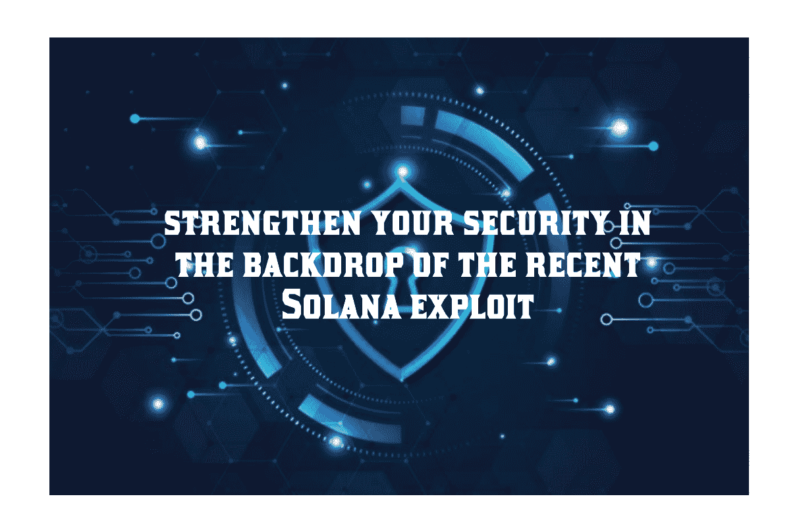

# 如何在最近索拉纳漏洞的背景下加强您的安全性？

> 原文：<https://medium.com/coinmonks/how-to-strengthen-your-security-in-the-backdrop-of-the-recent-solana-exploit-f56bafb7765d?source=collection_archive---------6----------------------->

鉴于最近的利用，我们想提供一个复习的情况和可操作的项目，为用户如何更好地保护他们的加密资产。

# 我们目前所知的

在与生态系统内的团队和安全公司进行了一段时间的深入调查后，一致认为该漏洞是由私钥泄露引起的，很可能是移动钱包应用程序中的漏洞造成的。特别是，Slope wallet 似乎拥有最高的受影响用户集中度(即使不是全部，也是最多的)。

# 你应该采取什么行动

[Snowflake Safe](https://snowflake.so) 仍然是 Solana 上最安全、最通用、功能最全的资产管理选项之一。这是令人难以置信的方便和成本效益(少于 0.1 溶胶)，并需要不到 2 分钟的设置。

如果您的资金目前存储在一个热门钱包中，我们强烈建议将这些资金转移到多个钱包，如雪花保险箱或设置一个硬件钱包。你可以[按照这个快速指南](https://coinsbench.com/create-a-solana-multisig-in-just-a-few-clicks-c348a6186cb8)来设置雪花多功能信号。

如果您已经在使用雪花保险箱，请审查任何使用过 Slope 钱包的所有者，并考虑更换其钥匙可能已被泄露的所有者和/或提高保险箱的批准门槛。您可以在“设置”菜单(“安全”>“设置”)中管理您的安全的所有者和批准阈值。

除了以上所述，我们建议每个人花点时间复习一下你的 OpSec(运营安全)。加密已被证明是黑客和其他不良分子密切关注的领域，因此将日常操作中的安全风险降至最低尤为重要。为了进一步加强您的安全和保护，请考虑以下提示:

-考虑为您的 multisig 的部分或全部用户使用硬件钱包。拥有一个保持干净并仅用于资产存储(而非智能合同互动)的地址，该地址存储您的大部分资金，另一个地址是您转入智能合同互动/日常使用的地址

-针对不同的目的，为您运行的每个 hot wallet 私钥创建不同的浏览器配置文件。例如，在一个配置文件上工作，在另一个上个人媒体消费，在第三个上加密。

-为了最大限度地降低破坏运行加密的计算机的风险，请在不用于任何其他用途(不浏览、不使用 pdf 等)的计算机/操作环境中进行加密交易。一个可能的选择是使用虚拟机来分离您的工作、个人和加密使用。

-使用密码管理器使您的每个密码都是独一无二的，难以破解(15–20 个字符+随机生成)。Bitwarden 或 1Password 是密码管理器的常见选项。

-在您的所有网络帐户上启用 2fa，考虑为硬件 2FA 配置一个 yubikey。

在利用的背景下，我们看到了 Solana 生态系统中惊人的团队工作和协作。团队在互相帮助中表现出韧性、积极性和支持。安全是一项持续的承诺。我们希望您采取措施提高警惕，提醒自己始终应用上述 OpSec 最佳实践，作为一个社区，我们将一起变得更加强大。

> 交易新手？试试[密码交易机器人](/coinmonks/crypto-trading-bot-c2ffce8acb2a)或者[复制交易](/coinmonks/top-10-crypto-copy-trading-platforms-for-beginners-d0c37c7d698c)