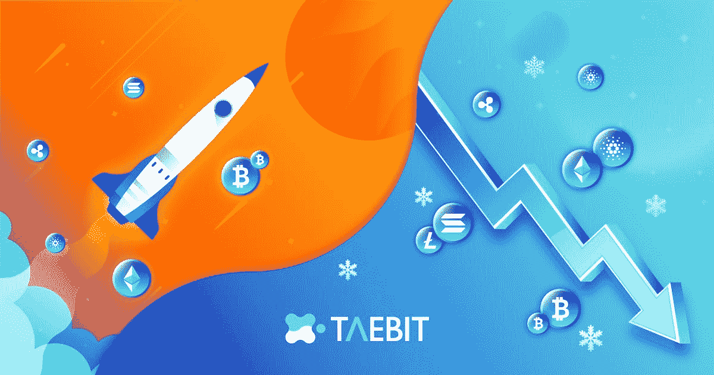
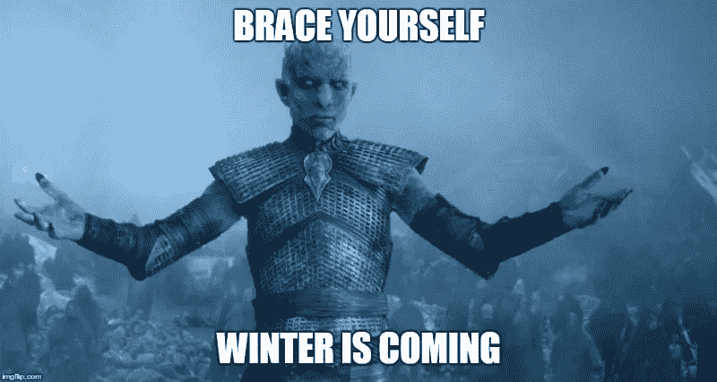
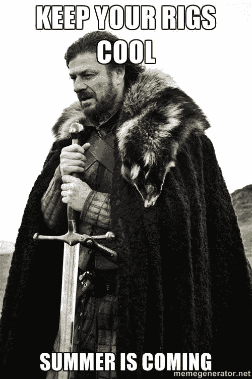

# 如何在神秘的冬天和神秘的夏天生存

> 原文：<https://medium.com/coinmonks/how-to-survive-in-crypto-winter-crypto-summer-da868dc1f22a?source=collection_archive---------49----------------------->

# **秘密赛季**

与所有金融市场类似，加密货币市场是周期性的，价格长期上涨，加密价格持续停滞或下降。术语隐夏和隐冬指的是这些交替周期之间的变化，夏季或冬季的持续时间通常取决于许多全球宏观经济因素。一些主要因素包括**通货膨胀、供应链健康、就业数据和地缘政治紧张**。虽然加密货币市场目前与传统金融市场高度相关，但仍有大量特定于加密的因素会导致加密价格的升值或贬值。评估每个加密季节的特征对于理解当前周期的哪个部分正在发生以及下一个周期何时开始是必不可少的。

## **Crypto 冬季🥶**

“隐性冬天”基本上意味着价格大幅下跌，然后在几周或几个月内保持低位。

一个隐秘的冬天的一些有意义的价格指标是价格长时间下降，然后是历史低点或多年低点。除了价格因素，启动资金减少，加密协议或公司的失败，以及主要新闻网络的负面情绪是加密冬天的特征。

加密冬天的一个明显例子是最近比特币在 6 月跌至 17 个月低点，随后是 Celsius Network 的失败和 Luna Foundation Guard 的灭亡。这些负面催化剂加上地缘政治冲突、全球燃料短缺、供应链扭曲和通货膨胀加剧，导致了当前这场漫长的加密冬天。

> 来自 Taebit 的相关文章
> 
> [多头对空头:驾驭动荡的市场](/@taebitdex/bulls-vs-bears-navigating-a-volatile-market-26ea286250b6)

## **隐秘的夏天😎**

加密夏季是指加密货币价格持续上涨并突破历史新高的时期。

加密之夏的主要特点是加密货币的采用增加，大量资金流入加密初创企业，以及大量新项目和积极的新闻故事被发布。

最著名的加密夏季始于 2020 年 4 月，持续到 2020 年 10 月。在此期间，BTC 和瑞士联邦理工学院达到了前所未有的高度，每周都有新项目出现，每天都有成千上万的用户加入。虽然没有办法准确地确定加密夏季何时开始，但我们团队关注的首要指标是以太坊和比特币的价格走势。

## **市场状况**

几乎所有可识别的指标都表明，我们目前正处于一个隐秘的冬天。全球加密货币市场的总市值处于 1.1 万亿美元的水平。加密市场的总市值从 2021 年 11 月的峰值近[3 万亿美元](https://www.theguardian.com/technology/2022/jun/13/crypto-lender-celsius-network-halts-withdrawals-extreme-market-conditions)大幅下降。也就是说，加密市场已经从 6 月份经历的低点恢复过来，并在 7 月份显示出价格弹性，以太坊从 6 月份的低点上涨了 58%。目前，加密货币有点崩溃，但摩根大通(JPMorgan Chase)的分析师表示，散户投资者推动了比特币和以太坊价格在 8 月初的反弹，加密市场去杠杆化过程最激烈的阶段“似乎已经过去。”尽管我们正处于一个加密的冬天，但冰层似乎正在融化，未来几个月可能会为投资者带来一个从购买加密货币中获利的新机会。

数字资产经纪商 GlobalBlock 的分析师本斯莫尔(Ben Small)表示，加密市场对美联储最近的行动反应积极。

> 他表示:“尽管本周一开始就面临着巨大的压力，但自那以后，数字资产呈现出一片绿色的海洋。”。“你可能会说，这种乐观情绪反映了投资者的一种观点，即人们预计美联储方面会出台更激进的行动计划，尤其是考虑到各国政府面临的应对通胀的政治压力越来越大。”

尽管过去几周加密价格飙升，但有一个明显的因素可能会延长加密的冬天——监管。

据福布斯报道:“美国证券交易委员会(SEC)正在调查比特币基地是否允许用户在其平台上非法交易未注册证券。”美国证券交易委员会最近还以内幕交易对一名前比特币基地产品经理提起刑事指控，并在其[投诉](https://www.sec.gov/litigation/complaints/2022/comp-pr2022-127.pdf)中认定一些加密货币为证券。这些监管措施紧随证券交易委员会主席加里·詹斯勒之后，他在六月宣布[不与证券交易委员会合作的加密交易所](https://www.forbes.com/advisor/investing/cryptocurrency/best-crypto-exchanges/)是“在法律之外运作”,可能面临强制行动的风险。

美国银行(Bank of America)分析师阿尔凯什·沙阿(Alkesh Shah)重申了监管冲突的增加，他表示，“投资者可能很快就会看到比特币基地和其他交易所放弃美国证券交易委员会(SEC)裁定为未注册证券的上市代币”。Shah 继续说道，“SEC 将 9 种代币归类为证券的决定为比特币基地这样的数字资产交易所带来了监管风险，这些交易所可能作为不受监管的证券交易所运营，这说明了全面监管框架的必要性，”

# **如何交易季节**

在投资加密货币时，了解总体市场状况如何影响特定的价格行为极其重要。然而，一旦建立了对潜在市场条件的深刻理解，那么部署针对特定季节的交易策略是有益的。

> 来自 Taebit 的相关文章
> 
> [多头对空头:驾驭动荡的市场](/@taebitdex/bulls-vs-bears-navigating-a-volatile-market-26ea286250b6)

## **交易密码夏季**

交易密码夏季最重要的因素是利用上升趋势的能力，以及知道何时获利。在一个隐秘的夏季，会有多种货币在价格上连续几周升值。一个好的交易者可以购买这些资产，并在价格上涨时持有，一旦超过一定的价格阈值，就卖出一定比例的资产。一个很好的经验法则是，一旦头寸升值 20%，就卖出 20%。这确保了你在上涨趋势中获利，同时也保护了资金以防价格突然大幅下跌。虽然没有保证产生利润的方法，但最重要的是对季节的变化保持警惕。一旦一个加密的夏天开始，通过持有主要的加密资产赚钱是很容易的——重要的是当你达到利润时卖出。

## 交易加密冬天

活着和保存资本是成功交易者在寒冬中的两个主要特征。Crypto winters 在同一时间对多种资产进行猛烈的价格下跌。一个成功的交易者可以通过进入空头头寸来利用这些波动，但是一个更成功的交易者只会用他们资本的一小部分进入空头头寸，而不是拿他们的整个投资组合冒险。应对价格下跌的一个成功策略是持有稳定的股票，等待 12 个月或 24 个月低点附近的买入良机。这些购买机会通常会在冬季出现 1-2 次，如果一直持续到下一个夏季，将会带来巨大的利润。

***关注我们 Taebit*** *☯*

> *推特上的最新内容🐦:*[*https://twitter.com/TaebitDEX*](https://twitter.com/TaebitDEX)
> 
> *交易讨论不和谐👾:*[*https://discord.gg/gBjqjFXmn2*](https://discord.gg/gBjqjFXmn2)
> 
> *https://t.me/+4kkLYgMPtZw3NjJl*[*电报最新公告*](https://t.me/+4kkLYgMPtZw3NjJl)
> 
> *Taebit 网站:*[*https://taebit.io/*](https://taebit.io/)

> 交易新手？尝试[加密交易机器人](/coinmonks/crypto-trading-bot-c2ffce8acb2a)或[复制交易](/coinmonks/top-10-crypto-copy-trading-platforms-for-beginners-d0c37c7d698c)