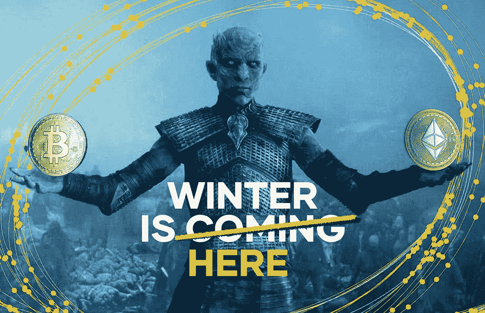
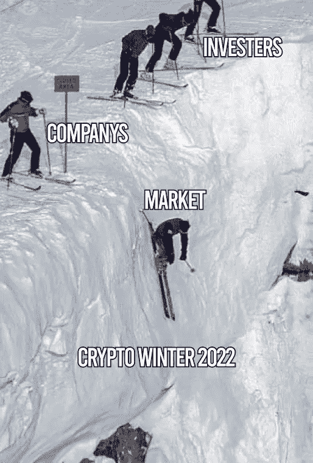
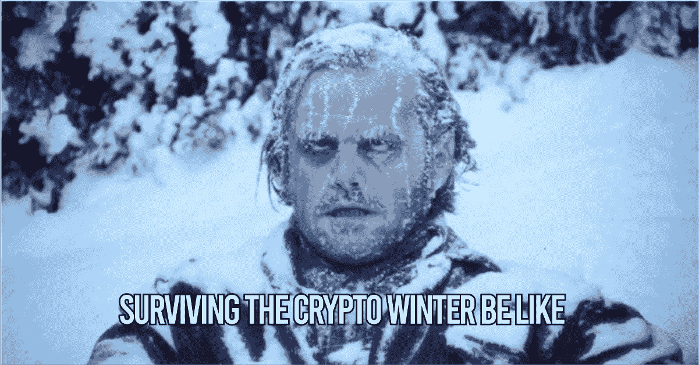

# 如何度过 2022 年的密码寒冬:投资者和公司指南

> 原文：<https://medium.com/coinmonks/how-to-survive-the-great-crypto-winter-2022-a-guide-for-investors-companies-f542b826f738?source=collection_archive---------7----------------------->

## 一个独立的研究和救济建议，由加密金融分析师和经验丰富的前银行家史蒂夫 l .卡梅尔为黄色网络。

Image Credit: [Yellow](https://medium.com/u/afdfe44f7fdb?source=post_page-----f542b826f738--------------------------------)

你准备好迎接下一个伟大的加密冬天了吗？

“你什么都不知道，琼恩·雪诺，冬天就要来了！”—许多人预测到了这一点，但很少有人相信，然而我们现在正处于另一个隐秘的冬天。

但是到底什么是加密冬天，是什么造成的，我们能做些什么？

让我们简短地了解一下加密的历史，触及一些基本的经济学，起草一些计划，并回顾一些管理这种情况的技巧和诀窍。

## 什么是隐冬？

“加密冬天”通常指的是加密货币市场的大范围抛售，随后是低迷的活动和缓慢的价格复苏。用传统的金融术语来说，想象一下泡沫破裂，造成熊市，导致经济衰退。

## 2018 年的伟大秘密冬天

以前的加密崩溃主要是由加密交易的主流采用增加引起的特定部门现象。越来越多的早期代币投资者获得丰厚收益的报道像野火一样蔓延开来，引发了市场狂热，这在很大程度上与更广泛、更传统的市场无关。

> 虽然 2018 年的秘密冬天是迄今为止最突出的，但它不是第一个。据 [*维基百科*](https://en.wikipedia.org/wiki/Cryptocurrency_bubble) *报道，自 2009 年比特币推出以来，加密市场已经发生了不下四次大的市场崩盘。*

虽然前三个问题很少受到公众的关注，但 2018 年的加密危机仍然在投资者和公司的脑海中挥之不去。

自 2008 年以来，宽松的货币政策、廉价的法定贷款利率和蓬勃发展的全球经济让许多新参与者带着现金进入加密市场，刺激了象征性的价格升值，通常不考虑基础项目的实际价值。区块链项目在每个领域都蓬勃发展，事实上让任何人都可以创造自己的钱，创造了一个蓬勃发展但脆弱的利基市场，没有人想错过这条船。

> 交易新手？尝试[加密交易机器人](/coinmonks/crypto-trading-bot-c2ffce8acb2a)或[复制交易](/coinmonks/top-10-crypto-copy-trading-platforms-for-beginners-d0c37c7d698c)

继 2017 年的大规模牛市之后，2018 年加密冬天的开始可以追溯到几个重大的加密相关问题，如 [BitConnect 事件](https://en.wikipedia.org/wiki/Bitconnect)和[某些国家对加密货币投资的限制](https://en.wikipedia.org/wiki/Legality_of_cryptocurrency_by_country_or_territory)。

## 2022 年的 Crypto Winter 有什么不同？

自 2018 年以来，加密市场已经习惯了监管和限制，公用事业令牌项目已经成为投资者和公司兴趣的最前沿。

两年多来，比特币和大多数其他代币恢复到危机前的水平，2020 年开始了新一轮牛市。毕竟，全球经济正在蓬勃发展，在新冠肺炎引发的封锁期间，人们有充足的时间来熟悉区块链和密码。如果 crypto 在 2018 年之前不是主流，那么到 2021 年底它肯定会成为主流。像 DeFi 和 NFT 项目这样的新应用蓬勃发展，每个人都突然成了密码专家。

这种情绪在 2022 年初发生了剧烈的转变。代币价格开始大幅下跌，卖方交易量飙升，许多杠杆投资者的头寸越来越困难，进一步加剧了价格螺旋下跌。

所以，再一次，仅仅是由 cryptos 的自然太高太快周期引起的冬天？也许部分是，但这次似乎不同。

今天不同的是，全球经济面临着一个新的敌人——这个敌人对你投资的行业或领域没有影响。

## 输入通货膨胀

自 2008 年金融危机以来，主要经济体采取了大量措施刺激经济增长，主要是通过降低基准利率和增加货币供应。但即便如此，近十年来，全球通胀数据一直保持在低位，这促使各国央行不断放松政策。而且效果很好。

十多年来，全球 GDP 增长强劲，国际贸易繁荣，投资者从繁荣的市场中获利。趋势投资者的心态是，你可以买任何东西，它会让你赚钱。甚至 2019-2021 年的新冠肺炎危机也似乎是暂时的，政府进一步打开闸门支持消费者和企业。

但这是一个微妙的实验。传统经济学告诉我们，货币和商品之间必须有一个平衡来稳定价格。货币对商品的供过于求导致价格上涨，也就是众所周知的通货膨胀。

从历史上看，许多央行会将大约 2%的年通胀率作为经济扩张成功的标志。

尽管许多人表达了担忧，但当通胀数据开始超过这些目标时，没有人真正关注。2021 年，美国美联储银行普遍认为高通胀率是暂时的。

2022 年初，警告宽松货币政策走得太远的声音终于引起了越来越多的关注。最近的战争冲突、鹰派外交政策和新冠肺炎战争的余波造成的全球供应链中断进一步加剧了这些担忧。

所有这些导致消费者价格上涨，也就是通货膨胀。现在，通货膨胀并不是可怕的敌人，只要你有合适的武器来对抗它。

## 输入上升的利率

传统上，央行会简单地提高利率，并通过发行债券从流通中回笼资金。但这就是问题所在。

加息意味着企业将有更高的再融资成本，公司估值发生变化，借贷成本增加。在经历了 10 年几乎免费的贷款后，许多企业和个人将面临一个去杠杆化或以更高价格借入资金的决定。

利率上升也让投资债务再次变得越来越有吸引力，同时降低了股票和其他风险资产的吸引力。

> 交易新手？试试[加密交易机器人](/coinmonks/crypto-trading-bot-c2ffce8acb2a)或者[复制交易](/coinmonks/top-10-crypto-copy-trading-platforms-for-beginners-d0c37c7d698c)

你可能会问，这与加密冬天有什么关系？

## 密码是高风险资产。猜猜在经济衰退中什么会首先被抛弃？

从传统投资者的角度来看，加密货币是高风险资产。

当全球经济面临放缓风险时，任何类型的高风险投资通常都会首先被清算。出售资产会导致价格下跌，进而引发更多抛售。瞧，熊市诞生了。Rawr🐻

虽然在传统市场中，溢出效应和长达数年的牛市/熊市周期是常见的，但对于许多热衷于加密的投资者来说，它们有些新。因此，在加密史上，冬天第一次不是一个行业制造的问题，而是全球经济力量影响的结果。

加密货币已经成为主流。虽然这对技术来说是个好消息，但这也意味着该领域与传统资产类别的关联变得更加紧密。更高的相关性意味着更低的多样化，从而增加了市场参与者的风险。

## 作为投资者或 Web3 公司，如何度过 Crypto 寒冬？

> *“没有冬天的寒冷给它带来甜蜜，夏天的温暖又有什么用呢？”——约翰·斯坦贝克。*

如何度过 2022 年的加密冬天

了解了 2022 年的加密冬天是如何到来的，我们可以得出结论，加密投资者和企业受到了他们无法控制的更大的经济力量的影响。

但是就像传统世界经济的其他部分一样，Web3 将安然度过今冬和明冬。尽管从整体来看，这听起来很有希望，但不可否认的是，困难时期正在来临。困难时期有时需要采取严厉的措施。许多人会消失，少数人会留下，但少数人会比以往任何时候都更加强大。

因此，让我们来看看作为投资者或 Web3 公司可以采取的一些措施，以改变生存于加密冬天的几率。

# 做:

*   有应急基金
*   保持透明和沟通
*   建立多种收入来源
*   分散投资
*   管理您的风险
*   选择价值和效用而不是回报
*   长期规划
*   降低成本和偿还债务
*   问有挑战性的问题和 DYOR

# 不要:

*   买蘸酱
*   过度曝光
*   弥补损失的杠杆作用
*   匆忙做出决定
*   追随自称的领导人
*   由 FOMO 驾驶

简而言之:关注**延续**、**价值**、**风险管理、**和**策划**。

将这些特质有机地注入到你的投资和 Web3 公司战略中，只会对你的未来、你的公司的未来、密码行业以及所有相关人员都有好处。

## 投资者和 Web3 公司的加密冬季生存计划

## 有应急基金

投资者:确保你有充足的流动资产。这将有助于弥补投资组合的最终损失，并让你以更低的估值逐步重建头寸。应急基金使你能够继续保持你的生活方式，而不用清算你的头寸。

> 根据经验，你的应急基金应该能让你支付至少一年的生活费用。

**公司:**任何一家可靠的公司都有一笔战争资金，使其能够在市场低迷时期继续运营。应急基金应该是公司的最后手段，不得用于任何其他目的。如果可能的话，即使你认为当前的危机不会影响你的业务，也要继续建立储备。记住，下一次黑天鹅事件总是迫在眉睫。

> *根据经验，对一家公司来说，将资产负债表的 5-10%用于应急基金是一个很好的起点。*

## 保持透明和沟通

**投资者:**确保你完全清楚自己在所有市场和资产类别中的风险敞口。如果你负债累累，确保你知道你能承受多大的损失，并寻求与你的债务提供者对话，以确定最坏的情况。

公司:与你的员工、客户和投资者开诚布公地交流情况。定期向他们介绍你的业务以及危机对业务的影响。它让利益相关者相信你能控制局面。投资者不太可能跳槽，客户也会建立信任并继续支持你的业务。

## 分散投资和收入来源

投资者:作为投资者，分散投资至关重要。重组你的投资组合，降低投资之间的相关性。别忘了——在危机时刻，现金为王。这将让你在做决定时更加灵活，并提供一个良好的睡眠。

如果可能的话，分散你的收入来源。仅仅依赖于一个单一的收入来源可能是一个危险的游戏，特别是如果你的现金流严重暴露于一个不稳定的资产，如加密。

> 为你的总持有量设定以%为单位的规模限制，例如，不超过任何给定证券投资组合价值的 5-10%。

**公司:**确保你的公司投资组合反映了你的业务，无论是资产、负债还是收入。停止或削减高风险投资和低利润产品。分析你的收入模式，看看你是否可以扩大或多样化。在危机时刻推出新产品是可能的。不要进入刺猬模式——这会让投资者望而却步，把你的公司描绘成只会一招的小马。

 [## 密码交易所的主要弱点给交易者带来了前所未有的风险

### 好消息是:它们是可以克服的。以下是方法。

medium.com](/yellow-blog/major-weak-points-of-crypto-exchanges-that-create-unprecedented-risks-for-traders-18d56e364028) 

## 管理您的风险

**投资者:**我不应该提到这一点，但**投资是 100%关于成功的风险管理**。确保你有一个适当的风险管理体系，并严格遵守它。如果一笔交易对你不利，在你还能走的时候，把损失打包，离开它。这同样适用于收益——有一个明确的目标回报，尽可能兑现。忘记双倍亏损，不要骑着你的赢家直到他们崩溃。

> *当处理止损、限价和止盈订单时，应用 3:1 的比率，这意味着每 300 美元的利润，你的最大亏损不超过 100 美元。*
> 
> *另一个原则是定义最大风险阈值。例如，在任何给定的时间里，不要让超过 1%的投资组合处于风险之中。*

这些数字可能听起来过于保守，尤其是在加密领域，但你以后会感谢我的。

公司:确保你意识到你公司的风险，更重要的是，要有一个应对风险的计划。根据你公司的规模，拥有一个全面的风险方法是一项重要的任务，并且随着公司规模的扩大会变得更加困难。

*首先要做的应该是建立一个严格的、可扩展的风险管理框架。*如果可能，将风险管理任务分配给一个专门的团队或团队成员，并尽可能缩短向执行委员会报告的时间。

## 选择价值和效用而不是回报

**投资者:**确保你了解你的投资，以及为什么它有价值。选择基于可用性、可伸缩性和稳定性的项目。当面临投资机会时，不要害怕问令人不舒服的问题。一旦你动用了你的钱，你就已经准备好了。开枪前先确定你的目标并瞄准。

> 小心危险信号，比如将巨额回报作为主要投资主题的承诺。相反，关注公司的底层产品，了解竞争对手。仔细分析公司结构、运营程序和管理记录。

**公司:**了解并清楚你的公司如何为股东和客户创造价值。注重交付质量而非数量。廉价、低质量的产品可能有更高的利润率和收益率，但也是短暂的，受趋势限制。为客户创造实际价值的产品确保更忠诚的客户群，并需要更少的主动营销。

以劳斯莱斯的客户为例。如果你能买得起一辆车——制造质量、客户服务和体验让你不太可能再买一辆车。如果你买了一辆便宜货，你也许可以偶尔买辆新车，但你更有可能尝试不同的品牌。

*便宜的主流产品更容易过时，所以当顾客选择另一个品牌时，不要表现得很惊讶。*

## 降低成本和债务

投资者:在你开始出售你的投资来弥补你在危机中的生活方式之前，降低你的成本。它让你的钱继续为你工作。首先列出你几周或几个月的开销，精确到每一分钱。然后老老实实问自己哪里可以删减，至少暂时可以。

*在衰退时期，减少投资者的债务至关重要，因为利率上升将增加借贷或再融资的成本。这并不意味着你应该无债一身轻，但要确保你有一个健康的负债权益比。没有什么比被迫平仓来偿还债务更糟糕的了。*

**公司:**降低成本并不一定意味着立即削减成本和员工，对公司的长期影响各不相同。在裁员之前，从提高公司的效率开始，即使这意味着你必须在短期内投资。这听起来可能会适得其反，但从长远来看，这比裁减员工、流程或整个业务部门，然后再重新引入它们成本更低、痛苦更少。

先想想不必要的成本。你的公司真的需要市中心的办公室吗，或者人们可以在家工作吗？我的员工必须出差吗？不管公司情况如何，管理层都需要奖金吗？

*对公司来说，不同之处在于减少债务可能会减轻你的现金流负担，但从税收角度来看，这实际上并不总是有效的。就如何重组或改善资产负债表获得专家的财务建议。成本将远远超过收益。*

 [## Web3 如何重塑传统金融

### 我们这一代人有幸有机会观察到技术是如何将经济范式转向某种东西的…

medium.com](/yellow-blog/how-web3-is-reinventing-traditional-finance-cfbd4c4b4e68) 

## 问一些有挑战性的问题&做自己的研究(DYOR)

**投资人:**对自己狠一点，问很多问题，投资前做适当的调研。批判性地对待任何信息来源。通过炒作、FOMO 和从众心理出售加密资产时要小心谨慎。用这些因素做投资决定会让你成为投机者和赌徒。

> *专家投资者深入挖掘，花时间分析，把情绪放在一边。*

公司:同样的规则也适用于公司。确保你了解你的业务、行业、竞争和外部力量的每一个细节。

*确保您站在最新发展的最前沿，并对您收到的任何内部或外部信息持批评态度。*

## 在隐秘的冬天不要做什么

## 不要买蘸酱

投资者:很少有投资者能成功地正确把握市场时机，更少的人能成功把握时机。是的，价格下跌提供了机会，据说沃伦·巴菲特说过，“当街上有血的时候买入。”但是你也听说过“千万不要接住掉下来的刀”吗？

拥有明智的风险方法和足够的流动资产的投资者无疑可以研究成本平均策略或寻找一个被低估的象征性项目。

但是，永远不要因为你觉得对自己的头寸有责任，就随便买蘸酱。专家投资必须不受个人情感的影响，因此不能盲目承诺或 HODL。

**公司:**虽然这个对公司适用较少，但原理和投资者差不多。不管市场周期如何，如果从整体角度来看有意义，就购买或投资。*没有感情，只是理性的决定。*

 [## 为什么象征性激励对网络 3 经济至关重要

### 今天，我们生活在向创造者经济过渡的时代。

medium.com](/yellow-blog/why-token-incentives-matter-a-world-for-the-web3-economy-ca208c926105) 

## 不要过度曝光

**投资者:**许多投资者，尤其是 crypto 的投资者，认为杠杆和借贷意味着免费的资金和放大的回报。虽然这在经济衰退之外可能是有效的，但潮流已经改变，你必须适应。提高基准利率会增加借贷成本，并给风险资产带来波动。降低杠杆率可以显著降低投资组合风险。不言而喻，通过借款来试图挽回损失从来都不是一个好主意。

**公司:**确保你了解整个企业的风险敞口。这利用了我们之前讨论的风险管理框架。过度暴露于特定的市场、产品或客户群可能会产生意想不到的损失。*将你的业务从依赖单一收入来源转向多元化供应链*。

当涉及债务时，确保你的杠杆率与你的风险偏好一致。评估你的公司是否过度暴露于利率上升的风险，并调整资本筹集的方式。

## 不要匆忙做决定

**投资者:**在你的决策过程中要务实。慢慢来，在执行之前考虑一下其中的含义。盲目跟随市场不是投资策略。记住，一个决定没有好坏之分。决定就是决定；只有结果是相关的。

> 如果这个决定导致了不好的结果——彻底改变你的决策过程，重新开始。

公司:战略性的商业决策几乎总是有长期的影响。确保你开发了多个场景，并单独评估每个结果。长期决策往往会带来更可持续的结果。对你的决策过程保持透明；这增强了投资者和客户的信心。同样，*没有错误的决策，只有糟糕的决策*。

## 不要追随自称的领导人

**投资者:**像“先令”、“阿平”、“霍德林”、“当蓝宝”和“到月亮”这些术语与投资毫无关系。不幸的是，如今每个人和他们的狗(双关语)都是密码影响者。然而，很少有人有可靠的成功投资和退出记录，可以证明他们所说的每句话都是正确的。持批评态度，自己做决定。

> *能够区分炒作与价值，营销与投资建议。*

**公司:**虽然这个主题不太适用于公司，但许多 Web3 公司都受到空间营销本身的强烈影响。Web3 公司的所有者通常是 Y 代和 Z 代，他们把“一切皆有可能”的思想带到了管理层。虽然创新精神和开放思想受到鼓励，但管理一家公司的大肆宣传和纯粹的趋势跟踪几乎肯定会在危急时刻导致失败。

*人人都可以牛逼*😎当事情变得美好而容易时。困难时期需要坚强、冷静和坚定的领导。

## 不要被 FOMO 驱使

**投资者:**如果你觉得已经错失良机，那就没必要再去追了。只需等待下一个。 ***害怕错过(FOMO)是一个无情的心理敌人，即使对于经验丰富的投资者也是如此。*** 如果你到现在还没想明白，这就是风险管理的用武之地。

公司也是如此。观察趋势，观察并分析它们。但是，永远不要让你的公司让你完全依赖它。

## 结论

尽管无法保证你是否能熬过 2022 年的大冬天，但遵循我们讨论过的一些简单而有效的指导方针，可能会决定你是一路冻死还是在春天变得更强壮。

正如任何一个农民会告诉你的那样，冬天有一个好处——它杀死旧杂草，为新作物腾出空间。在加密行业，这将意味着没有价值的项目将逐渐消失，让有意义的项目吸引资金。

对于加密投资者来说，加密冬天是一个反思的好时机，放下赌博心态，专注于为客户和利益相关者创造可持续、持久价值的项目。消除你的情绪，务实地做决定。

Web3 公司需要专注于他们的核心业务，并不断优化他们的流程。一个优化的企业可以保持发明和投资，即使更广泛的市场挣扎。它给投资者信心，吸引资本，并绑定客户。

> 记住——冬天来了，但下一个春天也来了。你所需要做的就是蹲下身子，安然度过这场风暴。如果你有所准备，你更有可能活下来。

## 学习 Web3 并通过黄色网络深入 DeFi！

[黄色](https://www.yellow.com/)由 [Openware](https://www.openware.com/) 提供支持，正在开发一个前所未有的全球范围的跨链 P2P 流动性聚合器[黄色网络](https://www.yellow.org/)，旨在**联合密码行业**并提供真正有助于人们的全球汇款服务。

你是一个**密码开发者**吗？查看 [GitHub](https://github.com/openware/opendax) 上的 OpenDAX v4 [白标加密货币交易软件](https://www.openware.com/product/opendax)堆栈，该软件旨在推出具有内置流动性流的上市加密交易经纪平台。

 [## Web3 编程语言和工具综合指南

### 40 多个有价值的链接，帮助您了解 2022 年的 Web3 堆栈

medium.com](/yellow-blog/a-comprehensive-guide-on-web3-programming-languages-and-tools-a763b233db84) 

加入**黄色社区**并投入到这个十年来最面向产品的加密项目中:

*   关注[黄色推特](https://twitter.com/Yellow)
*   加入[黄色电报](https://t.me/yellow_org)
*   看看[黄色不和谐](https://t.co/ZcmLTptwQI)

敬请关注黄色网络推出的开发，技术，开发工具，加密经纪节点软件，和社区流动性挖掘！

**作者的一句话:**
欢迎随时联系我或者在评论区发起对话！

请务必订阅并访问我们关于[Medium.com](/@inside-block)的其他文章

加入 Telegram、脸书、Instagram 和 Twitter 上的“街区内部”,了解 crypto 和区块链。(下面的链接)

 [## 在块内部|链接树

### 穿越噪音&提供关于区块链、Web 3.0、NFTs 和 DeFi 的信息

linktr.ee](https://linktr.ee/Insidetheblock) 

*免责声明:本文中的任何信息都是基于我的个人经验，并根据我的知识和能力出于个人兴趣而撰写的。本文没有宣传目的，不代表投资建议，文中提到的任何名称、品牌和报价仅用于说明目的。小心使用任何相关链接，风险自负。永远做你自己的研究。*

> 加入 Coinmonks [电报频道](https://t.me/coincodecap)和 [Youtube 频道](https://www.youtube.com/c/coinmonks/videos)了解加密交易和投资

# 另外，阅读

*   [5 款最佳加密交易终端](https://coincodecap.com/crypto-trading-terminals) | [最佳 DeFi 应用](https://coincodecap.com/best-defi-apps)
*   [最佳网上赌场](https://coincodecap.com/best-online-casinos) | [币安评论](/coinmonks/binance-review-ee10d3bf3b6e) | [BitMEX 评论](https://coincodecap.com/bitmex-review)
*   [麻雀交换评论](https://coincodecap.com/sparrow-exchange-review) | [纳什交换评论](https://coincodecap.com/nash-exchange-review)
*   [美国最佳加密交易机器人](https://coincodecap.com/crypto-trading-bots-in-the-us) | [经常性回顾](https://coincodecap.com/changelly-review)
*   [在印度利用加密套利赚取被动收入](https://coincodecap.com/crypto-arbitrage-in-india)