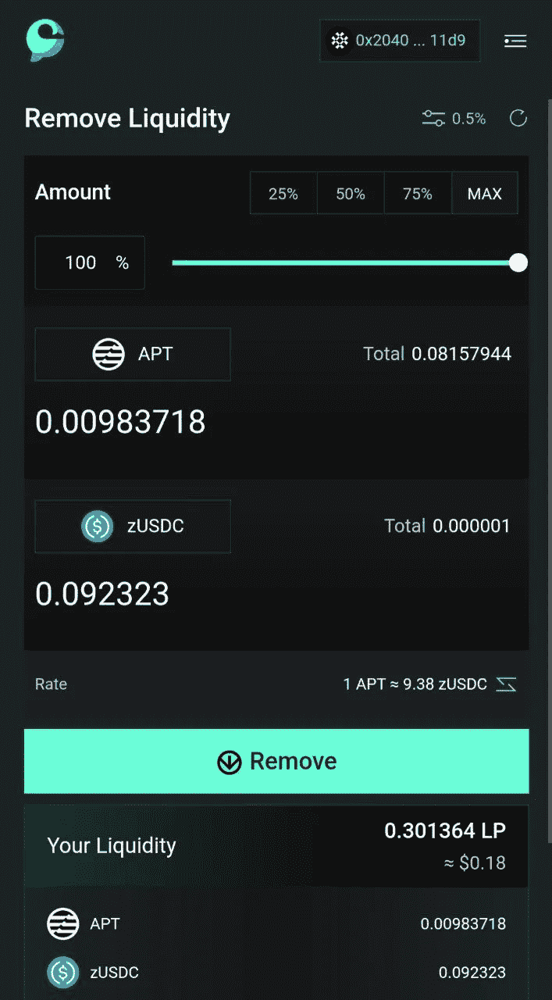

# 如何在 Aptos Mainnet 的塞特斯上交换和增加流动性

> 原文：<https://medium.com/coinmonks/how-to-swap-and-add-liquidity-on-cetus-which-on-aptos-mainnet-62226c521e5?source=collection_archive---------6----------------------->

在本文中，我们将进一步了解如何在 Aptos mainnet 上进行掉期交易并为塞特斯提供流动性，Aptos mainnet 于 2022 年 10 月 12 日推出，为这个无聊的熊市带来了新气象。

但首先让我们看看什么是交换代币，什么是我们放代币的流动性池。

交换:假设你的钱包里有代币 A，你想把它们换成代币 b。所以你需要一个交换来完成必要的工作。塞特斯为你提供了这个选择。我们将在后面看到如何实现这一点。在 dex(分散交易)中，将一种资产与另一种资产按比例进行交易。

掉期交易者:在某一指数上下单并执行掉期交易指令的用户。

流动性:储存在池合约中的代币，交易者可以据此进行交易。

流动性提供者:流动性提供者，也称为做市商，是指向平台提供加密资产以帮助分散交易的人。作为回报，他们从该平台的交易中获得费用，这可以被视为一种被动收入。例如，APT-ZUSDC 是一个流动性池，包含为令牌对 APT 和 ZUSDC 提供的流动性。

# **如何在 CETUS 上兑换代币**

1.  打开 https://www.cetus.zone/[(官方网站)。](https://app.cetus.zone/)

2.点击网页中的访问应用程序。

3.连接您的 Aptos 钱包(Petra、Martain、Fewcha、Pontem、Spika)并从币安、ftx、kucoin、mexc 等交易所充值$APT。我将使用火星钱包的教程。

4.转到“交换”选项卡，从令牌列表中选择您要将$Apt 令牌交换到的令牌。例:倾向于。

然后算出你想要交换的金额。

5.点击确认。并批准交易进入您的钱包。好哇，你的交换完成了。可以看到钱包里 zusdc 的金额。

# **如何在 CETUS 上提供流动性**

1.  单击“POOLS”选项卡。

2.选择您要添加流动性的池，然后单击它。例如:Apt/zUsdc。

3.输入您想加入池中的金额。然后单击添加到池中。

4.现在确认钱包中的交易。答对了，你在这个池子里增加了流动性。

您可以在屏幕底部查看您的 lp 份额。

5.同样，你也可以使用滑块或手动方式按百分比从池中移除流动性，只要你认为合适。

我希望在阅读完这篇文章后，每个人都可以很容易地使用 CetusProtocol，并发现在这个平台上进行互换和提供流动性是很容易的。

注意:准备一些油费。

# **关于塞特斯**

塞特斯是 DEX 和集中流动性协议的先驱，专注于基于移动的生态系统，如 Aptos 和 Sui。它将作为生态系统基础设施的重要组成部分，满足交易商、有限合伙人、上层应用和日益增长的 DeFi 人群的综合需求。

关注并保持更新！

网址:【https://www.cetus.zone/ T3

推特:【https://twitter.com/CetusProtocol 

不和:[https://discord.gg/rQtYGfmcD8](https://discord.gg/kpdaqsBEtY)

crew 3:[https://cetusprotocol . crew 3 . XYZ/invite/q Holt-dpsurid 2c z26 cqv](https://cetusprotocol.crew3.xyz/invite/QhOLt-dpSuriD2CZ26cQV)

中:[https://medium.com/@CetusProtocol](/@CetusProtocol)

**作者信息:**

推特:@darkseid89931

不和:承办人 8993#8197

> 交易新手？尝试[加密交易机器人](/coinmonks/crypto-trading-bot-c2ffce8acb2a)或[复制交易](/coinmonks/top-10-crypto-copy-trading-platforms-for-beginners-d0c37c7d698c)