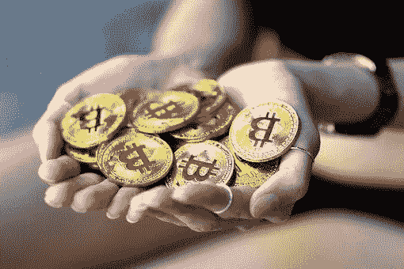

# 如何快速将你的比特币兑换成加纳塞地

> 原文：<https://medium.com/coinmonks/how-to-swap-your-bitcoin-to-ghanaian-cedis-quickly-182abe527901?source=collection_archive---------39----------------------->

比特币是目前最大的加密货币。自 2009 年问世以来，比特币交易量已超过 10 亿美元。虽然比特币的受欢迎程度可能正在下降，但它仍然是投资者和交易者的一个可行选择。以下是三个主要原因:

*   隐私:比特币是去中心化的，这意味着它不受政府或金融机构的控制。这使得它成为想要控制自己的财务和隐私的人的理想支付系统。
*   交易费用低:比特币交易产生的交易费用非常低。这使得它成为网上购物和小额交易的理想选择。
*   快速处理时间:比特币交易可在几分钟内处理完毕。这使得它成为需要快速周转时间的高交易量商家和投资者的首选。

比特币可以像任何其他货币一样用于购买和支付。它也可以在密码交易平台上持有和出售。购买、持有和出售比特币的原因有很多。一些人把它作为投资，另一些人用它来支付商品和服务。现在有各种各样的加密交换平台。其中一些包括:币安、比特币基地、Luno、Paxful、Kucoin、Gate.io、Dart Africa 等。然而，在选择交易所平台之前，了解不同类型的交易所及其特点是很重要的。在加纳，人们偶尔会用比特币兑换当地货币塞地。人们可能选择用比特币交易现金的原因有很多。有些人可能会这样做，以避免动荡的市场或获得加纳塞地。然而，由于 Dart Africa(一家在该国运营的比特币交易所)的努力，加纳人现在可以毫无争议地将他们的比特币出售给 cedis。

> 交易新手？试试[加密交易机器人](/coinmonks/crypto-trading-bot-c2ffce8acb2a)或者[复制交易](/coinmonks/top-10-crypto-copy-trading-platforms-for-beginners-d0c37c7d698c)

## 如何在 DART AFRICA 上销售比特币

当您在 Dart Africa 注册一个帐户时，您将立即获得一个可操作的法定钱包，您的每一笔成功交易的资金都将存入该钱包。如何在 Dart Africa 上注册？

1.  [在 Playstore](https://play.google.com/store/apps/details?id=com.dartafrica&gl=US) 或 App Store 下载应用。也可以使用网站( [www.dartafrica.io](http://dartafrica.io) )。
2.  通过填写所需的详细信息创建一个帐户。使用一个安全的密码，你可以随时记住你想登录。
3.  设置交易 pin。此 pin 将用于授权您的所有交易。
4.  导航到“出售硬币”选项，选择比特币作为您想要出售的加密货币，并输入您想要出售的金额。
5.  点击“立即出售硬币”开始交易。
6.  钱包地址将由系统生成。复制这个地址，把比特币转到这个地址。
7.  确认后，资金将被支付到您的钱包，您可以继续提取到您的帐户或移动资金。

Dart Africa 支持的加密货币包括:比特币、、、戴、以太坊、币、币、莱特币。总的来说，如果你正在加纳寻找一个出售 cedis 加密货币的地方，Dart Africa 是最好的地方。该交易所提供有竞争力的价格、用户友好的平台和可靠的客户服务。此外，Dart Africa 对交易不收取任何费用。