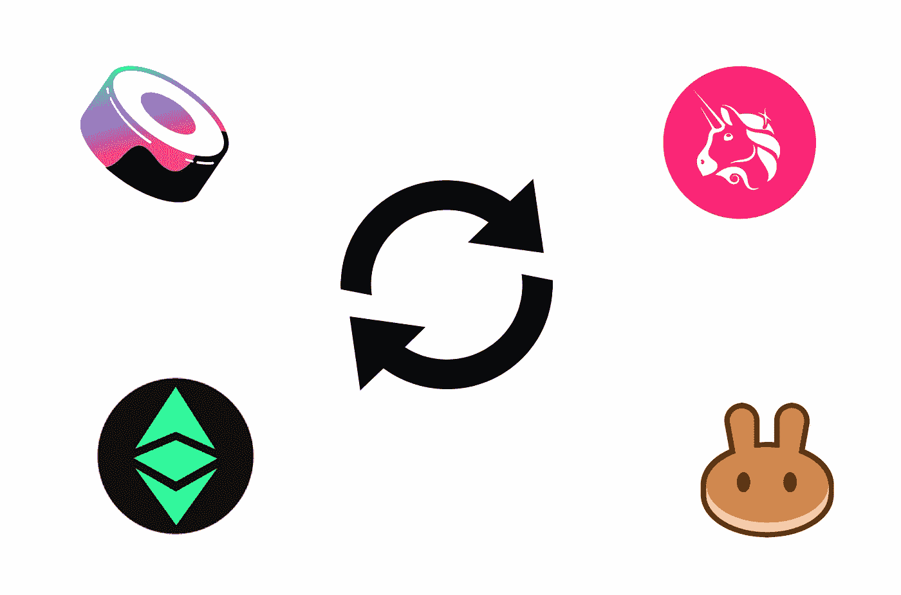
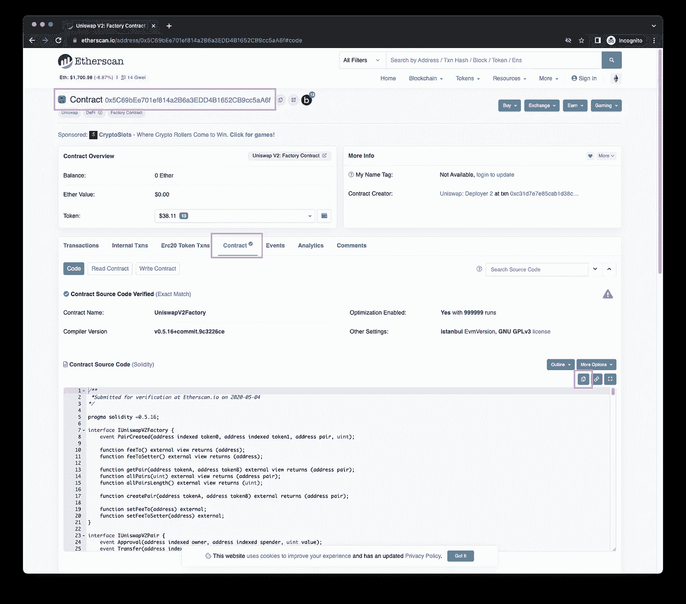
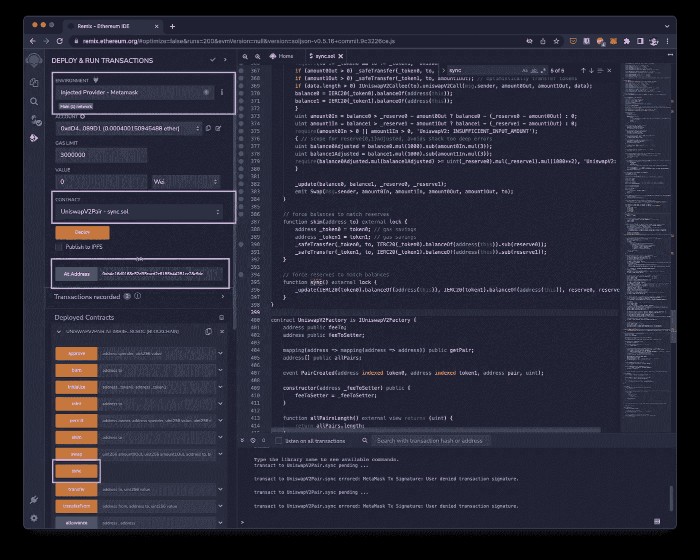

# 如何在 Uniswap 中同步和浏览

> 原文：<https://medium.com/coinmonks/how-to-sync-and-skim-in-uniswap-b536c921e66e?source=collection_archive---------5----------------------->

在混音中调用`sync()`和`skim()`。



# 概观

在本文中，我们将调用`sync()`函数来修复卡住的线对。当有人把泳池里的东西都拿走，留下灰尘时，就会发生这种情况。这些小数量可能会导致大的变化。同步会将准备金更新为当前余额。

这将适用于 Uniswap、Sushiswap、ETCSwap、PancakeSwap 和许多其他 AMM defi 协议。

根据 Uniswap V2 的[白皮书](https://docs.uniswap.org/whitepaper.pdf):

> 为了防止定制令牌实施更新 pair 合同的余额，并更好地处理总供应量可能大于 2112 的令牌，Uniswap v2 有两个应急功能:sync()和 skim()
> 
> sync()在令牌异步缩减一对令牌的余额的情况下充当恢复机制。在这种情况下，交易将获得次优利率，如果没有流动性提供者愿意纠正这种情况，这对组合就被卡住了。sync()的存在是为了将合同的储备设置为当前余额，从而在某种程度上从这种情况中恢复过来。
> 
> skim()作为一种恢复机制，以防有足够多的令牌被发送到一个对，使两个 uint112 存储槽溢出，否则可能导致交易失败。skim()允许用户将当前余额与 21121 之间的差额提取给调用者，如果该差额大于 0。

# 获取源代码

验证工厂地址。对于 Uniswap V2，其:0 x5c 69 bee 701 ef 814 a2 b 6 a3 edd 4b 1652 CB 9 cc 5a a6 f

 [## 工厂| Uniswap

### UniswapV2Factory 部署在以太坊主网上的 0x 5c 69 bee 701 ef 814 a2 b 6 a3 edd 4b 1652 CB 9 cc 5a a6 f，Ropsten…

docs.uniswap.org](https://docs.uniswap.org/protocol/V2/reference/smart-contracts/factory) 

访问块浏览器并复制合同源代码



为简单起见，下面是来源:

# 再搅拌

*   复制粘贴源代码到混音
*   选择环境到`Injected Provider`
*   选择合同给`UniswapV2Pair`
*   粘贴您想要同步的地址对。在这个例子中，它是 USDC 联邦理工学院

```
[https://v2.info.uniswap.org/pair/0xb4e16d0168e52d35cacd2c6185b44281ec28c9dc](https://v2.info.uniswap.org/pair/0xb4e16d0168e52d35cacd2c6185b44281ec28c9dc)0xb4e16d0168e52d35cacd2c6185b44281ec28c9dc
```

*   呼叫`sync()`



你已经同步了！

# 结论

当有人无缘无故地在一方转移令牌时，配对可能会失去同步。或者泳池很低的时候。Sync 强制准备金与余额匹配，而 skim 强制余额与准备金匹配。

> 交易新手？尝试[加密交易机器人](/coinmonks/crypto-trading-bot-c2ffce8acb2a)或[复制交易](/coinmonks/top-10-crypto-copy-trading-platforms-for-beginners-d0c37c7d698c)