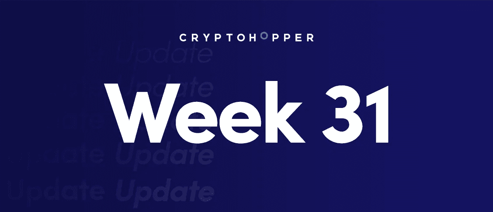
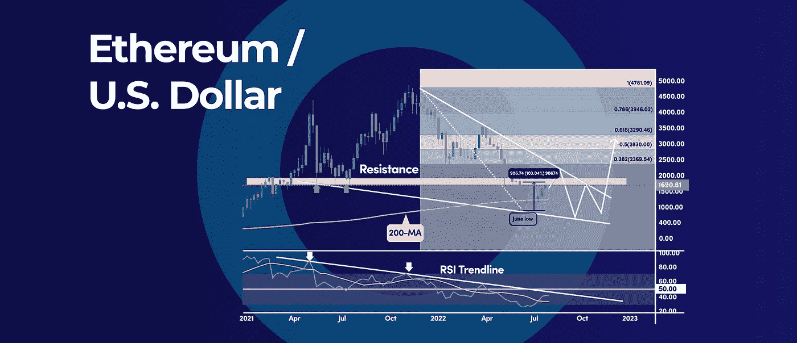
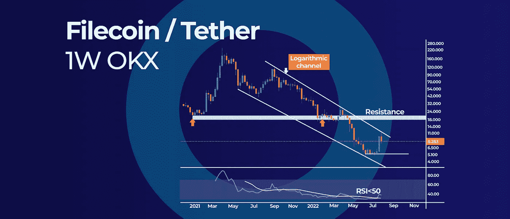

# 如何利用加密心理数字|以及本周加密更新中的更多内容。

> 原文：<https://medium.com/coinmonks/how-to-take-advantage-of-crypto-psychological-numbers-and-more-in-this-weeks-crypto-update-30454a09d2e2?source=collection_archive---------26----------------------->

How to take advantage of Crypto Psychological Numbers | And More in This Weeks Crypto Update.

*   以太坊的反弹可能会加快速度，如果它清除这个 RSI 趋势线
*   Filecoin 对数通道上限收益为 11 美元
*   如何利用加密心理数字以及如何使用它们

# 以太坊的反弹可能会加快速度，如果它清除这个 RSI 趋势线

以太坊(ETH)从 6 月中旬的低点上涨了 100%以上，经历了今年最大幅度的反弹。然而，每个人都在思考一个问题，这是长期复苏的开始，还是我们只是在见证一次死猫反弹。

## RSI 趋势线

在每周的时间框架上，ETH 正在攻击一个关键的 RSI 趋势线，如果该趋势线被清除，可能标志着 2000 美元心理水平上方的更多收益。基本上，RSI 趋势线连接了动量的峰值，上方的突破是市场情绪转变的明确信号。

通常，动量领先于价格，这意味着价格应该跟随 RSI 趋势线突破的引导。

但是，对于更保守的方法，我们可以等待周 RSI 突破 50 中级以上。

## RSI 趋势线是什么？

RSI 趋势线是技术分析师用来帮助识别股票或密码是超买还是超卖的工具。RSI 的计算方法是，取某一段时间内该项目的平均损益，然后将该数字除以平均真实范围。结果数字将介于 0 和 100 之间。读数为 70 或以上表明某种商品超买，读数为 30 或以下表明某种商品超卖。

## 短期阻力

短期来看，ETH 已经到达了 1，700 美元至 1，900 美元的坚固阻力位。与此同时，以太坊价格连续四周攀升——这是今年迄今为止最强劲的牛市之一。

虽然加密货币已经从过去的大幅下跌中复苏，但我们仍然需要等待上述信号的出现。通常，加密货币市场的复苏与 4 年减半周期相关。

比如上一次熊市持续了 2.5 年，而目前熊市长度已经进入第 10 个月。

# Filecoin 对数通道上限收益为 11 美元

Filecoin (FIL)显示了一个长期对数通道，有可能将上涨限制在 11 美元。自 2021 年 3 月和最近的 2021 年 9 月见顶以来，FLC 价格一直在下降通道内移动，无法突破通道的上限和下限。

## 对数通道

下降通道在 6 月中旬的历史低点 4.80 美元附近开始发挥作用，在这里它提供了强有力的支撑。短期来看，对数通道也将在 11 美元关口附近发挥作用。

这是导致从 11.37 美元高点抛售的关键因素。

只要 FLC 价格保持在通道的界限内，我们可以预计负面情绪将占上风。然而，在下降趋势线上方的周线突破和收盘有可能标志着反转，并为下一个关键阻力区 18 美元至 20 美元的重新测试打开大门。

## 什么是对数趋势通道？

对数趋势通道是技术分析师用来预测未来价格变动的工具。它基于这样一种观点，即价格在达到一定的里程碑后会以一定的方式移动。例如，如果一个密码的价格达到 10 美元，它很可能会在达到 11 美元之前上涨一定的数量。这种模式可以用来预测未来的价格走势。

## RSI 指标

每周相对强弱指数(RSI)继续保持在 50 的中间水平以下，标志着看跌的势头。潜在反转的早期迹象只有在 RSI 突破 50 中间水平时才会出现。

展望未来，第一个重要支撑位在 6.5 美元，随后是 5.0 美元，如果再次测试，有可能为 FLC 价格提供另一个反弹的机会。

# 如何利用加密心理数字以及如何使用它们

你有没有想过为什么市场上的加密价格会趋向于某一水平？这是巧合，还是这种价格行为背后有更有意义的东西？这可以用人类行为心理学对整数的偏好来解释。

## 什么是心理层面？

在加密交易中，心理数字是关键的价格水平，用 100 美元、1000 美元、5000 美元等整数表示。通常，这些价格水平会吸引散户和大型机构投资者。

由于所有的市场参与者都期待这些水平的反应，当它们最终被测试时，这就成了一个自我实现的预言。因此，许多买卖订单通常都围绕着心理数字。

最终结果是，市场倾向于围绕心理数字建立支撑和阻力区域。

## 如何使用整数？

如果价格停留在心理水平，它更有可能提供一个支持/阻力区域。然而，假设有一个整数的突破。在这种情况下，这可能标志着市场情绪的转变，心理数字可以从阻力位变为支撑位，反之亦然。

最好结合其他关键支撑位和阻力位以及技术指标来使用心理数字。当你有多个技术因素和一个心理数字聚集在一起时，价格在这些价格水平附近反应的可能性更大。

交易员可以将这些整数作为获利或设置止损单的目标。

以下是一些关于如何在加密货币市场利用整数的技巧:

*   留意围绕整数的大变动
*   使用整数作为止盈或设置止损单的目标
*   请注意，伪造可能发生在整数上
*   使用其他技术指标和整数来做交易决定

总之，心理数字可以和其他策略、价格行为和技术工具一起作为一个综合因素。

**展望未来:**过去的几个月对加密投资者来说很艰难。价格一直不稳定，许多人都亏了钱。然而，隧道的尽头有光明。可以利用心理数字来顺势而为，获利。

订阅我们的媒体每周博客和更新。
在推特[上关注我们](https://twitter.com/cryptohopper) | [脸书](https://www.facebook.com/cryptohopper)|[Reddit](https://www.reddit.com/r/CryptoHopper/)|[insta gram](https://www.instagram.com/cryptohopper/?hl=nl)

在 [Cryptohopper](https://www.cryptohopper.com/) 开始交易！

> 交易新手？尝试[加密交易机器人](/coinmonks/crypto-trading-bot-c2ffce8acb2a)或[复制交易](/coinmonks/top-10-crypto-copy-trading-platforms-for-beginners-d0c37c7d698c)