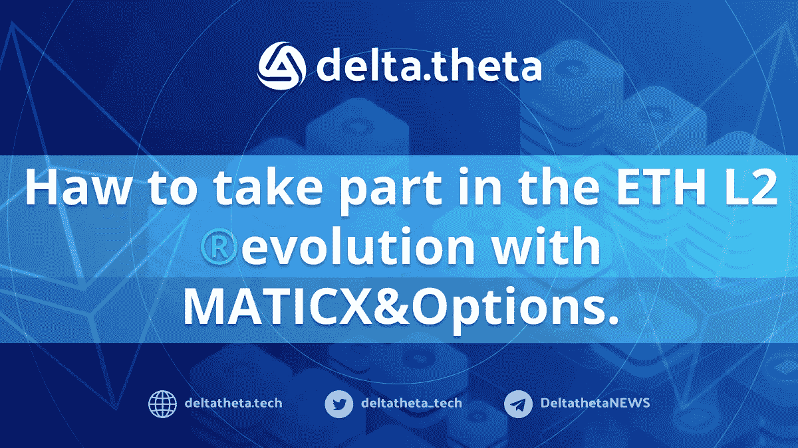
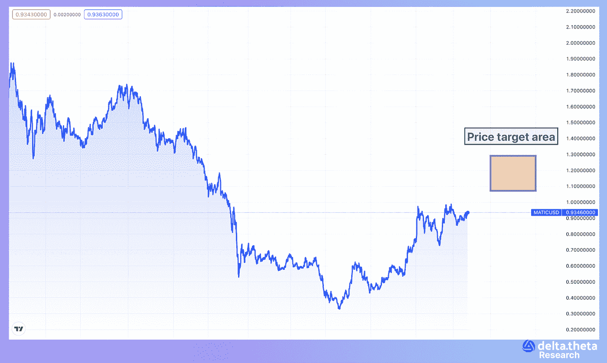
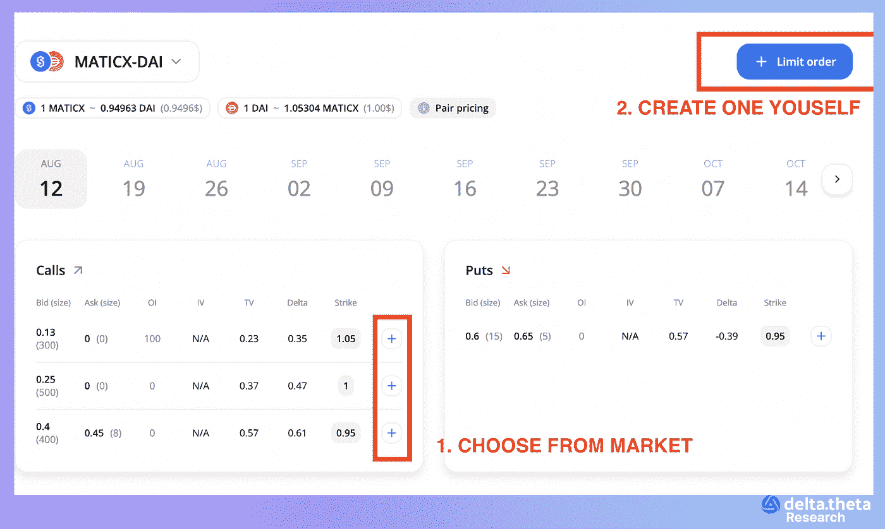

# 如何使用 MATICX & Options 参与 L2 联邦理工学院的发展？

> 原文：<https://medium.com/coinmonks/how-to-take-part-in-the-eth-l2-evolution-with-maticx-options-103ddb36b5b8?source=collection_archive---------34----------------------->

主要思路是参与以太坊生态系统的长期发展。当前的发展方向表明，有意识地选择支持 L2 解决方案，作为扩展底层区块链运营的更高效、更便捷的方式。

未来价格增长的催化剂是合并阶段——基础 ETH 网络的共识从工作证明转变为利益证明。将这些过程的技术方面排除在这个想法的范围之外，让我们把重点放在财务方面。因此，对新块的奖励将由验证者接收，验证者堆叠 ETH 令牌以保护网络。你可以在官方[以太坊](https://docs.ethhub.io/ethereum-roadmap/ethereum-2.0/eth-2.0-economics/)网站上找到更多关于验证器如何工作的细节。

为了使投资者作为 PoS 操作的一部分提供的流动性更有效，许多协议提出发行特殊的“流动性代币”,由放置在验证器中的代币担保。除了发行代币，此类活动还需要创建一些二级基础设施——分散交易所的交易所池或收益率集合器——由此产生的流动性可以被引导。这个领域最大的玩家是 Lido 和 Stader Labs。

目前，堆叠在信标链中的 ETH 令牌无法撤回—该算法将在共识改变后实施，并将需要很长时间(从一个月到六个月)。然而，可以利用液体堆积的产量，而对 L2 解(多边形)没有时间限制。在这个方面，PoS 验证很久以前就已经实现了，现在有一个流动性条款[激励计划](https://forum.polygon.technology/t/an-update-on-distribution-of-staking-token-rewards/9654)，允许您从验证器中获得高达 9%的自动令牌。当 MATICX 的堆叠版本换回原来的 MATIC 时，应计发生。

该程序不同于经典的“买入并持有”，涉及使用备兑买入策略交易期权，即在适当数量的可用代币上出售买入期权(不使用杠杆)。

# 因此，总结一下上面的信息:

1.  这个想法与以太坊增长的预期和生态系统高度相关的令牌 MATIC 联系在一起。
2.  使用的工具是流动性代币和期权。
3.  程序如下:购买 MATIC token，然后使用 [Stader labs liquid stacking](https://polygon.staderlabs.com/liquid-staking/maticx) 功能并获得 MATICX，在 deltatheta 上出售 MATICX 上的备兑期权(或通过[已开仓交易的外卖](https://app.deltatheta.tech/terminal/MaticX-DAI)(1)通过独立限价单创建(2)一个示例模板是[此处可用](https://app.deltatheta.tech/deeplink/9WF050PCOLLC8L)。这里有一个关于如何使用 deltatheta 平台的视频。

**目标:**截至 9 月 30 日(暂定合并开始日期)+15%的期权交易策略覆盖看涨期权+期权溢价(暂定每周 0.8%)+9% *(55/365)的 MATIC 叠加= 15%+5.6%+1.35%=21.95%，共 55 天，每年约为 145%

**风险:**这是一种方向性交易理念，因此在价格下跌的情况下，stablecoins 中的基础资产 MATICX 的价值存在下降的风险，但会根据卖出期权头寸的展期和流动性堆积的收益进行调整。

> 加入 Coinmonks [电报频道](https://t.me/coincodecap)和 [Youtube 频道](https://www.youtube.com/c/coinmonks/videos)了解加密交易和投资

# 另外，阅读

*   [分散交易所](https://coincodecap.com/what-are-decentralized-exchanges) | [比特 FIP](https://coincodecap.com/bitbns-fip)
*   用信用卡购买密码的 10 个最佳地点
*   [加拿大最佳加密交易机器人](https://coincodecap.com/5-best-crypto-trading-bots-in-canada) | [Bybit vs 币安](https://coincodecap.com/bybit-binance-moonxbt)
*   [阿联酋 5 大最佳加密交易所](https://coincodecap.com/best-crypto-exchanges-in-uae) | [SimpleSwap 评论](https://coincodecap.com/simpleswap-review)
*   购买 Dogecoin 的 7 种最佳方式 | [ZebPay 评论](https://coincodecap.com/zebpay-review)